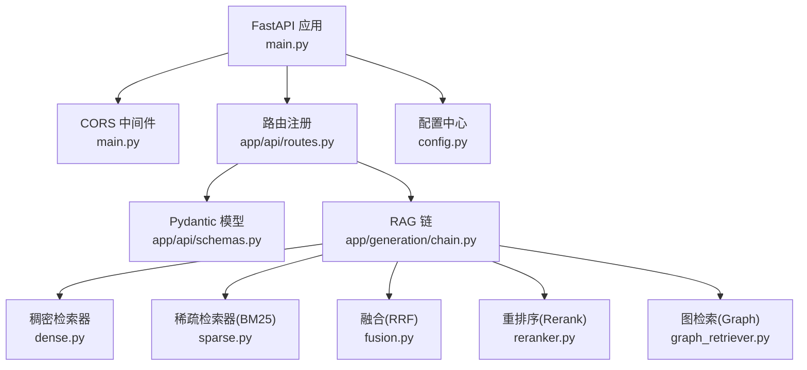
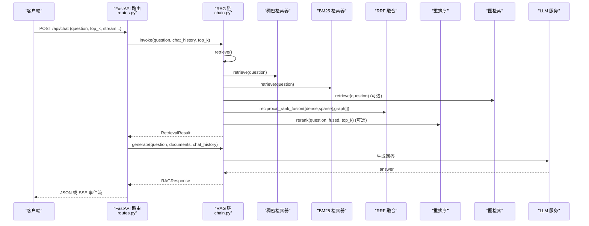
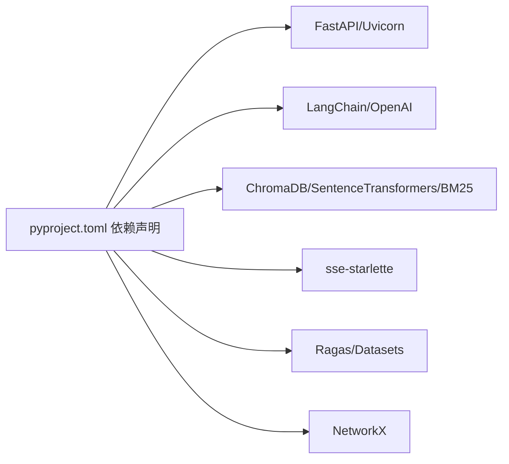

# API接口文档

<cite>
**本文引用的文件**   
- [main.py](file://main.py)
- [app/api/routes.py](file://app/api/routes.py)
- [app/api/schemas.py](file://app/api/schemas.py)
- [config.py](file://config.py)
- [app/generation/chain.py](file://app/generation/chain.py)
- [tests/test_api.py](file://tests/test_api.py)
- [pyproject.toml](file://pyproject.toml)
</cite>

## 目录
1. [简介](#简介)
2. [项目结构](#项目结构)
3. [核心组件](#核心组件)
4. [架构总览](#架构总览)
5. [详细接口说明](#详细接口说明)
6. [依赖关系分析](#依赖关系分析)
7. [性能与扩展性](#性能与扩展性)
8. [故障排查指南](#故障排查指南)
9. [结论](#结论)
10. [附录：客户端集成示例](#附录客户端集成示例)

## 简介
本仓库实现了一个生产级检索增强生成（RAG）系统，提供基于 FastAPI 的 RESTful API。系统支持多路召回（稠密向量 + BM25）、RRF融合、Cross-Encoder重排序、知识图谱检索、流式SSE响应以及评估指标输出。API包含对话问答、文档上传与索引管理、检索策略对比、追踪统计、评估、知识图谱构建与查询、健康检查等能力。

## 项目结构
- 应用入口与中间件配置位于主程序文件；路由定义集中在路由模块；请求/响应数据模型使用 Pydantic Schema 统一描述；RAG 管道封装在链式调用类中；测试用例覆盖关键端点；依赖声明在项目配置文件中。

图表来源
- [main.py:52-70](file://main.py#L52-L70)
- [app/api/routes.py:1-25](file://app/api/routes.py#L1-L25)
- [app/api/schemas.py:1-106](file://app/api/schemas.py#L1-L106)
- [app/generation/chain.py:49-98](file://app/generation/chain.py#L49-L98)
- [config.py:7-58](file://config.py#L7-L58)

章节来源
- [main.py:1-83](file://main.py#L1-L83)
- [app/api/routes.py:1-563](file://app/api/routes.py#L1-L563)
- [app/api/schemas.py:1-106](file://app/api/schemas.py#L1-L106)
- [config.py:1-58](file://config.py#L1-L58)
- [app/generation/chain.py:1-377](file://app/generation/chain.py#L1-L377)
- [pyproject.toml:1-47](file://pyproject.toml#L1-L47)

## 核心组件
- 应用生命周期与初始化：在应用启动时加载配置、初始化 RAGChain、尝试构建 BM25 索引并注册路由。
- CORS 中间件：允许跨域访问，默认放行所有来源、方法与头。
- 路由层：定义所有 HTTP 端点，负责参数校验、业务编排与响应组装。
- 数据模型：通过 Pydantic 对请求/响应进行强类型约束与校验。
- RAG 链：封装检索与生成的完整流程，包括查询改写、多路召回、融合、重排序与生成。

章节来源
- [main.py:21-70](file://main.py#L21-L70)
- [app/api/routes.py:25-43](file://app/api/routes.py#L25-L43)
- [app/api/schemas.py:1-106](file://app/api/schemas.py#L1-L106)
- [app/generation/chain.py:49-98](file://app/generation/chain.py#L49-L98)

## 架构总览
下图展示了从客户端到后端各组件的交互路径，包括对话、文档处理、检索与生成、追踪与评估等。

图表来源
- [app/api/routes.py:47-71](file://app/api/routes.py#L47-L71)
- [app/generation/chain.py:100-201](file://app/generation/chain.py#L100-L201)
- [app/generation/chain.py:203-270](file://app/generation/chain.py#L203-L270)

## 详细接口说明

### 通用约定
- 基础 URL：http://localhost:8000
- 内容类型：JSON 或 multipart/form-data（上传接口）
- 认证与安全：当前未启用认证中间件；如需在生产环境启用，可在应用启动处添加认证中间件并在路由上按需保护。
- CORS 配置：已启用，允许所有来源、方法与头，且允许携带凭据。
- 错误格式：HTTP 状态码配合标准 JSON 错误体，字段为 detail。

章节来源
- [main.py:60-70](file://main.py#L60-L70)
- [app/api/routes.py:121-162](file://app/api/routes.py#L121-L162)

---

### 1) 对话接口
- 方法：POST
- 路径：/api/chat
- 功能：执行 RAG 问答，支持普通与流式（SSE）两种模式。

请求体（JSON）
- question: string，必填，最小长度 1
- chat_history: array[object]，可选，默认 []，元素包含 role 与 content
- top_k: integer，可选，默认 5，范围 1-20
- use_query_transform: boolean，可选，默认 true
- use_rerank: boolean，可选，默认 true
- query_strategy: string，可选，默认 "multi_query"，取值 multi_query | hyde | none
- stream: boolean，可选，默认 false

响应体（stream=false）
- answer: string
- sources: array[SourceDocument]
- retrieval_detail: object
- total_time_ms: number

响应体（stream=true）
- 返回 SSE 事件流，事件类型：
  - retrieval：包含 queries_used、dense_count、sparse_count、fused_count、final_count、retrieval_time_ms
  - token：字符串片段
  - done：包含 sources 与 total_time_ms

验证规则与错误
- 缺少 question 或 question 为空将触发 422 验证错误
- 其他异常返回 500，detail 为错误信息

示例
- cURL（普通）：见“附录”
- cURL（流式）：见“附录”

章节来源
- [app/api/routes.py:47-71](file://app/api/routes.py#L47-L71)
- [app/api/routes.py:74-117](file://app/api/routes.py#L74-L117)
- [app/api/schemas.py:9-51](file://app/api/schemas.py#L9-L51)
- [tests/test_api.py:30-38](file://tests/test_api.py#L30-L38)

---

### 2) 文档管理

#### 2.1 上传文档并建立索引
- 方法：POST
- 路径：/api/documents/upload
- 内容类型：multipart/form-data
- 表单字段：
  - file: File，必填，支持 .pdf/.txt/.md/.markdown
- 成功响应：
  - message: string
  - filename: string
  - num_chunks: integer
  - doc_id: string
- 错误：
  - 400：不支持的文件格式
  - 500：文档处理失败

章节来源
- [app/api/routes.py:121-162](file://app/api/routes.py#L121-L162)
- [app/api/schemas.py:55-61](file://app/api/schemas.py#L55-L61)
- [tests/test_api.py:52-58](file://tests/test_api.py#L52-L58)

#### 2.2 获取已索引文档列表
- 方法：GET
- 路径：/api/documents
- 成功响应：
  - documents: array[DocumentInfo]
  - total: integer

章节来源
- [app/api/routes.py:165-191](file://app/api/routes.py#L165-L191)
- [app/api/schemas.py:63-74](file://app/api/schemas.py#L63-L74)
- [tests/test_api.py:44-50](file://tests/test_api.py#L44-L50)

#### 2.3 获取指定文档的分块详情（可视化）
- 方法：GET
- 路径：/api/documents/{doc_id}/chunks
- 路径参数：
  - doc_id: string，必填
- 成功响应：
  - doc_id: string
  - total: integer
  - stats: object（含 total_chars、total_tokens、avg_chunk_chars、vector_dim、embedding_model、has_summary）
  - summary: string|null
  - embeddings: array[object]
  - chunks: array[object]（含 chunk_id、position、content、char_count、token_count、top_terms、source）
- 错误：
  - 500：内部错误

章节来源
- [app/api/routes.py:194-257](file://app/api/routes.py#L194-L257)

---

### 3) 检索策略对比
- 方法：POST
- 路径：/api/retrieval/compare
- 请求体：同 ChatRequest（question、top_k 等）
- 成功响应：
  - question: string
  - top_k: integer
  - strategies: object，包含 dense、sparse、rrf、rerank 四个子项，每项包含 name、time_ms、count、overlap_with_rerank、results（数组）
- 用途：对比不同检索策略的效果与耗时

章节来源
- [app/api/routes.py:262-351](file://app/api/routes.py#L262-L351)

---

### 4) 追踪与统计
- GET /api/traces
  - 查询最近 N 条追踪记录（limit 默认 20）
  - 返回 traces 数组
- GET /api/traces/stats
  - 返回各阶段平均耗时统计对象

章节来源
- [app/api/routes.py:356-369](file://app/api/routes.py#L356-L369)

---

### 5) 评估接口
- 方法：POST
- 路径：/api/evaluate
- 请求体：
  - questions: array[string]，必填
  - ground_truths: array[string]，可选
- 成功响应：
  - metrics: object（faithfulness、answer_relevancy、context_precision、context_recall）
  - num_samples: integer
  - details: array[object]
- 错误：
  - 400：未提供问题列表
  - 501：评估依赖未安装
  - 500：评估执行失败

章节来源
- [app/api/routes.py:374-397](file://app/api/routes.py#L374-L397)
- [app/api/schemas.py:78-97](file://app/api/schemas.py#L78-L97)

---

### 6) 知识图谱（Graph RAG）

#### 6.1 构建知识图谱
- 方法：POST
- 路径：/api/graph/build
- 成功响应：
  - message: string
  - stats: object
- 错误：
  - 400：无已索引文档
  - 500：构建失败

章节来源
- [app/api/routes.py:402-428](file://app/api/routes.py#L402-L428)

#### 6.2 获取图谱统计
- 方法：GET
- 路径：/api/graph/stats
- 成功响应：stats 对象

章节来源
- [app/api/routes.py:431-436](file://app/api/routes.py#L431-L436)

#### 6.3 获取三元组（可视化）
- 方法：GET
- 路径：/api/graph/triples
- 查询参数：
  - limit: integer，默认 100
- 成功响应：
  - triples: array[object]
  - stats: object

章节来源
- [app/api/routes.py:439-447](file://app/api/routes.py#L439-L447)

#### 6.4 图检索查询
- 方法：POST
- 路径：/api/graph/query
- 请求体：同 ChatRequest（question、top_k 等）
- 成功响应：包含实体、关系与上下文的结果对象
- 错误：
  - 400：Graph RAG 未启用
  - 500：检索失败

章节来源
- [app/api/routes.py:450-464](file://app/api/routes.py#L450-L464)

#### 6.5 查找两个实体之间的关系路径
- 方法：GET
- 路径：/api/graph/path
- 查询参数：
  - source: string，必填
  - target: string，必填
- 成功响应：
  - source: string
  - target: string
  - path: array[object]
  - path_length: integer
  - found: boolean
- 空图时返回提示消息

章节来源
- [app/api/routes.py:467-490](file://app/api/routes.py#L467-L490)

#### 6.6 清空知识图谱
- 方法：DELETE
- 路径：/api/graph
- 成功响应：message 表示已清空

章节来源
- [app/api/routes.py:493-499](file://app/api/routes.py#L493-L499)

---

### 7) 健康检查
- 方法：GET
- 路径：/api/health
- 成功响应：
  - status: string（通常为 "ok"）
  - version: string
  - indexed_documents: integer

章节来源
- [app/api/routes.py:504-518](file://app/api/routes.py#L504-L518)
- [app/api/schemas.py:101-106](file://app/api/schemas.py#L101-L106)
- [tests/test_api.py:18-24](file://tests/test_api.py#L18-L24)

## 依赖关系分析
- 外部依赖：FastAPI、Uvicorn、LangChain/OpenAI、ChromaDB、Sentence Transformers、Rank-BM25、sse-starlette、Ragas、NetworkX 等。
- 运行时配置：OpenAI Key、Base URL、模型名、Embedding 模型、Chroma 持久化路径、检索与分块参数、Graph RAG 开关与持久化路径、服务器监听地址与端口等。

图表来源
- [pyproject.toml:1-47](file://pyproject.toml#L1-L47)

章节来源
- [pyproject.toml:1-47](file://pyproject.toml#L1-L47)
- [config.py:7-58](file://config.py#L7-L58)

## 性能与扩展性
- 流式响应：通过 SSE 降低首字节延迟，适合长文本生成场景。
- 多路召回与融合：稠密+稀疏+图检索经 RRF 融合提升召回质量；可结合重排序进一步优化相关性。
- 追踪与统计：内置追踪记录与阶段耗时统计，便于定位瓶颈。
- 可扩展点：
  - 增加限流中间件（如速率限制）以保护后端资源
  - 引入认证中间件（如 JWT/OAuth）以保护敏感接口
  - 调整检索参数（top_k、rrf_k、rerank_top_n）与分块大小/重叠度以平衡精度与吞吐

章节来源
- [app/api/routes.py:74-117](file://app/api/routes.py#L74-L117)
- [app/generation/chain.py:100-201](file://app/generation/chain.py#L100-L201)
- [config.py:27-46](file://config.py#L27-L46)

## 故障排查指南
- 常见状态码
  - 200：成功
  - 400：请求参数错误或业务前置条件不满足（如不支持的文件格式、无已索引文档、Graph RAG 未启用）
  - 422：请求体验证失败（Pydantic），例如缺失必填字段或字段越界
  - 500：服务器内部错误（文档处理失败、评估执行失败、检索失败等）
  - 501：功能未实现（评估依赖未安装）
- 调试建议
  - 使用 /api/health 确认服务可用与索引数量
  - 使用 /api/traces 与 /api/traces/stats 查看阶段耗时与追踪记录
  - 使用 /api/retrieval/compare 对比不同检索策略效果
  - 使用 /api/documents/{doc_id}/chunks 检查分块与词频分布
- 日志与错误
  - 服务端打印 INFO/WARNING/ERROR 日志，异常会转换为 HTTP 错误响应

章节来源
- [app/api/routes.py:121-162](file://app/api/routes.py#L121-L162)
- [app/api/routes.py:374-397](file://app/api/routes.py#L374-L397)
- [app/api/routes.py:402-428](file://app/api/routes.py#L402-L428)
- [app/api/routes.py:450-464](file://app/api/routes.py#L450-L464)
- [tests/test_api.py:18-38](file://tests/test_api.py#L18-L38)

## 结论
该 API 提供了完整的 RAG 能力，涵盖问答、文档管理、检索对比、评估、知识图谱与健康检查。通过流式响应与追踪统计，开发者可以快速集成与优化。建议在部署前补充认证与限流机制，并根据业务需求调优检索与分块参数。

## 附录：客户端集成示例

### Python 示例（requests）
- 普通对话
  - 方法：POST
  - 路径：/api/chat
  - 请求体：{"question": "什么是 RAG？", "top_k": 5}
  - 响应：JSON（answer、sources、retrieval_detail、total_time_ms）
- 流式对话
  - 方法：POST
  - 路径：/api/chat
  - 请求体：{"question": "什么是 RAG？", "stream": true}
  - 响应：SSE 事件流（retrieval/token/done）
- 上传文档
  - 方法：POST
  - 路径：/api/documents/upload
  - 表单：file=@./data/sample_docs/system_design.md
  - 响应：UploadResponse
- 获取文档列表
  - 方法：GET
  - 路径：/api/documents
- 获取文档分块详情
  - 方法：GET
  - 路径：/api/documents/{doc_id}/chunks
- 检索对比
  - 方法：POST
  - 路径：/api/retrieval/compare
  - 请求体：{"question": "...", "top_k": 5}
- 评估
  - 方法：POST
  - 路径：/api/evaluate
  - 请求体：{"questions": ["..."], "ground_truths": ["..."]}
- 知识图谱
  - 构建：POST /api/graph/build
  - 统计：GET /api/graph/stats
  - 三元组：GET /api/graph/triples?limit=100
  - 图检索：POST /api/graph/query {"question":"..."}
  - 路径查询：GET /api/graph/path?source=Redis&target=B%20树
  - 清空：DELETE /api/graph
- 健康检查
  - 方法：GET
  - 路径：/api/health

章节来源
- [app/api/routes.py:47-71](file://app/api/routes.py#L47-L71)
- [app/api/routes.py:121-162](file://app/api/routes.py#L121-L162)
- [app/api/routes.py:165-191](file://app/api/routes.py#L165-L191)
- [app/api/routes.py:194-257](file://app/api/routes.py#L194-L257)
- [app/api/routes.py:262-351](file://app/api/routes.py#L262-L351)
- [app/api/routes.py:374-397](file://app/api/routes.py#L374-L397)
- [app/api/routes.py:402-499](file://app/api/routes.py#L402-L499)
- [app/api/routes.py:504-518](file://app/api/routes.py#L504-L518)

### JavaScript 示例（fetch）
- 普通对话
  - fetch("/api/chat", {method:"POST", headers:{"Content-Type":"application/json"}, body:JSON.stringify({question:"什么是RAG？"})})
- 流式对话
  - 使用 EventSource 或 fetch 读取 SSE 流，按 event 类型处理 retrieval/token/done
- 上传文档
  - 使用 FormData 追加 file 字段，POST 到 /api/documents/upload
- 其余接口同上，按对应方法与路径发起请求

章节来源
- [app/api/routes.py:47-71](file://app/api/routes.py#L47-L71)
- [app/api/routes.py:121-162](file://app/api/routes.py#L121-L162)

### 速率限制与分页
- 速率限制：当前未内置限流中间件，建议在网关或服务层添加（如 Nginx/Kong 或自定义中间件）。
- 分页：当前文档列表与三元组接口未提供分页参数；可通过前端控制展示数量或使用 limit 参数（如 /api/graph/triples）。

章节来源
- [app/api/routes.py:165-191](file://app/api/routes.py#L165-L191)
- [app/api/routes.py:439-447](file://app/api/routes.py#L439-L447)

### 批量操作
- 批量上传：需多次调用 /api/documents/upload
- 批量评估：通过 /api/evaluate 传入 questions 与可选 ground_truths 数组

章节来源
- [app/api/routes.py:121-162](file://app/api/routes.py#L121-L162)
- [app/api/routes.py:374-397](file://app/api/routes.py#L374-L397)

### 安全与认证
- 当前未启用认证；若需保护接口，请在应用启动处添加认证中间件，并对敏感路由进行鉴权。
- CORS 已开放所有来源与方法，生产环境建议收紧 allow_origins 与 allow_headers。

章节来源
- [main.py:60-70](file://main.py#L60-L70)