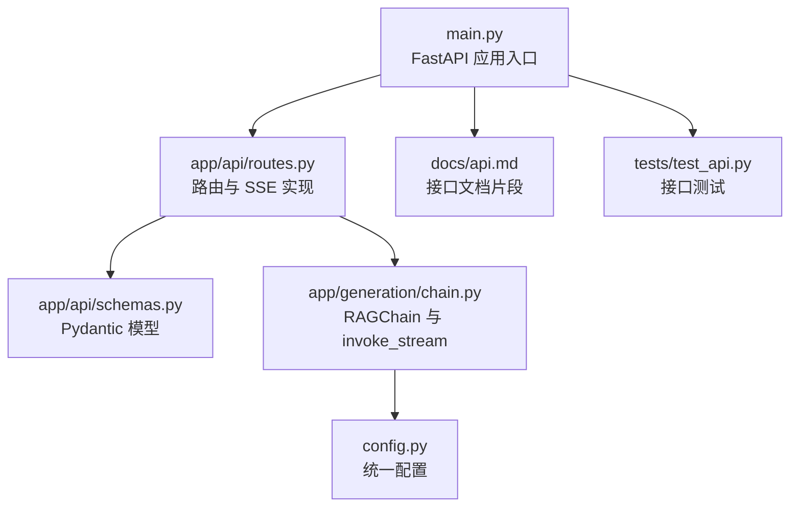
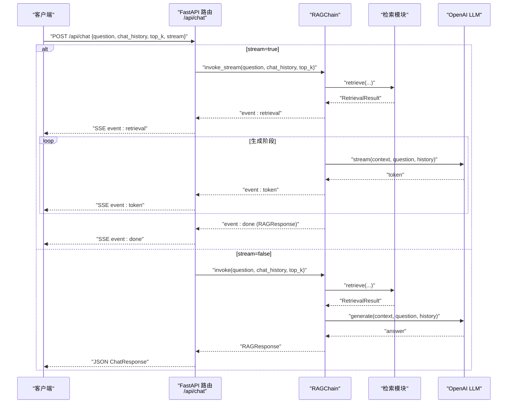
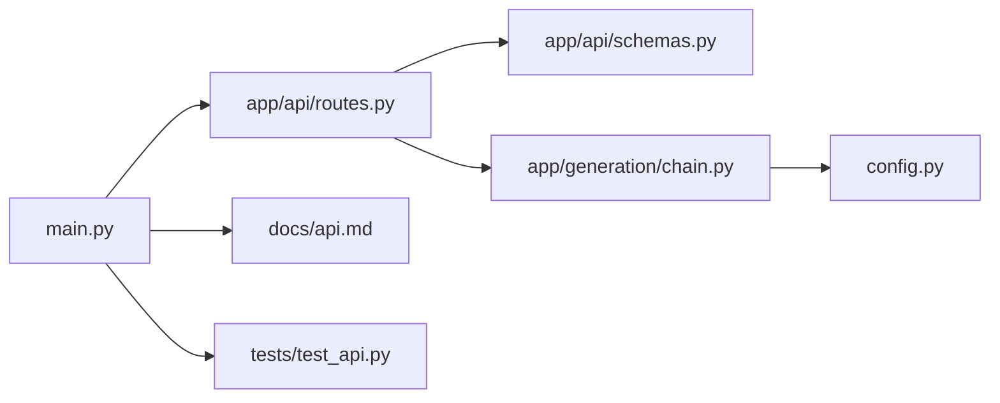

# 对话接口

<cite>
**本文引用的文件**
- [main.py](file://main.py)
- [routes.py](file://app/api/routes.py)
- [schemas.py](file://app/api/schemas.py)
- [chain.py](file://app/generation/chain.py)
- [config.py](file://config.py)
- [api.md](file://docs/api.md)
- [test_api.py](file://tests/test_api.py)
</cite>

## 目录
1. [简介](#简介)
2. [项目结构](#项目结构)
3. [核心组件](#核心组件)
4. [架构总览](#架构总览)
5. [详细组件分析](#详细组件分析)
6. [依赖关系分析](#依赖关系分析)
7. [性能考量](#性能考量)
8. [故障排查指南](#故障排查指南)
9. [结论](#结论)
10. [附录](#附录)

## 简介
本文件为 RAG 系统的“对话接口”API 文档，聚焦于 POST /api/chat 端点。该端点支持两种模式：
- 普通模式：一次性返回完整回答与来源信息
- 流式模式（SSE）：以 Server-Sent Events 逐步推送检索阶段、逐 token 生成以及完成事件

同时提供 ChatRequest 与 ChatResponse 数据模型字段说明、请求与响应示例、错误处理状态码，以及 Python 与 JavaScript 客户端集成示例（含流式处理）。

## 项目结构
与本接口相关的核心代码位于以下位置：
- 应用入口与生命周期初始化：main.py
- API 路由定义与 SSE 流式实现：app/api/routes.py
- Pydantic 数据模型（请求/响应）：app/api/schemas.py
- RAG 管道与流式调用：app/generation/chain.py
- 配置管理：config.py
- 官方 API 文档片段：docs/api.md
- 接口测试用例：tests/test_api.py

图表来源
- [main.py:1-83](file://main.py#L1-L83)
- [routes.py:1-563](file://app/api/routes.py#L1-L563)
- [schemas.py:1-106](file://app/api/schemas.py#L1-L106)
- [chain.py:1-377](file://app/generation/chain.py#L1-L377)
- [config.py:1-58](file://config.py#L1-L58)
- [api.md:1-275](file://docs/api.md#L1-L275)
- [test_api.py:1-59](file://tests/test_api.py#L1-L59)

章节来源
- [main.py:1-83](file://main.py#L1-L83)
- [routes.py:1-563](file://app/api/routes.py#L1-L563)
- [schemas.py:1-106](file://app/api/schemas.py#L1-L106)
- [chain.py:1-377](file://app/generation/chain.py#L1-L377)
- [config.py:1-58](file://config.py#L1-L58)
- [api.md:1-275](file://docs/api.md#L1-L275)
- [test_api.py:1-59](file://tests/test_api.py#L1-L59)

## 核心组件
- FastAPI 应用与中间件：在应用启动时注册 CORS 与路由，并在生命周期中初始化 RAGChain 并构建 BM25 索引。
- 路由层：POST /api/chat 根据 stream 参数选择普通或 SSE 流式路径；内部将 chat_history 转换为 LangChain Message 格式后调用 RAGChain。
- 数据模型：ChatRequest 定义输入字段及校验规则；ChatResponse 定义输出结构与来源、检索详情等。
- RAG 管道：RAGChain 封装检索（多路召回、RRF 融合、重排序）与生成（LLM），并提供 invoke 与 invoke_stream 两种调用方式。

章节来源
- [main.py:21-70](file://main.py#L21-L70)
- [routes.py:45-117](file://app/api/routes.py#L45-L117)
- [schemas.py:9-51](file://app/api/schemas.py#L9-L51)
- [chain.py:49-356](file://app/generation/chain.py#L49-L356)

## 架构总览
下图展示了从客户端到服务端再到 LLM 的端到端流程，包括普通与流式两条路径。

图表来源
- [routes.py:47-117](file://app/api/routes.py#L47-L117)
- [chain.py:272-356](file://app/generation/chain.py#L272-L356)

## 详细组件分析

### POST /api/chat 端点
- 功能：执行 RAG 问答，支持普通与流式两种模式。
- 行为差异：
  - 普通模式：等待检索与生成完成后一次性返回 JSON 响应。
  - 流式模式：使用 SSE 分阶段推送检索结果、逐 token 生成内容以及最终完成事件。
- 关键逻辑：
  - 将 chat_history 列表转为 LangChain HumanMessage/AIMessage 序列。
  - 当 stream=true 时，返回 EventSourceResponse，内部通过 _stream_response 生成器产出三种事件类型。
  - 当 stream=false 时，调用 chain.invoke 并构造 ChatResponse。

章节来源
- [routes.py:47-117](file://app/api/routes.py#L47-L117)
- [routes.py:523-563](file://app/api/routes.py#L523-L563)

#### 请求体 ChatRequest 字段说明
- question: string，必填，最小长度 1
- chat_history: array[object]，可选，默认 []，元素包含 role 与 content
- top_k: integer，可选，默认 5，范围 1-20
- use_query_transform: boolean，可选，默认 true
- use_rerank: boolean，可选，默认 true
- query_strategy: string，可选，默认 "multi_query"，取值 multi_query | hyde | none
- stream: boolean，可选，默认 false

章节来源
- [schemas.py:9-24](file://app/api/schemas.py#L9-L24)

#### 响应体 ChatResponse 字段说明
- answer: string，回答内容
- sources: array[SourceDocument]，引用来源列表
  - SourceDocument 字段：content、source、score、metadata
- retrieval_detail: RetrievalDetail，检索过程详情
  - queries_used: array[string]
  - dense_count: int
  - sparse_count: int
  - graph_count: int
  - fused_count: int
  - final_count: int
  - retrieval_time_ms: float
- total_time_ms: float，总耗时毫秒

章节来源
- [schemas.py:26-51](file://app/api/schemas.py#L26-L51)

#### 普通模式请求与响应示例
- 请求示例（JSON）
  - 字段参考：question、chat_history、top_k、use_query_transform、use_rerank、query_strategy、stream=false
- 响应示例（JSON）
  - 字段参考：answer、sources、retrieval_detail、total_time_ms

章节来源
- [api.md:21-77](file://docs/api.md#L21-L77)

#### 流式模式（SSE）事件类型与数据结构
- 事件类型
  - retrieval：检索阶段完成，包含查询改写使用的 queries_used、各阶段命中数量与耗时
  - token：生成阶段的增量 token
  - done：生成结束，包含最终 sources 摘要与 total_time_ms
- 事件载荷
  - retrieval.data：queries_used、dense_count、sparse_count、fused_count、final_count、retrieval_time_ms
  - token.data：字符串 token
  - done.data：sources（每个 source 包含 content、source、score）、total_time_ms

章节来源
- [routes.py:74-117](file://app/api/routes.py#L74-L117)
- [chain.py:314-356](file://app/generation/chain.py#L314-L356)
- [api.md:79-98](file://docs/api.md#L79-L98)

#### 流式与非流式使用场景建议
- 普通模式适合：
  - 对延迟不敏感、需要一次性获取完整答案与来源的场景
  - 简单日志记录与批处理
- 流式模式适合：
  - 前端实时展示生成进度
  - 长文本生成时的用户体验优化
  - 需要观察检索阶段信息的调试与分析

章节来源
- [routes.py:47-117](file://app/api/routes.py#L47-L117)
- [chain.py:314-356](file://app/generation/chain.py#L314-L356)

### RAGChain 流式机制
- invoke_stream 生成器按顺序产出三类事件：
  - 先 yield {"type": "retrieval", "data": RetrievalResult}
  - 再循环 yield {"type": "token", "data": str}
  - 最后 yield {"type": "done", "data": RAGResponse}
- 内部会记录 Trace，统计各阶段耗时与生成字符数等信息

章节来源
- [chain.py:314-356](file://app/generation/chain.py#L314-L356)

### 辅助函数与转换
- _build_chat_history：将 API 格式的 chat_history 转为 LangChain HumanMessage/AIMessage
- _build_chat_response：将 RAGResponse 转为 ChatResponse，并对 sources 与 retrieval_detail 进行格式化

章节来源
- [routes.py:523-563](file://app/api/routes.py#L523-L563)

## 依赖关系分析
- main.py 负责创建 FastAPI 实例、注册 CORS、加载路由，并在 lifespan 中初始化 RAGChain 与构建稀疏索引。
- routes.py 依赖 schemas.py 的数据模型与 chain.py 的 RAGChain。
- chain.py 依赖 config.py 的配置项（如模型、嵌入、检索参数）。
- api.md 提供了面向用户的接口说明与示例。
- test_api.py 验证了部分边界条件（如空问题返回 422）。

图表来源
- [main.py:1-83](file://main.py#L1-L83)
- [routes.py:1-563](file://app/api/routes.py#L1-L563)
- [schemas.py:1-106](file://app/api/schemas.py#L1-L106)
- [chain.py:1-377](file://app/generation/chain.py#L1-L377)
- [config.py:1-58](file://config.py#L1-L58)
- [api.md:1-275](file://docs/api.md#L1-L275)
- [test_api.py:1-59](file://tests/test_api.py#L1-L59)

章节来源
- [main.py:1-83](file://main.py#L1-L83)
- [routes.py:1-563](file://app/api/routes.py#L1-L563)
- [chain.py:1-377](file://app/generation/chain.py#L1-L377)
- [config.py:1-58](file://config.py#L1-L58)
- [api.md:1-275](file://docs/api.md#L1-L275)
- [test_api.py:1-59](file://tests/test_api.py#L1-L59)

## 性能考量
- 流式模式可降低首字延迟，提升交互体验；但会增加网络往返与客户端解析复杂度。
- 检索阶段的多路召回与 RRF 融合会影响整体耗时，可通过 top_k 与 rerank_top_n 控制。
- 重排序（Cross-Encoder）可能带来额外开销，可在 use_rerank=false 时关闭以提升吞吐。
- 建议在高频调用场景下复用连接与上下文，避免频繁重建索引。

[本节为通用指导，无需特定文件引用]

## 故障排查指南
- 常见状态码
  - 200：成功
  - 400：请求参数错误（如不支持的文件格式）
  - 422：请求体验证失败（Pydantic，例如 question 为空或缺失）
  - 500：服务器内部错误
  - 501：功能未实现（如评估依赖未安装）
- 典型异常与定位
  - 缺少 OPENAI_API_KEY：应用启动时报错，需检查环境变量配置
  - 上传文件格式不支持：返回 400，确认文件后缀为 .pdf/.txt/.md
  - 空问题或缺少 question：返回 422，检查请求体字段
- 调试建议
  - 使用 /api/traces 与 /api/traces/stats 查看各阶段耗时
  - 使用 /api/retrieval/compare 对比不同检索策略的效果
  - 使用 /api/documents 与 /api/documents/{doc_id}/chunks 检查索引情况

章节来源
- [routes.py:121-163](file://app/api/routes.py#L121-L163)
- [routes.py:262-351](file://app/api/routes.py#L262-L351)
- [routes.py:356-370](file://app/api/routes.py#L356-L370)
- [routes.py:504-518](file://app/api/routes.py#L504-L518)
- [test_api.py:30-38](file://tests/test_api.py#L30-L38)
- [api.md:256-275](file://docs/api.md#L256-L275)

## 结论
POST /api/chat 提供了完整的 RAG 对话能力，既支持一次性返回的普通模式，也支持实时展示的 SSE 流式模式。通过清晰的请求/响应模型与丰富的检索细节，开发者可灵活适配多种业务场景。结合健康检查、追踪与评估接口，系统具备良好的可观测性与可维护性。

[本节为总结性内容，无需特定文件引用]

## 附录

### 客户端集成示例（Python）
- 普通模式
  - 使用 requests 发送 JSON 请求，设置 stream=false，读取 JSON 响应中的 answer、sources 与 total_time_ms
- 流式模式
  - 使用 sseclient 或 httpx 的流式读取，监听 retrieval、token、done 事件
  - 在 token 事件中拼接输出，在 done 事件中汇总 sources 与 total_time_ms

章节来源
- [routes.py:47-117](file://app/api/routes.py#L47-L117)
- [api.md:100-113](file://docs/api.md#L100-L113)

### 客户端集成示例（JavaScript）
- 普通模式
  - 使用 fetch 发送 POST 请求，解析 JSON 响应
- 流式模式
  - 使用 EventSource 或 fetch + ReadableStream 接收 SSE
  - 处理 event=retrieval、event=token、event=done 三类消息
  - 在 token 事件中追加显示，在 done 事件中渲染来源与总耗时

章节来源
- [routes.py:74-117](file://app/api/routes.py#L74-L117)
- [api.md:79-98](file://docs/api.md#L79-L98)