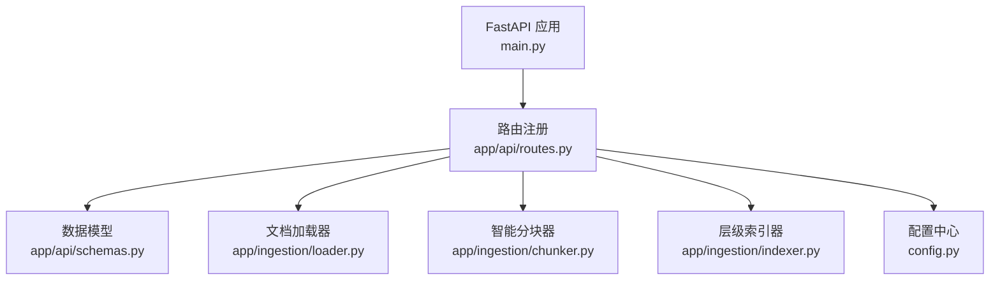
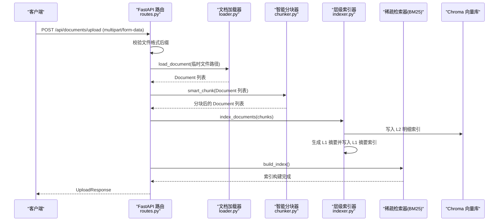
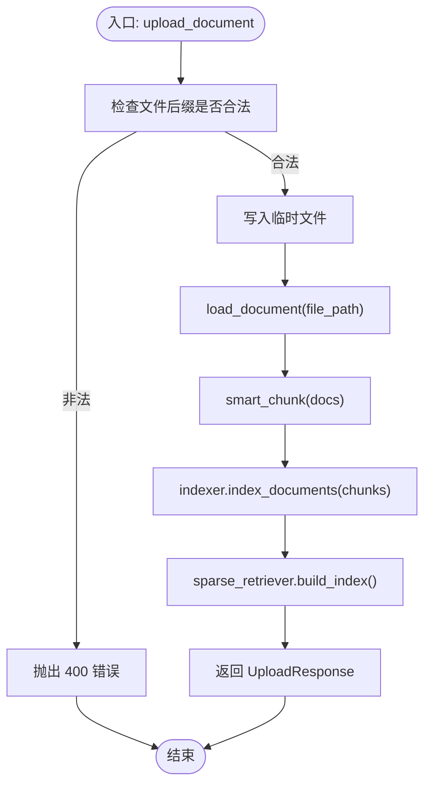
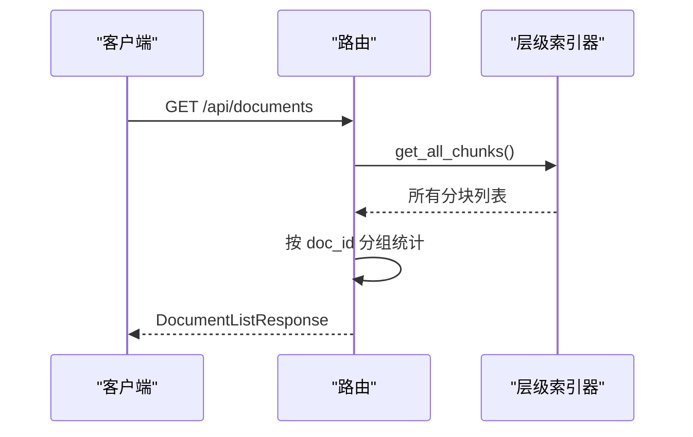
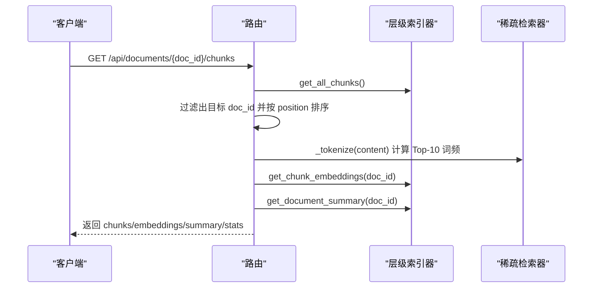
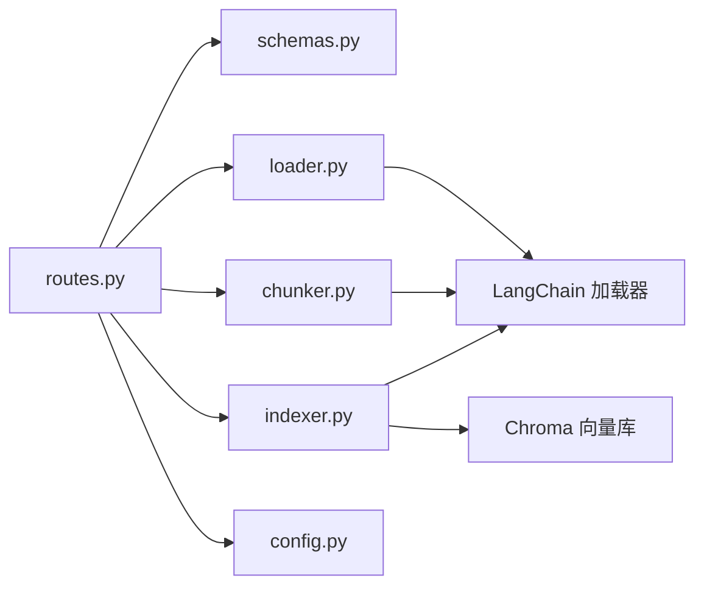

# 文档管理接口

<cite>
**本文引用的文件**   
- [main.py](file://main.py)
- [routes.py](file://app/api/routes.py)
- [schemas.py](file://app/api/schemas.py)
- [loader.py](file://app/ingestion/loader.py)
- [chunker.py](file://app/ingestion/chunker.py)
- [indexer.py](file://app/ingestion/indexer.py)
- [config.py](file://config.py)
- [test_api.py](file://tests/test_api.py)
</cite>

## 目录
1. [简介](#简介)
2. [项目结构](#项目结构)
3. [核心组件](#核心组件)
4. [架构总览](#架构总览)
5. [详细组件分析](#详细组件分析)
6. [依赖关系分析](#依赖关系分析)
7. [性能与容量建议](#性能与容量建议)
8. [故障排查指南](#故障排查指南)
9. [结论](#结论)
10. [附录：API 定义与示例](#附录api-定义与示例)

## 简介
本文件面向“文档管理”相关 API，覆盖以下三个核心端点：
- POST /api/documents/upload：上传文档并建立索引
- GET /api/documents：获取已索引文档列表
- GET /api/documents/{doc_id}/chunks：获取指定文档的详细索引信息（分块、BM25 词项、Embedding 向量维度等）

文档将详细说明请求参数验证规则、支持的文件格式与大小限制、数据模型结构、完整处理流程（解析、智能分块、向量索引构建）、错误处理机制，并提供 curl 与 Python requests 的使用示例。

## 项目结构
与文档管理相关的代码主要分布在路由层、Schema 定义以及 ingestion 子模块中：
- 路由层：定义 REST 端点与业务编排
- Schema：定义请求/响应数据模型
- Ingestion：负责文档加载、分块、索引构建与查询

图示来源
- [main.py:52-70](file://main.py#L52-L70)
- [routes.py:119-258](file://app/api/routes.py#L119-L258)
- [schemas.py:53-74](file://app/api/schemas.py#L53-L74)
- [loader.py:14-59](file://app/ingestion/loader.py#L14-L59)
- [chunker.py:138-157](file://app/ingestion/chunker.py#L138-L157)
- [indexer.py:74-147](file://app/ingestion/indexer.py#L74-L147)
- [config.py:7-58](file://config.py#L7-L58)

章节来源
- [main.py:52-70](file://main.py#L52-L70)
- [routes.py:119-258](file://app/api/routes.py#L119-L258)
- [schemas.py:53-74](file://app/api/schemas.py#L53-L74)
- [loader.py:14-59](file://app/ingestion/loader.py#L14-L59)
- [chunker.py:138-157](file://app/ingestion/chunker.py#L138-L157)
- [indexer.py:74-147](file://app/ingestion/indexer.py#L74-L147)
- [config.py:7-58](file://config.py#L7-L58)

## 核心组件
- 路由层（routes.py）
  - 提供 /api/documents/upload、/api/documents、/api/documents/{doc_id}/chunks 三个端点
  - 调用 ingestion 模块完成加载、分块、索引构建与检索
- 数据模型（schemas.py）
  - UploadResponse、DocumentInfo、DocumentListResponse 用于文档上传与列表响应
- 文档加载器（loader.py）
  - 根据扩展名选择加载器，支持 .pdf、.txt、.md、.markdown
- 智能分块器（chunker.py）
  - 递归字符分块与语义分块两种策略，默认使用递归字符分块
- 层级索引器（indexer.py）
  - L1 摘要索引（文档级）、L2 明细索引（段落级），基于 Chroma 持久化
- 配置（config.py）
  - 控制 Embedding 模型、Chroma 存储路径、分块大小与重叠等

章节来源
- [routes.py:119-258](file://app/api/routes.py#L119-L258)
- [schemas.py:53-74](file://app/api/schemas.py#L53-L74)
- [loader.py:14-59](file://app/ingestion/loader.py#L14-L59)
- [chunker.py:138-157](file://app/ingestion/chunker.py#L138-L157)
- [indexer.py:74-147](file://app/ingestion/indexer.py#L74-L147)
- [config.py:7-58](file://config.py#L7-L58)

## 架构总览
文档上传与索引的整体流程如下：

图示来源
- [routes.py:121-162](file://app/api/routes.py#L121-L162)
- [loader.py:22-59](file://app/ingestion/loader.py#L22-L59)
- [chunker.py:138-157](file://app/ingestion/chunker.py#L138-L157)
- [indexer.py:111-147](file://app/ingestion/indexer.py#L111-L147)

## 详细组件分析

### 端点一：POST /api/documents/upload
- 功能
  - 接收 multipart/form-data 的 file 字段，进行格式校验、读取到临时文件、加载、分块、索引构建，并返回上传结果。
- 请求参数
  - 表单字段：file（必填，UploadFile）
  - 文件名后缀校验：仅允许 .pdf、.txt、.md、.markdown
  - 文件大小限制：当前实现未显式限制大小；如需限制可在路由层增加前置校验逻辑
- 成功响应
  - 返回 UploadResponse，包含 message、filename、num_chunks、doc_id
- 失败处理
  - 不支持的文件格式：返回 400，detail 提示不支持的后缀
  - 其他异常（如加载、分块、索引失败）：捕获后返回 500，detail 为错误消息
- 关键流程
  - 保存临时文件 -> 加载文档 -> 智能分块 -> 写入层级索引 -> 重建 BM25 索引

图示来源
- [routes.py:121-162](file://app/api/routes.py#L121-L162)
- [loader.py:22-59](file://app/ingestion/loader.py#L22-L59)
- [chunker.py:138-157](file://app/ingestion/chunker.py#L138-L157)
- [indexer.py:111-147](file://app/ingestion/indexer.py#L111-L147)

章节来源
- [routes.py:121-162](file://app/api/routes.py#L121-L162)
- [loader.py:22-59](file://app/ingestion/loader.py#L22-L59)
- [chunker.py:138-157](file://app/ingestion/chunker.py#L138-L157)
- [indexer.py:111-147](file://app/ingestion/indexer.py#L111-L147)

### 端点二：GET /api/documents
- 功能
  - 获取所有已索引文档的列表，按 doc_id 分组统计每个文档的分块数量
- 成功响应
  - 返回 DocumentListResponse，包含 documents 列表与 total 总数
- 失败处理
  - 内部异常时返回空列表与 total=0，不抛错

图示来源
- [routes.py:165-191](file://app/api/routes.py#L165-L191)
- [indexer.py:203-211](file://app/ingestion/indexer.py#L203-L211)

章节来源
- [routes.py:165-191](file://app/api/routes.py#L165-L191)
- [indexer.py:203-211](file://app/ingestion/indexer.py#L203-L211)

### 端点三：GET /api/documents/{doc_id}/chunks
- 功能
  - 获取指定文档的全链路索引详情，包括：
    - 分块内容、字符数、token 数、Top-10 词频（BM25 分词）
    - Embedding 向量维度与预览、范数
    - L1 文档摘要是否存在
    - 汇总统计（总字符数、总 token 数、平均分块长度等）
- 成功响应
  - 返回包含 chunks、embeddings、summary、stats 的对象
- 失败处理
  - 内部异常时返回 500，detail 为错误消息

图示来源
- [routes.py:194-257](file://app/api/routes.py#L194-L257)
- [indexer.py:213-252](file://app/ingestion/indexer.py#L213-L252)

章节来源
- [routes.py:194-257](file://app/api/routes.py#L194-L257)
- [indexer.py:213-252](file://app/ingestion/indexer.py#L213-L252)

### 数据模型定义
- UploadResponse
  - 字段：message、filename、num_chunks、doc_id
- DocumentInfo
  - 字段：doc_id、source、num_chunks
- DocumentListResponse
  - 字段：documents（List[DocumentInfo]）、total

章节来源
- [schemas.py:55-74](file://app/api/schemas.py#L55-L74)

## 依赖关系分析
- 路由层依赖
  - schemas：用于请求/响应模型校验与序列化
  - loader：按扩展名加载 PDF/TXT/Markdown
  - chunker：递归或语义分块
  - indexer：写入 Chroma 向量库，维护 L1/L2 索引
  - config：读取 Embedding 模型、Chroma 存储路径、分块参数等
- 外部依赖
  - Chroma：向量数据库，持久化索引
  - LangChain：文档加载、文本分割、Embedding、LLM 调用
  - FastAPI：HTTP 服务与中间件（CORS）

图示来源
- [routes.py:119-258](file://app/api/routes.py#L119-L258)
- [schemas.py:53-74](file://app/api/schemas.py#L53-L74)
- [loader.py:14-59](file://app/ingestion/loader.py#L14-L59)
- [chunker.py:138-157](file://app/ingestion/chunker.py#L138-L157)
- [indexer.py:74-147](file://app/ingestion/indexer.py#L74-L147)
- [config.py:7-58](file://config.py#L7-L58)

章节来源
- [routes.py:119-258](file://app/api/routes.py#L119-L258)
- [schemas.py:53-74](file://app/api/schemas.py#L53-L74)
- [loader.py:14-59](file://app/ingestion/loader.py#L14-L59)
- [chunker.py:138-157](file://app/ingestion/chunker.py#L138-L157)
- [indexer.py:74-147](file://app/ingestion/indexer.py#L74-L147)
- [config.py:7-58](file://config.py#L7-L58)

## 性能与容量建议
- 分块策略
  - 默认使用递归字符分块，可通过配置调整 chunk_size 与 chunk_overlap
  - 若需更贴合语义的切分，可启用语义分块（需要 Embedding 模型）
- 索引构建
  - 每次上传后会重建 BM25 索引，频繁上传场景下建议批量导入或异步任务
- 向量维度
  - 由配置的 embedding_model 决定，可通过 /api/documents/{doc_id}/chunks 查看 vector_dim
- 存储路径
  - Chroma 持久化目录由 chroma_persist_dir 控制，注意磁盘空间与备份

章节来源
- [config.py:33-36](file://config.py#L33-L36)
- [routes.py:150-151](file://app/api/routes.py#L150-L151)
- [routes.py:246-247](file://app/api/routes.py#L246-L247)

## 故障排查指南
- 不支持的文件格式
  - 现象：上传返回 400，detail 提示不支持的后缀
  - 原因：文件后缀不在 .pdf/.txt/.md/.markdown 范围内
  - 处理：确认文件扩展名正确，必要时重命名
- 文件过大
  - 现状：当前路由未对文件大小做限制
  - 建议：在路由层增加前置校验（例如限制最大字节数），避免内存溢出
- 索引失败
  - 现象：上传返回 500，detail 为具体错误消息
  - 可能原因：加载失败、分块异常、向量索引写入失败、BM25 索引构建异常
  - 处理：查看日志定位具体步骤，检查 Chroma 存储路径权限与磁盘空间
- 文档列表为空
  - 现象：GET /api/documents 返回空列表
  - 处理：确认已成功上传并索引文档，检查 Chroma 集合是否存在

章节来源
- [routes.py:132-136](file://app/api/routes.py#L132-L136)
- [routes.py:160-162](file://app/api/routes.py#L160-L162)
- [routes.py:189-191](file://app/api/routes.py#L189-L191)
- [routes.py:255-257](file://app/api/routes.py#L255-L257)

## 结论
文档管理接口提供了完整的上传、列表与详情查询能力，结合多格式加载、智能分块与层级索引，能够满足常见的 RAG 系统文档入库需求。通过合理的分块策略与索引构建优化，可在保证检索质量的同时提升系统吞吐与稳定性。

## 附录：API 定义与示例

### 端点定义与参数说明
- POST /api/documents/upload
  - Content-Type：multipart/form-data
  - 表单字段：file（必填，UploadFile）
  - 支持格式：.pdf、.txt、.md、.markdown
  - 文件大小限制：当前未显式限制
  - 成功响应：UploadResponse
  - 错误码：400（不支持格式）、500（处理异常）
- GET /api/documents
  - 成功响应：DocumentListResponse
- GET /api/documents/{doc_id}/chunks
  - 路径参数：doc_id（字符串）
  - 成功响应：包含 chunks、embeddings、summary、stats 的对象
  - 错误码：500（处理异常）

章节来源
- [routes.py:121-162](file://app/api/routes.py#L121-L162)
- [routes.py:165-191](file://app/api/routes.py#L165-L191)
- [routes.py:194-257](file://app/api/routes.py#L194-L257)
- [schemas.py:55-74](file://app/api/schemas.py#L55-L74)

### 数据模型结构
- UploadResponse
  - message：上传结果消息
  - filename：原始文件名
  - num_chunks：分块数量
  - doc_id：文档唯一标识
- DocumentInfo
  - doc_id：文档唯一标识
  - source：文档来源（通常为文件名）
  - num_chunks：该文档的分块数量
- DocumentListResponse
  - documents：DocumentInfo 列表
  - total：文档总数

章节来源
- [schemas.py:55-74](file://app/api/schemas.py#L55-L74)

### 完整上传流程说明
- 文件解析
  - 根据文件后缀选择加载器：PDF 使用 PyPDFLoader，TXT/MD 使用 TextLoader
  - 加载后补充元数据：source、file_path、doc_id、chunk_index
- 智能分块
  - 默认采用递归字符分块，按段落/句子/字符层级递归切分
  - 可选语义分块：基于相邻句子的 Embedding 相似度检测语义边界
- 向量索引构建
  - L2 明细索引：将分块写入 Chroma 向量库
  - L1 摘要索引：对同一文档的所有分块生成摘要并写入摘要索引
  - 重建 BM25 索引：确保关键词检索可用

章节来源
- [loader.py:22-59](file://app/ingestion/loader.py#L22-L59)
- [chunker.py:15-53](file://app/ingestion/chunker.py#L15-L53)
- [chunker.py:56-135](file://app/ingestion/chunker.py#L56-L135)
- [indexer.py:111-147](file://app/ingestion/indexer.py#L111-L147)

### 错误处理机制
- 不支持的文件格式：返回 400，detail 提示不支持的后缀
- 文件过大：当前未限制，建议在路由层增加前置校验
- 索引失败：捕获异常后返回 500，detail 为具体错误消息
- 文档列表异常：返回空列表与 total=0，不抛错

章节来源
- [routes.py:132-136](file://app/api/routes.py#L132-L136)
- [routes.py:160-162](file://app/api/routes.py#L160-L162)
- [routes.py:189-191](file://app/api/routes.py#L189-L191)
- [routes.py:255-257](file://app/api/routes.py#L255-L257)

### 使用示例

- curl 示例
  - 上传文档
    - curl -X POST http://localhost:8000/api/documents/upload -F "file=@/path/to/document.pdf"
  - 获取文档列表
    - curl http://localhost:8000/api/documents
  - 获取文档索引详情
    - curl http://localhost:8000/api/documents/<doc_id>/chunks

- Python requests 示例
  - 上传文档
    - import requests
    - with open("/path/to/document.md", "rb") as f:
        resp = requests.post("http://localhost:8000/api/documents/upload", files={"file": ("document.md", f)})
      print(resp.json())
  - 获取文档列表
    - resp = requests.get("http://localhost:8000/api/documents")
    - print(resp.json())
  - 获取文档索引详情
    - resp = requests.get(f"http://localhost:8000/api/documents/{doc_id}/chunks")
    - print(resp.json())

章节来源
- [routes.py:121-162](file://app/api/routes.py#L121-L162)
- [routes.py:165-191](file://app/api/routes.py#L165-L191)
- [routes.py:194-257](file://app/api/routes.py#L194-L257)