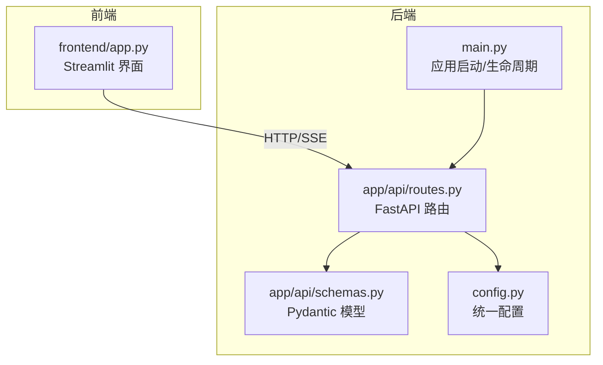
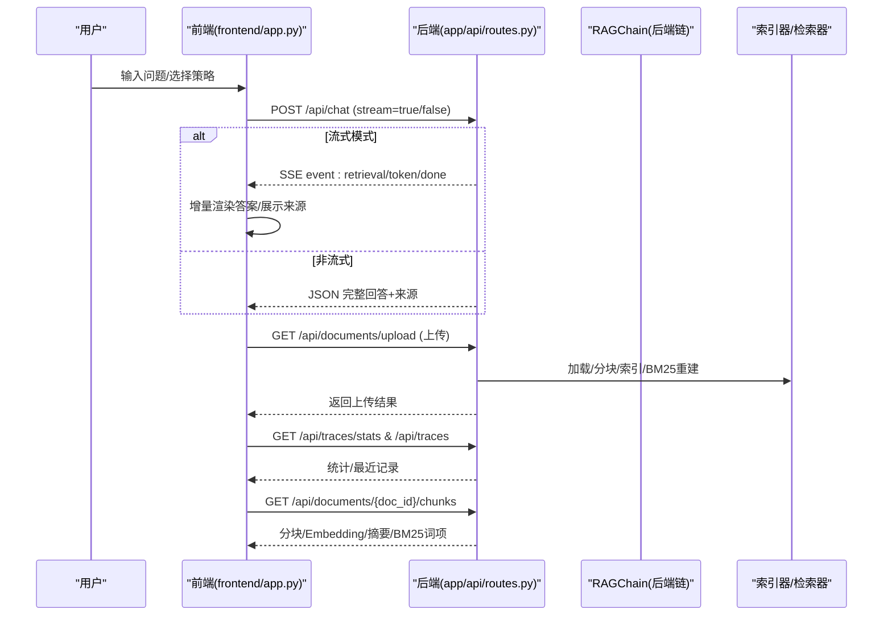
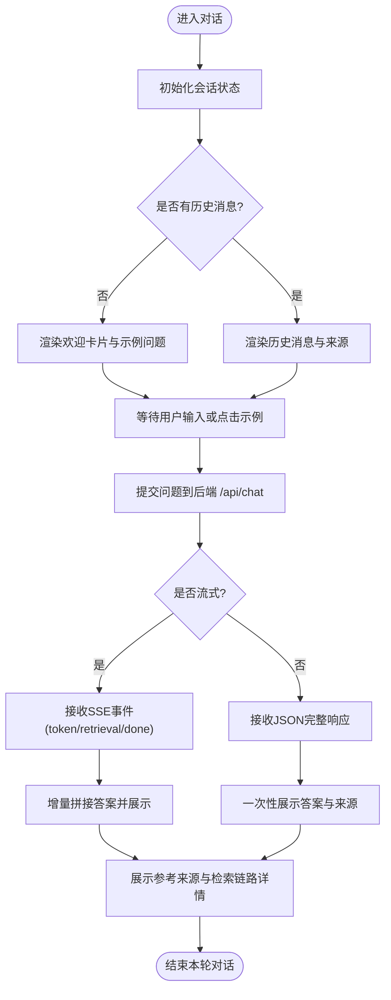
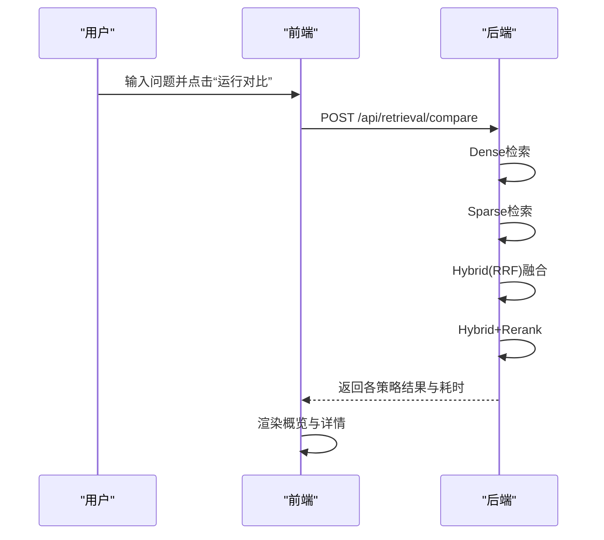
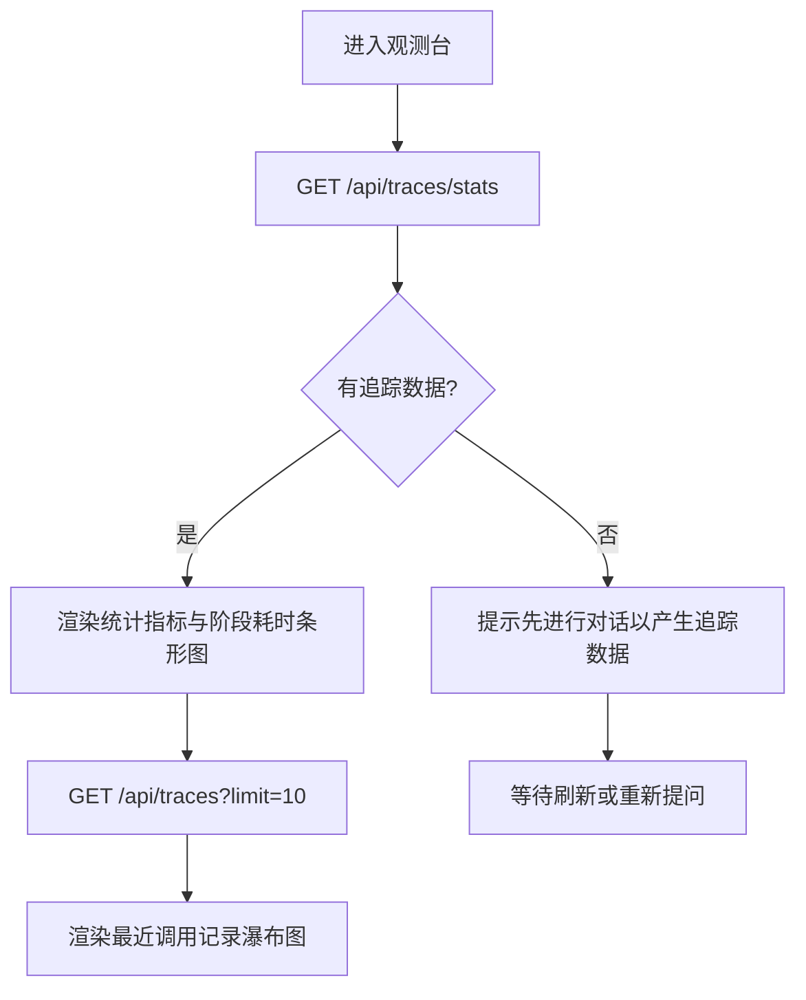
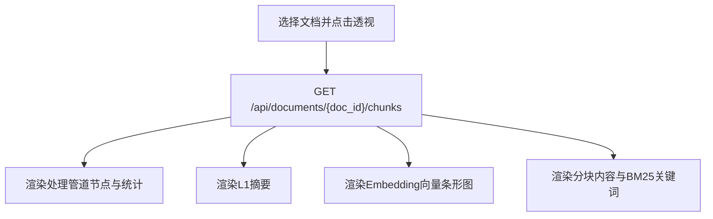
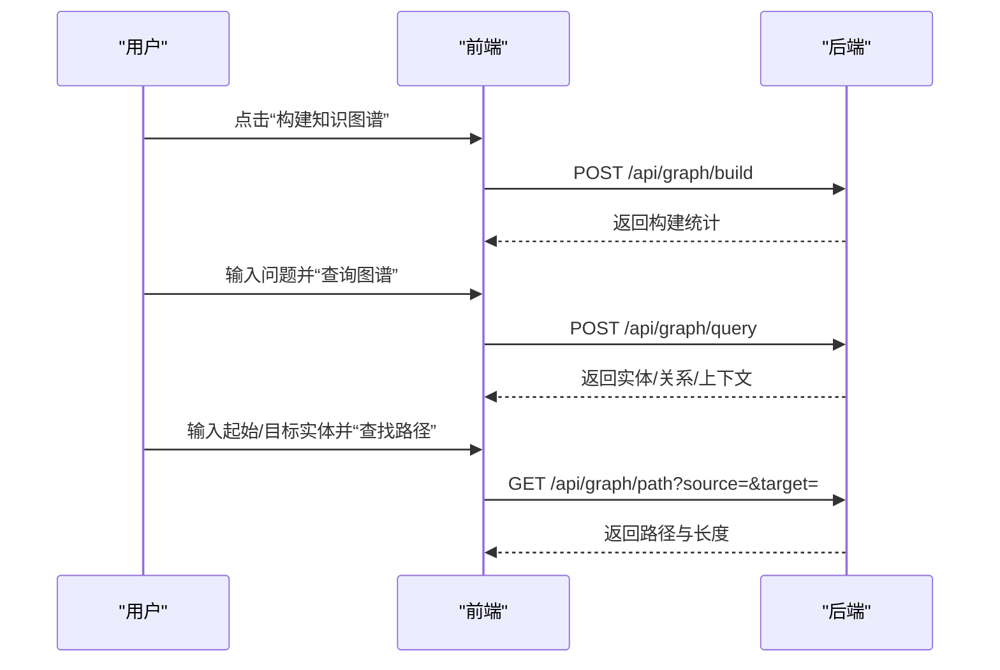
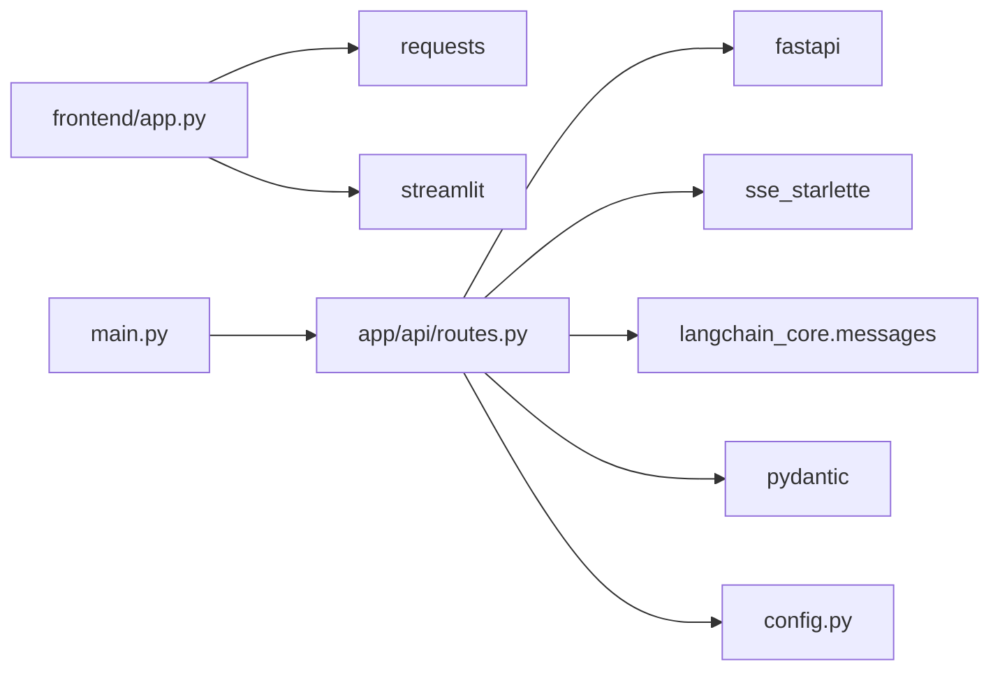

# 前端界面

<cite>
**本文引用的文件**
- [frontend/app.py](file://frontend/app.py)
- [main.py](file://main.py)
- [config.py](file://config.py)
- [app/api/routes.py](file://app/api/routes.py)
- [app/api/schemas.py](file://app/api/schemas.py)
- [.streamlit/config.toml](file://.streamlit/config.toml)
</cite>

## 目录
1. [简介](#简介)
2. [项目结构](#项目结构)
3. [核心组件](#核心组件)
4. [架构总览](#架构总览)
5. [详细组件分析](#详细组件分析)
6. [依赖关系分析](#依赖关系分析)
7. [性能与体验优化](#性能与体验优化)
8. [故障排查指南](#故障排查指南)
9. [结论](#结论)
10. [附录：API 与数据交互](#附录api-与数据交互)

## 简介
本文件面向使用 Streamlit 构建的前端界面，提供从“上手”到“定制”的完整说明。界面采用四 Tab 设计（对话问答、对比实验、观测台、索引透视），并扩展了知识图谱能力，覆盖文档上传、索引构建、实时对话、结果可视化、检索策略对比、管道追踪与知识图谱操作等全流程。同时给出样式与主题配置方法、后端 API 集成方式、数据交互流程以及用户体验与性能调优建议。

## 项目结构
前端入口位于 frontend/app.py，通过 HTTP 请求与 FastAPI 后端进行交互；后端路由定义在 app/api/routes.py，统一的数据模型在 app/api/schemas.py；应用启动与生命周期管理在 main.py；全局配置在 config.py；Streamlit 主题与服务器参数在 .streamlit/config.toml。

图表来源
- [frontend/app.py:1-20](file://frontend/app.py#L1-L20)
- [app/api/routes.py:1-25](file://app/api/routes.py#L1-L25)
- [app/api/schemas.py:1-10](file://app/api/schemas.py#L1-L10)
- [config.py:1-20](file://config.py#L1-L20)
- [main.py:1-20](file://main.py#L1-L20)

章节来源
- [frontend/app.py:1-20](file://frontend/app.py#L1-L20)
- [main.py:1-20](file://main.py#L1-L20)
- [config.py:1-20](file://config.py#L1-L20)
- [app/api/routes.py:1-25](file://app/api/routes.py#L1-L25)
- [app/api/schemas.py:1-10](file://app/api/schemas.py#L1-L10)
- [.streamlit/config.toml:1-10](file://.streamlit/config.toml#L1-L10)

## 核心组件
- 页面配置与主题
  - 页面标题、图标、布局宽度、侧边栏初始状态由页面级配置设置。
  - 自定义 CSS 定义了卡片、标签、按钮、滚动条、Tab 等视觉风格。
- 侧边栏控制台
  - 服务健康状态显示、检索策略参数（Top-K、查询改写、Rerank、改写策略）、文档上传与已索引文档列表、清空对话。
- 主界面 Tabs
  - 对话问答：流式输出、参考来源、检索链路详情。
  - 对比实验：四种检索策略对比（Dense、Sparse、Hybrid RRF、Hybrid+Rerank）。
  - 观测台：管道追踪统计与瀑布图。
  - 索引透视：分块内容、BM25 词项、Embedding 向量预览、L1 摘要。
  - 知识图谱：构建、统计、三元组浏览、路径查询、图检索。

章节来源
- [frontend/app.py:13-19](file://frontend/app.py#L13-L19)
- [frontend/app.py:21-197](file://frontend/app.py#L21-L197)
- [frontend/app.py:485-542](file://frontend/app.py#L485-L542)
- [frontend/app.py:559-624](file://frontend/app.py#L559-L624)
- [frontend/app.py:626-682](file://frontend/app.py#L626-L682)
- [frontend/app.py:684-788](file://frontend/app.py#L684-L788)
- [frontend/app.py:790-800](file://frontend/app.py#L790-L800)
- [frontend/app.py:801-954](file://frontend/app.py#L801-L954)

## 架构总览
前端通过 requests 调用后端 REST 接口，支持普通响应与 SSE 流式响应。后端基于 FastAPI 暴露 Chat、Documents、Retrieval Compare、Traces、Graph 等端点，内部组合 RAG Chain、索引器、检索器、重排器等模块。

图表来源
- [frontend/app.py:202-243](file://frontend/app.py#L202-L243)
- [frontend/app.py:420-483](file://frontend/app.py#L420-L483)
- [app/api/routes.py:47-117](file://app/api/routes.py#L47-L117)
- [app/api/routes.py:121-163](file://app/api/routes.py#L121-L163)
- [app/api/routes.py:194-258](file://app/api/routes.py#L194-L258)
- [app/api/routes.py:356-370](file://app/api/routes.py#L356-L370)

## 详细组件分析

### 侧边栏控制台
- 健康检查：自动探测后端是否在线并显示已索引文档数。
- 检索策略：
  - Top-K：召回数量滑块（1-20）。
  - 查询改写：开关控制是否启用。
  - Rerank：开关控制是否启用。
  - 改写策略：下拉选择 multi_query/hyde/none。
- 文档上传：支持 PDF/TXT/Markdown，点击后触发上传并索引，成功后提示分块数量并刷新。
- 已索引文档：列出 doc_id、source、num_chunks。
- 清空对话：重置会话消息与检索详情。

章节来源
- [frontend/app.py:485-542](file://frontend/app.py#L485-L542)
- [frontend/app.py:236-243](file://frontend/app.py#L236-L243)
- [frontend/app.py:220-234](file://frontend/app.py#L220-L234)

### Tab 1：对话问答
- 空态欢迎卡片与示例问题，点击示例将自动提交。
- 历史消息区：用户与助手消息交替显示，助手消息附带参考来源与检索链路详情。
- 流式生成：SSE 事件 token 逐步拼接，retrieval 阶段信息用于展示检索细节，done 事件携带最终来源与耗时。
- 错误处理：连接失败时提示启动后端命令。

图表来源
- [frontend/app.py:564-624](file://frontend/app.py#L564-L624)
- [frontend/app.py:420-483](file://frontend/app.py#L420-L483)
- [app/api/routes.py:47-117](file://app/api/routes.py#L47-L117)

章节来源
- [frontend/app.py:564-624](file://frontend/app.py#L564-L624)
- [frontend/app.py:420-483](file://frontend/app.py#L420-L483)
- [app/api/routes.py:47-117](file://app/api/routes.py#L47-L117)

### Tab 2：对比实验
- 输入测试问题，点击运行对比，后端对同一问题执行四种检索策略并返回命中结果、耗时与重叠度。
- 概览卡片展示各策略耗时、命中篇数与与最终重排结果的重叠数。
- 展开查看每种策略的详细结果片段与分数。

图表来源
- [frontend/app.py:626-682](file://frontend/app.py#L626-L682)
- [app/api/routes.py:262-351](file://app/api/routes.py#L262-L351)

章节来源
- [frontend/app.py:626-682](file://frontend/app.py#L626-L682)
- [app/api/routes.py:262-351](file://app/api/routes.py#L262-L351)

### Tab 3：观测台
- 统计概览：总调用次数、平均总耗时、最慢阶段。
- 阶段平均耗时条形图：按阶段着色，便于识别瓶颈。
- 最近 traces 列表：展开查看单次调用的瀑布图与答案预览。

图表来源
- [frontend/app.py:684-788](file://frontend/app.py#L684-L788)
- [app/api/routes.py:356-370](file://app/api/routes.py#L356-L370)

章节来源
- [frontend/app.py:684-788](file://frontend/app.py#L684-L788)
- [app/api/routes.py:356-370](file://app/api/routes.py#L356-L370)

### Tab 4：索引透视
- 选择已索引文档，点击“透视索引”，获取该文档的全链路索引详情。
- 展示处理管道节点（原始文档→智能分块→向量化→L1摘要→BM25索引）及对应统计。
- L1 摘要：LLM 生成的全文摘要。
- Embedding 向量：每个分块的向量前 8 维预览，正负值用不同颜色表示。
- 分块内容与 BM25 关键词：每块字符/词项计数与高频词项标签。

图表来源
- [frontend/app.py:318-418](file://frontend/app.py#L318-L418)
- [app/api/routes.py:194-258](file://app/api/routes.py#L194-L258)

章节来源
- [frontend/app.py:318-418](file://frontend/app.py#L318-L418)
- [app/api/routes.py:194-258](file://app/api/routes.py#L194-L258)

### Tab 5：知识图谱
- 构建知识图谱：从已索引文档抽取实体和关系，返回构建统计。
- 清空图谱：删除现有图谱。
- 图谱统计：实体数、关系数、密度、核心实体（度最高）。
- 图检索查询：输入问题，返回识别实体、关系与上下文文本。
- 实体路径查询：查找两个实体之间的关系路径（多跳推理）。
- 三元组浏览：分页展示三元组与来源。

图表来源
- [frontend/app.py:801-954](file://frontend/app.py#L801-L954)
- [app/api/routes.py:402-499](file://app/api/routes.py#L402-L499)

章节来源
- [frontend/app.py:801-954](file://frontend/app.py#L801-L954)
- [app/api/routes.py:402-499](file://app/api/routes.py#L402-L499)

## 依赖关系分析
- 前端依赖
  - requests：发起 HTTP 请求与 SSE 流式读取。
  - streamlit：UI 组件与页面配置。
- 后端依赖
  - fastapi：路由与中间件。
  - sse_starlette：SSE 流式响应。
  - langchain_core.messages：对话历史格式转换。
  - pydantic：请求/响应数据模型校验。
- 配置依赖
  - config.py：集中管理 OpenAI/Embedding/ChromaDB/检索/Chunking/Graph 等参数。
  - .streamlit/config.toml：Streamlit 主题与服务器参数。

图表来源
- [frontend/app.py:1-10](file://frontend/app.py#L1-L10)
- [app/api/routes.py:1-25](file://app/api/routes.py#L1-L25)
- [config.py:1-20](file://config.py#L1-L20)
- [main.py:1-20](file://main.py#L1-L20)

章节来源
- [frontend/app.py:1-10](file://frontend/app.py#L1-L10)
- [app/api/routes.py:1-25](file://app/api/routes.py#L1-L25)
- [config.py:1-20](file://config.py#L1-L20)
- [main.py:1-20](file://main.py#L1-L20)

## 性能与体验优化
- 流式输出
  - 使用 SSE 提升首字延迟，减少用户感知等待时间。
  - 合理设置 Top-K 与是否启用 Rerank，平衡质量与耗时。
- 缓存与复用
  - 已索引文档在内存中持久化，避免重复构建索引。
  - 观测台缓存最近 traces，降低频繁拉取开销。
- 渲染优化
  - 向量预览仅展示前 8 维，避免大向量渲染卡顿。
  - 长文本截断与折叠（expander）减少 DOM 压力。
- 网络与超时
  - 知识图谱构建可能耗时较长，前端增加超时提示与重试引导。
  - 连接失败时明确提示启动后端命令，缩短排障时间。
- 主题与可读性
  - 深色主题提高长时间使用的舒适度，关键数值高亮显示。
  - 统一的卡片与标签样式增强信息层级感。

[本节为通用指导，不直接分析具体文件]

## 故障排查指南
- 无法连接后端
  - 现象：对话与对比均报错“无法连接后端服务”。
  - 处理：确认已启动后端服务，检查端口与 CORS 配置。
- 上传失败
  - 现象：上传后返回错误详情。
  - 处理：检查文件格式（PDF/TXT/MD），查看后端日志定位异常。
- 无追踪数据
  - 现象：观测台提示暂无追踪数据。
  - 处理：先在对话问答中提问，再回到观测台刷新。
- 知识图谱为空
  - 现象：图谱统计为空或提示未构建。
  - 处理：点击“构建知识图谱”，等待完成后再查询。

章节来源
- [frontend/app.py:478-483](file://frontend/app.py#L478-L483)
- [frontend/app.py:731-736](file://frontend/app.py#L731-L736)
- [frontend/app.py:852-855](file://frontend/app.py#L852-L855)
- [app/api/routes.py:132-136](file://app/api/routes.py#L132-L136)
- [app/api/routes.py:504-518](file://app/api/routes.py#L504-L518)

## 结论
本前端界面围绕“可观测、可对比、可解释”的目标，提供了完整的 RAG 工作流交互体验。通过流式对话、策略对比、管道追踪与索引透视，帮助用户快速理解系统行为与效果；结合知识图谱能力，进一步拓展了关系型推理场景。配合主题与样式定制，可灵活适配不同使用环境。

[本节为总结性内容，不直接分析具体文件]

## 附录：API 与数据交互

### 主要端点一览
- 对话
  - POST /api/chat：支持普通与流式两种模式，返回回答、来源与检索详情。
- 文档
  - POST /api/documents/upload：上传并索引文档，返回分块数量与 doc_id。
  - GET /api/documents：列出已索引文档。
  - GET /api/documents/{doc_id}/chunks：获取指定文档的分块、Embedding、摘要与 BM25 词项。
- 对比
  - POST /api/retrieval/compare：对比四种检索策略的结果与耗时。
- 观测
  - GET /api/traces：最近 traces 列表。
  - GET /api/traces/stats：各阶段平均耗时统计。
- 知识图谱
  - POST /api/graph/build：构建知识图谱。
  - GET /api/graph/stats：图谱统计。
  - GET /api/graph/triples：三元组列表。
  - POST /api/graph/query：图检索查询。
  - GET /api/graph/path：实体间路径查询。
  - DELETE /api/graph：清空图谱。
- 健康
  - GET /api/health：服务健康与已索引文档数。

章节来源
- [app/api/routes.py:47-117](file://app/api/routes.py#L47-L117)
- [app/api/routes.py:121-163](file://app/api/routes.py#L121-L163)
- [app/api/routes.py:165-192](file://app/api/routes.py#L165-L192)
- [app/api/routes.py:194-258](file://app/api/routes.py#L194-L258)
- [app/api/routes.py:262-351](file://app/api/routes.py#L262-L351)
- [app/api/routes.py:356-370](file://app/api/routes.py#L356-L370)
- [app/api/routes.py:402-499](file://app/api/routes.py#L402-L499)
- [app/api/routes.py:504-518](file://app/api/routes.py#L504-L518)

### 数据模型要点
- ChatRequest/ChatResponse：包含问题、历史、Top-K、改写与重排开关、流式标志；回答、来源、检索详情与总耗时。
- SourceDocument/RetrievalDetail：来源文档字段与检索过程统计。
- UploadResponse/DocumentInfo/DocumentListResponse：上传与文档列表结构。
- EvalRequest/EvalReport：评估相关请求与报告结构。
- HealthResponse：健康检查响应。

章节来源
- [app/api/schemas.py:9-51](file://app/api/schemas.py#L9-L51)
- [app/api/schemas.py:55-74](file://app/api/schemas.py#L55-L74)
- [app/api/schemas.py:78-96](file://app/api/schemas.py#L78-L96)
- [app/api/schemas.py:101-106](file://app/api/schemas.py#L101-L106)

### 主题与样式定制
- Streamlit 主题
  - 修改 .streamlit/config.toml 中的 primaryColor、backgroundColor、textColor 等，实现整体配色切换。
- 自定义 CSS
  - 在 frontend/app.py 中注入 CSS，调整卡片、按钮、滚动条、Tab 等样式。
- 页面配置
  - 通过 st.set_page_config 设置页面标题、图标、布局与侧边栏状态。

章节来源
- [.streamlit/config.toml:1-10](file://.streamlit/config.toml#L1-L10)
- [frontend/app.py:13-19](file://frontend/app.py#L13-L19)
- [frontend/app.py:21-197](file://frontend/app.py#L21-L197)

### 与后端集成与数据流
- 前端通过 requests 调用后端 REST 接口，SSE 模式下逐行解析 event/data 事件，增量渲染答案与来源。
- 后端在路由中组装 RAG Chain，依次执行查询改写、多路召回、RRF 融合、重排与生成，并通过 EventSourceResponse 推送事件。
- 索引与检索数据通过 Pydantic 模型校验，确保前后端数据结构一致。

章节来源
- [frontend/app.py:202-243](file://frontend/app.py#L202-L243)
- [frontend/app.py:420-483](file://frontend/app.py#L420-L483)
- [app/api/routes.py:47-117](file://app/api/routes.py#L47-L117)
- [app/api/schemas.py:9-51](file://app/api/schemas.py#L9-L51)