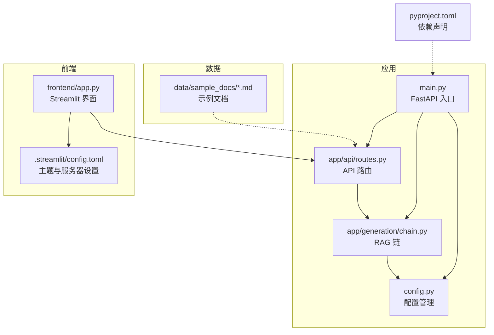
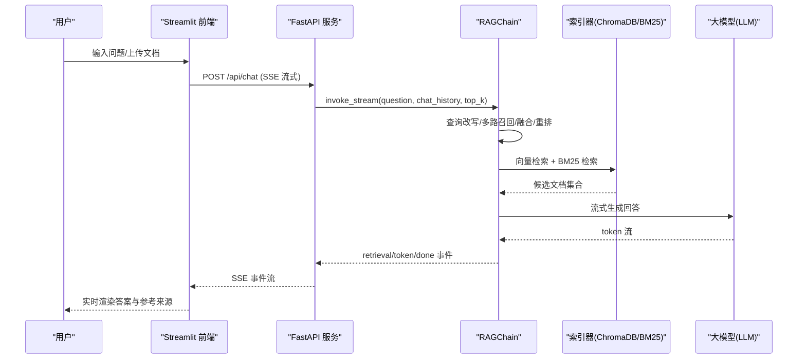
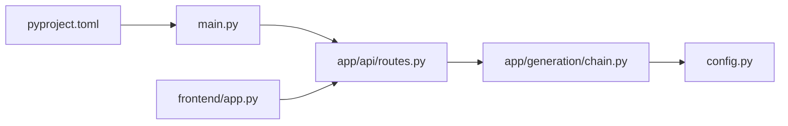

# 快速开始

<cite>
**本文引用的文件**
- [pyproject.toml](file://pyproject.toml)
- [main.py](file://main.py)
- [config.py](file://config.py)
- [app/api/routes.py](file://app/api/routes.py)
- [frontend/app.py](file://frontend/app.py)
- [.streamlit/config.toml](file://.streamlit/config.toml)
- [data/sample_docs/computer_network.md](file://data/sample_docs/computer_network.md)
- [tests/test_api.py](file://tests/test_api.py)
</cite>

## 目录
1. [简介](#简介)
2. [项目结构](#项目结构)
3. [核心组件](#核心组件)
4. [架构总览](#架构总览)
5. [详细组件分析](#详细组件分析)
6. [依赖分析](#依赖分析)
7. [性能考虑](#性能考虑)
8. [故障排除指南](#故障排除指南)
9. [结论](#结论)
10. [附录](#附录)

## 简介
本指南面向新手，帮助你在 30 分钟内完成 RAG 智能问答系统的本地搭建与运行。你将学会：
- 准备 Python 环境与系统依赖
- 使用 uv 安装项目依赖
- 配置环境变量（API Key、端口等）
- 启动后端 API 服务与 Streamlit 前端
- 上传示例文档并进行问答测试
- 排查常见问题（如 API Key 错误、端口冲突等）

## 项目结构
本项目采用分层组织方式：
- app/：业务逻辑（API、检索、生成、索引、观测等）
- frontend/：Streamlit 对话界面
- data/：示例文档与数据
- config.py：统一配置管理
- main.py：FastAPI 应用入口
- pyproject.toml：项目依赖与元信息

图表来源
- [main.py:1-83](file://main.py#L1-L83)
- [app/api/routes.py:1-120](file://app/api/routes.py#L1-L120)
- [app/generation/chain.py:1-120](file://app/generation/chain.py#L1-L120)
- [config.py:1-58](file://config.py#L1-L58)
- [frontend/app.py:1-120](file://frontend/app.py#L1-L120)
- [.streamlit/config.toml:1-10](file://.streamlit/config.toml#L1-L10)
- [pyproject.toml:1-47](file://pyproject.toml#L1-L47)

章节来源
- [pyproject.toml:1-47](file://pyproject.toml#L1-L47)
- [main.py:1-83](file://main.py#L1-L83)
- [config.py:1-58](file://config.py#L1-L58)
- [frontend/app.py:1-120](file://frontend/app.py#L1-L120)
- [.streamlit/config.toml:1-10](file://.streamlit/config.toml#L1-L10)

## 核心组件
- FastAPI 服务：提供健康检查、文档上传、对话问答、检索对比、追踪统计、知识图谱等接口
- Streamlit 前端：可视化对话、上传文档、查看索引详情与观测台
- RAG Chain：查询改写、多路召回（向量+关键词）、RRF 融合、重排、LLM 生成
- 配置中心：集中读取 .env 与环境变量，提供默认值

章节来源
- [app/api/routes.py:1-120](file://app/api/routes.py#L1-L120)
- [frontend/app.py:1-120](file://frontend/app.py#L1-L120)
- [app/generation/chain.py:1-120](file://app/generation/chain.py#L1-L120)
- [config.py:1-58](file://config.py#L1-L58)

## 架构总览
下图展示了从用户提问到答案返回的端到端流程，以及前后端交互关系。

图表来源
- [app/api/routes.py:47-117](file://app/api/routes.py#L47-L117)
- [app/generation/chain.py:100-200](file://app/generation/chain.py#L100-L200)
- [frontend/app.py:200-240](file://frontend/app.py#L200-L240)

## 详细组件分析

### 环境准备与依赖安装
- Python 版本要求：>= 3.11
- 推荐包管理器：uv（用于创建虚拟环境与安装依赖）
- 关键依赖包括：LangChain、OpenAI 客户端、ChromaDB、BM25、Sentence Transformers、FastAPI/Uvicorn、Streamlit、RAGAS、PyPDF、python-dotenv、Pydantic Settings 等

步骤建议
- 安装 uv（若未安装）
- 在项目根目录执行 uv sync 或 uv pip install -e ".[dev]" 以安装全部依赖
- 确认 Python 版本满足要求

章节来源
- [pyproject.toml:1-47](file://pyproject.toml#L1-L47)

### 环境变量与配置
- 配置文件位置：.env（由 Settings 自动加载）
- 必填项：OPENAI_API_KEY（否则服务启动会报错并提示如何配置）
- 可选项：openai_base_url、openai_model、embedding_provider、embedding_model、chroma_persist_dir、retrieval_top_k、rerank_top_n、chunk_size、api_host、api_port、graph_enabled 等
- 默认监听地址与端口：0.0.0.0:8000

注意
- 首次运行前请复制示例模板并填写 OPENAI_API_KEY（若仓库内无示例模板，可直接新建 .env 并写入键值对）
- 如需更换模型或嵌入模型，修改对应配置项即可

章节来源
- [config.py:1-58](file://config.py#L1-L58)
- [main.py:21-32](file://main.py#L21-L32)

### 启动后端 API 服务
- 入口脚本：python main.py
- 启动时会初始化 RAGChain，尝试构建 BM25 索引（若无已索引文档则跳过）
- 服务默认监听 0.0.0.0:8000，可通过配置调整 host/port

验证
- 访问 http://localhost:8000/docs 查看 OpenAPI 文档
- 调用健康检查 GET /api/health 返回状态与已索引文档数

章节来源
- [main.py:52-83](file://main.py#L52-L83)
- [app/api/routes.py:502-518](file://app/api/routes.py#L502-L518)

### 启动 Streamlit 前端
- 启动命令：streamlit run frontend/app.py
- 前端默认连接后端 http://localhost:8000
- 可在侧边栏切换检索策略、上传文档、查看索引透视与观测台

章节来源
- [frontend/app.py:1-120](file://frontend/app.py#L1-L120)
- [.streamlit/config.toml:1-10](file://.streamlit/config.toml#L1-L10)

### 基本使用示例（上传与问答）
- 上传文档：在 Streamlit 左侧选择 PDF/TXT/Markdown 文件，点击“上传并索引”
- 发起问答：在对话框输入问题，支持流式输出；可展开“检索链路详情”查看中间结果
- 示例文档：data/sample_docs 下包含若干技术主题 Markdown 文件，可直接上传体验

章节来源
- [app/api/routes.py:121-163](file://app/api/routes.py#L121-L163)
- [data/sample_docs/computer_network.md:1-109](file://data/sample_docs/computer_network.md#L1-L109)
- [frontend/app.py:515-541](file://frontend/app.py#L515-L541)

### 关键 API 概览
- 健康检查：GET /api/health
- 对话问答：POST /api/chat（支持 stream=true/false）
- 文档上传：POST /api/documents/upload（multipart/form-data，字段 file）
- 文档列表：GET /api/documents
- 文档索引详情：GET /api/documents/{doc_id}/chunks
- 检索对比：POST /api/retrieval/compare
- 追踪统计：GET /api/traces/stats、GET /api/traces?limit=...

章节来源
- [app/api/routes.py:47-117](file://app/api/routes.py#L47-L117)
- [app/api/routes.py:165-258](file://app/api/routes.py#L165-L258)
- [app/api/routes.py:262-351](file://app/api/routes.py#L262-L351)
- [app/api/routes.py:356-369](file://app/api/routes.py#L356-L369)

## 依赖分析
- 运行时依赖：FastAPI、Uvicorn、LangChain/OpenAI、ChromaDB、BM25、Sentence Transformers、Streamlit、RAGAS、PyPDF、dotenv、Pydantic Settings 等
- 开发依赖：pytest、httpx 等
- 模块耦合：
  - main.py 负责生命周期与路由注册
  - routes.py 定义所有 HTTP 端点，调用 RAGChain 与索引器
  - chain.py 编排检索与生成流程
  - config.py 提供全局配置单例

图表来源
- [pyproject.toml:1-47](file://pyproject.toml#L1-L47)
- [main.py:1-83](file://main.py#L1-L83)
- [app/api/routes.py:1-120](file://app/api/routes.py#L1-L120)
- [app/generation/chain.py:1-120](file://app/generation/chain.py#L1-L120)
- [config.py:1-58](file://config.py#L1-L58)
- [frontend/app.py:1-120](file://frontend/app.py#L1-L120)

章节来源
- [pyproject.toml:1-47](file://pyproject.toml#L1-L47)
- [main.py:1-83](file://main.py#L1-L83)
- [app/api/routes.py:1-120](file://app/api/routes.py#L1-L120)
- [app/generation/chain.py:1-120](file://app/generation/chain.py#L1-L120)
- [config.py:1-58](file://config.py#L1-L58)
- [frontend/app.py:1-120](file://frontend/app.py#L1-L120)

## 性能考虑
- 多路召回与融合：Dense + Sparse + Graph（可选）经 RRF 融合后进入重排，兼顾召回率与相关性
- 流式输出：SSE 降低首字延迟，提升用户体验
- 索引构建：首次上传文档会进行分块、向量化与 BM25 索引重建，后续增量上传会更新索引
- 可调参数：top_k、rerank_top_n、chunk_size、chunk_overlap、query_strategy 等，可根据场景调优

章节来源
- [app/generation/chain.py:100-200](file://app/generation/chain.py#L100-L200)
- [app/api/routes.py:262-351](file://app/api/routes.py#L262-L351)
- [config.py:27-36](file://config.py#L27-L36)

## 故障排除指南
- 启动时报错提示缺少 OPENAI_API_KEY
  - 现象：服务启动时抛出异常并提示配置方法
  - 处理：在项目根目录创建 .env，填入 OPENAI_API_KEY 及其他必要配置
  - 参考：[main.py:21-32](file://main.py#L21-L32)、[config.py:1-58](file://config.py#L1-L58)

- 端口冲突（8000 被占用）
  - 现象：启动失败或无法访问
  - 处理：修改 api_host/api_port 配置，或释放占用端口
  - 参考：[config.py:38-40](file://config.py#L38-L40)

- 前端显示“后端离线”
  - 现象：Streamlit 侧边栏提示后端离线
  - 处理：确认已启动 python main.py，且前端 API_BASE_URL 指向正确地址
  - 参考：[frontend/app.py:236-243](file://frontend/app.py#L236-L243)

- 上传文件格式不支持
  - 现象：上传非 .pdf/.txt/.md 文件返回 400
  - 处理：仅支持 PDF、TXT、Markdown 格式
  - 参考：[app/api/routes.py:131-136](file://app/api/routes.py#L131-L136)

- 健康检查失败
  - 现象：/api/health 返回异常
  - 处理：检查索引器是否可用、是否有已索引文档
  - 参考：[app/api/routes.py:502-518](file://app/api/routes.py#L502-L518)

- 单元测试辅助定位
  - 使用 pytest 运行 tests/test_api.py，覆盖健康检查、对话校验、文档上传等用例
  - 参考：[tests/test_api.py:1-59](file://tests/test_api.py#L1-L59)

## 结论
通过本指南，你已完成 RAG 智能问答系统的本地部署与基础使用。建议下一步：
- 上传更多领域文档以提升问答质量
- 在“观测台”中观察各阶段耗时，优化检索策略与参数
- 结合评估接口与数据集进行效果评测

## 附录

### 快速命令清单
- 安装依赖（推荐 uv）
  - uv sync
  - 或 uv pip install -e ".[dev]"
- 启动后端
  - python main.py
- 启动前端
  - streamlit run frontend/app.py
- 健康检查
  - curl http://localhost:8000/api/health

章节来源
- [pyproject.toml:1-47](file://pyproject.toml#L1-L47)
- [main.py:73-83](file://main.py#L73-L83)
- [frontend/app.py:1-120](file://frontend/app.py#L1-L120)
- [app/api/routes.py:502-518](file://app/api/routes.py#L502-L518)