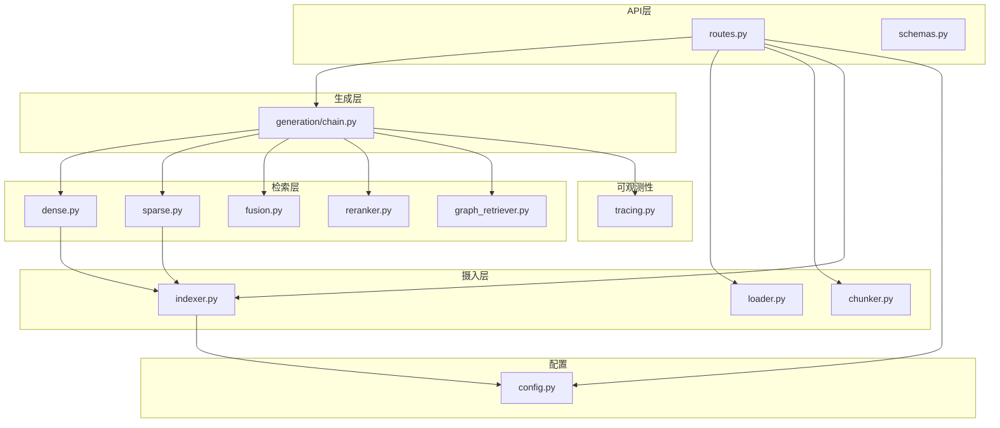
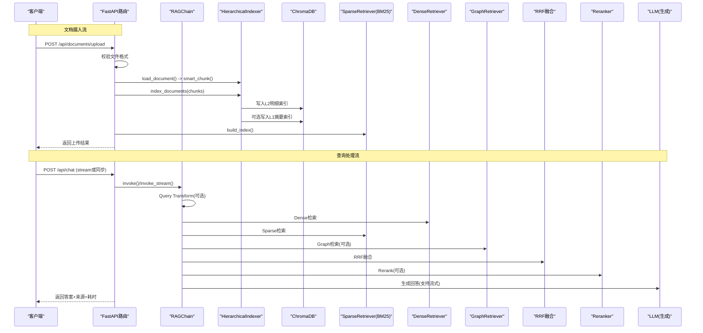
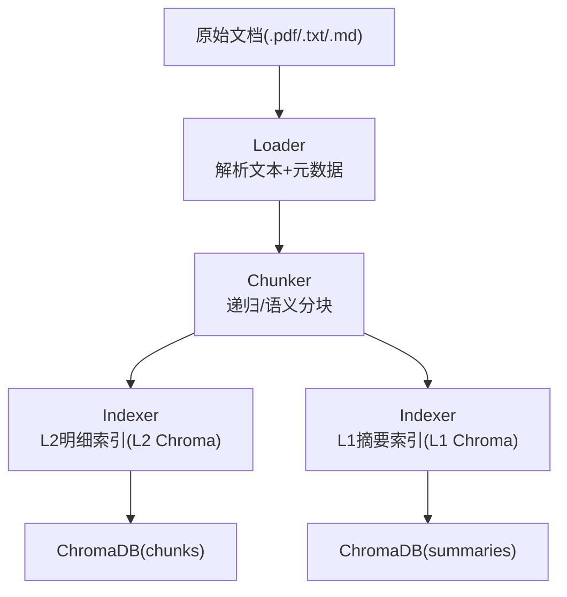
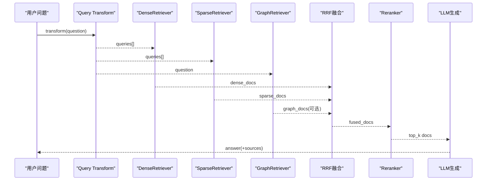
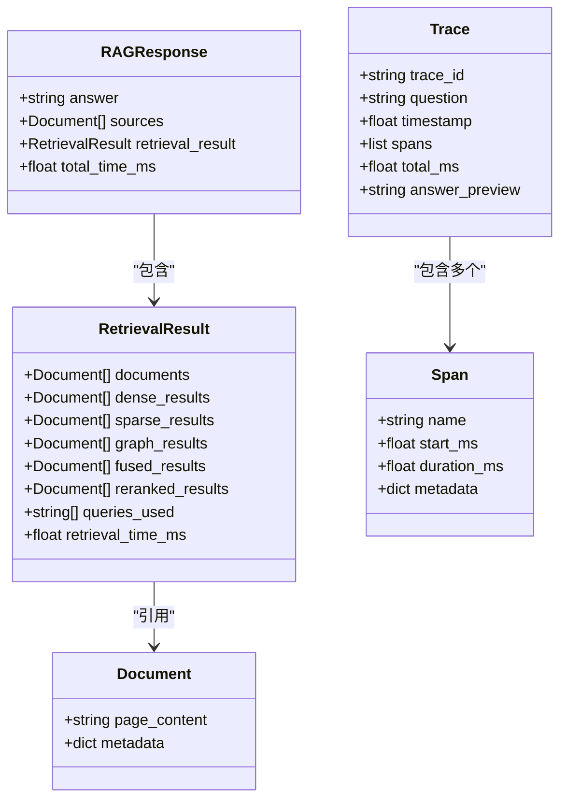
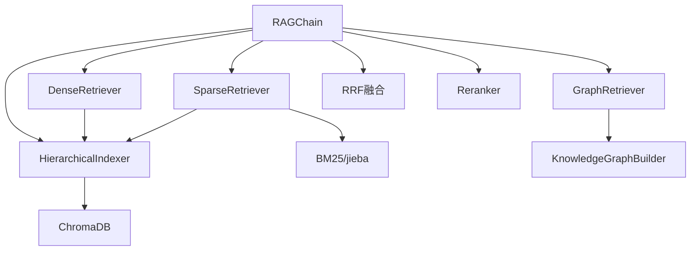

# 数据流架构

<cite>
**本文引用的文件**
- [main.py](file://main.py)
- [config.py](file://config.py)
- [app/api/routes.py](file://app/api/routes.py)
- [app/api/schemas.py](file://app/api/schemas.py)
- [app/ingestion/loader.py](file://app/ingestion/loader.py)
- [app/ingestion/chunker.py](file://app/ingestion/chunker.py)
- [app/ingestion/indexer.py](file://app/ingestion/indexer.py)
- [app/generation/chain.py](file://app/generation/chain.py)
- [app/retrieval/dense.py](file://app/retrieval/dense.py)
- [app/retrieval/sparse.py](file://app/retrieval/sparse.py)
- [app/retrieval/fusion.py](file://app/retrieval/fusion.py)
- [app/retrieval/reranker.py](file://app/retrieval/reranker.py)
- [app/retrieval/graph_retriever.py](file://app/retrieval/graph_retriever.py)
- [app/observability/tracing.py](file://app/observability/tracing.py)
</cite>

## 目录
1. [引言](#引言)
2. [项目结构](#项目结构)
3. [核心组件](#核心组件)
4. [架构总览](#架构总览)
5. [详细组件分析](#详细组件分析)
6. [依赖关系分析](#依赖关系分析)
7. [性能与并发](#性能与并发)
8. [故障排查指南](#故障排查指南)
9. [结论](#结论)
10. [附录：数据模型与序列化](#附录数据模型与序列化)

## 引言
本文件面向RAG系统的数据流架构，系统化描述从文档摄入到查询处理的完整数据流转路径，明确关键数据结构、组件间传递方式与序列化格式，并给出异步处理机制、并发控制策略、缓存与一致性保证的说明。文末提供多幅数据流图，帮助读者快速理解各阶段的输入输出关系。

## 项目结构
仓库采用按功能分层组织：
- API层：FastAPI路由与请求/响应Schema定义
- 摄入层（Ingestion）：文档加载、分块、层级索引构建
- 检索层（Retrieval）：稠密/稀疏/图检索、RRF融合、重排序
- 生成层（Generation）：RAG链组装、上下文拼接、LLM调用
- 可观测性（Observability）：轻量追踪器Trace/Span
- 配置（Config）：统一环境变量与默认值

图示来源
- [main.py:1-83](file://main.py#L1-L83)
- [app/api/routes.py:1-563](file://app/api/routes.py#L1-L563)
- [app/api/schemas.py:1-106](file://app/api/schemas.py#L1-L106)
- [app/ingestion/loader.py:1-90](file://app/ingestion/loader.py#L1-L90)
- [app/ingestion/chunker.py:1-157](file://app/ingestion/chunker.py#L1-L157)
- [app/ingestion/indexer.py:1-253](file://app/ingestion/indexer.py#L1-L253)
- [app/generation/chain.py:1-377](file://app/generation/chain.py#L1-L377)
- [app/retrieval/dense.py:1-53](file://app/retrieval/dense.py#L1-L53)
- [app/retrieval/sparse.py:1-123](file://app/retrieval/sparse.py#L1-L123)
- [app/retrieval/fusion.py:1-106](file://app/retrieval/fusion.py#L1-L106)
- [app/retrieval/reranker.py:1-112](file://app/retrieval/reranker.py#L1-L112)
- [app/retrieval/graph_retriever.py:1-312](file://app/retrieval/graph_retriever.py#L1-L312)
- [app/observability/tracing.py:1-146](file://app/observability/tracing.py#L1-L146)
- [config.py:1-58](file://config.py#L1-L58)

章节来源
- [main.py:1-83](file://main.py#L1-L83)
- [config.py:1-58](file://config.py#L1-L58)

## 核心组件
- 文档摄入流：原始文档 → Loader → Chunker → Indexer → ChromaDB
- 查询处理流：用户问题 → Query Transform → Multi-Recall（Dense + Sparse + Graph）→ Fusion（RRF）→ Rerank → Generation
- 关键数据结构：Document对象、RetrievalResult封装类、RAGResponse响应结构、Trace/Span追踪记录
- 组件间传递：以LangChain Document为主载体，元数据承载ID、分数、来源等；API层使用Pydantic Schema进行JSON序列化
- 异步与并发：FastAPI基于事件循环，SSE流式返回；BM25索引按需构建；ChromaDB持久化存储
- 缓存与一致性：ChromaDB作为向量与元数据的持久化后端；BM25索引在新增文档后重建；去重策略保障结果唯一性

章节来源
- [app/generation/chain.py:1-377](file://app/generation/chain.py#L1-L377)
- [app/api/routes.py:1-563](file://app/api/routes.py#L1-L563)
- [app/ingestion/indexer.py:1-253](file://app/ingestion/indexer.py#L1-L253)
- [app/retrieval/sparse.py:1-123](file://app/retrieval/sparse.py#L1-L123)
- [app/retrieval/fusion.py:1-106](file://app/retrieval/fusion.py#L1-L106)
- [app/observability/tracing.py:1-146](file://app/observability/tracing.py#L1-L146)

## 架构总览
下图展示端到端数据流：上传与索引构建、以及在线查询的完整链路。

图示来源
- [app/api/routes.py:1-563](file://app/api/routes.py#L1-L563)
- [app/generation/chain.py:1-377](file://app/generation/chain.py#L1-L377)
- [app/ingestion/indexer.py:1-253](file://app/ingestion/indexer.py#L1-L253)
- [app/retrieval/dense.py:1-53](file://app/retrieval/dense.py#L1-L53)
- [app/retrieval/sparse.py:1-123](file://app/retrieval/sparse.py#L1-L123)
- [app/retrieval/fusion.py:1-106](file://app/retrieval/fusion.py#L1-L106)
- [app/retrieval/reranker.py:1-112](file://app/retrieval/reranker.py#L1-L112)
- [app/retrieval/graph_retriever.py:1-312](file://app/retrieval/graph_retriever.py#L1-L312)

## 详细组件分析

### 文档摄入流（原始文档→Loader→Chunker→Indexer→ChromaDB）
- 加载器：根据扩展名选择PDF/TXT/Markdown加载器，补充source、file_path、doc_id等元数据
- 分块器：递归字符分块或语义分块，为每个chunk添加chunk_id与position
- 层级索引：L2明细索引（段落向量），L1摘要索引（文档级摘要向量）
- 持久化：ChromaDB集合分别保存chunks与summaries，支持过滤与可视化导出

图示来源
- [app/ingestion/loader.py:1-90](file://app/ingestion/loader.py#L1-L90)
- [app/ingestion/chunker.py:1-157](file://app/ingestion/chunker.py#L1-L157)
- [app/ingestion/indexer.py:1-253](file://app/ingestion/indexer.py#L1-L253)

章节来源
- [app/ingestion/loader.py:1-90](file://app/ingestion/loader.py#L1-L90)
- [app/ingestion/chunker.py:1-157](file://app/ingestion/chunker.py#L1-L157)
- [app/ingestion/indexer.py:1-253](file://app/ingestion/indexer.py#L1-L253)

### 查询处理流（用户问题→Query Transform→Multi-Recall→Fusion→Rerank→Generation）
- 查询改写：支持multi_query/hyde/none策略，产出多个查询变体
- 多路召回：稠密向量检索（Chroma）、稀疏关键词检索（BM25）、知识图谱检索（实体抽取+子图）
- 融合：RRF融合多路结果，不依赖原始分数，仅利用排名
- 重排序：Cross-Encoder对候选精排，附加rerank_score
- 生成：构造上下文，调用LLM生成回答，支持流式token推送

图示来源
- [app/generation/chain.py:1-377](file://app/generation/chain.py#L1-L377)
- [app/retrieval/dense.py:1-53](file://app/retrieval/dense.py#L1-L53)
- [app/retrieval/sparse.py:1-123](file://app/retrieval/sparse.py#L1-L123)
- [app/retrieval/fusion.py:1-106](file://app/retrieval/fusion.py#L1-L106)
- [app/retrieval/reranker.py:1-112](file://app/retrieval/reranker.py#L1-L112)
- [app/retrieval/graph_retriever.py:1-312](file://app/retrieval/graph_retriever.py#L1-L312)

章节来源
- [app/generation/chain.py:1-377](file://app/generation/chain.py#L1-L377)
- [app/retrieval/dense.py:1-53](file://app/retrieval/dense.py#L1-L53)
- [app/retrieval/sparse.py:1-123](file://app/retrieval/sparse.py#L1-L123)
- [app/retrieval/fusion.py:1-106](file://app/retrieval/fusion.py#L1-L106)
- [app/retrieval/reranker.py:1-112](file://app/retrieval/reranker.py#L1-L112)
- [app/retrieval/graph_retriever.py:1-312](file://app/retrieval/graph_retriever.py#L1-L312)

### 关键数据结构设计
- Document对象：LangChain标准文档，page_content承载正文，metadata承载source、doc_id、chunk_id、position、各类分数（bm25_score、rrf_score、rerank_score）等
- RetrievalResult：封装多路召回结果与最终文档列表，包含queries_used、dense_results、sparse_results、graph_results、fused_results、reranked_results、retrieval_time_ms
- RAGResponse：包含answer、sources、retrieval_result、total_time_ms
- Trace/Span：Trace记录一次调用的trace_id、question、timestamp、spans、total_ms、answer_preview；Span记录阶段name、start_ms、duration_ms、metadata

图示来源
- [app/generation/chain.py:1-377](file://app/generation/chain.py#L1-L377)
- [app/observability/tracing.py:1-146](file://app/observability/tracing.py#L1-L146)

章节来源
- [app/generation/chain.py:1-377](file://app/generation/chain.py#L1-L377)
- [app/observability/tracing.py:1-146](file://app/observability/tracing.py#L1-L146)

### 数据在不同组件间的传递方式与序列化格式
- 组件内传递：以LangChain Document为主，通过metadata携带ID、分数、来源等字段
- API层序列化：Pydantic Schema将内部对象转换为JSON响应，如ChatRequest/ChatResponse、SourceDocument、RetrievalDetail等
- 流式传输：SSE事件类型包括retrieval、token、done，分别携带检索统计、增量token、最终响应摘要

图示来源
- [app/api/schemas.py:1-106](file://app/api/schemas.py#L1-L106)
- [app/api/routes.py:1-563](file://app/api/routes.py#L1-L563)

章节来源
- [app/api/schemas.py:1-106](file://app/api/schemas.py#L1-L106)
- [app/api/routes.py:1-563](file://app/api/routes.py#L1-L563)

### 异步数据处理机制与并发控制策略
- FastAPI基于事件循环，路由函数使用async/await，SSE流式返回提升交互体验
- 检索阶段串行执行各阶段（transform→dense→sparse→graph→fusion→rerank→generate），避免复杂并发带来的状态竞争
- BM25索引按需构建，首次检索时自动build_index，减少启动开销
- 全局单例RAG Chain在应用生命周期中初始化，避免重复创建资源

章节来源
- [main.py:1-83](file://main.py#L1-L83)
- [app/api/routes.py:1-563](file://app/api/routes.py#L1-L563)
- [app/retrieval/sparse.py:1-123](file://app/retrieval/sparse.py#L1-L123)

### 缓存策略与数据一致性保证
- 向量与元数据持久化：ChromaDB集合chunks与summaries分别存储L2/L1索引，重启后可恢复
- 去重策略：基于chunk_id去重，确保多路召回结果唯一性
- 索引一致性：上传新文档后重建BM25索引，保证关键词检索与向量检索一致
- 降级与回退：层级检索失败时回退到全局明细检索；无图数据时跳过图检索

章节来源
- [app/ingestion/indexer.py:1-253](file://app/ingestion/indexer.py#L1-L253)
- [app/retrieval/fusion.py:1-106](file://app/retrieval/fusion.py#L1-L106)
- [app/retrieval/sparse.py:1-123](file://app/retrieval/sparse.py#L1-L123)

## 依赖关系分析
- 组件耦合：RAGChain聚合各检索器与生成器；Indexer依赖Embedding与ChromaDB；SparseRetriever依赖BM25与jieba；GraphRetriever依赖知识图谱构建器
- 外部依赖：OpenAI/DeepSeek LLM与Embedding、HuggingFace本地Embedding、ChromaDB、NetworkX（图算法）

图示来源
- [app/generation/chain.py:1-377](file://app/generation/chain.py#L1-L377)
- [app/ingestion/indexer.py:1-253](file://app/ingestion/indexer.py#L1-L253)
- [app/retrieval/sparse.py:1-123](file://app/retrieval/sparse.py#L1-L123)
- [app/retrieval/graph_retriever.py:1-312](file://app/retrieval/graph_retriever.py#L1-L312)

章节来源
- [app/generation/chain.py:1-377](file://app/generation/chain.py#L1-L377)
- [app/ingestion/indexer.py:1-253](file://app/ingestion/indexer.py#L1-L253)
- [app/retrieval/sparse.py:1-123](file://app/retrieval/sparse.py#L1-L123)
- [app/retrieval/graph_retriever.py:1-312](file://app/retrieval/graph_retriever.py#L1-L312)

## 性能与并发
- 多路召回并行度：当前实现串行执行各阶段，便于追踪与调试；如需提升吞吐，可在多路召回阶段引入并发（注意去重与锁）
- 重排序成本：Cross-Encoder对候选精排较慢，建议限制候选规模（如top_n=20）
- 流式生成：SSE逐步推送token，降低首字延迟
- 指标与追踪：内置Tracer记录各阶段耗时，便于定位瓶颈

[本节为通用性能讨论，无需特定文件来源]

## 故障排查指南
- 文档上传失败：检查文件格式与临时文件写入权限；查看日志中的错误信息
- BM25索引为空：确认已索引文档存在且成功构建索引；必要时手动触发build_index
- 图检索未启用：确认配置graph_enabled为True且已构建知识图谱
- 检索结果为空：检查ChromaDB集合是否存在、Embedding模型是否可用、query_transform策略是否禁用
- 生成失败：验证OPENAI_API_KEY与base_url配置正确

章节来源
- [app/api/routes.py:1-563](file://app/api/routes.py#L1-L563)
- [config.py:1-58](file://config.py#L1-L58)

## 结论
本架构以Document为核心载体，结合ChromaDB持久化与BM25关键词匹配，形成“稠密+稀疏+图”的多路召回体系，并通过RRF融合与Cross-Encoder重排序提升相关性。RAGChain串联全流程，配合SSE流式与轻量追踪，兼顾性能与可观测性。建议在后续迭代中评估并发召回与更细粒度的缓存策略，以进一步提升吞吐与稳定性。

[本节为总结，无需特定文件来源]

## 附录：数据模型与序列化
- 请求/响应Schema：ChatRequest、ChatResponse、SourceDocument、RetrievalDetail、UploadResponse、DocumentInfo、DocumentListResponse、EvalRequest、EvalReport、HealthResponse
- 内部数据模型：RetrievalResult、RAGResponse、Trace、Span
- 元数据关键字段：source、doc_id、chunk_id、position、bm25_score、rrf_score、rerank_score、type、num_chunks等

章节来源
- [app/api/schemas.py:1-106](file://app/api/schemas.py#L1-L106)
- [app/generation/chain.py:1-377](file://app/generation/chain.py#L1-L377)
- [app/observability/tracing.py:1-146](file://app/observability/tracing.py#L1-L146)