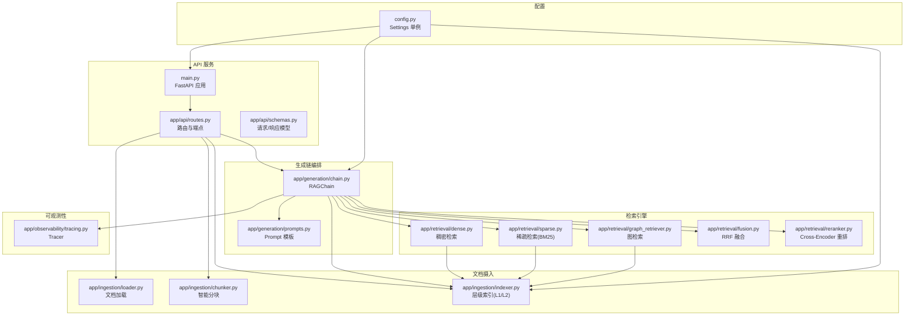
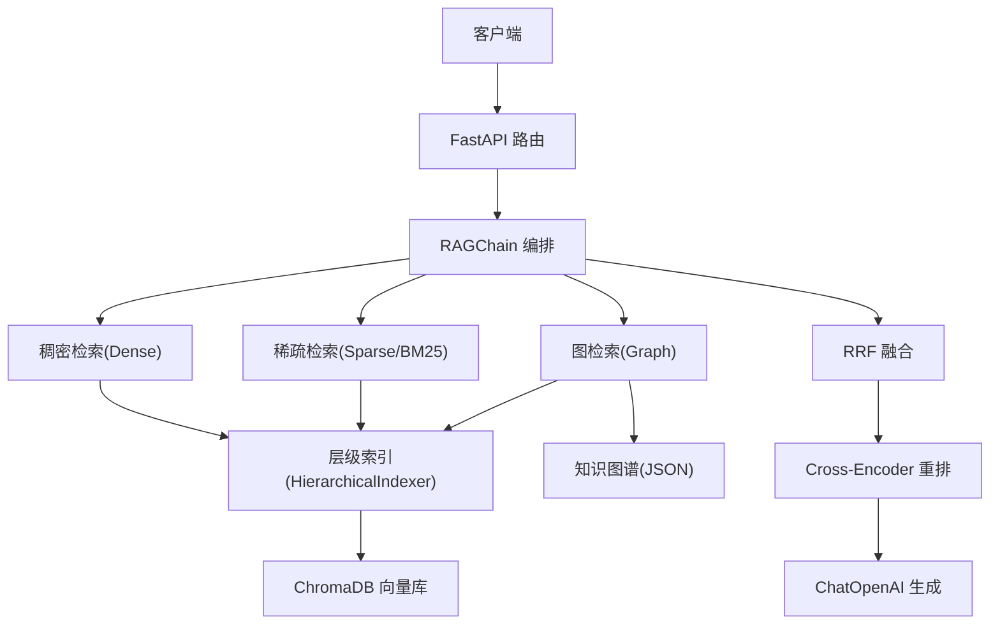
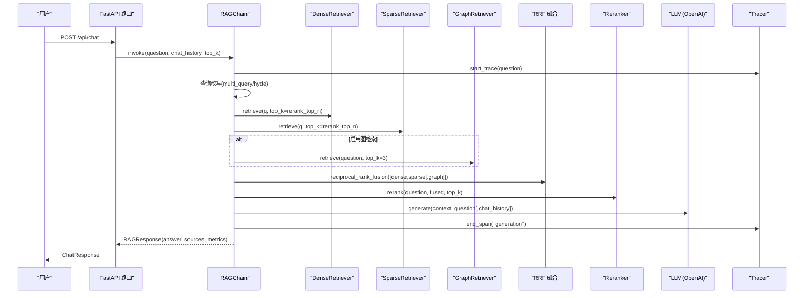
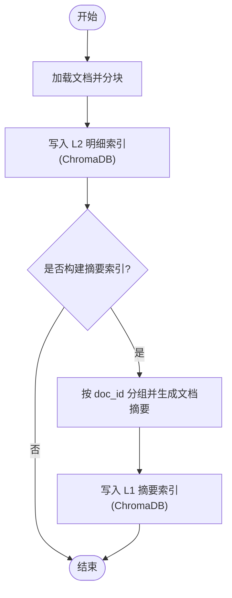
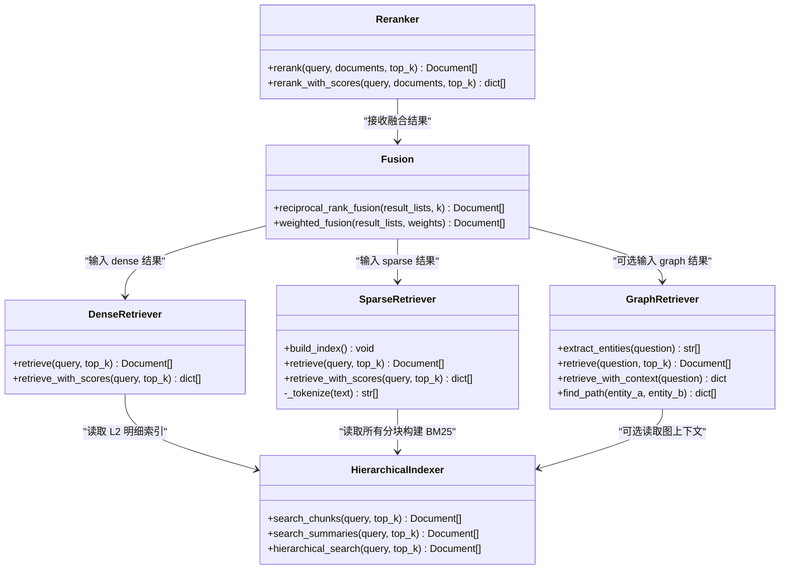
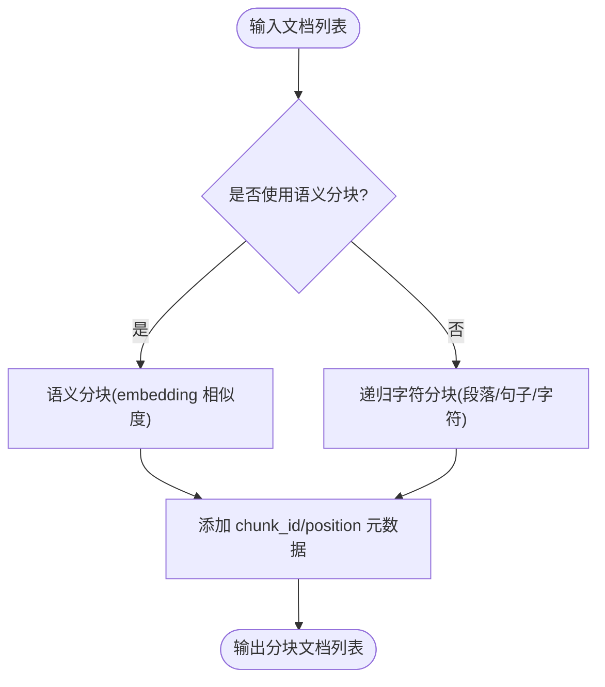
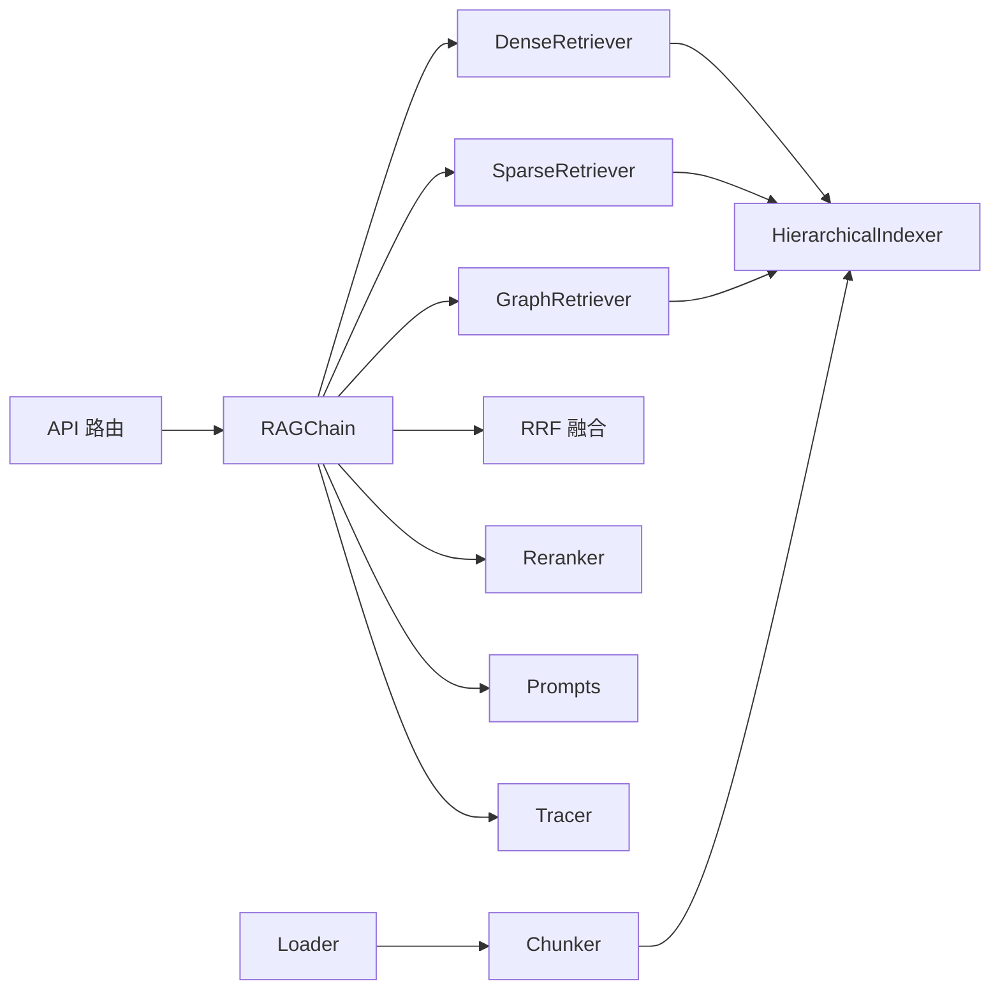
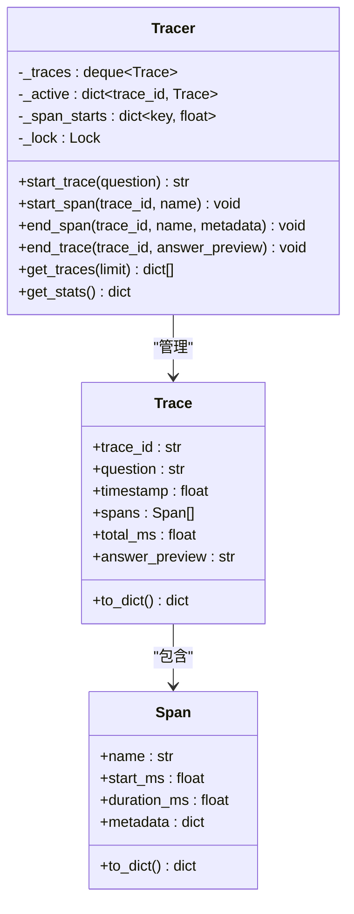

# 架构设计

<cite>
**本文引用的文件**   
- [main.py](file://main.py)
- [config.py](file://config.py)
- [app/generation/chain.py](file://app/generation/chain.py)
- [app/ingestion/indexer.py](file://app/ingestion/indexer.py)
- [app/retrieval/dense.py](file://app/retrieval/dense.py)
- [app/retrieval/sparse.py](file://app/retrieval/sparse.py)
- [app/retrieval/fusion.py](file://app/retrieval/fusion.py)
- [app/retrieval/reranker.py](file://app/retrieval/reranker.py)
- [app/retrieval/graph_retriever.py](file://app/retrieval/graph_retriever.py)
- [app/observability/tracing.py](file://app/observability/tracing.py)
- [app/api/routes.py](file://app/api/routes.py)
- [app/api/schemas.py](file://app/api/schemas.py)
- [app/ingestion/loader.py](file://app/ingestion/loader.py)
- [app/ingestion/chunker.py](file://app/ingestion/chunker.py)
- [app/generation/prompts.py](file://app/generation/prompts.py)
</cite>

## 目录
1. [引言](#引言)
2. [项目结构](#项目结构)
3. [核心组件](#核心组件)
4. [架构总览](#架构总览)
5. [详细组件分析](#详细组件分析)
6. [依赖关系分析](#依赖关系分析)
7. [性能与可扩展性](#性能与可扩展性)
8. [可观测性与监控](#可观测性与监控)
9. [故障排查指南](#故障排查指南)
10. [结论](#结论)

## 引言
本文件面向开发者与架构师，系统化阐述该 RAG 系统的高层架构、分层索引设计、多路召回融合策略、生成链编排以及可观测性体系。重点说明：
- 文档摄入层、检索引擎层、生成链编排层、数据存储层的职责划分
- RAGChain 如何协调稠密向量检索、稀疏关键词检索、知识图谱检索与重排序
- L1 摘要索引与 L2 明细索引的协作机制
- 多路召回（Dense + Sparse + Graph）与 RRF 融合的技术实现
- 管道追踪与性能指标收集的可观测性方案

## 项目结构
仓库采用按功能域划分的模块化组织方式，核心模块包括：
- API 服务与路由：FastAPI 应用入口、路由定义、请求/响应模型
- 文档摄入：加载器、分块器、层级索引构建
- 检索引擎：稠密检索、稀疏检索、图检索、RRF 融合、重排序
- 生成链：RAGChain 编排、提示词模板、流式输出
- 可观测性：轻量级分布式追踪
- 配置管理：统一配置单例与环境变量注入

图表来源
- [main.py:1-83](file://main.py#L1-L83)
- [app/api/routes.py:1-563](file://app/api/routes.py#L1-L563)
- [app/generation/chain.py:1-377](file://app/generation/chain.py#L1-L377)
- [app/retrieval/dense.py:1-53](file://app/retrieval/dense.py#L1-L53)
- [app/retrieval/sparse.py:1-123](file://app/retrieval/sparse.py#L1-L123)
- [app/retrieval/graph_retriever.py:1-312](file://app/retrieval/graph_retriever.py#L1-L312)
- [app/retrieval/fusion.py:1-106](file://app/retrieval/fusion.py#L1-L106)
- [app/retrieval/reranker.py:1-112](file://app/retrieval/reranker.py#L1-L112)
- [app/ingestion/loader.py:1-90](file://app/ingestion/loader.py#L1-L90)
- [app/ingestion/chunker.py:1-157](file://app/ingestion/chunker.py#L1-L157)
- [app/ingestion/indexer.py:1-253](file://app/ingestion/indexer.py#L1-L253)
- [app/observability/tracing.py:1-146](file://app/observability/tracing.py#L1-L146)
- [config.py:1-58](file://config.py#L1-L58)

章节来源
- [main.py:1-83](file://main.py#L1-L83)
- [config.py:1-58](file://config.py#L1-L58)

## 核心组件
- FastAPI 应用与生命周期管理：在启动时初始化 RAGChain、可选构建 BM25 索引、注册路由与中间件
- RAGChain：编排查询改写、多路召回、RRF 融合、重排序与生成；支持同步与流式调用；内置追踪埋点
- 层级索引 HierarchicalIndexer：维护 L1 摘要索引与 L2 明细索引；提供层级检索能力
- 检索器族：DenseRetriever、SparseRetriever、GraphRetriever；分别负责向量相似度、BM25 关键词匹配、知识图谱关系检索
- 融合与重排：reciprocal_rank_fusion 进行多路结果融合；Reranker 使用 Cross-Encoder 对候选精排
- 文档摄入：Loader 支持 PDF/TXT/Markdown；Chunker 提供递归字符分块与语义分块；Indexer 写入 ChromaDB
- 可观测性：Tracer 记录 Trace/Span，统计各阶段耗时与汇总指标
- 配置：基于 pydantic-settings 的统一 Settings 单例，环境变量优先

章节来源
- [main.py:21-49](file://main.py#L21-L49)
- [app/generation/chain.py:49-100](file://app/generation/chain.py#L49-L100)
- [app/ingestion/indexer.py:74-110](file://app/ingestion/indexer.py#L74-L110)
- [app/retrieval/dense.py:13-37](file://app/retrieval/dense.py#L13-L37)
- [app/retrieval/sparse.py:19-47](file://app/retrieval/sparse.py#L19-L47)
- [app/retrieval/graph_retriever.py:39-61](file://app/retrieval/graph_retriever.py#L39-L61)
- [app/retrieval/fusion.py:13-64](file://app/retrieval/fusion.py#L13-L64)
- [app/retrieval/reranker.py:14-31](file://app/retrieval/reranker.py#L14-L31)
- [app/ingestion/loader.py:22-59](file://app/ingestion/loader.py#L22-L59)
- [app/ingestion/chunker.py:138-157](file://app/ingestion/chunker.py#L138-L157)
- [app/observability/tracing.py:49-74](file://app/observability/tracing.py#L49-L74)
- [config.py:7-58](file://config.py#L7-L58)

## 架构总览
整体采用“接入层 → 编排层 → 检索层 → 存储层”的分层架构：
- 接入层：FastAPI 暴露 REST 接口，处理上传、对话、评估、健康检查等
- 编排层：RAGChain 串联查询改写、多路召回、融合、重排与生成
- 检索层：Dense/Sparse/Graph 三路并行或串行组合，RRF 融合后进入精排
- 存储层：ChromaDB 持久化向量索引（L1/L2），本地 JSON 保存知识图谱

图表来源
- [main.py:52-70](file://main.py#L52-L70)
- [app/api/routes.py:47-71](file://app/api/routes.py#L47-L71)
- [app/generation/chain.py:100-201](file://app/generation/chain.py#L100-L201)
- [app/retrieval/dense.py:21-37](file://app/retrieval/dense.py#L21-L37)
- [app/retrieval/sparse.py:27-47](file://app/retrieval/sparse.py#L27-L47)
- [app/retrieval/graph_retriever.py:88-132](file://app/retrieval/graph_retriever.py#L88-L132)
- [app/retrieval/fusion.py:13-64](file://app/retrieval/fusion.py#L13-L64)
- [app/retrieval/reranker.py:33-79](file://app/retrieval/reranker.py#L33-L79)
- [app/ingestion/indexer.py:89-109](file://app/ingestion/indexer.py#L89-L109)

## 详细组件分析

### RAGChain 编排流程
RAGChain 是系统的核心编排器，负责：
- 查询改写：支持 multi_query/hyde 等策略，产出多个查询变体
- 多路召回：对每个查询变体执行 Dense 与 Sparse 检索，并可选 Graph 检索
- 去重与融合：合并多路结果，使用 RRF 计算综合分数
- 重排序：对候选集进行 Cross-Encoder 精排
- 生成：构造上下文，选择 Prompt 模板，调用 LLM 生成回答（支持流式）
- 追踪：为关键阶段打点，记录耗时与元数据

图表来源
- [app/api/routes.py:47-71](file://app/api/routes.py#L47-L71)
- [app/generation/chain.py:272-312](file://app/generation/chain.py#L272-L312)
- [app/generation/chain.py:100-201](file://app/generation/chain.py#L100-L201)
- [app/retrieval/dense.py:24-37](file://app/retrieval/dense.py#L24-L37)
- [app/retrieval/sparse.py:72-104](file://app/retrieval/sparse.py#L72-L104)
- [app/retrieval/graph_retriever.py:88-132](file://app/retrieval/graph_retriever.py#L88-L132)
- [app/retrieval/fusion.py:13-64](file://app/retrieval/fusion.py#L13-L64)
- [app/retrieval/reranker.py:33-79](file://app/retrieval/reranker.py#L33-L79)
- [app/observability/tracing.py:63-74](file://app/observability/tracing.py#L63-L74)

章节来源
- [app/generation/chain.py:49-100](file://app/generation/chain.py#L49-L100)
- [app/generation/chain.py:100-201](file://app/generation/chain.py#L100-L201)
- [app/generation/chain.py:203-241](file://app/generation/chain.py#L203-L241)
- [app/generation/chain.py:272-312](file://app/generation/chain.py#L272-L312)
- [app/generation/prompts.py:6-42](file://app/generation/prompts.py#L6-L42)

### 分层索引架构（L1 摘要 + L2 明细）
- L2 明细索引：将分块后的文档片段存入 ChromaDB，用于细粒度检索
- L1 摘要索引：对同一文档的所有分块，使用 LLM 生成文档级摘要，再建立向量索引，用于粗粒度定位相关文档
- 层级检索：先通过 L1 摘要检索定位目标文档集合，再在 L2 明细索引中限定范围检索，提升召回精准度与效率

图表来源
- [app/ingestion/indexer.py:111-146](file://app/ingestion/indexer.py#L111-L146)
- [app/ingestion/chunker.py:15-53](file://app/ingestion/chunker.py#L15-L53)
- [app/ingestion/loader.py:22-59](file://app/ingestion/loader.py#L22-L59)

章节来源
- [app/ingestion/indexer.py:74-110](file://app/ingestion/indexer.py#L74-L110)
- [app/ingestion/indexer.py:111-146](file://app/ingestion/indexer.py#L111-L146)
- [app/ingestion/indexer.py:166-201](file://app/ingestion/indexer.py#L166-L201)

### 多路召回与融合策略
- 稠密检索：使用 OpenAI Embedding 将查询编码为向量，在 ChromaDB 中进行余弦相似度搜索
- 稀疏检索：基于 BM25 的关键词匹配，中文使用 jieba 分词，英文/数字保持完整单词，过滤噪声
- 图检索：从查询中抽取实体，获取实体关系与子图，格式化为自然语言三元组文本作为补充上下文
- RRF 融合：对多路结果按排名计算 RRF 分数，不依赖原始分数，鲁棒性强
- 重排序：对融合后的候选集使用 Cross-Encoder 打分精排

图表来源
- [app/retrieval/dense.py:13-53](file://app/retrieval/dense.py#L13-L53)
- [app/retrieval/sparse.py:19-123](file://app/retrieval/sparse.py#L19-L123)
- [app/retrieval/graph_retriever.py:39-312](file://app/retrieval/graph_retriever.py#L39-L312)
- [app/retrieval/fusion.py:13-106](file://app/retrieval/fusion.py#L13-L106)
- [app/retrieval/reranker.py:14-112](file://app/retrieval/reranker.py#L14-L112)
- [app/ingestion/indexer.py:158-201](file://app/ingestion/indexer.py#L158-L201)

章节来源
- [app/retrieval/dense.py:21-37](file://app/retrieval/dense.py#L21-L37)
- [app/retrieval/sparse.py:32-47](file://app/retrieval/sparse.py#L32-L47)
- [app/retrieval/sparse.py:49-70](file://app/retrieval/sparse.py#L49-L70)
- [app/retrieval/fusion.py:13-64](file://app/retrieval/fusion.py#L13-L64)
- [app/retrieval/reranker.py:33-79](file://app/retrieval/reranker.py#L33-L79)
- [app/retrieval/graph_retriever.py:88-132](file://app/retrieval/graph_retriever.py#L88-L132)

### 文档摄入与分块策略
- 加载器：根据扩展名自动选择 PyPDFLoader/TextLoader，补充 source/file_path/doc_id 等元数据
- 分块器：
  - 递归字符分块：按段落/句子/字符层级切分，添加 chunk_id 与 position
  - 语义分块：基于相邻句子的 embedding 相似度检测语义边界，阈值低于设定值则切分
- 智能分块入口：根据配置选择策略

图表来源
- [app/ingestion/loader.py:22-59](file://app/ingestion/loader.py#L22-L59)
- [app/ingestion/chunker.py:15-53](file://app/ingestion/chunker.py#L15-L53)
- [app/ingestion/chunker.py:56-135](file://app/ingestion/chunker.py#L56-L135)
- [app/ingestion/chunker.py:138-157](file://app/ingestion/chunker.py#L138-L157)

章节来源
- [app/ingestion/loader.py:22-59](file://app/ingestion/loader.py#L22-L59)
- [app/ingestion/chunker.py:15-53](file://app/ingestion/chunker.py#L15-L53)
- [app/ingestion/chunker.py:56-135](file://app/ingestion/chunker.py#L56-L135)

### API 与服务集成
- 主入口：创建 FastAPI 应用，配置 CORS，注册路由，启动 uvicorn
- 路由：
  - /api/chat：对话接口，支持普通与 SSE 流式模式
  - /api/documents/upload：上传文档并建立索引，重建 BM25 索引
  - /api/documents：列出已索引文档
  - /api/documents/{doc_id}/chunks：获取指定文档的全链路索引详情（含分块、Embedding、L1 摘要、BM25 词项）
  - /api/retrieval/compare：检索策略对比实验（Dense/Sparse/RRF/Rerank）
  - /api/traces 与 /api/traces/stats：追踪记录与统计
  - /api/evaluate：触发评估（RAGAS 指标）
  - 图检索相关：/api/graph/build、/api/graph/stats、/api/graph/triples、/api/graph/query、/api/graph/path、/api/graph/clear
  - /api/health：健康检查

章节来源
- [main.py:52-83](file://main.py#L52-L83)
- [app/api/routes.py:47-117](file://app/api/routes.py#L47-L117)
- [app/api/routes.py:121-192](file://app/api/routes.py#L121-L192)
- [app/api/routes.py:194-258](file://app/api/routes.py#L194-L258)
- [app/api/routes.py:262-351](file://app/api/routes.py#L262-L351)
- [app/api/routes.py:356-369](file://app/api/routes.py#L356-L369)
- [app/api/routes.py:374-397](file://app/api/routes.py#L374-L397)
- [app/api/routes.py:402-499](file://app/api/routes.py#L402-L499)
- [app/api/routes.py:504-518](file://app/api/routes.py#L504-L518)

## 依赖关系分析
- 外部依赖：
  - LangChain/OpenAI：ChatOpenAI、OpenAIEmbeddings、LangChain Core/Community
  - ChromaDB：向量数据库
  - SentenceTransformers：Cross-Encoder 重排序
  - rank_bm25：BM25 算法
  - jieba：中文分词
  - NetworkX：知识图谱路径查找
- 内部耦合：
  - RAGChain 强依赖各检索器与融合/重排组件
  - 检索器依赖 HierarchicalIndexer 访问 ChromaDB
  - 图检索依赖 KnowledgeGraphBuilder（从文档抽取实体与关系）
  - Tracer 被 RAGChain 与 API 层使用，提供追踪与统计

图表来源
- [app/generation/chain.py:49-100](file://app/generation/chain.py#L49-L100)
- [app/retrieval/dense.py:21-37](file://app/retrieval/dense.py#L21-L37)
- [app/retrieval/sparse.py:27-47](file://app/retrieval/sparse.py#L27-L47)
- [app/retrieval/graph_retriever.py:50-61](file://app/retrieval/graph_retriever.py#L50-L61)
- [app/retrieval/fusion.py:13-64](file://app/retrieval/fusion.py#L13-L64)
- [app/retrieval/reranker.py:26-31](file://app/retrieval/reranker.py#L26-L31)
- [app/ingestion/indexer.py:82-109](file://app/ingestion/indexer.py#L82-L109)
- [app/ingestion/loader.py:22-59](file://app/ingestion/loader.py#L22-L59)
- [app/ingestion/chunker.py:138-157](file://app/ingestion/chunker.py#L138-L157)
- [app/api/routes.py:27-43](file://app/api/routes.py#L27-L43)

章节来源
- [app/generation/chain.py:49-100](file://app/generation/chain.py#L49-L100)
- [app/retrieval/dense.py:21-37](file://app/retrieval/dense.py#L21-L37)
- [app/retrieval/sparse.py:27-47](file://app/retrieval/sparse.py#L27-L47)
- [app/retrieval/graph_retriever.py:50-61](file://app/retrieval/graph_retriever.py#L50-L61)
- [app/retrieval/fusion.py:13-64](file://app/retrieval/fusion.py#L13-L64)
- [app/retrieval/reranker.py:26-31](file://app/retrieval/reranker.py#L26-L31)
- [app/ingestion/indexer.py:82-109](file://app/ingestion/indexer.py#L82-L109)
- [app/ingestion/loader.py:22-59](file://app/ingestion/loader.py#L22-L59)
- [app/ingestion/chunker.py:138-157](file://app/ingestion/chunker.py#L138-L157)
- [app/api/routes.py:27-43](file://app/api/routes.py#L27-L43)

## 性能与可扩展性
- 多路召回并行化：Dense 与 Sparse 可并行执行，缩短端到端延迟
- RRF 融合复杂度：O(N log N) 排序，N 为候选总数；k 平滑常数影响融合敏感度
- Cross-Encoder 重排：时间开销较高，建议仅对少量候选精排（top_k 控制）
- 层级检索优化：L1 定位文档集合后在 L2 限定范围检索，减少全量相似度计算
- 分块策略权衡：语义分块更贴合主题边界但需额外 embedding 计算；递归分块更快且稳定
- 配置可调参数：retrieval_top_k、rerank_top_n、retrieval_rrf_k、chunk_size、chunk_overlap、semantic_chunk_threshold、graph_max_hops、graph_max_entities

[本节为通用指导，不涉及具体文件分析]

## 可观测性与监控
- 追踪模型：Trace 表示一次完整调用，Span 表示各阶段耗时与元数据
- 线程安全：使用锁保护共享状态，避免并发竞争
- 指标收集：
  - 各阶段平均耗时（query_transform、dense_retrieval、sparse_retrieval、rrf_fusion、rerank、generation）
  - 总耗时、答案预览长度、命中数量等
- 暴露接口：/api/traces 与 /api/traces/stats 提供可视化与统计分析

图表来源
- [app/observability/tracing.py:49-114](file://app/observability/tracing.py#L49-L114)
- [app/observability/tracing.py:116-136](file://app/observability/tracing.py#L116-L136)
- [app/api/routes.py:356-369](file://app/api/routes.py#L356-L369)

章节来源
- [app/observability/tracing.py:49-114](file://app/observability/tracing.py#L49-L114)
- [app/observability/tracing.py:116-136](file://app/observability/tracing.py#L116-L136)
- [app/api/routes.py:356-369](file://app/api/routes.py#L356-L369)

## 故障排查指南
- 启动失败：OPENAI_API_KEY 未配置会抛出运行时错误，需在 .env 中设置
- BM25 索引构建失败：无文档数据时会警告并返回空结果，需先上传文档
- 图检索为空：若知识图谱节点数为 0，图检索直接返回空，需先构建图谱
- 检索结果为空：可能因 BM25 索引为空或分块策略导致，检查上传与分块流程
- 重排序异常：Cross-Encoder 模型加载失败或候选为空，检查模型名称与候选数量
- 追踪缺失：确保在调用链中正确 start/end trace 与 span

章节来源
- [main.py:27-31](file://main.py#L27-L31)
- [app/retrieval/sparse.py:39-47](file://app/retrieval/sparse.py#L39-L47)
- [app/retrieval/graph_retriever.py:99-105](file://app/retrieval/graph_retriever.py#L99-L105)
- [app/retrieval/reranker.py:53-54](file://app/retrieval/reranker.py#L53-L54)
- [app/observability/tracing.py:63-74](file://app/observability/tracing.py#L63-L74)

## 结论
本 RAG 系统以 RAGChain 为核心编排器，结合分层索引、多路召回与精排，实现了高可用、高性能的知识问答流水线。通过可观测性体系，开发者可直观掌握各阶段耗时与瓶颈，持续优化召回与生成质量。未来可在以下方向演进：
- 引入更多融合策略（如加权融合、学习排序）
- 扩展图检索能力（路径推理、子图摘要）
- 增强分块策略（领域自适应阈值、长文档结构化切分）
- 完善评估体系（自动化评测、A/B 测试）