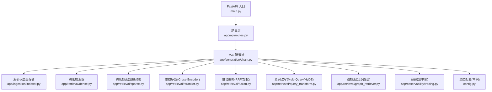
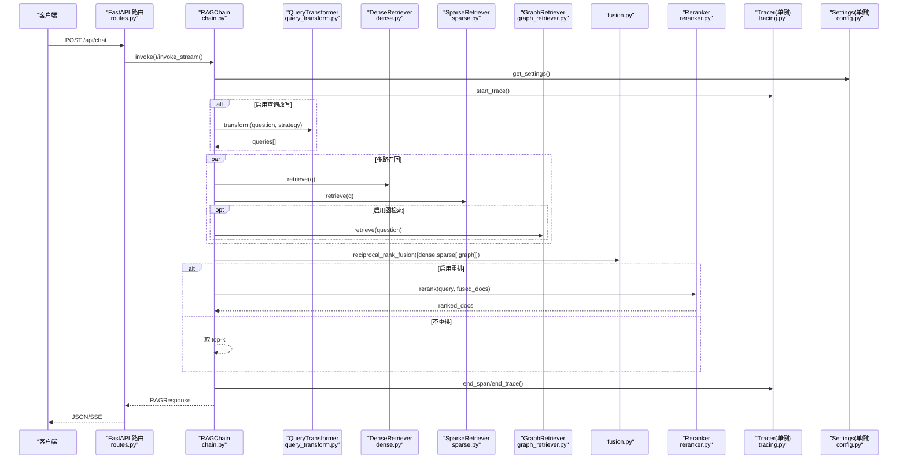
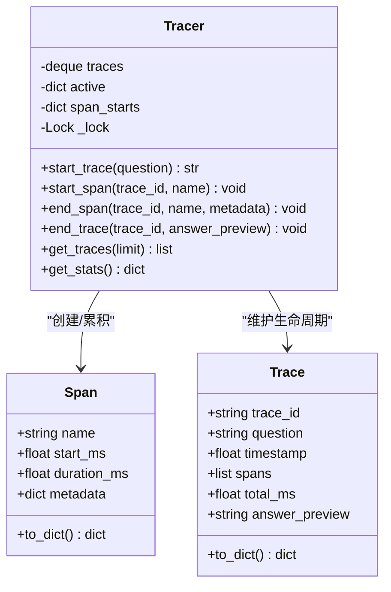
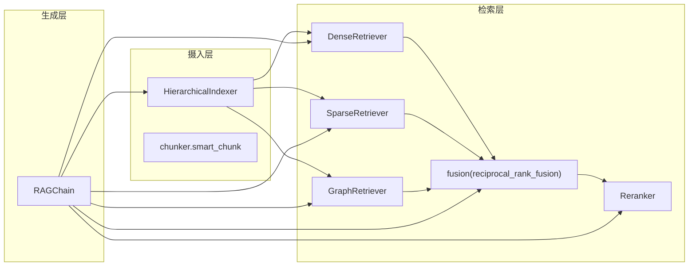
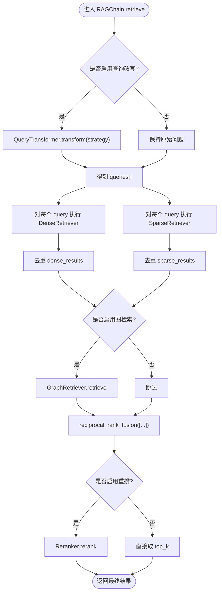
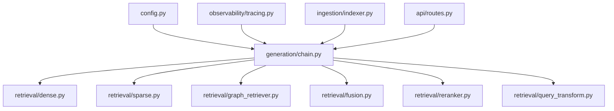

# 核心架构模式

<cite>
**本文引用的文件**
- [config.py](file://config.py)
- [main.py](file://main.py)
- [app/ingestion/indexer.py](file://app/ingestion/indexer.py)
- [app/retrieval/fusion.py](file://app/retrieval/fusion.py)
- [app/generation/chain.py](file://app/generation/chain.py)
- [app/observability/tracing.py](file://app/observability/tracing.py)
- [app/retrieval/dense.py](file://app/retrieval/dense.py)
- [app/retrieval/sparse.py](file://app/retrieval/sparse.py)
- [app/retrieval/reranker.py](file://app/retrieval/reranker.py)
- [app/ingestion/chunker.py](file://app/ingestion/chunker.py)
- [app/retrieval/query_transform.py](file://app/retrieval/query_transform.py)
- [app/retrieval/graph_retriever.py](file://app/retrieval/graph_retriever.py)
- [app/api/routes.py](file://app/api/routes.py)
</cite>

## 目录
1. [简介](#简介)
2. [项目结构](#项目结构)
3. [核心组件](#核心组件)
4. [架构总览](#架构总览)
5. [详细组件分析](#详细组件分析)
6. [依赖关系分析](#依赖关系分析)
7. [性能考量](#性能考量)
8. [故障排查指南](#故障排查指南)
9. [结论](#结论)

## 简介
本文件聚焦于 RAG 系统的核心架构模式与分层设计，系统性阐述以下关键主题：
- 策略模式在检索算法切换中的应用（稠密/稀疏/图检索、查询改写策略）
- 工厂模式在组件实例化中的使用（Embedding/LLM/Reranker/GraphRetriever 等）
- 观察者模式在追踪监控中的实现（轻量级分布式追踪器）
- 分层架构的职责分离（摄入层、检索层、生成层）及接口契约
- 单例模式在全局配置管理与追踪器共享中的应用
- 插件化架构（可插拔的分块策略、检索策略、改写策略）
- 配置驱动的设计理念（基于 Pydantic Settings 的环境变量覆盖与运行时配置管理）

## 项目结构
系统采用按功能域划分的模块化组织方式，入口为 FastAPI 应用，内部通过“链式编排”将摄入、检索、生成串联起来。

图表来源
- [main.py:1-83](file://main.py#L1-L83)
- [app/api/routes.py:1-563](file://app/api/routes.py#L1-L563)
- [app/generation/chain.py:1-377](file://app/generation/chain.py#L1-L377)
- [app/ingestion/indexer.py:1-253](file://app/ingestion/indexer.py#L1-L253)
- [app/retrieval/dense.py:1-53](file://app/retrieval/dense.py#L1-L53)
- [app/retrieval/sparse.py:1-123](file://app/retrieval/sparse.py#L1-L123)
- [app/retrieval/reranker.py:1-112](file://app/retrieval/reranker.py#L1-L112)
- [app/retrieval/fusion.py:1-106](file://app/retrieval/fusion.py#L1-L106)
- [app/retrieval/query_transform.py:1-134](file://app/retrieval/query_transform.py#L1-L134)
- [app/retrieval/graph_retriever.py:1-312](file://app/retrieval/graph_retriever.py#L1-L312)
- [app/observability/tracing.py:1-146](file://app/observability/tracing.py#L1-L146)
- [config.py:1-58](file://config.py#L1-L58)

章节来源
- [main.py:1-83](file://main.py#L1-L83)
- [app/api/routes.py:1-563](file://app/api/routes.py#L1-L563)

## 核心组件
- 全局配置单例：提供统一配置访问，支持环境变量覆盖与默认值。
- 追踪器单例：线程安全地记录每次调用的阶段耗时与元数据。
- RAGChain：编排查询改写、多路召回、融合、重排、生成的完整管道。
- 分层索引：L1 文档摘要 + L2 段落明细的向量索引。
- 多路检索器：稠密向量检索、稀疏 BM25 检索、可选图检索。
- 融合与重排：RRF/加权融合 + Cross-Encoder 精排。
- 查询改写：Multi-Query 与 HyDE 两种策略。
- 分块策略：递归字符分块与语义分块，可插拔选择。

章节来源
- [config.py:1-58](file://config.py#L1-L58)
- [app/observability/tracing.py:1-146](file://app/observability/tracing.py#L1-L146)
- [app/generation/chain.py:1-377](file://app/generation/chain.py#L1-L377)
- [app/ingestion/indexer.py:1-253](file://app/ingestion/indexer.py#L1-L253)
- [app/retrieval/dense.py:1-53](file://app/retrieval/dense.py#L1-L53)
- [app/retrieval/sparse.py:1-123](file://app/retrieval/sparse.py#L1-L123)
- [app/retrieval/reranker.py:1-112](file://app/retrieval/reranker.py#L1-L112)
- [app/retrieval/fusion.py:1-106](file://app/retrieval/fusion.py#L1-L106)
- [app/retrieval/query_transform.py:1-134](file://app/retrieval/query_transform.py#L1-L134)
- [app/ingestion/chunker.py:1-157](file://app/ingestion/chunker.py#L1-L157)

## 架构总览
下图展示了从 API 到各层的调用路径以及关键模式的应用点。

图表来源
- [app/api/routes.py:1-563](file://app/api/routes.py#L1-L563)
- [app/generation/chain.py:1-377](file://app/generation/chain.py#L1-L377)
- [app/retrieval/query_transform.py:1-134](file://app/retrieval/query_transform.py#L1-L134)
- [app/retrieval/dense.py:1-53](file://app/retrieval/dense.py#L1-L53)
- [app/retrieval/sparse.py:1-123](file://app/retrieval/sparse.py#L1-L123)
- [app/retrieval/graph_retriever.py:1-312](file://app/retrieval/graph_retriever.py#L1-L312)
- [app/retrieval/fusion.py:1-106](file://app/retrieval/fusion.py#L1-L106)
- [app/retrieval/reranker.py:1-112](file://app/retrieval/reranker.py#L1-L112)
- [app/observability/tracing.py:1-146](file://app/observability/tracing.py#L1-L146)
- [config.py:1-58](file://config.py#L1-L58)

## 详细组件分析

### 配置驱动与单例模式（Settings 单例）
- 设计理念：集中式配置，优先读取环境变量，其次 .env，最后回退默认值；通过缓存函数返回全局唯一实例，避免重复初始化开销。
- 关键职责：
  - 定义所有可调参数（模型、嵌入、ChromaDB、检索、分块、服务器、图检索、LangSmith 等）。
  - 暴露 get_settings() 作为全局单例入口。
- 影响范围：几乎所有模块均通过 get_settings() 获取运行时配置，形成“配置即契约”。

章节来源
- [config.py:1-58](file://config.py#L1-L58)

### 追踪器与观察者模式（Tracer 单例）
- 设计理念：以“Trace-Span”为核心，记录一次 RAG 请求的全链路阶段耗时与元数据；内部使用线程锁保证并发安全，并以环形队列保存最近 N 条 Trace。
- 关键职责：
  - 开始/结束 Trace 与 Span，计算相对偏移与绝对耗时。
  - 提供统计聚合接口（平均耗时、阶段均值）。
  - 暴露 get_tracer() 作为全局单例，供各层埋点。
- 观察者视角：RAGChain 在关键阶段主动“通知”Tracer 记录，便于外部可视化与诊断。

图表来源
- [app/observability/tracing.py:1-146](file://app/observability/tracing.py#L1-L146)

章节来源
- [app/observability/tracing.py:1-146](file://app/observability/tracing.py#L1-L146)

### 分层架构与接口契约
- 摄入层（Ingestion）
  - 职责：加载文档、智能分块、构建层级索引（L1 摘要 + L2 明细）、导出用于 BM25 的语料。
  - 关键类/函数：HierarchicalIndexer、recursive_chunk、semantic_chunk、smart_chunk。
- 检索层（Retrieval）
  - 职责：多路召回（稠密/稀疏/图）、融合（RRF/加权）、重排（Cross-Encoder）。
  - 关键类：DenseRetriever、SparseRetriever、GraphRetriever、Reranker、reciprocal_rank_fusion、weighted_fusion。
- 生成层（Generation）
  - 职责：组装上下文、选择 Prompt、调用 LLM 生成或流式输出。
  - 关键类：RAGChain（编排）、Prompt 模板（由上层导入）。

图表来源
- [app/ingestion/indexer.py:1-253](file://app/ingestion/indexer.py#L1-L253)
- [app/ingestion/chunker.py:1-157](file://app/ingestion/chunker.py#L1-L157)
- [app/retrieval/dense.py:1-53](file://app/retrieval/dense.py#L1-L53)
- [app/retrieval/sparse.py:1-123](file://app/retrieval/sparse.py#L1-L123)
- [app/retrieval/graph_retriever.py:1-312](file://app/retrieval/graph_retriever.py#L1-L312)
- [app/retrieval/fusion.py:1-106](file://app/retrieval/fusion.py#L1-L106)
- [app/retrieval/reranker.py:1-112](file://app/retrieval/reranker.py#L1-L112)
- [app/generation/chain.py:1-377](file://app/generation/chain.py#L1-L377)

章节来源
- [app/ingestion/indexer.py:1-253](file://app/ingestion/indexer.py#L1-L253)
- [app/ingestion/chunker.py:1-157](file://app/ingestion/chunker.py#L1-L157)
- [app/retrieval/dense.py:1-53](file://app/retrieval/dense.py#L1-L53)
- [app/retrieval/sparse.py:1-123](file://app/retrieval/sparse.py#L1-L123)
- [app/retrieval/graph_retriever.py:1-312](file://app/retrieval/graph_retriever.py#L1-L312)
- [app/retrieval/fusion.py:1-106](file://app/retrieval/fusion.py#L1-L106)
- [app/retrieval/reranker.py:1-112](file://app/retrieval/reranker.py#L1-L112)
- [app/generation/chain.py:1-377](file://app/generation/chain.py#L1-L377)

### 策略模式：检索与改写策略的可插拔
- 检索策略
  - 稠密检索：基于向量相似度搜索，封装为 DenseRetriever。
  - 稀疏检索：BM25 关键词匹配，封装为 SparseRetriever。
  - 图检索：抽取实体并扩展子图，封装为 GraphRetriever。
  - 融合策略：RRF 与加权融合，位于 fusion.py。
- 改写策略
  - Multi-Query：生成多个查询变体扩大召回面。
  - HyDE：生成假设性文档提升语义匹配度。
- 策略切换机制
  - RAGChain 根据构造参数与配置决定是否启用某策略。
  - QueryTransformer.transform 根据 strategy 参数分发到不同策略实现。

图表来源
- [app/generation/chain.py:1-377](file://app/generation/chain.py#L1-L377)
- [app/retrieval/query_transform.py:1-134](file://app/retrieval/query_transform.py#L1-L134)
- [app/retrieval/dense.py:1-53](file://app/retrieval/dense.py#L1-L53)
- [app/retrieval/sparse.py:1-123](file://app/retrieval/sparse.py#L1-L123)
- [app/retrieval/graph_retriever.py:1-312](file://app/retrieval/graph_retriever.py#L1-L312)
- [app/retrieval/fusion.py:1-106](file://app/retrieval/fusion.py#L1-L106)
- [app/retrieval/reranker.py:1-112](file://app/retrieval/reranker.py#L1-L112)

章节来源
- [app/retrieval/query_transform.py:1-134](file://app/retrieval/query_transform.py#L1-L134)
- [app/retrieval/dense.py:1-53](file://app/retrieval/dense.py#L1-L53)
- [app/retrieval/sparse.py:1-123](file://app/retrieval/sparse.py#L1-L123)
- [app/retrieval/graph_retriever.py:1-312](file://app/retrieval/graph_retriever.py#L1-L312)
- [app/retrieval/fusion.py:1-106](file://app/retrieval/fusion.py#L1-L106)
- [app/retrieval/reranker.py:1-112](file://app/retrieval/reranker.py#L1-L112)
- [app/generation/chain.py:1-377](file://app/generation/chain.py#L1-L377)

### 工厂模式：组件实例化与提供者
- Embedding 工厂：根据 embedding_provider 动态选择本地 HuggingFace 或 OpenAI Embeddings。
- LLM 工厂：根据配置创建 ChatOpenAI 实例。
- Reranker 工厂：根据配置选择 Cross-Encoder 模型名称。
- GraphRetriever 工厂：按需注入 KnowledgeGraphBuilder 与 LLM。
- 这些工厂方法通常以函数形式存在，集中读取配置并返回具体实现，降低耦合。

章节来源
- [app/ingestion/indexer.py:1-253](file://app/ingestion/indexer.py#L1-L253)
- [app/retrieval/reranker.py:1-112](file://app/retrieval/reranker.py#L1-L112)
- [app/retrieval/graph_retriever.py:1-312](file://app/retrieval/graph_retriever.py#L1-L312)

### 单例模式：全局配置与追踪器共享
- 配置单例：get_settings() 使用 lru_cache 确保进程内唯一实例。
- 追踪器单例：get_tracer() 返回全局 Tracer，供 RAGChain 与各层埋点共享。
- 路由层也通过全局变量持有 RAGChain 实例，避免重复构建。

章节来源
- [config.py:1-58](file://config.py#L1-L58)
- [app/observability/tracing.py:1-146](file://app/observability/tracing.py#L1-L146)
- [app/api/routes.py:1-563](file://app/api/routes.py#L1-L563)

### 插件化架构：分块、检索、改写的可扩展性
- 分块策略
  - recursive_chunk：按段落/句子/字符递归切分。
  - semantic_chunk：基于相邻句子的 embedding 相似度检测语义边界。
  - smart_chunk：根据 use_semantic 与 embeddings 可用性选择策略。
- 检索策略
  - DenseRetriever、SparseRetriever、GraphRetriever 各自独立，可在 RAGChain 中按需启用。
- 改写策略
  - QueryTransformer.transform 支持 multi_query/hyde/none 三种策略。
- 融合策略
  - reciprocal_rank_fusion 与 weighted_fusion 可组合使用。

章节来源
- [app/ingestion/chunker.py:1-157](file://app/ingestion/chunker.py#L1-L157)
- [app/retrieval/dense.py:1-53](file://app/retrieval/dense.py#L1-L53)
- [app/retrieval/sparse.py:1-123](file://app/retrieval/sparse.py#L1-L123)
- [app/retrieval/graph_retriever.py:1-312](file://app/retrieval/graph_retriever.py#L1-L312)
- [app/retrieval/query_transform.py:1-134](file://app/retrieval/query_transform.py#L1-L134)
- [app/retrieval/fusion.py:1-106](file://app/retrieval/fusion.py#L1-L106)

### 分层架构与接口定义
- 摄入层接口
  - HierarchicalIndexer.index_documents(chunks, build_summary=True)
  - HierarchicalIndexer.hierarchical_search(query, top_k)
  - HierarchicalIndexer.get_all_chunks()
- 检索层接口
  - DenseRetriever.retrieve(query, top_k)
  - SparseRetriever.retrieve(query, top_k)
  - GraphRetriever.retrieve(question, top_k)
  - fusion.reciprocal_rank_fusion(result_lists, k)
  - reranker.Reranker.rerank(query, documents, top_k)
- 生成层接口
  - RAGChain.invoke(question, chat_history, top_k) -> RAGResponse
  - RAGChain.invoke_stream(...) -> Generator[dict]

章节来源
- [app/ingestion/indexer.py:1-253](file://app/ingestion/indexer.py#L1-L253)
- [app/retrieval/dense.py:1-53](file://app/retrieval/dense.py#L1-L53)
- [app/retrieval/sparse.py:1-123](file://app/retrieval/sparse.py#L1-L123)
- [app/retrieval/graph_retriever.py:1-312](file://app/retrieval/graph_retriever.py#L1-L312)
- [app/retrieval/fusion.py:1-106](file://app/retrieval/fusion.py#L1-L106)
- [app/retrieval/reranker.py:1-112](file://app/retrieval/reranker.py#L1-L112)
- [app/generation/chain.py:1-377](file://app/generation/chain.py#L1-L377)

## 依赖关系分析
- 低耦合高内聚：各检索器仅依赖索引器与配置，不互相强耦合。
- 明确的外部依赖：
  - LangChain/LangChain OpenAI：聊天与嵌入模型。
  - ChromaDB：向量持久化。
  - rank_bm25：稀疏检索。
  - sentence-transformers：Cross-Encoder 重排。
  - jieba：中文分词。
  - networkx：知识图谱路径查找。
- 可能的循环依赖风险：当前未见明显循环引用；若新增跨层回调需警惕。

图表来源
- [config.py:1-58](file://config.py#L1-L58)
- [app/observability/tracing.py:1-146](file://app/observability/tracing.py#L1-L146)
- [app/ingestion/indexer.py:1-253](file://app/ingestion/indexer.py#L1-L253)
- [app/generation/chain.py:1-377](file://app/generation/chain.py#L1-L377)
- [app/retrieval/dense.py:1-53](file://app/retrieval/dense.py#L1-L53)
- [app/retrieval/sparse.py:1-123](file://app/retrieval/sparse.py#L1-L123)
- [app/retrieval/graph_retriever.py:1-312](file://app/retrieval/graph_retriever.py#L1-L312)
- [app/retrieval/fusion.py:1-106](file://app/retrieval/fusion.py#L1-L106)
- [app/retrieval/reranker.py:1-112](file://app/retrieval/reranker.py#L1-L112)
- [app/retrieval/query_transform.py:1-134](file://app/retrieval/query_transform.py#L1-L134)
- [app/api/routes.py:1-563](file://app/api/routes.py#L1-L563)

章节来源
- [app/generation/chain.py:1-377](file://app/generation/chain.py#L1-L377)
- [app/api/routes.py:1-563](file://app/api/routes.py#L1-L563)

## 性能考量
- 多路召回并行化：对每个查询变体并行执行 Dense/Sparse 检索可降低端到端延迟。
- 融合与重排成本：RRF 时间复杂度近似 O(N log N)，Cross-Encoder 重排对候选集敏感，建议控制候选规模。
- 索引构建：BM25 索引首次构建可能较慢，建议在启动时异步构建或增量更新。
- 流式生成：SSE 流式输出能显著改善首字延迟体验。
- 资源隔离：Embedding/LLM/Reranker 等重型组件应复用单例，避免重复加载模型。

## 故障排查指南
- 常见问题定位
  - 未配置 OPENAI_API_KEY：应用启动时会抛出异常，需在 .env 中设置。
  - BM25 索引为空：首次检索前需显式构建索引。
  - 图检索未启用：检查 graph_enabled 配置与图谱构建状态。
- 追踪与统计
  - 使用 /api/traces 与 /api/traces/stats 查看阶段耗时与平均值，快速定位瓶颈。
- 日志与降级
  - 各模块均有日志输出，失败路径包含警告信息，便于快速定位。

章节来源
- [main.py:1-83](file://main.py#L1-L83)
- [app/api/routes.py:1-563](file://app/api/routes.py#L1-L563)
- [app/observability/tracing.py:1-146](file://app/observability/tracing.py#L1-L146)

## 结论
该 RAG 系统通过清晰的三层架构与多种经典设计模式实现了高内聚、低耦合、可扩展的检索增强生成管线：
- 策略模式使检索与改写灵活可插拔；
- 工厂模式屏蔽了底层模型与存储的差异；
- 单例模式保障了配置与追踪器的全局一致性；
- 观察者模式的追踪器为性能优化与问题定位提供了有力支撑；
- 配置驱动让系统在开发、测试与生产环境间平滑迁移。