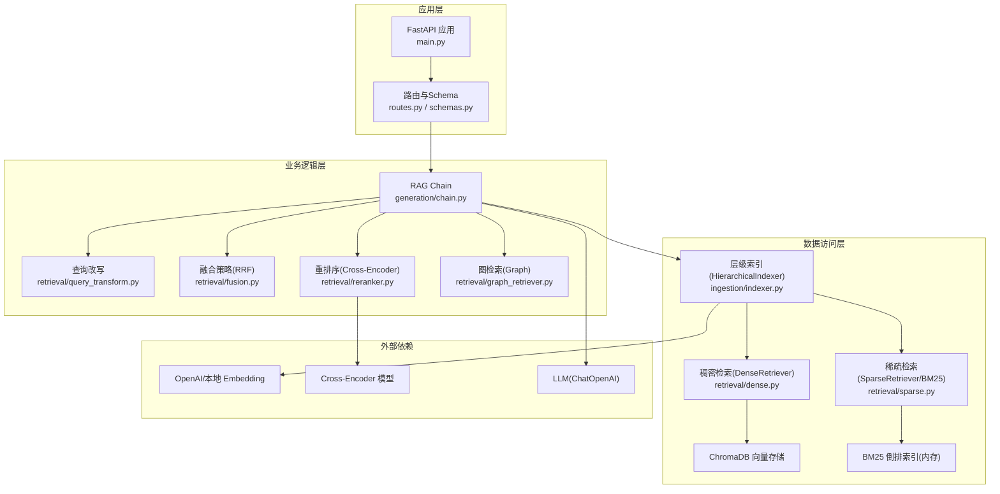
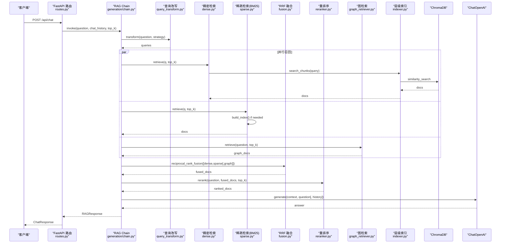
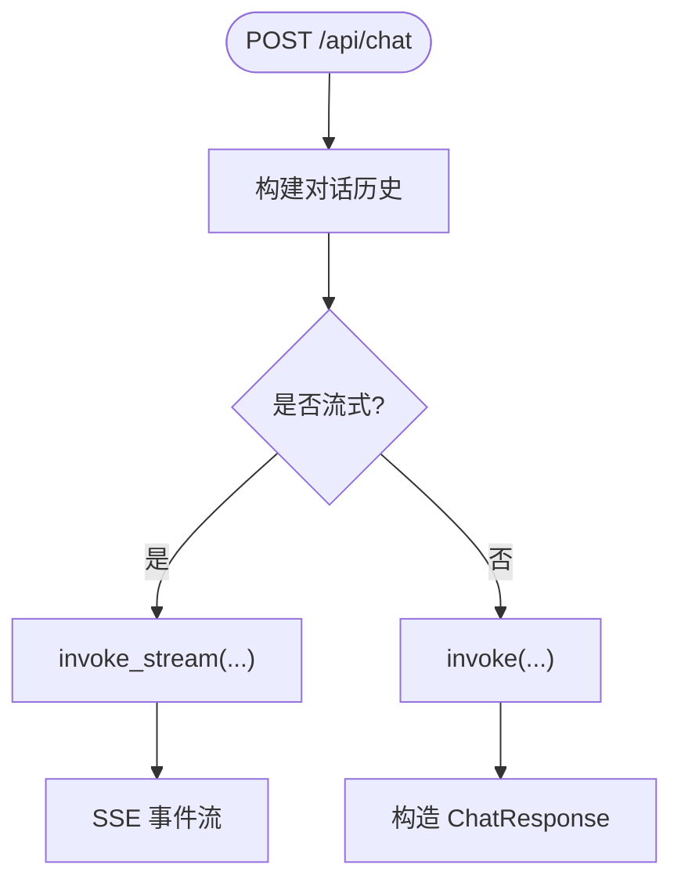
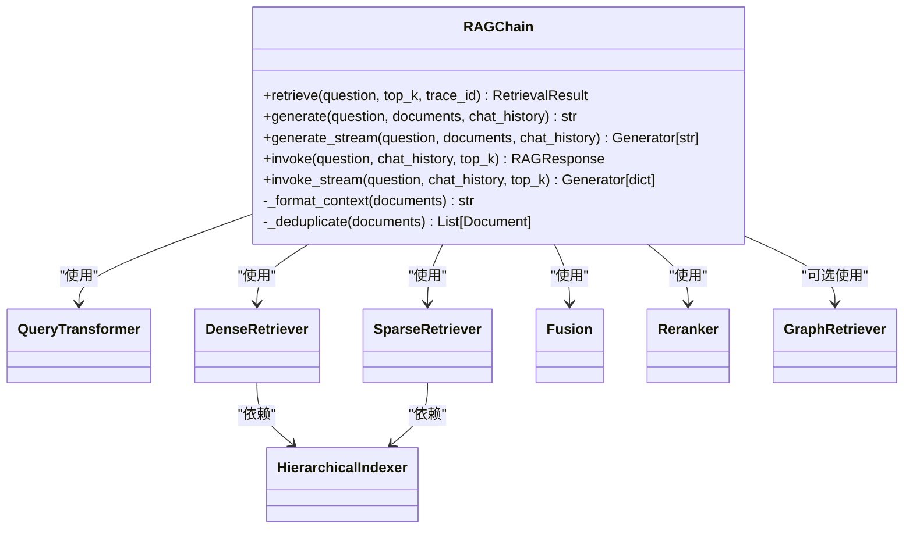
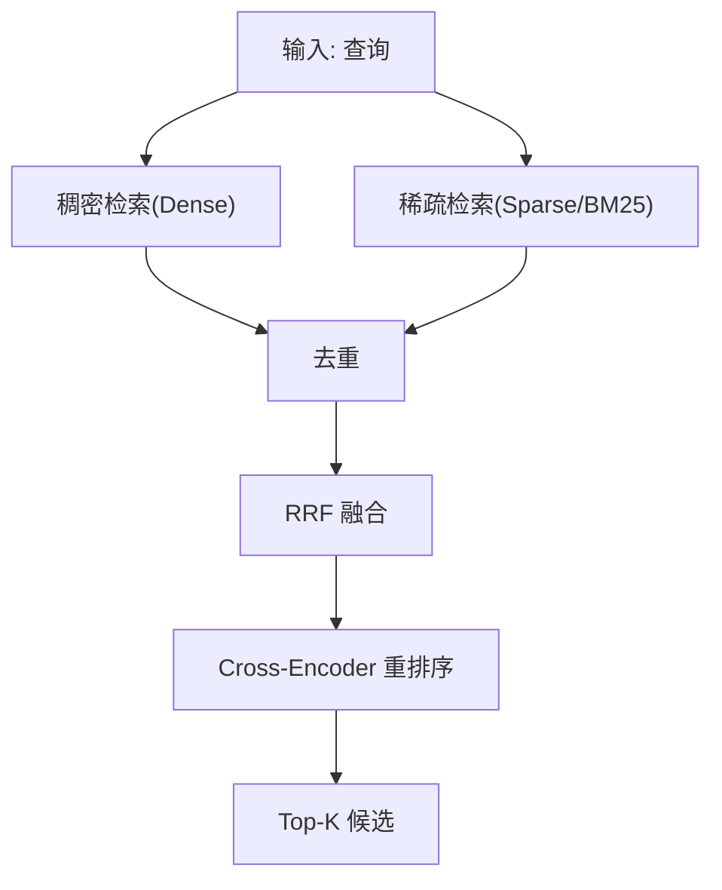
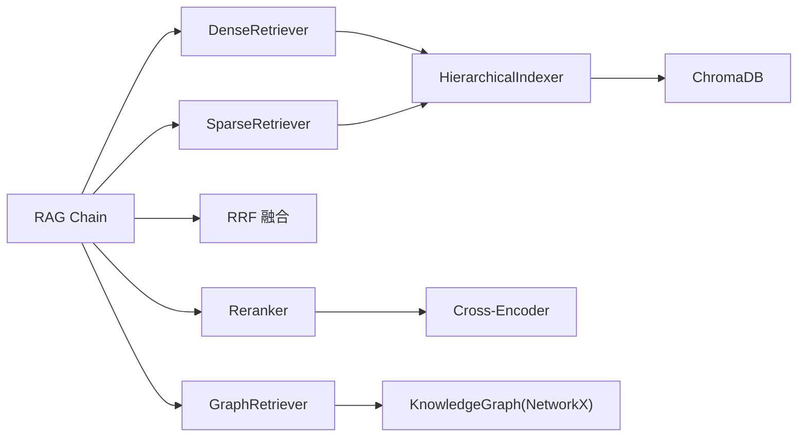

# 系统概览

<cite>
**本文引用的文件**   
- [main.py](file://main.py)
- [config.py](file://config.py)
- [app/api/routes.py](file://app/api/routes.py)
- [app/generation/chain.py](file://app/generation/chain.py)
- [app/retrieval/dense.py](file://app/retrieval/dense.py)
- [app/retrieval/sparse.py](file://app/retrieval/sparse.py)
- [app/retrieval/fusion.py](file://app/retrieval/fusion.py)
- [app/retrieval/reranker.py](file://app/retrieval/reranker.py)
- [app/retrieval/query_transform.py](file://app/retrieval/query_transform.py)
- [app/retrieval/graph_retriever.py](file://app/retrieval/graph_retriever.py)
- [app/ingestion/indexer.py](file://app/ingestion/indexer.py)
- [app/ingestion/chunker.py](file://app/ingestion/chunker.py)
- [app/api/schemas.py](file://app/api/schemas.py)
- [pyproject.toml](file://pyproject.toml)
</cite>

## 目录
1. [引言](#引言)
2. [项目结构](#项目结构)
3. [核心组件](#核心组件)
4. [架构总览](#架构总览)
5. [详细组件分析](#详细组件分析)
6. [依赖关系分析](#依赖关系分析)
7. [性能考量](#性能考量)
8. [故障排查指南](#故障排查指南)
9. [结论](#结论)

## 引言
本系统是一个生产级检索增强生成（RAG）平台，面向多路召回、重排序与层级索引等关键特性，提供高可用、可扩展的问答服务。整体采用分层架构：FastAPI 应用层负责对外暴露 API；业务逻辑层通过 RAG Chain 编排检索与生成流程；数据访问层基于 ChromaDB 向量库与 BM25 稀疏索引实现高效检索。技术栈以 LangChain 生态为核心，结合 OpenAI/Sentence Transformers 嵌入模型与 Cross-Encoder 重排序器，兼顾精度与效率。

## 项目结构
仓库按功能域组织，核心模块包括：
- 应用入口与生命周期管理：main.py
- 配置中心：config.py
- API 路由与请求/响应模型：app/api/routes.py、app/api/schemas.py
- 检索与生成编排：app/generation/chain.py
- 检索子模块：稠密检索、稀疏检索、融合、重排序、查询改写、图检索
- 数据接入与索引：文档加载、分块、层级索引
- 可观测性：追踪与统计

图表来源
- [main.py:1-83](file://main.py#L1-L83)
- [app/api/routes.py:1-563](file://app/api/routes.py#L1-L563)
- [app/generation/chain.py:1-377](file://app/generation/chain.py#L1-L377)
- [app/retrieval/dense.py:1-53](file://app/retrieval/dense.py#L1-L53)
- [app/retrieval/sparse.py:1-123](file://app/retrieval/sparse.py#L1-L123)
- [app/retrieval/fusion.py:1-106](file://app/retrieval/fusion.py#L1-L106)
- [app/retrieval/reranker.py:1-112](file://app/retrieval/reranker.py#L1-L112)
- [app/retrieval/query_transform.py:1-134](file://app/retrieval/query_transform.py#L1-L134)
- [app/retrieval/graph_retriever.py:1-312](file://app/retrieval/graph_retriever.py#L1-L312)
- [app/ingestion/indexer.py:1-253](file://app/ingestion/indexer.py#L1-L253)

章节来源
- [main.py:1-83](file://main.py#L1-L83)
- [app/api/routes.py:1-563](file://app/api/routes.py#L1-L563)
- [app/generation/chain.py:1-377](file://app/generation/chain.py#L1-L377)
- [app/ingestion/indexer.py:1-253](file://app/ingestion/indexer.py#L1-L253)

## 核心组件
- FastAPI 应用与生命周期：在启动时初始化 RAG Chain，按需构建 BM25 索引，注册路由并启用 CORS。
- RAG Chain：统一编排“查询改写 → 多路召回 → RRF 融合 → 重排序 → 生成”的完整链路，支持流式输出与对话历史。
- 检索子系统：
  - 稠密检索：基于向量相似度搜索（ChromaDB）。
  - 稀疏检索：基于 BM25 关键词匹配，弥补精确术语召回不足。
  - 融合：RRF 将多路结果合并，不依赖原始分数可比性。
  - 重排序：Cross-Encoder 对候选进行精排。
  - 图检索：从知识图谱抽取实体关系，作为补充上下文。
- 层级索引：L1 摘要索引用于粗粒度定位，L2 明细索引用于细粒度检索。
- 配置中心：集中管理 OpenAI、Embedding、ChromaDB、检索参数、图检索开关等。

章节来源
- [main.py:21-50](file://main.py#L21-L50)
- [app/generation/chain.py:49-100](file://app/generation/chain.py#L49-L100)
- [app/retrieval/dense.py:13-37](file://app/retrieval/dense.py#L13-L37)
- [app/retrieval/sparse.py:19-47](file://app/retrieval/sparse.py#L19-L47)
- [app/retrieval/fusion.py:13-64](file://app/retrieval/fusion.py#L13-L64)
- [app/retrieval/reranker.py:14-31](file://app/retrieval/reranker.py#L14-L31)
- [app/retrieval/query_transform.py:38-55](file://app/retrieval/query_transform.py#L38-L55)
- [app/retrieval/graph_retriever.py:39-61](file://app/retrieval/graph_retriever.py#L39-L61)
- [app/ingestion/indexer.py:74-110](file://app/ingestion/indexer.py#L74-L110)
- [config.py:1-58](file://config.py#L1-L58)

## 架构总览
下图展示从用户请求到回答生成的端到端流程，以及各组件之间的依赖和数据流向。

图表来源
- [app/api/routes.py:47-71](file://app/api/routes.py#L47-L71)
- [app/generation/chain.py:100-201](file://app/generation/chain.py#L100-L201)
- [app/retrieval/query_transform.py:113-134](file://app/retrieval/query_transform.py#L113-L134)
- [app/retrieval/dense.py:24-37](file://app/retrieval/dense.py#L24-L37)
- [app/retrieval/sparse.py:72-104](file://app/retrieval/sparse.py#L72-L104)
- [app/retrieval/fusion.py:13-64](file://app/retrieval/fusion.py#L13-L64)
- [app/retrieval/reranker.py:33-79](file://app/retrieval/reranker.py#L33-L79)
- [app/retrieval/graph_retriever.py:88-132](file://app/retrieval/graph_retriever.py#L88-L132)
- [app/ingestion/indexer.py:158-201](file://app/ingestion/indexer.py#L158-L201)

## 详细组件分析

### 应用层（FastAPI 路由与 Schema）
- 路由职责：
  - 对话接口：支持普通与 SSE 流式两种模式，内部调用 RAG Chain 完成检索与生成。
  - 文档上传：加载文档 → 智能分块 → 写入层级索引 → 重建 BM25 索引。
  - 检索对比：分别执行 Dense、Sparse、Hybrid(RRF)、Hybrid+Rerank 四种策略，返回耗时与命中重叠度。
  - 健康检查：返回已索引文档数量与服务版本。
- Schema 职责：定义统一的请求/响应结构，便于前后端契约与自动文档生成。

图表来源
- [app/api/routes.py:47-117](file://app/api/routes.py#L47-L117)
- [app/api/schemas.py:9-51](file://app/api/schemas.py#L9-L51)

章节来源
- [app/api/routes.py:47-117](file://app/api/routes.py#L47-L117)
- [app/api/schemas.py:9-51](file://app/api/schemas.py#L9-L51)

### 业务逻辑层（RAG Chain）
- 职责边界：
  - 编排查询改写、多路召回、融合、重排序与生成。
  - 维护检索中间结果（稠密、稀疏、图、融合、最终），并提供流式输出。
  - 记录 Trace，统计各阶段耗时与命中数。
- 关键流程：
  - 查询改写：Multi-Query 或 HyDE，默认 Multi-Query。
  - 多路召回：对每个查询变体并行执行 Dense 与 Sparse，可选 Graph。
  - 融合：RRF 合并多路结果。
  - 重排序：Cross-Encoder 精排，得到最终候选。
  - 生成：根据是否有对话历史选择不同 Prompt 模板。

图表来源
- [app/generation/chain.py:49-100](file://app/generation/chain.py#L49-L100)
- [app/retrieval/query_transform.py:38-55](file://app/retrieval/query_transform.py#L38-L55)
- [app/retrieval/dense.py:13-23](file://app/retrieval/dense.py#L13-L23)
- [app/retrieval/sparse.py:19-31](file://app/retrieval/sparse.py#L19-L31)
- [app/retrieval/fusion.py:13-34](file://app/retrieval/fusion.py#L13-34)
- [app/retrieval/reranker.py:14-31](file://app/retrieval/reranker.py#L14-L31)
- [app/retrieval/graph_retriever.py:39-61](file://app/retrieval/graph_retriever.py#L39-L61)
- [app/ingestion/indexer.py:74-110](file://app/ingestion/indexer.py#L74-L110)

章节来源
- [app/generation/chain.py:100-201](file://app/generation/chain.py#L100-L201)
- [app/generation/chain.py:272-356](file://app/generation/chain.py#L272-L356)

### 数据访问层（层级索引与检索器）
- 层级索引（HierarchicalIndexer）：
  - L1 摘要索引：为每篇文档生成摘要并建立向量索引，用于快速定位相关文档。
  - L2 明细索引：段落级分块的向量索引，用于细粒度检索。
  - 层级检索：先通过摘要定位目标文档集合，再在该集合内做明细检索，失败回退全局检索。
- 稠密检索（DenseRetriever）：
  - 基于 OpenAI 或本地 Embedding 模型，调用 ChromaDB 进行余弦相似度搜索。
- 稀疏检索（SparseRetriever）：
  - 中文使用 jieba 词级分词，英文/数字保持完整单词，过滤单字噪声。
  - 构建 BM25 倒排索引，支持首次检索时懒加载构建。
- 融合（RRF）：
  - 仅利用排名信息，避免跨路分数不可比问题，提升鲁棒性。
- 重排序（Reranker）：
  - 使用 Cross-Encoder 对候选进行精细打分，适合少量候选的精排。

图表来源
- [app/ingestion/indexer.py:158-201](file://app/ingestion/indexer.py#L158-L201)
- [app/retrieval/dense.py:24-37](file://app/retrieval/dense.py#L24-L37)
- [app/retrieval/sparse.py:72-104](file://app/retrieval/sparse.py#L72-L104)
- [app/retrieval/fusion.py:13-64](file://app/retrieval/fusion.py#L13-L64)
- [app/retrieval/reranker.py:33-79](file://app/retrieval/reranker.py#L33-L79)

章节来源
- [app/ingestion/indexer.py:111-201](file://app/ingestion/indexer.py#L111-L201)
- [app/retrieval/dense.py:13-53](file://app/retrieval/dense.py#L13-L53)
- [app/retrieval/sparse.py:19-123](file://app/retrieval/sparse.py#L19-L123)
- [app/retrieval/fusion.py:13-106](file://app/retrieval/fusion.py#L13-L106)
- [app/retrieval/reranker.py:14-112](file://app/retrieval/reranker.py#L14-L112)

### 图检索（Graph Retriever）
- 能力：
  - 从查询中抽取实体，获取实体关系与子图扩展。
  - 将三元组与子图格式化为自然语言上下文，供 LLM 理解。
  - 支持路径查找与可视化。
- 集成点：
  - 作为多路召回之一，与 Dense/Sparse 结果一起参与 RRF 融合。
  - 可通过配置开关控制是否启用。

章节来源
- [app/retrieval/graph_retriever.py:39-132](file://app/retrieval/graph_retriever.py#L39-L132)
- [app/retrieval/graph_retriever.py:134-182](file://app/retrieval/graph_retriever.py#L134-L182)
- [app/retrieval/graph_retriever.py:265-312](file://app/retrieval/graph_retriever.py#L265-L312)

### 配置与技术栈选择理由
- LangChain 生态：
  - 提供统一的 LLM、Prompt、Output Parser、Embedding 抽象，降低集成成本。
  - 便于组合多种检索器与生成链，支持实验与迭代。
- ChromaDB 向量数据库：
  - 轻量、易部署，支持持久化与过滤查询，适合生产环境中的向量存储。
- Sentence Transformers 嵌入模型：
  - 本地模型（如 all-MiniLM-L6-v2）可在 CPU 上运行，满足隐私与成本要求。
  - 同时支持 OpenAI Embedding，便于在不同场景切换。
- Cross-Encoder 重排序：
  - 相比双塔模型，能捕获 query-document 细粒度交互，显著提升相关性。
- BM25 稀疏检索：
  - 对专有名词、编号、术语等精确匹配更稳健，弥补向量检索不足。

章节来源
- [config.py:1-58](file://config.py#L1-L58)
- [pyproject.toml:1-47](file://pyproject.toml#L1-L47)
- [app/ingestion/indexer.py:15-43](file://app/ingestion/indexer.py#L15-L43)
- [app/retrieval/reranker.py:14-31](file://app/retrieval/reranker.py#L14-L31)
- [app/retrieval/sparse.py:19-47](file://app/retrieval/sparse.py#L19-L47)

## 依赖关系分析
- 组件耦合与内聚：
  - RAG Chain 作为编排中枢，聚合多个检索器与生成器，内聚度高。
  - 检索器与索引解耦，通过接口（search_chunks/get_all_chunks）交互，降低耦合。
- 直接/间接依赖：
  - DenseRetriever 依赖 HierarchicalIndexer 与 ChromaDB。
  - SparseRetriever 依赖 HierarchicalIndexer 与 BM25 倒排索引（内存）。
  - Reranker 依赖 Cross-Encoder 模型。
  - GraphRetriever 依赖 KnowledgeGraphBuilder（NetworkX）。
- 外部依赖与集成点：
  - OpenAI/本地 Embedding 模型。
  - LLM（ChatOpenAI）。
  - ChromaDB 向量存储。
  - NetworkX 图计算。

图表来源
- [app/generation/chain.py:49-100](file://app/generation/chain.py#L49-L100)
- [app/retrieval/dense.py:13-23](file://app/retrieval/dense.py#L13-L23)
- [app/retrieval/sparse.py:19-31](file://app/retrieval/sparse.py#L19-L31)
- [app/retrieval/reranker.py:14-31](file://app/retrieval/reranker.py#L14-L31)
- [app/retrieval/graph_retriever.py:39-61](file://app/retrieval/graph_retriever.py#L39-L61)
- [app/ingestion/indexer.py:74-110](file://app/ingestion/indexer.py#L74-L110)

章节来源
- [app/generation/chain.py:49-100](file://app/generation/chain.py#L49-L100)
- [app/ingestion/indexer.py:74-110](file://app/ingestion/indexer.py#L74-L110)

## 性能考量
- 多路召回并行：Dense 与 Sparse 可并行执行，缩短端到端延迟。
- RRF 融合优势：不依赖跨路分数可比性，减少调参复杂度。
- 重排序开销：Cross-Encoder 计算较重，建议限制候选规模（如 top_n=20）。
- BM25 索引构建时机：
  - 服务启动时尝试构建（若已有索引数据）。
  - 上传新文档后重建索引，确保检索一致性。
- 层级索引优化：
  - L1 摘要检索缩小候选范围，降低 L2 检索压力。
  - 失败回退机制保证可用性。

章节来源
- [app/generation/chain.py:134-152](file://app/generation/chain.py#L134-L152)
- [app/retrieval/reranker.py:33-79](file://app/retrieval/reranker.py#L33-L79)
- [app/retrieval/sparse.py:32-47](file://app/retrieval/sparse.py#L32-L47)
- [app/ingestion/indexer.py:166-201](file://app/ingestion/indexer.py#L166-L201)

## 故障排查指南
- 启动失败（缺少 API Key）：
  - 现象：抛出运行时异常提示未配置 OPENAI_API_KEY。
  - 处理：复制 .env.example 为 .env 并填入有效 Key。
- BM25 索引构建跳过：
  - 现象：日志警告“BM25 索引构建跳过”。
  - 处理：确认存在已索引文档；必要时触发上传接口重建索引。
- 图检索未启用：
  - 现象：调用图相关接口返回“Graph RAG 未启用”。
  - 处理：检查配置项 graph_enabled 是否为 True。
- 检索结果为空：
  - 现象：Dense/Sparse 返回空列表。
  - 处理：确认索引是否存在；检查分块与 embedding 是否正常；验证 ChromaDB 连接。
- 评估模块缺失：
  - 现象：评估接口返回“评估模块依赖未安装”。
  - 处理：安装 ragas 与 datasets 依赖。

章节来源
- [main.py:27-46](file://main.py#L27-L46)
- [app/api/routes.py:402-428](file://app/api/routes.py#L402-L428)
- [app/api/routes.py:450-464](file://app/api/routes.py#L450-L464)
- [app/api/routes.py:374-397](file://app/api/routes.py#L374-L397)

## 结论
本系统以 RAG Chain 为核心，整合多路召回、RRF 融合与 Cross-Encoder 重排序，辅以层级索引与知识图谱，形成高可用、可扩展的生产级 RAG 平台。通过清晰的层次划分与模块化设计，系统在精度、性能与可维护性之间取得良好平衡。后续可进一步优化方向包括：
- 引入异步并发与缓存机制，降低重复查询开销。
- 动态调整融合权重与重排序阈值，适配不同领域。
- 扩展更多检索策略（如混合检索、语义路由）以提升召回质量。