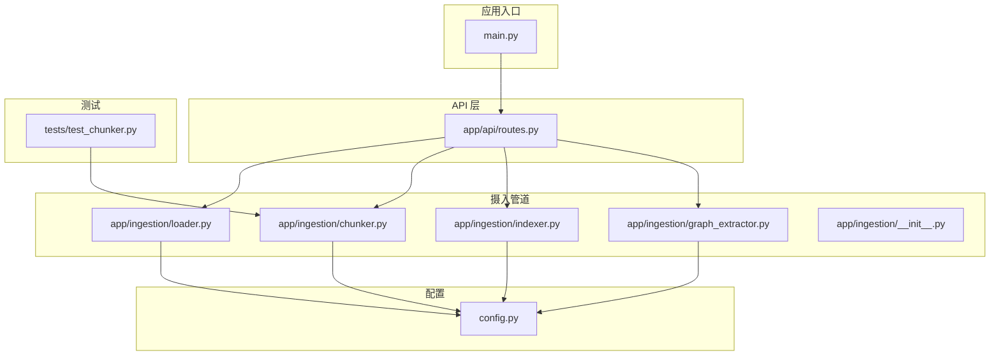
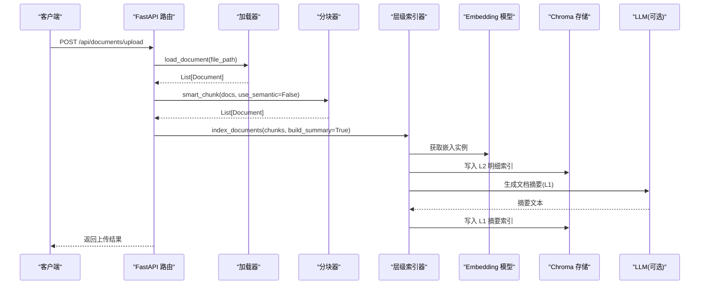
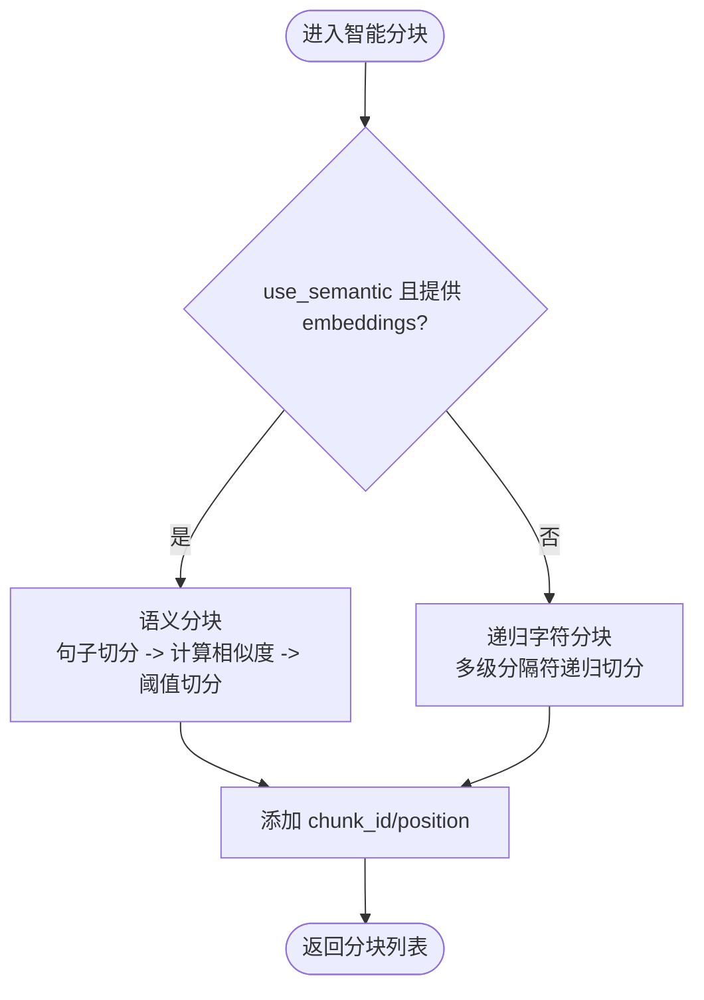
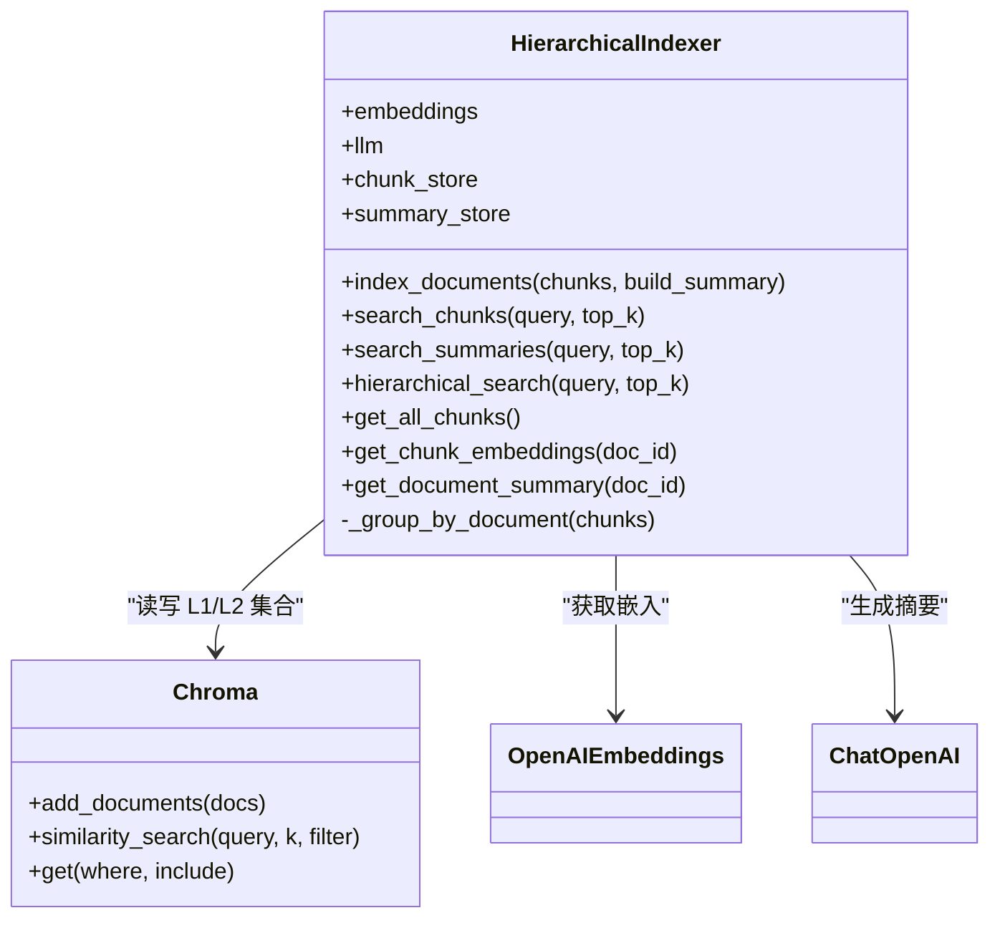
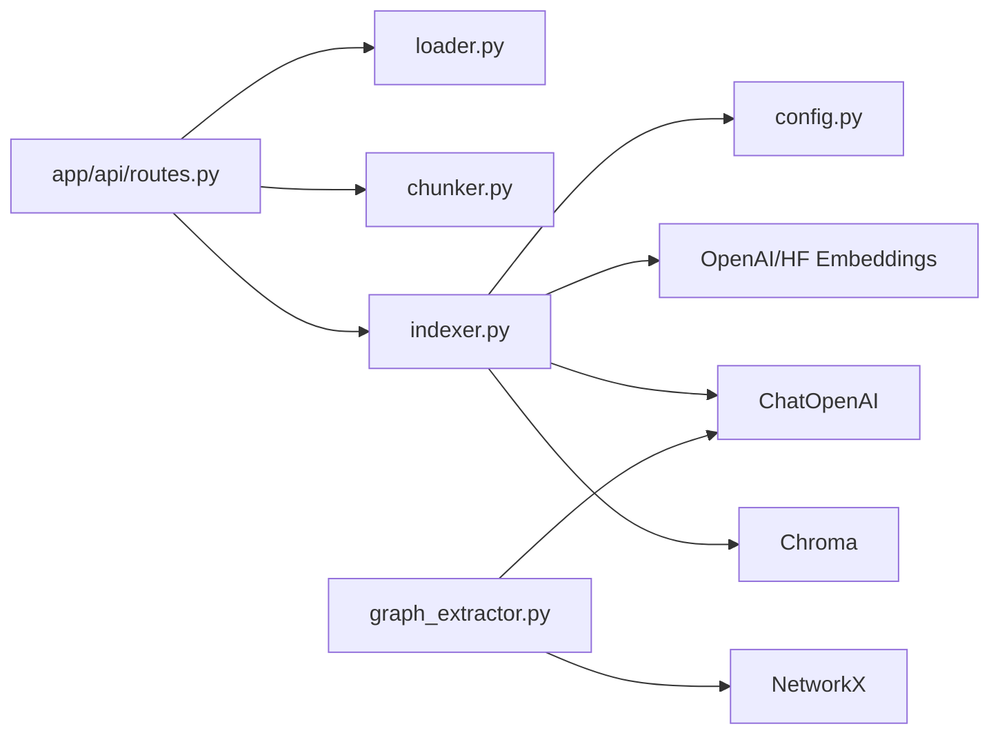

# 文档摄入管道

<cite>
**本文引用的文件**   
- [main.py](file://main.py)
- [config.py](file://config.py)
- [app/api/routes.py](file://app/api/routes.py)
- [app/ingestion/__init__.py](file://app/ingestion/__init__.py)
- [app/ingestion/loader.py](file://app/ingestion/loader.py)
- [app/ingestion/chunker.py](file://app/ingestion/chunker.py)
- [app/ingestion/indexer.py](file://app/ingestion/indexer.py)
- [app/ingestion/graph_extractor.py](file://app/ingestion/graph_extractor.py)
- [tests/test_chunker.py](file://tests/test_chunker.py)
</cite>

## 目录
1. [简介](#简介)
2. [项目结构](#项目结构)
3. [核心组件](#核心组件)
4. [架构总览](#架构总览)
5. [详细组件分析](#详细组件分析)
6. [依赖关系分析](#依赖关系分析)
7. [性能考虑](#性能考虑)
8. [故障排查指南](#故障排查指南)
9. [结论](#结论)
10. [附录：接口规范与使用示例](#附录接口规范与使用示例)

## 简介
本技术文档聚焦“文档摄入管道”，系统性地阐述多格式文档加载、智能分块、层级索引构建以及知识图谱抽取等关键能力。目标读者包括需要扩展或集成该管道的开发者，既提供高层架构说明，也给出代码级实现细节、接口规范、配置参数与最佳实践。

## 项目结构
本项目采用分层模块化组织，摄入管道位于 app/ingestion 下，API 路由在 app/api 中编排调用，统一配置由 config.py 管理。

图表来源
- [main.py:1-83](file://main.py#L1-L83)
- [app/api/routes.py:1-563](file://app/api/routes.py#L1-L563)
- [app/ingestion/loader.py:1-90](file://app/ingestion/loader.py#L1-L90)
- [app/ingestion/chunker.py:1-157](file://app/ingestion/chunker.py#L1-L157)
- [app/ingestion/indexer.py:1-253](file://app/ingestion/indexer.py#L1-L253)
- [app/ingestion/graph_extractor.py:1-337](file://app/ingestion/graph_extractor.py#L1-L337)
- [config.py:1-58](file://config.py#L1-L58)
- [tests/test_chunker.py:1-80](file://tests/test_chunker.py#L1-L80)

章节来源
- [main.py:1-83](file://main.py#L1-L83)
- [app/api/routes.py:1-563](file://app/api/routes.py#L1-L563)
- [app/ingestion/__init__.py:1-2](file://app/ingestion/__init__.py#L1-L2)

## 核心组件
- 多格式文档加载器：支持 PDF、Markdown、TXT，自动按扩展名选择加载器并补充元数据。
- 智能分块模块：提供递归字符分块与基于 embedding 的语义分块，并提供统一入口。
- 层级索引构建器：维护 L1（摘要）和 L2（明细）两个向量索引集合，支持层级检索。
- 知识图谱抽取器：从文本中抽取实体与关系，构建 NetworkX 有向图并持久化。

章节来源
- [app/ingestion/loader.py:1-90](file://app/ingestion/loader.py#L1-L90)
- [app/ingestion/chunker.py:1-157](file://app/ingestion/chunker.py#L1-L157)
- [app/ingestion/indexer.py:1-253](file://app/ingestion/indexer.py#L1-L253)
- [app/ingestion/graph_extractor.py:1-337](file://app/ingestion/graph_extractor.py#L1-L337)

## 架构总览
下图展示了从上传到索引再到检索的关键流程，涵盖 API 路由、加载器、分块器、索引器与外部服务（Embedding/LLM/Chroma）。

图表来源
- [app/api/routes.py:121-163](file://app/api/routes.py#L121-L163)
- [app/ingestion/loader.py:22-59](file://app/ingestion/loader.py#L22-L59)
- [app/ingestion/chunker.py:138-157](file://app/ingestion/chunker.py#L138-L157)
- [app/ingestion/indexer.py:111-146](file://app/ingestion/indexer.py#L111-L146)
- [app/ingestion/indexer.py:15-43](file://app/ingestion/indexer.py#L15-L43)

## 详细组件分析

### 多格式文档加载器
- 功能要点
  - 根据文件后缀映射到具体加载器（PDF、TXT、Markdown）。
  - 为每个 Document 补充 source、file_path、doc_id、chunk_index 等元数据。
  - 支持单文件与批量目录加载，失败时记录警告并继续处理其他文件。
- 关键设计
  - 扩展名到加载器的映射表，便于新增格式。
  - 异常隔离：单个文件解析失败不影响整体批次。
- 错误处理
  - 文件不存在抛出 FileNotFoundError。
  - 不支持的格式抛出 ValueError。
  - 目录遍历中捕获异常并记录日志。

章节来源
- [app/ingestion/loader.py:13-59](file://app/ingestion/loader.py#L13-L59)
- [app/ingestion/loader.py:62-90](file://app/ingestion/loader.py#L62-L90)

### 智能分块策略
- 递归字符分块
  - 基于段落/句子/字符多级分隔符进行递归切分。
  - 可配置 chunk_size 与 chunk_overlap，默认值来自全局配置。
  - 为每个分块追加唯一 chunk_id 与 position 元数据。
- 语义分块
  - 先按句子拆分，再计算相邻句子的 embedding 余弦相似度。
  - 当相似度低于阈值时判定为语义边界并切分。
  - 适合长文主题切换频繁的场景，但需额外调用 Embedding。
- 智能入口
  - 根据 use_semantic 与是否提供 embeddings 决定走哪种策略。

图表来源
- [app/ingestion/chunker.py:15-53](file://app/ingestion/chunker.py#L15-L53)
- [app/ingestion/chunker.py:56-135](file://app/ingestion/chunker.py#L56-L135)
- [app/ingestion/chunker.py:138-157](file://app/ingestion/chunker.py#L138-L157)

章节来源
- [app/ingestion/chunker.py:15-53](file://app/ingestion/chunker.py#L15-L53)
- [app/ingestion/chunker.py:56-135](file://app/ingestion/chunker.py#L56-L135)
- [app/ingestion/chunker.py:138-157](file://app/ingestion/chunker.py#L138-L157)
- [tests/test_chunker.py:1-80](file://tests/test_chunker.py#L1-L80)

### 层级索引构建过程（L1 摘要 + L2 明细）
- L2 明细索引
  - 将分块后的 Document 直接写入向量库，用于细粒度检索。
- L1 摘要索引
  - 按 doc_id 分组，对每个文档的所有分块内容拼接后交由 LLM 生成摘要。
  - 摘要作为独立 Document 写入另一个集合，用于粗粒度定位相关文档。
- 层级检索
  - 先用 L1 摘要检索定位候选文档，再在候选文档范围内做 L2 明细检索。
  - 若过滤失败则回退到全局明细检索。

图表来源
- [app/ingestion/indexer.py:74-110](file://app/ingestion/indexer.py#L74-L110)
- [app/ingestion/indexer.py:111-146](file://app/ingestion/indexer.py#L111-L146)
- [app/ingestion/indexer.py:148-156](file://app/ingestion/indexer.py#L148-L156)
- [app/ingestion/indexer.py:158-201](file://app/ingestion/indexer.py#L158-L201)
- [app/ingestion/indexer.py:203-253](file://app/ingestion/indexer.py#L203-L253)
- [app/ingestion/indexer.py:15-43](file://app/ingestion/indexer.py#L15-L43)

章节来源
- [app/ingestion/indexer.py:111-146](file://app/ingestion/indexer.py#L111-L146)
- [app/ingestion/indexer.py:158-201](file://app/ingestion/indexer.py#L158-L201)
- [app/ingestion/indexer.py:203-253](file://app/ingestion/indexer.py#L203-L253)

### 知识图谱抽取（可选增强）
- 通过 LLM 从文本中抽取三元组（头实体、关系、尾实体），构建 NetworkX 有向图。
- 支持持久化到 JSON，提供子图查询、实体关系查询、统计信息导出等能力。
- 与摄入管道解耦，可在索引完成后按需构建。

章节来源
- [app/ingestion/graph_extractor.py:47-169](file://app/ingestion/graph_extractor.py#L47-L169)
- [app/ingestion/graph_extractor.py:171-337](file://app/ingestion/graph_extractor.py#L171-L337)

## 依赖关系分析
- 组件耦合
  - API 路由依赖加载器、分块器、索引器；索引器依赖配置、Embedding、LLM 与 Chroma。
  - 分块器依赖配置；加载器依赖 LangChain 加载器。
- 外部依赖
  - Embedding：本地 HuggingFace 或 OpenAI。
  - LLM：ChatOpenAI。
  - 向量库：Chroma。
  - 图结构：NetworkX。

图表来源
- [app/api/routes.py:1-563](file://app/api/routes.py#L1-L563)
- [app/ingestion/indexer.py:15-43](file://app/ingestion/indexer.py#L15-L43)
- [app/ingestion/graph_extractor.py:1-337](file://app/ingestion/graph_extractor.py#L1-L337)
- [config.py:1-58](file://config.py#L1-L58)

章节来源
- [app/api/routes.py:1-563](file://app/api/routes.py#L1-L563)
- [app/ingestion/indexer.py:15-43](file://app/ingestion/indexer.py#L15-L43)
- [config.py:1-58](file://config.py#L1-L58)

## 性能考虑
- 分块策略选择
  - 递归字符分块成本低、速度快，适合大多数场景。
  - 语义分块能更好保持语义连贯性，但需额外 Embedding 开销，建议在大文档或复杂主题切换场景使用。
- 索引写入批量化
  - 批量 add_documents 可减少网络与序列化开销。
- 层级检索优化
  - 先用 L1 缩小候选范围，再进行 L2 检索，显著降低全量检索成本。
- 资源与并发
  - 合理设置 chunk_size 与 overlap，避免过小的块导致检索碎片化。
  - 生产环境建议启用连接池与缓存（如 Embedding 结果缓存）。
- 存储与持久化
  - Chroma 持久化目录应定期备份；注意磁盘空间与索引重建成本。

[本节为通用指导，不直接分析具体文件]

## 故障排查指南
- 常见错误
  - 文件格式不支持：检查扩展名是否在映射表中，必要时扩展 LOADER_MAPPING。
  - 文件路径无效：确认路径存在且可读。
  - 目录遍历异常：单个文件解析失败会被记录并跳过，关注日志中的警告。
  - 索引写入失败：检查 Chroma 配置与权限，确认 persist_directory 可写。
  - 摘要生成失败：检查 LLM 配置与网络连通性，查看日志中的警告。
- 诊断手段
  - 使用健康检查端点验证系统状态与已索引文档数量。
  - 通过文档详情端点查看分块、词频、向量维度等信息。
  - 开启追踪端点观察各阶段耗时与链路。

章节来源
- [app/ingestion/loader.py:32-43](file://app/ingestion/loader.py#L32-L43)
- [app/ingestion/loader.py:80-89](file://app/ingestion/loader.py#L80-L89)
- [app/ingestion/indexer.py:141-146](file://app/ingestion/indexer.py#L141-L146)
- [app/api/routes.py:504-518](file://app/api/routes.py#L504-L518)
- [app/api/routes.py:356-369](file://app/api/routes.py#L356-L369)

## 结论
本摄入管道以“加载-分块-索引”为主线，结合层级索引与可选的知识图谱抽取，形成从粗到细的多路召回基础。通过合理的配置与策略选择，可在保证检索质量的同时兼顾性能与可扩展性。

[本节为总结性内容，不直接分析具体文件]

## 附录：接口规范与使用示例

### 配置参数（部分）
- OpenAI/DeepSeek
  - openai_api_key: 必填
  - openai_base_url: 默认 https://api.openai.com/v1
  - openai_model: 默认 gpt-4o-mini
  - openai_embedding_model: 默认 text-embedding-3-small
- Embedding
  - embedding_provider: local | openai
  - embedding_model: 本地模型名称（如 all-MiniLM-L6-v2）
- ChromaDB
  - chroma_persist_dir: 持久化目录
  - chroma_chunk_collection: 明细集合名
  - chroma_summary_collection: 摘要集合名
- 检索
  - retrieval_top_k: 默认 5
  - rerank_top_n: 默认 20
- 分块
  - chunk_size: 默认 512
  - chunk_overlap: 默认 64
  - semantic_chunk_threshold: 默认 0.75
- 服务器
  - api_host: 默认 0.0.0.0
  - api_port: 默认 8000

章节来源
- [config.py:12-51](file://config.py#L12-L51)

### API 端点（与摄入相关）
- 上传文档并建立索引
  - 方法: POST
  - 路径: /api/documents/upload
  - 请求体: multipart/form-data，字段 file
  - 响应: 包含文件名、分块数、doc_id 等
- 列出已索引文档
  - 方法: GET
  - 路径: /api/documents
  - 响应: 文档列表及分块计数
- 获取指定文档的分块详情（含 BM25 词项、Embedding 信息、L1 摘要）
  - 方法: GET
  - 路径: /api/documents/{doc_id}/chunks

章节来源
- [app/api/routes.py:121-163](file://app/api/routes.py#L121-L163)
- [app/api/routes.py:165-191](file://app/api/routes.py#L165-L191)
- [app/api/routes.py:194-257](file://app/api/routes.py#L194-L257)

### 使用示例（调用方式指引）
- 上传并索引一个 PDF/TXT/Markdown 文件
  - 调用 /api/documents/upload，传入文件即可触发加载-分块-索引全流程。
- 查看某文档的分块与索引详情
  - 调用 /api/documents/{doc_id}/chunks，获取分块内容、BM25 词频、向量维度与 L1 摘要。
- 健康检查
  - 调用 /api/health，返回系统状态与已索引文档数量。

章节来源
- [app/api/routes.py:121-163](file://app/api/routes.py#L121-L163)
- [app/api/routes.py:194-257](file://app/api/routes.py#L194-L257)
- [app/api/routes.py:504-518](file://app/api/routes.py#L504-L518)

### 代码片段路径（关键功能入口）
- 加载单个文档
  - [load_document:22-59](file://app/ingestion/loader.py#L22-L59)
- 批量加载目录
  - [load_directory:62-90](file://app/ingestion/loader.py#L62-L90)
- 递归字符分块
  - [recursive_chunk:15-53](file://app/ingestion/chunker.py#L15-L53)
- 语义分块
  - [semantic_chunk:56-135](file://app/ingestion/chunker.py#L56-L135)
- 智能分块入口
  - [smart_chunk:138-157](file://app/ingestion/chunker.py#L138-L157)
- 层级索引写入（L1+L2）
  - [HierarchicalIndexer.index_documents:111-146](file://app/ingestion/indexer.py#L111-L146)
- 层级检索
  - [HierarchicalIndexer.hierarchical_search:166-201](file://app/ingestion/indexer.py#L166-L201)
- 获取所有分块（用于 BM25 构建）
  - [HierarchicalIndexer.get_all_chunks:203-211](file://app/ingestion/indexer.py#L203-L211)
- 获取分块向量信息（可视化）
  - [HierarchicalIndexer.get_chunk_embeddings:213-241](file://app/ingestion/indexer.py#L213-L241)
- 获取文档 L1 摘要
  - [HierarchicalIndexer.get_document_summary:243-253](file://app/ingestion/indexer.py#L243-L253)
- 知识图谱抽取与持久化
  - [KnowledgeGraphBuilder.build_from_documents:129-169](file://app/ingestion/graph_extractor.py#L129-L169)
  - [KnowledgeGraphBuilder._save:297-303](file://app/ingestion/graph_extractor.py#L297-L303)