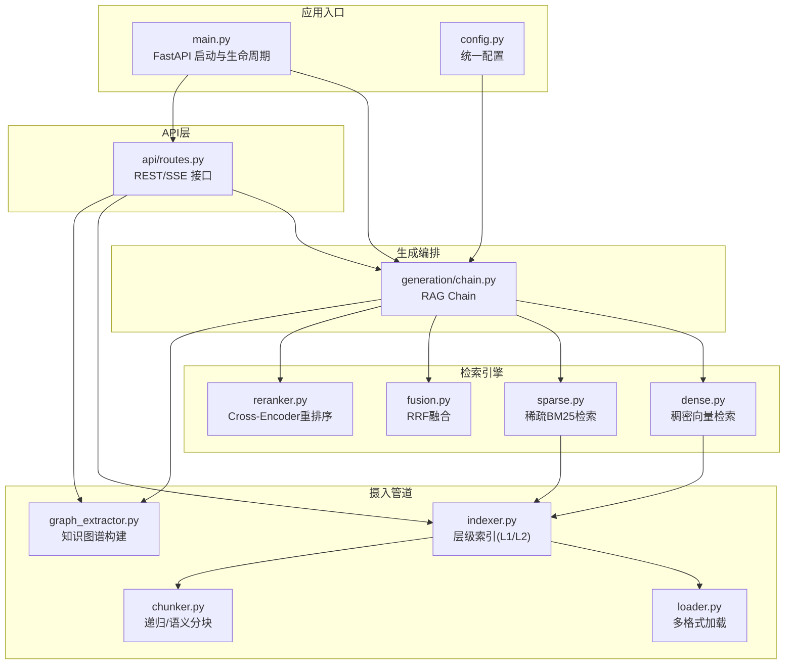
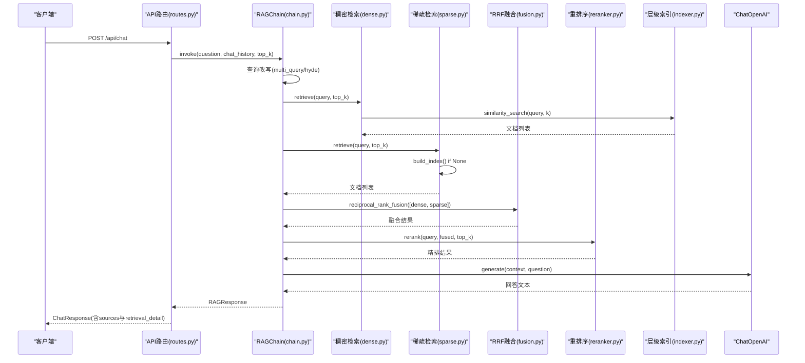
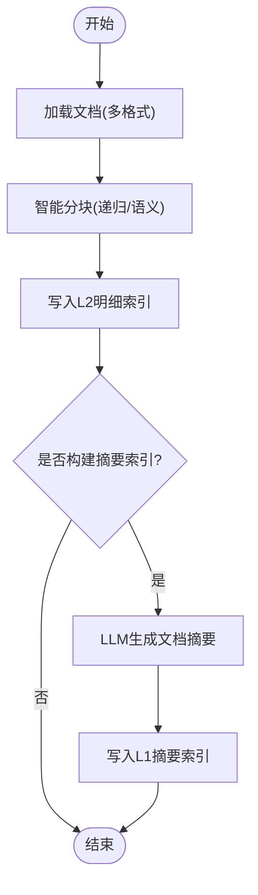
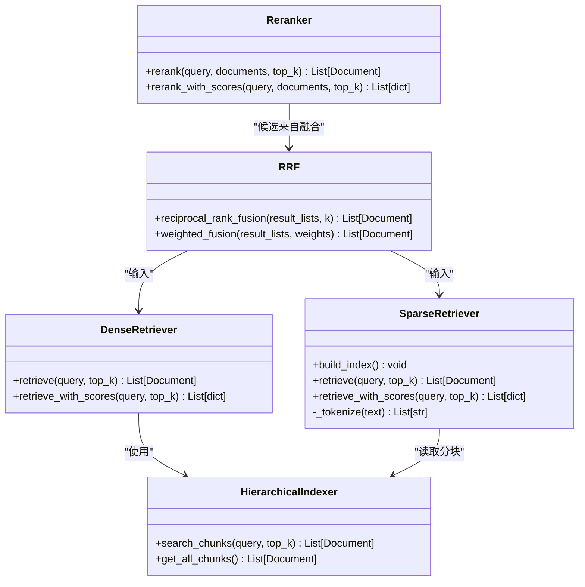
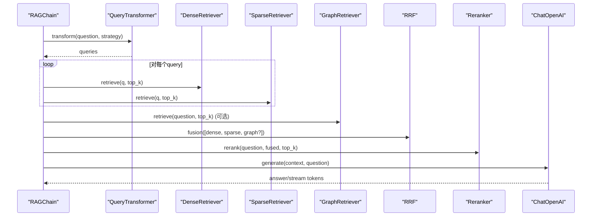
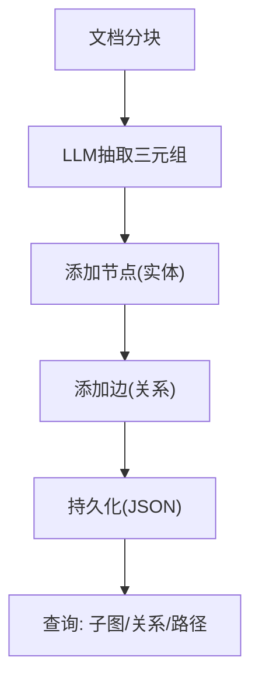
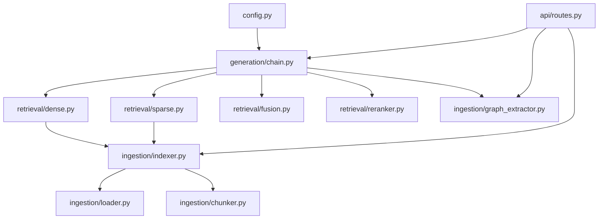

# 核心模块

<cite>
**本文引用的文件**   
- [main.py](file://main.py)
- [config.py](file://config.py)
- [app/ingestion/loader.py](file://app/ingestion/loader.py)
- [app/ingestion/chunker.py](file://app/ingestion/chunker.py)
- [app/ingestion/indexer.py](file://app/ingestion/indexer.py)
- [app/retrieval/dense.py](file://app/retrieval/dense.py)
- [app/retrieval/sparse.py](file://app/retrieval/sparse.py)
- [app/retrieval/fusion.py](file://app/retrieval/fusion.py)
- [app/retrieval/reranker.py](file://app/retrieval/reranker.py)
- [app/generation/chain.py](file://app/generation/chain.py)
- [app/api/routes.py](file://app/api/routes.py)
- [app/ingestion/graph_extractor.py](file://app/ingestion/graph_extractor.py)
</cite>

## 目录
1. [简介](#简介)
2. [项目结构](#项目结构)
3. [核心组件](#核心组件)
4. [架构总览](#架构总览)
5. [详细组件分析](#详细组件分析)
6. [依赖关系分析](#依赖关系分析)
7. [性能考量](#性能考量)
8. [故障排查指南](#故障排查指南)
9. [结论](#结论)
10. [附录：接口规范与使用示例](#附录接口规范与使用示例)

## 简介
本技术文档聚焦于检索增强生成（RAG）系统的核心模块，覆盖文档摄入管道、多路召回检索引擎、结果融合与重排序、以及生成链编排器。文档深入解析了多种格式文档的加载与解析、智能分块策略、层级索引构建、稠密向量检索与稀疏关键词检索的实现细节、RRF融合与Cross-Encoder重排序流程，并给出查询改写、上下文管理与流式响应处理的关键逻辑。同时提供接口规范、配置参数说明、使用示例、性能优化建议与最佳实践，帮助开发者快速理解与扩展系统能力。

## 项目结构
系统采用分层模块化组织：
- 应用入口与生命周期管理：负责初始化 RAGChain、CORS、路由注册等
- 配置中心：集中管理模型、嵌入、存储、检索、分块、图检索等参数
- 文档摄入管道：加载多格式文档、智能分块、层级索引构建
- 检索引擎：稠密向量检索、稀疏BM25检索、RRF融合、Cross-Encoder重排序
- 生成链编排器：查询改写、多路召回、融合重排、LLM生成与流式输出
- API层：REST/SSE接口暴露聊天、文档上传、检索对比、图谱操作、健康检查等
- 知识图谱：从文本抽取实体与关系，构建NetworkX有向图，支持持久化与查询

图表来源
- [main.py:21-58](file://main.py#L21-L58)
- [config.py:7-52](file://config.py#L7-L52)
- [app/ingestion/loader.py:22-59](file://app/ingestion/loader.py#L22-L59)
- [app/ingestion/chunker.py:15-53](file://app/ingestion/chunker.py#L15-L53)
- [app/ingestion/indexer.py:74-110](file://app/ingestion/indexer.py#L74-L110)
- [app/retrieval/dense.py:13-37](file://app/retrieval/dense.py#L13-L37)
- [app/retrieval/sparse.py:19-47](file://app/retrieval/sparse.py#L19-L47)
- [app/retrieval/fusion.py:13-64](file://app/retrieval/fusion.py#L13-L64)
- [app/retrieval/reranker.py:14-31](file://app/retrieval/reranker.py#L14-L31)
- [app/generation/chain.py:49-98](file://app/generation/chain.py#L49-L98)
- [app/api/routes.py:47-71](file://app/api/routes.py#L47-L71)
- [app/ingestion/graph_extractor.py:47-69](file://app/ingestion/graph_extractor.py#L47-L69)

章节来源
- [main.py:21-58](file://main.py#L21-L58)
- [config.py:7-52](file://config.py#L7-L52)

## 核心组件
- 文档摄入管道
  - 多格式加载：支持PDF、TXT、Markdown；自动选择加载器并补充元数据
  - 智能分块：递归字符分块与基于embedding相似度的语义分块
  - 层级索引：L1摘要索引（文档级）、L2明细索引（段落级），支持过滤检索
- 检索引擎
  - 稠密向量检索：OpenAI Embedding + ChromaDB余弦相似度搜索
  - 稀疏关键词检索：jieba中文分词 + BM25Okapi倒排索引
  - 结果融合：RRF融合（不依赖分数可比性，仅利用排名）
  - 重排序：Cross-Encoder对候选进行细粒度相关性打分
- 生成链编排器
  - 查询改写：Multi-Query/HyDE策略（通过QueryTransformer）
  - 多路召回：Dense + Sparse + Graph（可选）
  - 上下文管理：格式化检索结果为Prompt上下文
  - 流式响应：SSE事件推送token流
- 知识图谱
  - LLM抽取三元组，构建NetworkX有向图，支持持久化、子图扩展、路径查找

章节来源
- [app/ingestion/loader.py:22-59](file://app/ingestion/loader.py#L22-L59)
- [app/ingestion/chunker.py:56-135](file://app/ingestion/chunker.py#L56-L135)
- [app/ingestion/indexer.py:74-201](file://app/ingestion/indexer.py#L74-L201)
- [app/retrieval/dense.py:13-37](file://app/retrieval/dense.py#L13-L37)
- [app/retrieval/sparse.py:19-123](file://app/retrieval/sparse.py#L19-L123)
- [app/retrieval/fusion.py:13-64](file://app/retrieval/fusion.py#L13-L64)
- [app/retrieval/reranker.py:14-79](file://app/retrieval/reranker.py#L14-L79)
- [app/generation/chain.py:49-201](file://app/generation/chain.py#L49-L201)
- [app/ingestion/graph_extractor.py:47-169](file://app/ingestion/graph_extractor.py#L47-L169)

## 架构总览
下图展示了端到端RAG流程：用户请求进入API层，触发RAGChain编排，依次执行查询改写、多路召回、RRF融合、重排序与LLM生成，最终返回答案与来源。

图表来源
- [app/api/routes.py:47-71](file://app/api/routes.py#L47-L71)
- [app/generation/chain.py:100-201](file://app/generation/chain.py#L100-L201)
- [app/retrieval/dense.py:24-37](file://app/retrieval/dense.py#L24-L37)
- [app/retrieval/sparse.py:72-104](file://app/retrieval/sparse.py#L72-L104)
- [app/retrieval/fusion.py:13-64](file://app/retrieval/fusion.py#L13-L64)
- [app/retrieval/reranker.py:33-79](file://app/retrieval/reranker.py#L33-L79)
- [app/ingestion/indexer.py:158-201](file://app/ingestion/indexer.py#L158-L201)

## 详细组件分析

### 文档摄入管道
- 多格式加载器
  - 根据文件后缀映射到对应加载器（PDF/TXT/Markdown）
  - 为每个Document补充source、file_path、doc_id、chunk_index等元数据
  - 支持单文件与批量目录加载，异常日志记录
- 智能分块
  - 递归字符分块：按段落/句子/字符层级切分，可配置大小与重叠
  - 语义分块：先按句子拆分，计算相邻句子的embedding余弦相似度，低于阈值则切分
  - 智能入口：根据配置选择分块策略，并为每个chunk添加唯一ID与位置信息
- 层级索引构建
  - L1摘要索引：对同一文档的所有分块调用LLM生成摘要，写入Chroma集合
  - L2明细索引：将分块直接写入Chroma集合
  - 层级检索：先通过摘要定位相关文档，再在目标文档内做明细检索，失败回退全局检索
  - 辅助方法：获取所有分块（用于BM25构建）、获取指定文档的分块向量信息、获取文档摘要

图表来源
- [app/ingestion/loader.py:22-59](file://app/ingestion/loader.py#L22-L59)
- [app/ingestion/chunker.py:15-53](file://app/ingestion/chunker.py#L15-L53)
- [app/ingestion/chunker.py:56-135](file://app/ingestion/chunker.py#L56-L135)
- [app/ingestion/indexer.py:111-146](file://app/ingestion/indexer.py#L111-L146)

章节来源
- [app/ingestion/loader.py:22-59](file://app/ingestion/loader.py#L22-L59)
- [app/ingestion/chunker.py:15-53](file://app/ingestion/chunker.py#L15-L53)
- [app/ingestion/chunker.py:56-135](file://app/ingestion/chunker.py#L56-L135)
- [app/ingestion/indexer.py:74-201](file://app/ingestion/indexer.py#L74-L201)

### 检索引擎
- 稠密向量检索
  - 使用HierarchicalIndexer的明细索引进行相似度搜索
  - 支持带分数的检索，便于后续融合与评估
- 稀疏关键词检索（BM25）
  - 从Chroma读取所有分块，构建BM25倒排索引
  - 中文分词策略：jieba精确模式，过滤停用词与单字噪声，保留英文/数字完整单词
  - 支持retrieve与retrieve_with_scores两种模式
- 结果融合（RRF）
  - 公式：RRF_score(d) = Σ 1/(k + rank_i(d))
  - 不依赖各路原始分数，仅利用排名信息，鲁棒性强
  - 支持加权融合作为备选策略
- 重排序（Cross-Encoder）
  - 将(query, document)对输入Cross-Encoder模型，输出相关性分数
  - 适合对少量候选进行精排，精度高于双塔模型但速度较慢

图表来源
- [app/retrieval/dense.py:13-37](file://app/retrieval/dense.py#L13-L37)
- [app/retrieval/sparse.py:19-123](file://app/retrieval/sparse.py#L19-L123)
- [app/retrieval/fusion.py:13-106](file://app/retrieval/fusion.py#L13-L106)
- [app/retrieval/reranker.py:14-112](file://app/retrieval/reranker.py#L14-L112)
- [app/ingestion/indexer.py:158-211](file://app/ingestion/indexer.py#L158-L211)

章节来源
- [app/retrieval/dense.py:13-37](file://app/retrieval/dense.py#L13-L37)
- [app/retrieval/sparse.py:19-123](file://app/retrieval/sparse.py#L19-L123)
- [app/retrieval/fusion.py:13-106](file://app/retrieval/fusion.py#L13-L106)
- [app/retrieval/reranker.py:14-112](file://app/retrieval/reranker.py#L14-L112)

### 生成链编排器
- 查询改写
  - 支持multi_query与hyde策略，通过QueryTransformer生成多个查询变体
- 多路召回
  - 对每个查询变体分别执行稠密与稀疏检索，去重后合并
  - 可选图检索补充关系信息
- 融合与重排序
  - RRF融合多路结果，随后使用Cross-Encoder进行精排
- 上下文管理与生成
  - 将检索结果格式化为上下文字符串，选择简单或对话Prompt模板
  - 支持流式生成，逐token推送
- 追踪与统计
  - 各阶段耗时记录，trace_id贯穿全流程，便于可视化与分析

图表来源
- [app/generation/chain.py:100-201](file://app/generation/chain.py#L100-L201)
- [app/generation/chain.py:203-270](file://app/generation/chain.py#L203-L270)

章节来源
- [app/generation/chain.py:49-201](file://app/generation/chain.py#L49-L201)
- [app/generation/chain.py:203-270](file://app/generation/chain.py#L203-L270)

### 知识图谱
- 三元组抽取
  - 使用LLM-as-Extractor从文本中抽取实体与关系，输出标准化三元组
- 图构建与持久化
  - 构建NetworkX有向图，节点与边携带来源信息，支持JSON持久化
- 查询与可视化
  - 支持N跳子图扩展、实体关系查询、三元组导出、度分布统计
  - 模糊匹配节点，支持部分匹配与包含匹配

图表来源
- [app/ingestion/graph_extractor.py:70-169](file://app/ingestion/graph_extractor.py#L70-L169)
- [app/ingestion/graph_extractor.py:171-270](file://app/ingestion/graph_extractor.py#L171-L270)

章节来源
- [app/ingestion/graph_extractor.py:47-169](file://app/ingestion/graph_extractor.py#L47-L169)
- [app/ingestion/graph_extractor.py:171-270](file://app/ingestion/graph_extractor.py#L171-L270)

## 依赖关系分析
- 组件耦合与内聚
  - RAGChain聚合各检索与生成组件，职责清晰，内聚度高
  - 检索器与索引器解耦，通过接口交互，便于替换实现
- 外部依赖
  - OpenAI Embedding/Chat模型、ChromaDB、jieba、rank_bm25、sentence_transformers、networkx
- 潜在循环依赖
  - 当前未发现循环导入；各模块单向依赖配置与索引器

图表来源
- [config.py:7-52](file://config.py#L7-L52)
- [app/generation/chain.py:49-98](file://app/generation/chain.py#L49-L98)
- [app/retrieval/dense.py:13-37](file://app/retrieval/dense.py#L13-L37)
- [app/retrieval/sparse.py:19-47](file://app/retrieval/sparse.py#L19-L47)
- [app/retrieval/fusion.py:13-64](file://app/retrieval/fusion.py#L13-L64)
- [app/retrieval/reranker.py:14-31](file://app/retrieval/reranker.py#L14-L31)
- [app/ingestion/indexer.py:74-110](file://app/ingestion/indexer.py#L74-L110)
- [app/ingestion/loader.py:22-59](file://app/ingestion/loader.py#L22-L59)
- [app/ingestion/chunker.py:15-53](file://app/ingestion/chunker.py#L15-L53)
- [app/ingestion/graph_extractor.py:47-69](file://app/ingestion/graph_extractor.py#L47-L69)
- [app/api/routes.py:47-71](file://app/api/routes.py#L47-L71)

章节来源
- [config.py:7-52](file://config.py#L7-L52)
- [app/generation/chain.py:49-98](file://app/generation/chain.py#L49-L98)
- [app/api/routes.py:47-71](file://app/api/routes.py#L47-L71)

## 性能考量
- 分块策略
  - 递归分块适合通用场景，语义分块能更好保持主题连贯性，但需额外embedding开销
  - 建议根据领域特性调整chunk_size与overlap，平衡召回率与延迟
- 索引与检索
  - 稠密检索依赖Embedding质量与ChromaDB性能，合理设置top_k与rerank_top_n
  - BM25索引构建一次性成本较高，建议在后台异步重建或增量更新
- 融合与重排序
  - RRF无需分数归一化，鲁棒且高效；Cross-Encoder重排序精度高但慢，建议控制候选规模
- 流式响应
  - SSE流式输出提升用户体验，注意服务端缓冲与网络抖动处理
- 资源与并发
  - 大模型调用与本地模型推理可能成为瓶颈，考虑批处理、缓存与限流

## 故障排查指南
- 常见错误
  - OPENAI_API_KEY未配置：启动时抛出运行时错误，需在.env中填写
  - 不支持的文件格式：上传时校验后缀，拒绝非PDF/TXT/Markdown
  - BM25索引为空：无已索引文档时返回空结果，需先完成文档上传与索引
  - 知识图谱为空：构建前需确保已有索引文档
- 诊断手段
  - 使用检索对比接口比较不同策略的命中与耗时
  - 查看追踪统计与各阶段耗时，定位瓶颈
  - 获取文档索引详情（内容、分词、向量维度、摘要）辅助调试

章节来源
- [main.py:27-31](file://main.py#L27-L31)
- [app/api/routes.py:121-162](file://app/api/routes.py#L121-L162)
- [app/retrieval/sparse.py:83-88](file://app/retrieval/sparse.py#L83-L88)
- [app/api/routes.py:262-351](file://app/api/routes.py#L262-L351)
- [app/api/routes.py:356-369](file://app/api/routes.py#L356-L369)
- [app/api/routes.py:194-257](file://app/api/routes.py#L194-L257)

## 结论
本RAG系统以模块化设计实现了从文档摄入到检索增成的完整链路，具备多路召回、融合重排、流式输出与知识图谱扩展能力。通过合理的配置与优化策略，可在保证召回质量的同时兼顾性能与可扩展性。建议在生产环境中结合业务需求调优分块与检索参数，引入缓存与异步任务，持续监控与评估系统表现。

## 附录：接口规范与使用示例

### 配置参数（节选）
- 模型与嵌入
  - openai_api_key、openai_base_url、openai_model、openai_embedding_model
  - embedding_provider（local/openai）、embedding_model
- 存储
  - chroma_persist_dir、chroma_chunk_collection、chroma_summary_collection
- 检索
  - retrieval_top_k、retrieval_rrf_k、rerank_top_n、rerank_model
- 分块
  - chunk_size、chunk_overlap、semantic_chunk_threshold
- 服务器
  - api_host、api_port
- 图检索
  - graph_enabled、graph_max_hops、graph_max_entities、graph_persist_path

章节来源
- [config.py:7-52](file://config.py#L7-L52)

### API接口定义（节选）
- 对话接口
  - POST /api/chat
  - 请求体：question、chat_history、stream、top_k
  - 响应：answer、sources、retrieval_detail、total_time_ms
- 文档上传
  - POST /api/documents/upload
  - 表单字段：file(.pdf/.txt/.md/.markdown)
  - 响应：message、filename、num_chunks、doc_id
- 文档列表
  - GET /api/documents
  - 响应：documents(doc_id/source/num_chunks)、total
- 文档详情
  - GET /api/documents/{doc_id}/chunks
  - 响应：doc_id、stats、summary、embeddings、chunks
- 检索对比
  - POST /api/retrieval/compare
  - 请求体：question、top_k
  - 响应：strategies(dense/sparse/rrf/rerank)
- 健康检查
  - GET /api/health
  - 响应：status、version、indexed_documents

章节来源
- [app/api/routes.py:47-71](file://app/api/routes.py#L47-L71)
- [app/api/routes.py:121-162](file://app/api/routes.py#L121-L162)
- [app/api/routes.py:165-191](file://app/api/routes.py#L165-L191)
- [app/api/routes.py:194-257](file://app/api/routes.py#L194-L257)
- [app/api/routes.py:262-351](file://app/api/routes.py#L262-L351)
- [app/api/routes.py:504-518](file://app/api/routes.py#L504-L518)

### 使用示例（代码片段路径）
- 初始化RAGChain并设置全局实例
  - [main.py:33-39](file://main.py#L33-L39)
- 构建BM25索引（启动时）
  - [main.py:41-46](file://main.py#L41-L46)
- 上传文档并建立索引
  - [app/api/routes.py:121-162](file://app/api/routes.py#L121-L162)
- 执行检索对比实验
  - [app/api/routes.py:262-351](file://app/api/routes.py#L262-L351)
- 获取文档索引详情（用于可视化）
  - [app/api/routes.py:194-257](file://app/api/routes.py#L194-L257)
- 构建知识图谱
  - [app/api/routes.py:402-428](file://app/api/routes.py#L402-L428)
- 图检索查询
  - [app/api/routes.py:450-464](file://app/api/routes.py#L450-L464)