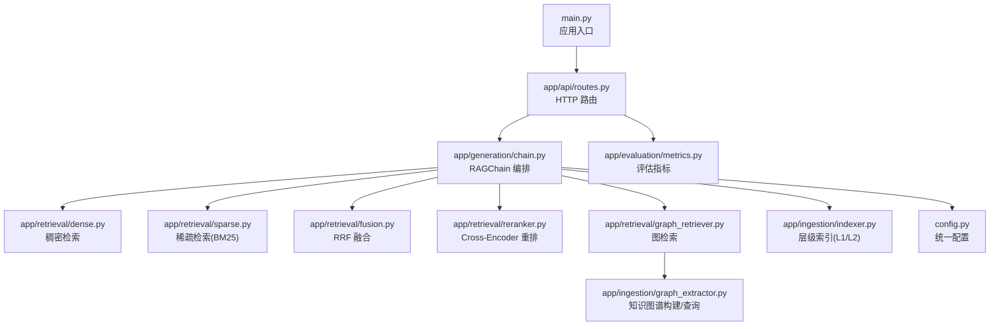
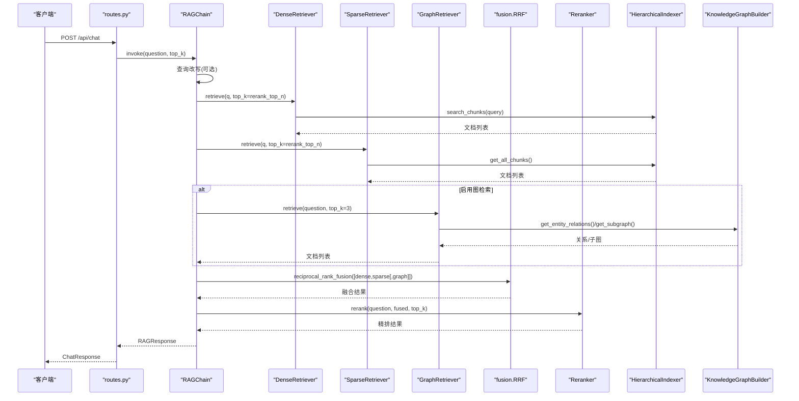
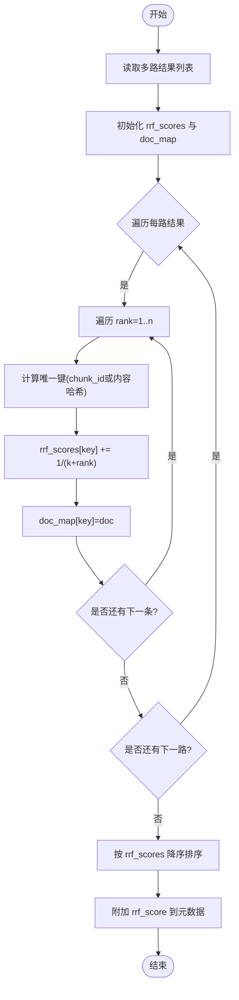
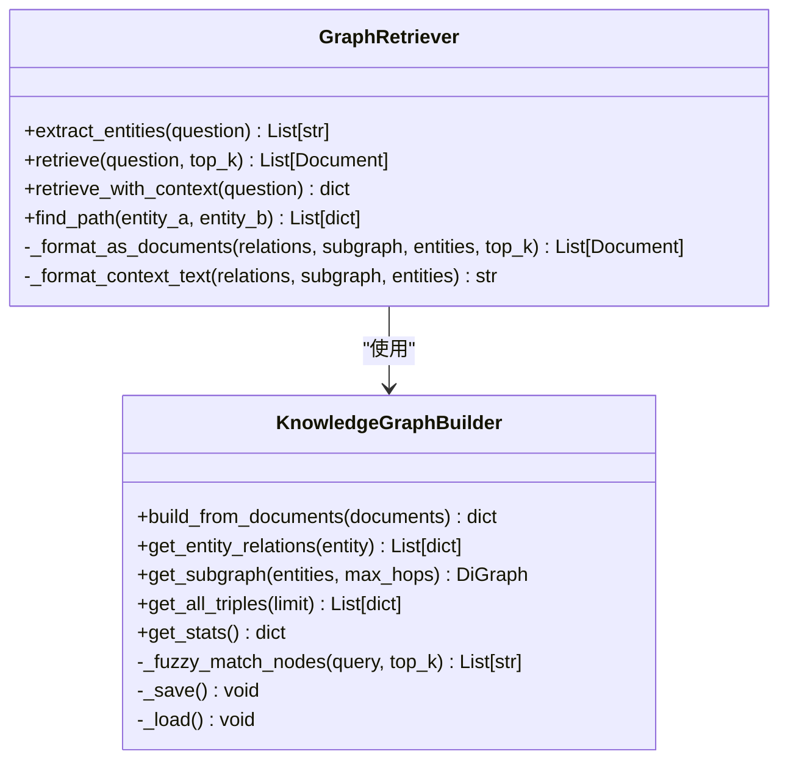
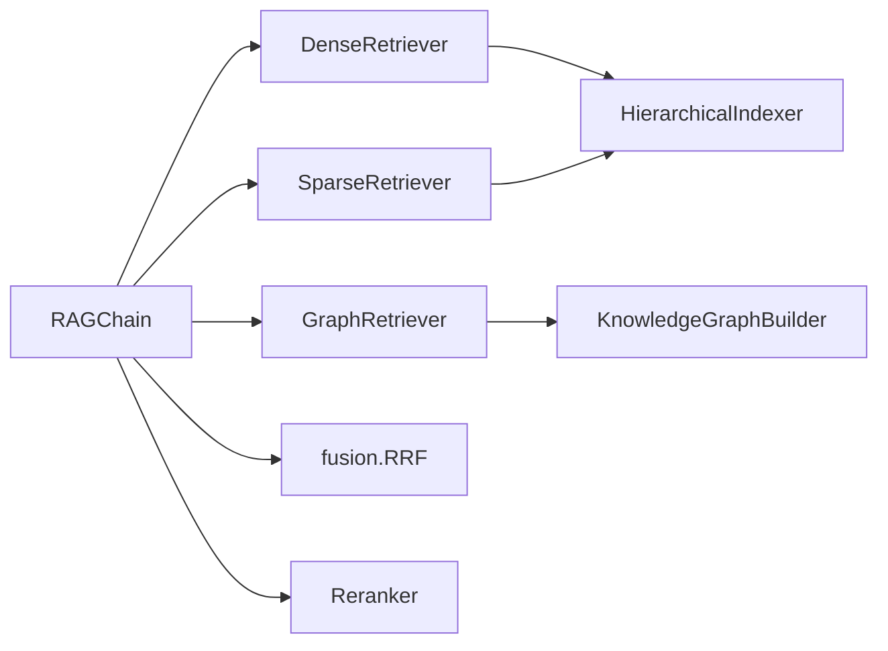

# 检索引擎

<cite>
**本文引用的文件**   
- [main.py](file://main.py)
- [config.py](file://config.py)
- [app/generation/chain.py](file://app/generation/chain.py)
- [app/retrieval/dense.py](file://app/retrieval/dense.py)
- [app/retrieval/sparse.py](file://app/retrieval/sparse.py)
- [app/retrieval/fusion.py](file://app/retrieval/fusion.py)
- [app/retrieval/reranker.py](file://app/retrieval/reranker.py)
- [app/retrieval/graph_retriever.py](file://app/retrieval/graph_retriever.py)
- [app/ingestion/indexer.py](file://app/ingestion/indexer.py)
- [app/ingestion/graph_extractor.py](file://app/ingestion/graph_extractor.py)
- [app/api/routes.py](file://app/api/routes.py)
- [app/evaluation/metrics.py](file://app/evaluation/metrics.py)
- [tests/test_retrieval.py](file://tests/test_retrieval.py)
</cite>

## 目录
1. [引言](#引言)
2. [项目结构](#项目结构)
3. [核心组件](#核心组件)
4. [架构总览](#架构总览)
5. [详细组件分析](#详细组件分析)
6. [依赖关系分析](#依赖关系分析)
7. [性能与调优](#性能与调优)
8. [故障排查指南](#故障排查指南)
9. [结论](#结论)
10. [附录：接口规范与使用示例](#附录接口规范与使用示例)

## 引言
本技术文档面向开发者，系统性阐述检索引擎的多路召回、结果融合与重排序机制，并覆盖知识图谱检索的实现与优化。内容涵盖稠密向量检索（语义相似度）、稀疏关键词检索（BM25）、RRF 融合、Cross-Encoder 重排序、图检索流程、评估方法、索引优化策略与扩展开发指南。通过代码级分析与可视化图示，帮助读者理解并定制检索策略。

## 项目结构
本项目采用分层模块化组织：
- 应用入口与路由：FastAPI 服务、生命周期管理、统一配置
- 生成链：RAGChain 编排查询改写、多路召回、融合、重排序与生成
- 检索模块：稠密检索、稀疏检索、融合、重排序、图检索
- 索引与抽取：层级索引（摘要 L1 + 明细 L2）、知识图谱构建
- 评估：自实现 RAGAS 指标（忠实度、相关性、上下文精确度/召回率）
- API：对话、文档上传、检索对比、图谱操作、健康检查等

图表来源
- [main.py:1-83](file://main.py#L1-L83)
- [app/api/routes.py:1-563](file://app/api/routes.py#L1-L563)
- [app/generation/chain.py:1-377](file://app/generation/chain.py#L1-L377)
- [app/retrieval/dense.py:1-53](file://app/retrieval/dense.py#L1-L53)
- [app/retrieval/sparse.py:1-123](file://app/retrieval/sparse.py#L1-L123)
- [app/retrieval/fusion.py:1-106](file://app/retrieval/fusion.py#L1-L106)
- [app/retrieval/reranker.py:1-112](file://app/retrieval/reranker.py#L1-L112)
- [app/retrieval/graph_retriever.py:1-312](file://app/retrieval/graph_retriever.py#L1-L312)
- [app/ingestion/indexer.py:1-253](file://app/ingestion/indexer.py#L1-L253)
- [app/ingestion/graph_extractor.py:1-337](file://app/ingestion/graph_extractor.py#L1-L337)
- [app/evaluation/metrics.py:1-403](file://app/evaluation/metrics.py#L1-L403)
- [config.py:1-58](file://config.py#L1-L58)

章节来源
- [main.py:1-83](file://main.py#L1-L83)
- [config.py:1-58](file://config.py#L1-L58)

## 核心组件
- RAGChain：统一编排查询改写、多路召回（稠密+稀疏+可选图）、RRF 融合、Cross-Encoder 重排序与生成；支持流式输出与追踪埋点。
- DenseRetriever：基于 OpenAI Embedding 或本地模型将查询编码为向量，在 ChromaDB 中进行余弦相似度搜索。
- SparseRetriever：基于 BM25 的关键词匹配，中文使用 jieba 分词，英文按单词保留，过滤单字噪声。
- Fusion：提供 RRF 融合与加权融合，不依赖原始分数，仅利用排名信息合并多路结果。
- Reranker：使用 Cross-Encoder 对候选进行细粒度相关性打分与精排。
- GraphRetriever：从查询中抽取实体，获取实体关系与 N 跳子图，格式化文本供 LLM 理解。
- HierarchicalIndexer：维护 L1 摘要索引与 L2 明细索引，支持层级检索与批量导出。
- KnowledgeGraphBuilder：LLM 抽取三元组，构建 NetworkX 有向图，支持持久化与统计。

章节来源
- [app/generation/chain.py:1-377](file://app/generation/chain.py#L1-L377)
- [app/retrieval/dense.py:1-53](file://app/retrieval/dense.py#L1-L53)
- [app/retrieval/sparse.py:1-123](file://app/retrieval/sparse.py#L1-L123)
- [app/retrieval/fusion.py:1-106](file://app/retrieval/fusion.py#L1-L106)
- [app/retrieval/reranker.py:1-112](file://app/retrieval/reranker.py#L1-L112)
- [app/retrieval/graph_retriever.py:1-312](file://app/retrieval/graph_retriever.py#L1-L312)
- [app/ingestion/indexer.py:1-253](file://app/ingestion/indexer.py#L1-L253)
- [app/ingestion/graph_extractor.py:1-337](file://app/ingestion/graph_extractor.py#L1-L337)

## 架构总览
下图展示了端到端检索增强生成的调用序列，包括查询改写、多路召回、融合、重排序与生成阶段。

图表来源
- [app/api/routes.py:47-117](file://app/api/routes.py#L47-L117)
- [app/generation/chain.py:100-201](file://app/generation/chain.py#L100-L201)
- [app/retrieval/dense.py:24-37](file://app/retrieval/dense.py#L24-L37)
- [app/retrieval/sparse.py:72-104](file://app/retrieval/sparse.py#L72-L104)
- [app/retrieval/fusion.py:13-64](file://app/retrieval/fusion.py#L13-L64)
- [app/retrieval/reranker.py:33-79](file://app/retrieval/reranker.py#L33-L79)
- [app/retrieval/graph_retriever.py:88-132](file://app/retrieval/graph_retriever.py#L88-L132)
- [app/ingestion/indexer.py:158-201](file://app/ingestion/indexer.py#L158-L201)
- [app/ingestion/graph_extractor.py:171-204](file://app/ingestion/graph_extractor.py#L171-L204)

## 详细组件分析

### 稠密向量检索（DenseRetriever）
- 目标：通过语义相似度召回相关片段。
- 实现要点：
  - 使用 OpenAI text-embedding-3-small 或本地 all-MiniLM-L6-v2 将查询编码为向量。
  - 在 ChromaDB 集合上进行相似度搜索，返回按相似度排序的文档。
  - 支持带分数的检索，便于后续融合与调试。
- 复杂度：
  - 时间：O(k log n) 近似最近邻搜索（ChromaDB 内部实现），k 为 top_k。
  - 空间：存储所有分块向量与元数据。
- 错误处理：
  - 当底层集合为空或异常时，返回空列表或抛出异常由上层捕获。
- 性能建议：
  - 合理设置 embedding_provider 与模型以平衡精度与延迟。
  - 控制 rerank_top_n 以减少下游重排压力。

章节来源
- [app/retrieval/dense.py:13-53](file://app/retrieval/dense.py#L13-L53)
- [app/ingestion/indexer.py:158-165](file://app/ingestion/indexer.py#L158-L165)

### 稀疏关键词检索（SparseRetriever，BM25）
- 目标：精确匹配术语、编号、专有名词，弥补向量检索不足。
- 实现要点：
  - 中文使用 jieba 词级分词，英文/数字保持完整单词，过滤单字噪声。
  - 构建 BM25Okapi 倒排索引，计算查询得分并取 top_k。
  - 支持带分数的检索，并将 bm25_score 写入元数据。
- 复杂度：
  - 构建索引：O(N·T)，N 为文档数，T 为平均 token 数。
  - 检索：O(T + k log n)。
- 错误处理：
  - 无文档或索引未构建时返回空结果并记录警告。
- 性能建议：
  - 首次启动自动构建 BM25 索引；增量更新后需重建索引。
  - 调整分词策略以提升领域术语召回。

章节来源
- [app/retrieval/sparse.py:19-123](file://app/retrieval/sparse.py#L19-L123)
- [app/ingestion/indexer.py:203-211](file://app/ingestion/indexer.py#L203-L211)

### 结果融合（RRF 与加权融合）
- RRF（Reciprocal Rank Fusion）：
  - 公式：RRF_score(d) = Σ 1/(k + rank_i(d))，k 为平滑常数（默认 60）。
  - 优势：不依赖各路原始分数，仅用排名，鲁棒且简单。
  - 去重键：优先使用 chunk_id，否则回退到内容哈希。
- 加权融合：
  - 对不同检索路赋予权重，适用于某些路更可靠的场景。
- 复杂度：
  - O(M·n)，M 为路数，n 为每路结果长度。
- 错误处理：
  - 空输入直接返回空列表。

图表来源
- [app/retrieval/fusion.py:13-64](file://app/retrieval/fusion.py#L13-L64)

章节来源
- [app/retrieval/fusion.py:13-106](file://app/retrieval/fusion.py#L13-L106)
- [tests/test_retrieval.py:10-67](file://tests/test_retrieval.py#L10-L67)

### 重排序（Cross-Encoder Reranker）
- 目标：对融合后的候选进行细粒度相关性精排。
- 实现要点：
  - 使用 cross-encoder/ms-marco-MiniLM-L-6-v2 模型对 (query, document) 对打分。
  - 将 rerank_score 写入元数据并按分数降序取 top_k。
- 复杂度：
  - 时间：O(m·t)，m 为候选数，t 为模型推理开销。
  - 空间：缓存模型与中间张量。
- 错误处理：
  - 空候选直接返回空列表。
- 性能建议：
  - 控制候选规模（如 rerank_top_n）以降低推理成本。
  - 可替换为更快或更强的 Cross-Encoder 模型。

章节来源
- [app/retrieval/reranker.py:14-112](file://app/retrieval/reranker.py#L14-L112)

### 知识图谱检索（GraphRetriever）
- 目标：补充关系推理能力，作为向量检索的增强。
- 工作流程：
  - 实体抽取：使用 LLM 从问题中提取关键技术实体。
  - 关系检索：获取实体的入边/出边关系，去重汇总。
  - 子图扩展：BFS N 跳扩展，提取额外边用于上下文补充。
  - 文本格式化：将三元组与子图转为自然语言段落，便于 LLM 理解。
- 路径查找：
  - 在无向版本上求最短路径，提取路径上的关系。
- 复杂度：
  - 实体抽取：LLM 调用开销。
  - 关系/子图：O(E+N) 级别，E 为边数，N 为节点数。
- 错误处理：
  - 图空或节点不存在时返回空结果。

图表来源
- [app/retrieval/graph_retriever.py:39-312](file://app/retrieval/graph_retriever.py#L39-L312)
- [app/ingestion/graph_extractor.py:47-337](file://app/ingestion/graph_extractor.py#L47-L337)

章节来源
- [app/retrieval/graph_retriever.py:39-312](file://app/retrieval/graph_retriever.py#L39-L312)
- [app/ingestion/graph_extractor.py:47-337](file://app/ingestion/graph_extractor.py#L47-L337)

### 层级索引（HierarchicalIndexer）
- 目标：L1 摘要索引用于粗粒度定位，L2 明细索引用于细粒度检索。
- 功能：
  - 写入 L2 明细索引；按文档分组生成摘要并写入 L1。
  - 层级检索：先 L1 定位相关文档，再在限定范围内做 L2 检索。
  - 导出全部分块用于 BM25 构建。
- 复杂度：
  - 写入：O(N) 次插入。
  - 检索：近似最近邻搜索 O(k log n)。
- 错误处理：
  - 摘要生成失败跳过该文档；过滤失败回退全局检索。

章节来源
- [app/ingestion/indexer.py:74-253](file://app/ingestion/indexer.py#L74-L253)

## 依赖关系分析
- 组件耦合：
  - RAGChain 聚合各检索器与融合/重排组件，低耦合高内聚。
  - Dense/Sparse/Graph 均依赖 HierarchicalIndexer 或 KnowledgeGraphBuilder。
  - Fusion/Reranker 独立于具体检索器，通用性强。
- 外部依赖：
  - ChromaDB（向量存储）、OpenAI Embedding/Cross-Encoder、jieba、NetworkX。
- 潜在循环依赖：
  - 当前未见循环导入；各模块职责清晰。

图表来源
- [app/generation/chain.py:49-99](file://app/generation/chain.py#L49-L99)
- [app/retrieval/dense.py:13-23](file://app/retrieval/dense.py#L13-L23)
- [app/retrieval/sparse.py:19-31](file://app/retrieval/sparse.py#L19-L31)
- [app/retrieval/graph_retriever.py:39-61](file://app/retrieval/graph_retriever.py#L39-L61)
- [app/ingestion/indexer.py:74-110](file://app/ingestion/indexer.py#L74-L110)
- [app/ingestion/graph_extractor.py:47-69](file://app/ingestion/graph_extractor.py#L47-L69)

章节来源
- [app/generation/chain.py:49-99](file://app/generation/chain.py#L49-L99)

## 性能与调优
- 稠密检索：
  - 选择合适 embedding 模型（本地 vs OpenAI），权衡延迟与精度。
  - 控制 rerank_top_n，减少下游重排压力。
- 稀疏检索：
  - 首次启动构建 BM25 索引；增量更新后重建索引。
  - 优化分词策略（停用词表、领域词典）提升召回。
- 融合与重排：
  - RRF 参数 k 影响融合敏感度；k 越大越平滑。
  - 重排候选规模与模型大小直接影响耗时。
- 图检索：
  - 限制 max_hops 与 max_entities，避免子图过大。
  - 实体抽取 Prompt 与 LLM 稳定性影响效果。
- 索引优化：
  - 合理 chunk_size 与 overlap，保证语义完整性与检索效率。
  - 定期清理无用集合与图谱，释放资源。

## 故障排查指南
- 常见问题：
  - 未配置 OPENAI_API_KEY：启动时报错，需在 .env 中配置。
  - BM25 索引为空：上传文档后需重建 BM25 索引。
  - 图检索为空：确保已构建知识图谱且存在实体。
  - 重排结果为空：候选为空或模型加载失败。
- 日志与追踪：
  - 各模块均有日志输出，结合 /api/traces 与 /api/traces/stats 查看阶段耗时。
- 快速验证：
  - 使用 /api/retrieval/compare 对比不同策略命中与耗时。
  - 使用 /api/evaluate 触发评估，观察 Faithfulness、Relevancy、Precision、Recall。

章节来源
- [main.py:21-49](file://main.py#L21-L49)
- [app/api/routes.py:262-351](file://app/api/routes.py#L262-L351)
- [app/api/routes.py:374-397](file://app/api/routes.py#L374-L397)

## 结论
本检索引擎通过“稠密+稀疏+图”的多路召回与 RRF 融合、Cross-Encoder 重排序，实现了高精度与强鲁棒的检索链路。层级索引与知识图谱进一步增强了定位与关系推理能力。配合完善的评估与观测工具，便于持续优化与扩展。

## 附录：接口规范与使用示例

### 配置参数（Settings）
- OpenAI/Embedding：openai_api_key、openai_base_url、openai_model、openai_embedding_model、embedding_provider、embedding_model
- ChromaDB：chroma_persist_dir、chroma_chunk_collection、chroma_summary_collection
- 检索：retrieval_top_k、retrieval_rrf_k、rerank_top_n、rerank_model
- Chunking：chunk_size、chunk_overlap、semantic_chunk_threshold
- 服务器：api_host、api_port
- 图检索：graph_enabled、graph_max_hops、graph_max_entities、graph_persist_path

章节来源
- [config.py:7-58](file://config.py#L7-L58)

### 检索器接口规范
- DenseRetriever
  - retrieve(query, top_k) -> List[Document]
  - retrieve_with_scores(query, top_k) -> List[dict]
- SparseRetriever
  - build_index()
  - retrieve(query, top_k) -> List[Document]
  - retrieve_with_scores(query, top_k) -> List[dict]
- Fusion
  - reciprocal_rank_fusion(result_lists, k=None) -> List[Document]
  - weighted_fusion(result_lists, weights=None) -> List[Document]
- Reranker
  - rerank(query, documents, top_k=None) -> List[Document]
  - rerank_with_scores(query, documents, top_k=None) -> List[dict]
- GraphRetriever
  - extract_entities(question) -> List[str]
  - retrieve(question, top_k=5) -> List[Document]
  - retrieve_with_context(question) -> dict
  - find_path(entity_a, entity_b) -> List[dict]

章节来源
- [app/retrieval/dense.py:24-53](file://app/retrieval/dense.py#L24-L53)
- [app/retrieval/sparse.py:32-123](file://app/retrieval/sparse.py#L32-L123)
- [app/retrieval/fusion.py:13-106](file://app/retrieval/fusion.py#L13-L106)
- [app/retrieval/reranker.py:33-112](file://app/retrieval/reranker.py#L33-L112)
- [app/retrieval/graph_retriever.py:62-312](file://app/retrieval/graph_retriever.py#L62-L312)

### 多路召回配置与调用示例（代码片段路径）
- 初始化 RAGChain 并执行检索：
  - [app/generation/chain.py:63-99](file://app/generation/chain.py#L63-L99)
  - [app/generation/chain.py:100-201](file://app/generation/chain.py#L100-L201)
- 单独调用各检索器：
  - 稠密检索：[app/retrieval/dense.py:24-37](file://app/retrieval/dense.py#L24-L37)
  - 稀疏检索：[app/retrieval/sparse.py:72-104](file://app/retrieval/sparse.py#L72-L104)
  - 图检索：[app/retrieval/graph_retriever.py:88-132](file://app/retrieval/graph_retriever.py#L88-L132)
- 融合与重排：
  - RRF 融合：[app/retrieval/fusion.py:13-64](file://app/retrieval/fusion.py#L13-L64)
  - Cross-Encoder 重排：[app/retrieval/reranker.py:33-79](file://app/retrieval/reranker.py#L33-L79)
- HTTP 对比实验：
  - [app/api/routes.py:262-351](file://app/api/routes.py#L262-L351)

### 评估方法与指标
- 指标定义：
  - Faithfulness：回答声明是否有上下文支持
  - Answer Relevancy：回答与问题的语义相关性
  - Context Precision：相关文档是否靠前（加权精确度）
  - Context Recall：标准答案信息被检索覆盖程度
- 评估流程：
  - 使用 RAGChain 获取回答与上下文，逐样本评估并汇总报告。
- 快速评估：
  - 仅计算不依赖 LLM 的指标（如关键词重叠率）。

章节来源
- [app/evaluation/metrics.py:85-365](file://app/evaluation/metrics.py#L85-L365)
- [app/evaluation/metrics.py:368-403](file://app/evaluation/metrics.py#L368-L403)

### 索引优化策略
- 层级索引：
  - 合理 chunk_size 与 overlap，兼顾语义完整性与检索效率。
  - 按需开启摘要索引，加速粗粒度定位。
- 图索引：
  - 控制 max_hops 与实体数量，避免子图爆炸。
  - 定期持久化与加载，减少重复构建。
- 混合检索：
  - 根据业务场景调整 rerank_top_n 与融合策略（RRF 或加权）。

章节来源
- [app/ingestion/indexer.py:111-201](file://app/ingestion/indexer.py#L111-L201)
- [app/ingestion/graph_extractor.py:171-204](file://app/ingestion/graph_extractor.py#L171-L204)

### 扩展开发指南
- 新增检索路：
  - 实现新的 Retriever 类，遵循 retrieve/retrieve_with_scores 接口。
  - 在 RAGChain.retrieve 中集成新路的召回与去重。
- 自定义融合策略：
  - 在 fusion.py 中添加新函数，并在 RAGChain 中调用。
- 替换重排模型：
  - 修改 Reranker 初始化参数或替换模型名称。
- 图检索增强：
  - 改进实体抽取 Prompt 或引入外部知识库。
  - 扩展子图算法（如加权路径、约束路径）。

章节来源
- [app/generation/chain.py:100-201](file://app/generation/chain.py#L100-L201)
- [app/retrieval/fusion.py:13-106](file://app/retrieval/fusion.py#L13-L106)
- [app/retrieval/reranker.py:26-31](file://app/retrieval/reranker.py#L26-L31)
- [app/retrieval/graph_retriever.py:62-86](file://app/retrieval/graph_retriever.py#L62-L86)