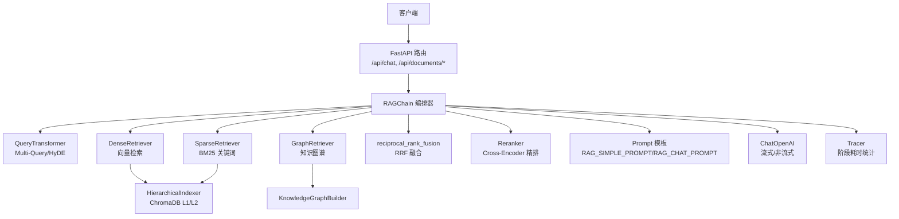
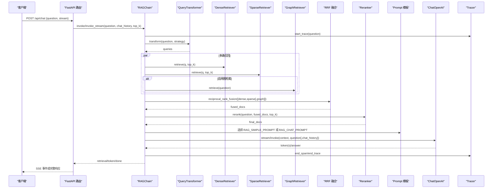
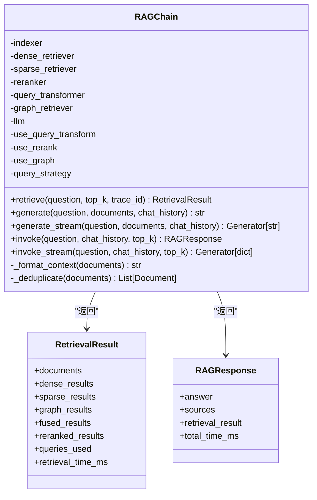
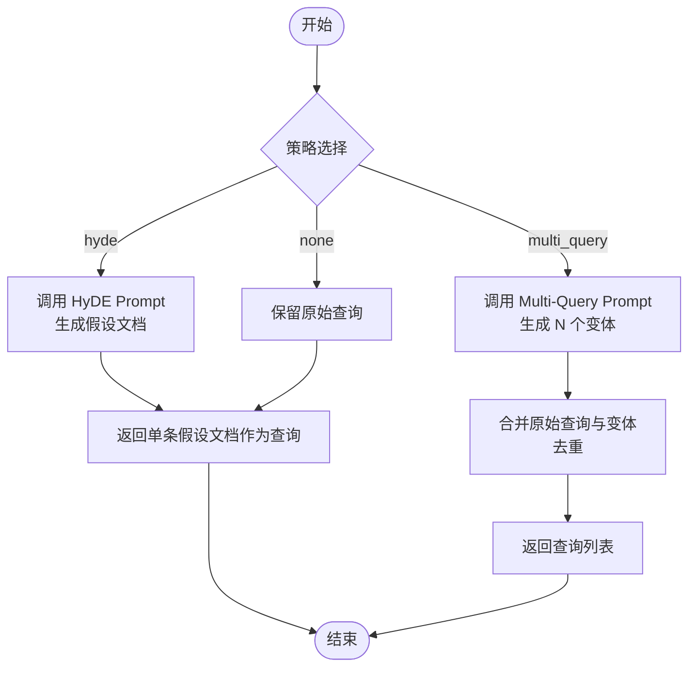
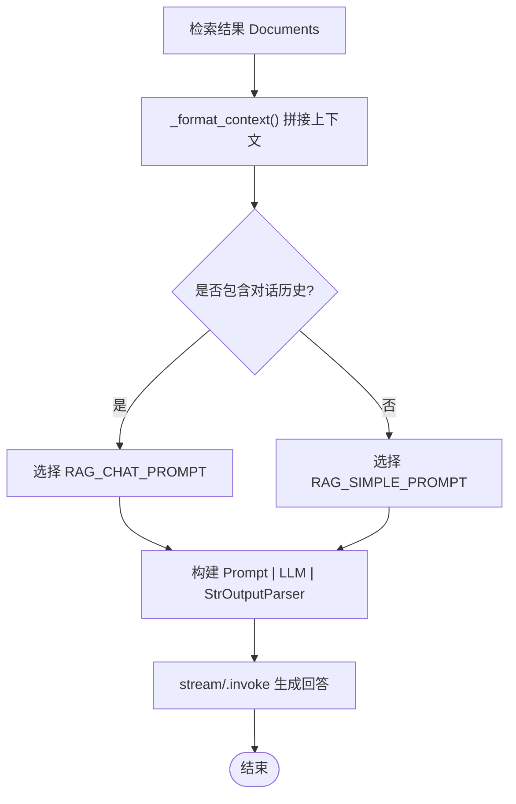
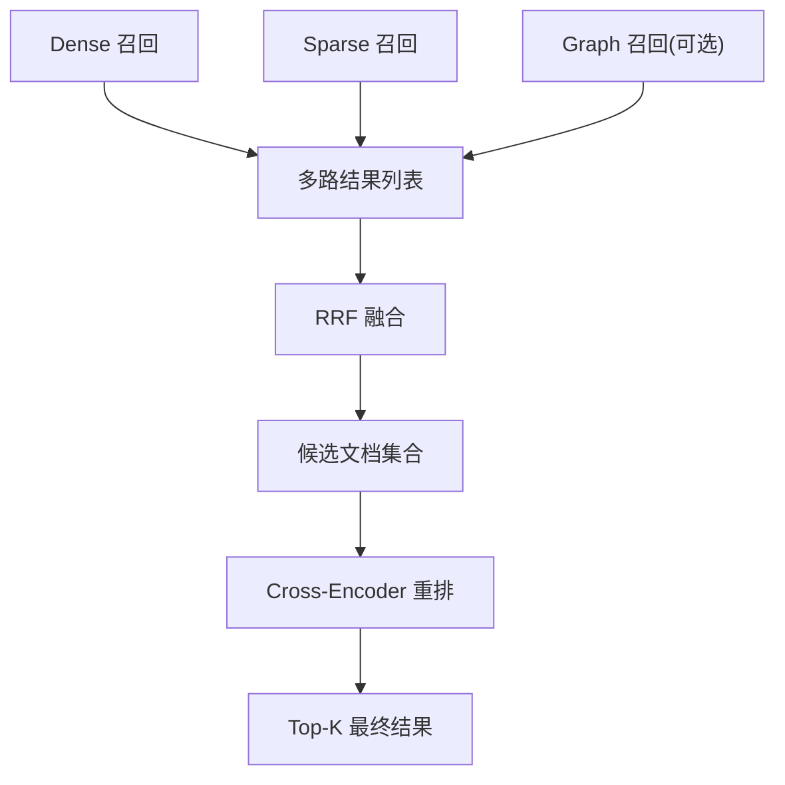
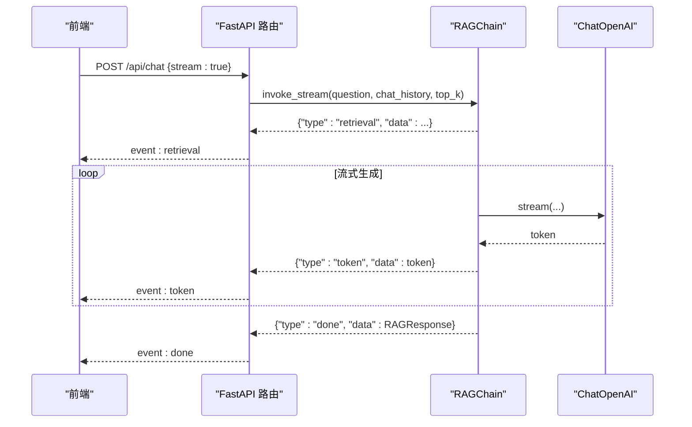
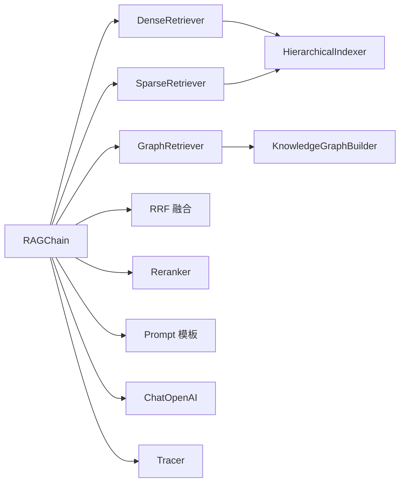

# 生成链编排

<cite>
**本文引用的文件**   
- [main.py](file://main.py)
- [config.py](file://config.py)
- [app/generation/chain.py](file://app/generation/chain.py)
- [app/retrieval/query_transform.py](file://app/retrieval/query_transform.py)
- [app/generation/prompts.py](file://app/generation/prompts.py)
- [app/observability/tracing.py](file://app/observability/tracing.py)
- [app/api/routes.py](file://app/api/routes.py)
- [app/api/schemas.py](file://app/api/schemas.py)
- [app/retrieval/dense.py](file://app/retrieval/dense.py)
- [app/retrieval/sparse.py](file://app/retrieval/sparse.py)
- [app/retrieval/fusion.py](file://app/retrieval/fusion.py)
- [app/retrieval/reranker.py](file://app/retrieval/reranker.py)
- [app/ingestion/indexer.py](file://app/ingestion/indexer.py)
- [app/retrieval/graph_retriever.py](file://app/retrieval/graph_retriever.py)
</cite>

## 目录
1. [简介](#简介)
2. [项目结构](#项目结构)
3. [核心组件](#核心组件)
4. [架构总览](#架构总览)
5. [详细组件分析](#详细组件分析)
6. [依赖关系分析](#依赖关系分析)
7. [性能与调优](#性能与调优)
8. [故障排查指南](#故障排查指南)
9. [结论](#结论)
10. [附录：配置与调用示例](#附录配置与调用示例)

## 简介
本技术文档聚焦于“生成链编排器”的实现与使用，围绕 RAGChain 的核心编排逻辑展开，涵盖以下关键主题：
- 查询改写策略：Multi-Query 变体生成、HyDE 假设文档
- 上下文管理机制：检索结果整合、提示词模板管理
- LLM 调用封装：流式与非流式两种模式
- 流式 SSE 响应：前端实时输出体验优化
- 执行流程：检索→融合→重排→生成
- 配置选项、参数调优与错误处理
- 性能监控、缓存策略与扩展开发指南

## 项目结构
系统采用分层模块化组织：
- API 层：FastAPI 路由与请求/响应模型
- 编排层：RAGChain 串联检索、融合、重排与生成
- 检索层：稠密（向量）、稀疏（BM25）、图检索、RRF 融合、Cross-Encoder 重排
- 索引层：层级索引（L1 摘要 + L2 明细）
- 可观测性：轻量级追踪记录各阶段耗时
- 配置中心：统一环境变量与默认值

图表来源
- [main.py:1-83](file://main.py#L1-L83)
- [app/api/routes.py:1-563](file://app/api/routes.py#L1-L563)
- [app/generation/chain.py:1-377](file://app/generation/chain.py#L1-L377)
- [app/retrieval/query_transform.py:1-134](file://app/retrieval/query_transform.py#L1-L134)
- [app/retrieval/dense.py:1-53](file://app/retrieval/dense.py#L1-L53)
- [app/retrieval/sparse.py:1-123](file://app/retrieval/sparse.py#L1-L123)
- [app/retrieval/fusion.py:1-106](file://app/retrieval/fusion.py#L1-L106)
- [app/retrieval/reranker.py:1-112](file://app/retrieval/reranker.py#L1-L112)
- [app/ingestion/indexer.py:1-253](file://app/ingestion/indexer.py#L1-L253)
- [app/retrieval/graph_retriever.py:1-312](file://app/retrieval/graph_retriever.py#L1-L312)
- [app/generation/prompts.py:1-61](file://app/generation/prompts.py#L1-L61)
- [app/observability/tracing.py:1-146](file://app/observability/tracing.py#L1-L146)

章节来源
- [main.py:1-83](file://main.py#L1-L83)
- [app/api/routes.py:1-563](file://app/api/routes.py#L1-L563)
- [config.py:1-58](file://config.py#L1-L58)

## 核心组件
- RAGChain：编排入口，负责查询改写、多路召回、融合、重排与生成；提供同步与流式接口。
- QueryTransformer：支持 Multi-Query 与 HyDE 两种改写策略。
- DenseRetriever/SparseRetriever：分别基于向量相似度与 BM25 进行召回。
- reciprocal_rank_fusion：RRF 融合多路结果。
- Reranker：Cross-Encoder 对候选进行精排。
- HierarchicalIndexer：L1 摘要 + L2 明细的层级索引。
- GraphRetriever：从知识图谱抽取实体与子图，补充关系上下文。
- Prompt 模板：RAG_SIMPLE_PROMPT/RAG_CHAT_PROMPT 控制回答约束与对话历史注入。
- Tracer：轻量分布式追踪，记录各阶段耗时与元数据。

章节来源
- [app/generation/chain.py:1-377](file://app/generation/chain.py#L1-L377)
- [app/retrieval/query_transform.py:1-134](file://app/retrieval/query_transform.py#L1-L134)
- [app/retrieval/dense.py:1-53](file://app/retrieval/dense.py#L1-L53)
- [app/retrieval/sparse.py:1-123](file://app/retrieval/sparse.py#L1-L123)
- [app/retrieval/fusion.py:1-106](file://app/retrieval/fusion.py#L1-L106)
- [app/retrieval/reranker.py:1-112](file://app/retrieval/reranker.py#L1-L112)
- [app/ingestion/indexer.py:1-253](file://app/ingestion/indexer.py#L1-L253)
- [app/retrieval/graph_retriever.py:1-312](file://app/retrieval/graph_retriever.py#L1-L312)
- [app/generation/prompts.py:1-61](file://app/generation/prompts.py#L1-L61)
- [app/observability/tracing.py:1-146](file://app/observability/tracing.py#L1-L146)

## 架构总览
RAGChain 的端到端流程如下：
- 输入问题进入 QueryTransformer，按策略生成查询变体或假设文档
- 对每个查询并行执行 Dense/Sparse 召回，可选 Graph 召回
- 将多路结果通过 RRF 融合，再经 Cross-Encoder 重排得到最终候选
- 构建上下文字符串并选择合适 Prompt 模板，调用 ChatOpenAI 生成回答
- 全程由 Tracer 记录各阶段耗时，便于可视化与定位瓶颈

图表来源
- [app/api/routes.py:47-117](file://app/api/routes.py#L47-L117)
- [app/generation/chain.py:100-356](file://app/generation/chain.py#L100-L356)
- [app/retrieval/query_transform.py:113-134](file://app/retrieval/query_transform.py#L113-L134)
- [app/retrieval/dense.py:24-37](file://app/retrieval/dense.py#L24-L37)
- [app/retrieval/sparse.py:72-104](file://app/retrieval/sparse.py#L72-L104)
- [app/retrieval/fusion.py:13-64](file://app/retrieval/fusion.py#L13-L64)
- [app/retrieval/reranker.py:33-79](file://app/retrieval/reranker.py#L33-L79)
- [app/generation/prompts.py:26-42](file://app/generation/prompts.py#L26-L42)
- [app/observability/tracing.py:63-110](file://app/observability/tracing.py#L63-L110)

## 详细组件分析

### RAGChain 编排器
职责与能力
- 初始化各组件：索引器、稠密/稀疏检索器、重排器、查询改写器、图检索器、LLM
- 检索流程：查询改写 → 多路召回 → RRF 融合 → Rerank → 生成
- 上下文管理：格式化检索结果为上下文字符串
- 流式输出：generate_stream 与 invoke_stream 实现 token 级推送
- 追踪埋点：start_span/end_span/end_trace 记录阶段耗时与元数据

关键方法
- retrieve：执行完整检索流程，返回 RetrievalResult
- generate/generate_stream：基于上下文与 Prompt 模板生成回答
- invoke/invoke_stream：端到端调用，自动追踪与汇总耗时
- _format_context/_deduplicate：上下文拼接与去重

图表来源
- [app/generation/chain.py:27-47](file://app/generation/chain.py#L27-L47)
- [app/generation/chain.py:49-377](file://app/generation/chain.py#L49-L377)

章节来源
- [app/generation/chain.py:1-377](file://app/generation/chain.py#L1-L377)

### 查询改写策略（Multi-Query 与 HyDE）
- Multi-Query：通过 LLM 生成多个不同视角的查询变体，扩大召回面，提升召回率
- HyDE：让 LLM 生成一段“假设性回答”，用其 embedding 做检索，使语义空间更接近真实文档
- 统一入口 transform 支持 multi_query/hyde/none 三种策略

图表来源
- [app/retrieval/query_transform.py:14-35](file://app/retrieval/query_transform.py#L14-L35)
- [app/retrieval/query_transform.py:56-87](file://app/retrieval/query_transform.py#L56-L87)
- [app/retrieval/query_transform.py:89-112](file://app/retrieval/query_transform.py#L89-L112)
- [app/retrieval/query_transform.py:113-134](file://app/retrieval/query_transform.py#L113-L134)

章节来源
- [app/retrieval/query_transform.py:1-134](file://app/retrieval/query_transform.py#L1-L134)

### 上下文管理与提示词模板
- 上下文格式：将检索到的文档拼接为结构化文本，标注来源与序号
- 模板选择：无对话历史使用 RAG_SIMPLE_PROMPT；有对话历史使用 RAG_CHAT_PROMPT，并注入 MessagesPlaceholder
- 兜底回复：当无检索结果时返回 FALLBACK_RESPONSE

图表来源
- [app/generation/chain.py:357-365](file://app/generation/chain.py#L357-L365)
- [app/generation/chain.py:203-241](file://app/generation/chain.py#L203-L241)
- [app/generation/prompts.py:26-42](file://app/generation/prompts.py#L26-L42)
- [app/generation/prompts.py:54-60](file://app/generation/prompts.py#L54-L60)

章节来源
- [app/generation/chain.py:203-271](file://app/generation/chain.py#L203-L271)
- [app/generation/prompts.py:1-61](file://app/generation/prompts.py#L1-L61)

### 检索结果整合与重排序
- 多路召回：DenseRetriever（向量相似度）+ SparseRetriever（BM25），可选 GraphRetriever（知识图谱）
- RRF 融合：不依赖原始分数，仅利用排名信息，鲁棒性强
- Cross-Encoder 重排：对少量候选进行细粒度相关性打分，提高最终质量

图表来源
- [app/retrieval/dense.py:24-37](file://app/retrieval/dense.py#L24-L37)
- [app/retrieval/sparse.py:72-104](file://app/retrieval/sparse.py#L72-L104)
- [app/retrieval/fusion.py:13-64](file://app/retrieval/fusion.py#L13-L64)
- [app/retrieval/reranker.py:33-79](file://app/retrieval/reranker.py#L33-L79)
- [app/retrieval/graph_retriever.py:88-132](file://app/retrieval/graph_retriever.py#L88-L132)

章节来源
- [app/retrieval/dense.py:1-53](file://app/retrieval/dense.py#L1-L53)
- [app/retrieval/sparse.py:1-123](file://app/retrieval/sparse.py#L1-L123)
- [app/retrieval/fusion.py:1-106](file://app/retrieval/fusion.py#L1-L106)
- [app/retrieval/reranker.py:1-112](file://app/retrieval/reranker.py#L1-L112)
- [app/retrieval/graph_retriever.py:1-312](file://app/retrieval/graph_retriever.py#L1-L312)

### 流式 SSE 响应与前端实时输出
- FastAPI 路由根据请求参数决定是否走流式路径
- RAGChain.invoke_stream 分阶段产出事件：retrieval（检索完成）、token（增量文本）、done（最终结果）
- EventSourceResponse 将事件以 SSE 形式推送至前端，实现低延迟实时体验

图表来源
- [app/api/routes.py:47-117](file://app/api/routes.py#L47-L117)
- [app/generation/chain.py:314-356](file://app/generation/chain.py#L314-L356)

章节来源
- [app/api/routes.py:1-563](file://app/api/routes.py#L1-L563)
- [app/generation/chain.py:243-356](file://app/generation/chain.py#L243-L356)

### 索引与图检索
- 层级索引：L1 文档摘要用于粗粒度定位，L2 段落明细用于细粒度检索
- 图检索：从查询中抽取实体，获取实体关系与子图，并以自然语言三元组形式补充上下文

章节来源
- [app/ingestion/indexer.py:1-253](file://app/ingestion/indexer.py#L1-L253)
- [app/retrieval/graph_retriever.py:1-312](file://app/retrieval/graph_retriever.py#L1-L312)

## 依赖关系分析
- RAGChain 依赖：
  - 检索组件：DenseRetriever、SparseRetriever、GraphRetriever
  - 融合与重排：reciprocal_rank_fusion、Reranker
  - 提示词与 LLM：RAG_SIMPLE_PROMPT/RAG_CHAT_PROMPT、ChatOpenAI
  - 追踪：Tracer
- 外部依赖：
  - ChromaDB（向量存储）
  - jieba、rank_bm25（中文分词与 BM25）
  - sentence_transformers（Cross-Encoder）
  - networkx（图算法）

图表来源
- [app/generation/chain.py:49-99](file://app/generation/chain.py#L49-L99)
- [app/retrieval/dense.py:13-37](file://app/retrieval/dense.py#L13-L37)
- [app/retrieval/sparse.py:19-47](file://app/retrieval/sparse.py#L19-L47)
- [app/retrieval/fusion.py:13-64](file://app/retrieval/fusion.py#L13-L64)
- [app/retrieval/reranker.py:14-31](file://app/retrieval/reranker.py#L14-L31)
- [app/ingestion/indexer.py:74-109](file://app/ingestion/indexer.py#L74-L109)
- [app/retrieval/graph_retriever.py:39-61](file://app/retrieval/graph_retriever.py#L39-L61)
- [app/generation/prompts.py:26-42](file://app/generation/prompts.py#L26-L42)
- [app/observability/tracing.py:49-74](file://app/observability/tracing.py#L49-L74)

章节来源
- [app/generation/chain.py:1-377](file://app/generation/chain.py#L1-L377)
- [app/retrieval/dense.py:1-53](file://app/retrieval/dense.py#L1-L53)
- [app/retrieval/sparse.py:1-123](file://app/retrieval/sparse.py#L1-L123)
- [app/retrieval/fusion.py:1-106](file://app/retrieval/fusion.py#L1-L106)
- [app/retrieval/reranker.py:1-112](file://app/retrieval/reranker.py#L1-L112)
- [app/ingestion/indexer.py:1-253](file://app/ingestion/indexer.py#L1-L253)
- [app/retrieval/graph_retriever.py:1-312](file://app/retrieval/graph_retriever.py#L1-L312)
- [app/generation/prompts.py:1-61](file://app/generation/prompts.py#L1-L61)
- [app/observability/tracing.py:1-146](file://app/observability/tracing.py#L1-L146)

## 性能与调优
- 检索阶段
  - 调整 rerank_top_n：增大候选集有助于提升重排效果，但会增加 Cross-Encoder 计算开销
  - 调整 retrieval_rrf_k：平滑常数影响融合敏感度，通常保持默认即可
  - 开启/关闭图检索：在复杂关系推理场景下收益明显，但需确保图谱已构建
- 生成阶段
  - temperature=0：保证答案稳定性与忠实度
  - 流式输出：降低首字延迟，改善用户体验
- 索引与分块
  - chunk_size/chunk_overlap：平衡上下文完整性与检索精度
  - semantic_chunk_threshold：语义切分阈值，影响分块边界
- 监控与定位
  - 使用 /api/traces 与 /api/traces/stats 查看阶段耗时分布，定位瓶颈
  - 结合日志输出（检索命中数、融合数量、最终数量）快速诊断

章节来源
- [config.py:27-46](file://config.py#L27-L46)
- [app/generation/chain.py:100-201](file://app/generation/chain.py#L100-L201)
- [app/api/routes.py:356-369](file://app/api/routes.py#L356-L369)

## 故障排查指南
- 启动失败：OPENAI_API_KEY 未配置会抛出运行时异常，需在 .env 中设置
- 检索为空：检查 BM25 索引是否构建成功；若为空则返回空结果
- 图检索不可用：确认 graph_enabled 为 True 且图谱已构建
- 流式中断：检查网络与 SSE 连接状态；确认后端正常 yield token 事件
- 评估模块缺失：/api/evaluate 需要额外依赖，未安装会返回 501

章节来源
- [main.py:27-31](file://main.py#L27-L31)
- [app/retrieval/sparse.py:83-88](file://app/retrieval/sparse.py#L83-L88)
- [app/api/routes.py:402-428](file://app/api/routes.py#L402-L428)
- [app/api/routes.py:374-397](file://app/api/routes.py#L374-L397)

## 结论
RAGChain 通过“查询改写 + 多路召回 + RRF 融合 + Cross-Encoder 重排 + 流式生成”的编排策略，兼顾召回广度与生成质量，并提供完善的追踪与可视化能力。开发者可通过配置项灵活调整各环节行为，并结合 SSE 流式输出获得良好的前端交互体验。

## 附录：配置与调用示例

### 配置选项（节选）
- OpenAI/DeepSeek：openai_api_key、openai_base_url、openai_model、openai_embedding_model
- Embedding：embedding_provider、embedding_model
- ChromaDB：chroma_persist_dir、chroma_chunk_collection、chroma_summary_collection
- 检索：retrieval_top_k、retrieval_rrf_k、rerank_top_n、rerank_model
- 分块：chunk_size、chunk_overlap、semantic_chunk_threshold
- 服务器：api_host、api_port
- 图检索：graph_enabled、graph_max_hops、graph_max_entities、graph_persist_path
- LangSmith（可选）：langchain_tracing_v2、langchain_api_key、langchain_project

章节来源
- [config.py:1-58](file://config.py#L1-L58)

### 初始化与调用方式（代码片段路径）
- 应用生命周期中初始化 RAGChain 并注册到全局
  - [main.py:33-39](file://main.py#L33-L39)
- 构建 BM25 索引（如有已索引文档）
  - [main.py:41-46](file://main.py#L41-L46)
- 非流式调用：POST /api/chat {stream:false}
  - [app/api/routes.py:47-71](file://app/api/routes.py#L47-L71)
- 流式调用：POST /api/chat {stream:true}
  - [app/api/routes.py:74-117](file://app/api/routes.py#L74-L117)
- 直接调用编排器（Python）
  - 同步：RAGChain.invoke
    - [app/generation/chain.py:272-312](file://app/generation/chain.py#L272-L312)
  - 流式：RAGChain.invoke_stream
    - [app/generation/chain.py:314-356](file://app/generation/chain.py#L314-L356)