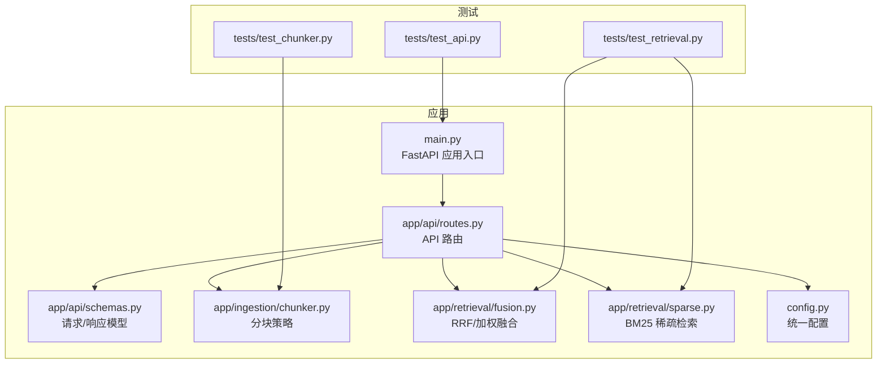
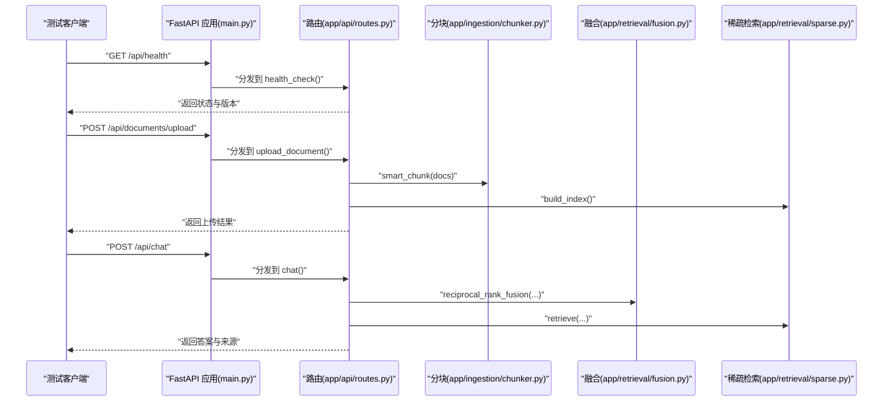
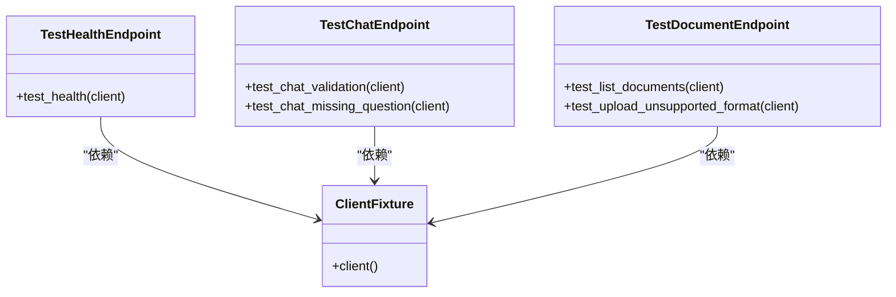
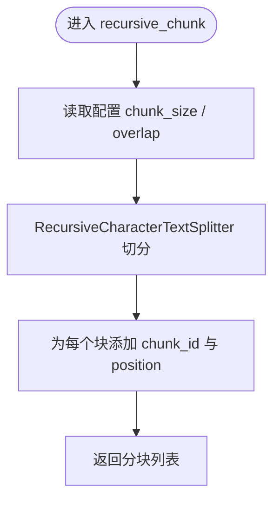
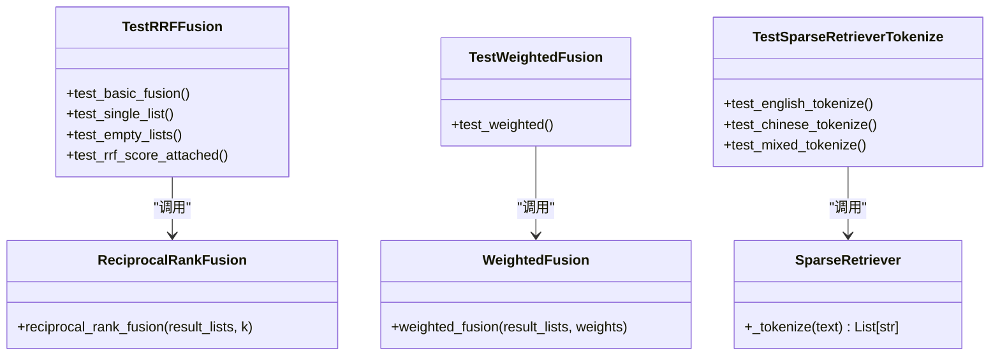
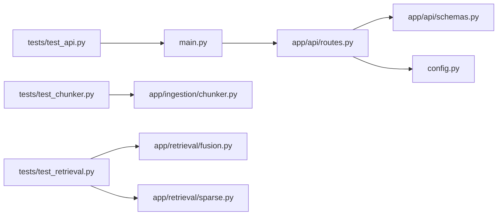

# 单元测试指南

<cite>
**本文引用的文件**   
- [tests/test_api.py](file://tests/test_api.py)
- [tests/test_chunker.py](file://tests/test_chunker.py)
- [tests/test_retrieval.py](file://tests/test_retrieval.py)
- [pyproject.toml](file://pyproject.toml)
- [main.py](file://main.py)
- [app/api/routes.py](file://app/api/routes.py)
- [app/api/schemas.py](file://app/api/schemas.py)
- [app/ingestion/chunker.py](file://app/ingestion/chunker.py)
- [app/retrieval/fusion.py](file://app/retrieval/fusion.py)
- [app/retrieval/sparse.py](file://app/retrieval/sparse.py)
- [config.py](file://config.py)
</cite>

## 目录
1. [简介](#简介)
2. [项目结构](#项目结构)
3. [核心组件](#核心组件)
4. [架构总览](#架构总览)
5. [详细组件分析](#详细组件分析)
6. [依赖分析](#依赖分析)
7. [性能考虑](#性能考虑)
8. [故障排查指南](#故障排查指南)
9. [结论](#结论)
10. [附录](#附录)

## 简介
本指南面向开发者，基于仓库现有测试结构与实现，系统讲解如何编写高质量的单元测试。内容覆盖：
- pytest 框架使用与最佳实践（夹具、类组织、断言）
- API 端点测试、文档处理测试、检索功能测试的实战方法
- 测试数据准备、Mock 对象使用、异步测试要点
- 覆盖率要求与代码质量检查配置建议
- 清晰的规范与示例路径指引

## 项目结构
本项目采用按功能域划分的模块结构，测试集中在 tests 目录下，遵循“一个被测模块对应一个或多个测试文件”的原则。关键入口与路由定义位于 main.py 与 app/api/routes.py；分块与检索逻辑分别在 app/ingestion/chunker.py 与 app/retrieval/* 中。

图表来源
- [main.py:1-83](file://main.py#L1-L83)
- [app/api/routes.py:1-563](file://app/api/routes.py#L1-L563)
- [app/api/schemas.py:1-106](file://app/api/schemas.py#L1-L106)
- [app/ingestion/chunker.py:1-157](file://app/ingestion/chunker.py#L1-L157)
- [app/retrieval/fusion.py:1-106](file://app/retrieval/fusion.py#L1-L106)
- [app/retrieval/sparse.py:1-123](file://app/retrieval/sparse.py#L1-L123)
- [config.py:1-58](file://config.py#L1-L58)

章节来源
- [pyproject.toml:44-47](file://pyproject.toml#L44-L47)
- [main.py:1-83](file://main.py#L1-L83)

## 核心组件
- FastAPI 应用与路由：提供健康检查、对话、文档上传与列表、检索对比、评估、图谱等接口。
- 分块模块：递归字符分块与语义分块，智能入口根据配置选择策略。
- 检索模块：RRF 融合、加权融合、BM25 稀疏检索。
- 配置管理：集中式 Settings，支持环境变量与默认值。

章节来源
- [app/api/routes.py:1-563](file://app/api/routes.py#L1-L563)
- [app/ingestion/chunker.py:1-157](file://app/ingestion/chunker.py#L1-L157)
- [app/retrieval/fusion.py:1-106](file://app/retrieval/fusion.py#L1-L106)
- [app/retrieval/sparse.py:1-123](file://app/retrieval/sparse.py#L1-L123)
- [config.py:1-58](file://config.py#L1-L58)

## 架构总览
下图展示从客户端到后端各层的关键交互，以及测试如何覆盖这些路径。

图表来源
- [main.py:1-83](file://main.py#L1-L83)
- [app/api/routes.py:1-563](file://app/api/routes.py#L1-L563)
- [app/ingestion/chunker.py:1-157](file://app/ingestion/chunker.py#L1-L157)
- [app/retrieval/fusion.py:1-106](file://app/retrieval/fusion.py#L1-L106)
- [app/retrieval/sparse.py:1-123](file://app/retrieval/sparse.py#L1-L123)

## 详细组件分析

### 测试环境与运行
- pytest 配置在 pyproject.toml 中，指定 pythonpath 与 testpaths。
- 开发可选依赖包含 pytest、pytest-asyncio、httpx，便于扩展异步与 HTTP 客户端测试。

章节来源
- [pyproject.toml:37-47](file://pyproject.toml#L37-L47)

### API 端点测试
- 使用 fastapi.testclient.TestClient 直接调用已启动的 FastAPI 应用实例，无需真实网络。
- 通过 @pytest.fixture 创建 client 夹具，避免重复构造 TestClient。
- 测试覆盖：
  - 健康检查：验证状态码与响应字段。
  - 对话接口：校验必填字段缺失或空值的错误码。
  - 文档接口：列举文档、上传不支持格式的错误处理。

图表来源
- [tests/test_api.py:1-59](file://tests/test_api.py#L1-L59)
- [app/api/routes.py:504-518](file://app/api/routes.py#L504-L518)
- [app/api/routes.py:121-163](file://app/api/routes.py#L121-L163)
- [app/api/routes.py:165-192](file://app/api/routes.py#L165-L192)

章节来源
- [tests/test_api.py:1-59](file://tests/test_api.py#L1-L59)
- [app/api/routes.py:47-72](file://app/api/routes.py#L47-L72)
- [app/api/routes.py:121-163](file://app/api/routes.py#L121-L163)
- [app/api/routes.py:165-192](file://app/api/routes.py#L165-L192)
- [app/api/schemas.py:9-24](file://app/api/schemas.py#L9-L24)

### 文档处理测试（分块）
- 针对 recursive_chunk 与 smart_chunk 的边界条件与行为进行断言：
  - 基本分块：长度上限、元数据保留、chunk_id 与 position 生成。
  - 短文档：不切分或保持单块。
  - 重叠区域：相邻块的尾部片段是否出现在下一块中。
  - 空输入：返回空列表。
- 使用 langchain_core.documents.Document 构造最小化测试数据。

图表来源
- [app/ingestion/chunker.py:15-53](file://app/ingestion/chunker.py#L15-L53)
- [app/ingestion/chunker.py:138-157](file://app/ingestion/chunker.py#L138-L157)

章节来源
- [tests/test_chunker.py:1-80](file://tests/test_chunker.py#L1-L80)
- [app/ingestion/chunker.py:1-157](file://app/ingestion/chunker.py#L1-L157)

### 检索功能测试（融合与稀疏检索）
- RRF 融合：
  - 多路结果合并后唯一文档数量正确。
  - 共同出现的文档排名靠前。
  - 单路与空列表边界情况。
  - 分数附加到元数据且数值符合预期。
- 加权融合：权重影响排序。
- BM25 分词：
  - 英文、中文、中英混合的分词结果满足期望。
  - 通过 SparseRetriever.__new__ 绕过初始化，仅测试 _tokenize。

图表来源
- [tests/test_retrieval.py:1-91](file://tests/test_retrieval.py#L1-L91)
- [app/retrieval/fusion.py:13-64](file://app/retrieval/fusion.py#L13-L64)
- [app/retrieval/fusion.py:67-106](file://app/retrieval/fusion.py#L67-L106)
- [app/retrieval/sparse.py:19-70](file://app/retrieval/sparse.py#L19-L70)

章节来源
- [tests/test_retrieval.py:1-91](file://tests/test_retrieval.py#L1-L91)
- [app/retrieval/fusion.py:1-106](file://app/retrieval/fusion.py#L1-L106)
- [app/retrieval/sparse.py:1-123](file://app/retrieval/sparse.py#L1-L123)

### 测试夹具与测试类组织
- 夹具：
  - client 夹具封装 TestClient(app)，减少重复构造。
  - 可进一步扩展：临时索引目录、固定配置、模拟外部服务。
- 测试类：
  - 按功能域分组（如 TestHealthEndpoint、TestChatEndpoint），提升可读性与定位效率。
  - 用例命名清晰表达意图（如 test_chat_validation）。

章节来源
- [tests/test_api.py:9-13](file://tests/test_api.py#L9-L13)
- [tests/test_api.py:15-59](file://tests/test_api.py#L15-L59)

### 断言方法与最佳实践
- 状态码断言：确保接口契约稳定。
- 响应体断言：对关键字段存在性与取值范围进行断言。
- 近似断言：使用 pytest.approx 比较浮点数，避免精度问题。
- 结构化断言：对嵌套 JSON 的键存在性、类型与范围进行检查。

章节来源
- [tests/test_api.py:18-24](file://tests/test_api.py#L18-L24)
- [tests/test_retrieval.py:48-53](file://tests/test_retrieval.py#L48-L53)

### 测试数据准备
- 使用 langchain_core.documents.Document 构造最小化输入，控制 page_content 与 metadata。
- 针对分块与检索，构造不同长度与语言特征的文本以覆盖边界。
- 对于上传接口，构造非受支持的文件名与二进制内容以触发错误分支。

章节来源
- [tests/test_chunker.py:14-27](file://tests/test_chunker.py#L14-L27)
- [tests/test_chunker.py:54-63](file://tests/test_chunker.py#L54-L63)
- [tests/test_api.py:52-58](file://tests/test_api.py#L52-L58)

### Mock 对象使用与隔离
- 当被测逻辑依赖外部服务（如向量库、LLM、嵌入模型）时，建议使用 unittest.mock.patch 或 pytest-mock 替换依赖，保证测试快速、稳定、可重复。
- 常见场景：
  - 替换 get_settings 返回固定配置。
  - 替换 ChromaDB 或 Embedding 模型的调用。
  - 替换 BM25 构建与检索过程，仅验证上层逻辑。

章节来源
- [config.py:54-57](file://config.py#L54-L57)
- [app/retrieval/sparse.py:32-47](file://app/retrieval/sparse.py#L32-L47)

### 异步测试指导
- 当前测试均为同步调用（TestClient 同步模式），适用于大多数路由与业务函数。
- 若需测试异步端点或流式 SSE，可使用 httpx.AsyncClient 配合 pytest-asyncio，或在路由层增加同步包装进行测试。
- 注意：SSE 流式响应在同步测试中可通过 EventSourceResponse 的生成器行为进行有限验证，但更推荐异步方式。

章节来源
- [app/api/routes.py:74-116](file://app/api/routes.py#L74-L116)
- [pyproject.toml:37-42](file://pyproject.toml#L37-L42)

### 覆盖率要求与质量检查配置建议
- 覆盖率：
  - 建议在 pyproject.toml 的 [tool.pytest.ini_options] 下启用 coverage 插件，设置最低阈值（例如 80%）。
  - 使用 pytest-cov 收集并输出报告，CI 中阻断低于阈值的提交。
- 代码质量：
  - 引入 ruff/flake8/black 进行静态检查与格式化。
  - 引入 mypy 进行类型检查（结合项目的 Pydantic 与类型注解）。
  - 在 CI 中集成上述工具，形成统一的门禁。

章节来源
- [pyproject.toml:44-47](file://pyproject.toml#L44-L47)

## 依赖分析
- 测试与应用的耦合关系：
  - tests/test_api.py 依赖 main.py 中的 app 实例。
  - tests/test_chunker.py 依赖 app.ingestion.chunker 的函数。
  - tests/test_retrieval.py 依赖 app.retrieval.fusion 与 app.retrieval.sparse。
- 外部依赖：
  - LangChain Document、BM25、jieba、FastAPI TestClient 等。

图表来源
- [tests/test_api.py:1-59](file://tests/test_api.py#L1-L59)
- [tests/test_chunker.py:1-80](file://tests/test_chunker.py#L1-L80)
- [tests/test_retrieval.py:1-91](file://tests/test_retrieval.py#L1-L91)
- [main.py:1-83](file://main.py#L1-L83)
- [app/api/routes.py:1-563](file://app/api/routes.py#L1-L563)
- [app/api/schemas.py:1-106](file://app/api/schemas.py#L1-L106)
- [config.py:1-58](file://config.py#L1-L58)

章节来源
- [tests/test_api.py:1-59](file://tests/test_api.py#L1-L59)
- [tests/test_chunker.py:1-80](file://tests/test_chunker.py#L1-L80)
- [tests/test_retrieval.py:1-91](file://tests/test_retrieval.py#L1-L91)
- [main.py:1-83](file://main.py#L1-L83)
- [app/api/routes.py:1-563](file://app/api/routes.py#L1-L563)
- [app/api/schemas.py:1-106](file://app/api/schemas.py#L1-L106)
- [config.py:1-58](file://config.py#L1-L58)

## 性能考虑
- 测试数据规模：
  - 分块与检索测试应包含小、中、大三种规模的数据，关注时间与内存增长趋势。
- 外部 I/O 隔离：
  - 使用 Mock 替代磁盘与网络访问，避免测试因外部因素波动。
- 并行执行：
  - 使用 pytest-xdist 并行运行测试，缩短反馈时间。
- 资源清理：
  - 对临时文件、索引目录使用夹具的 yield 与 finally 进行清理，避免污染后续用例。

[本节为通用建议，不涉及具体文件分析]

## 故障排查指南
- 健康检查失败：
  - 确认路由注册与中间件未拦截。
  - 检查依赖初始化（RAG Chain、索引构建）是否抛出异常。
- 上传接口报错：
  - 检查文件格式白名单与异常分支。
  - 确认临时文件写入权限与路径。
- 分块异常：
  - 检查分隔符与长度限制是否符合预期。
  - 验证元数据是否被正确复制与追加。
- 检索为空：
  - 确认 BM25 索引是否构建成功。
  - 检查分词策略与停用词过滤逻辑。

章节来源
- [app/api/routes.py:504-518](file://app/api/routes.py#L504-L518)
- [app/api/routes.py:121-163](file://app/api/routes.py#L121-L163)
- [app/ingestion/chunker.py:15-53](file://app/ingestion/chunker.py#L15-L53)
- [app/retrieval/sparse.py:32-47](file://app/retrieval/sparse.py#L32-L47)

## 结论
本指南基于现有测试结构，总结了 pytest 的使用范式、API/文档/检索三类测试的编写要点，并提供了覆盖率与质量检查的配置建议。遵循本文规范，可显著提升测试的可读性、稳定性与可维护性，保障 RAG 系统的持续交付质量。

[本节为总结性内容，不涉及具体文件分析]

## 附录

### 常用 pytest 命令
- 运行全部测试：pytest
- 运行单个文件：pytest tests/test_api.py
- 运行单个用例：pytest tests/test_api.py::TestHealthEndpoint::test_health
- 显示详细日志：pytest -s -v
- 生成覆盖率报告：pytest --cov=. --cov-report=term-missing

[本节为通用操作说明，不涉及具体文件分析]