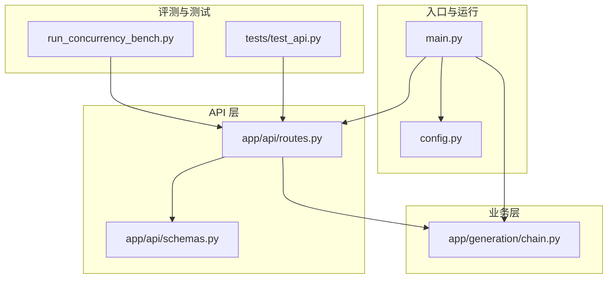
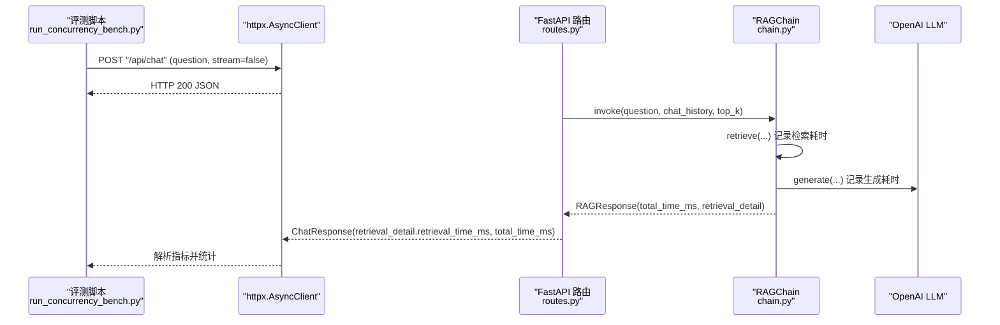
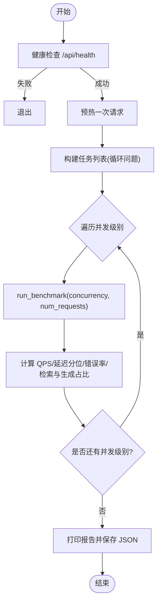
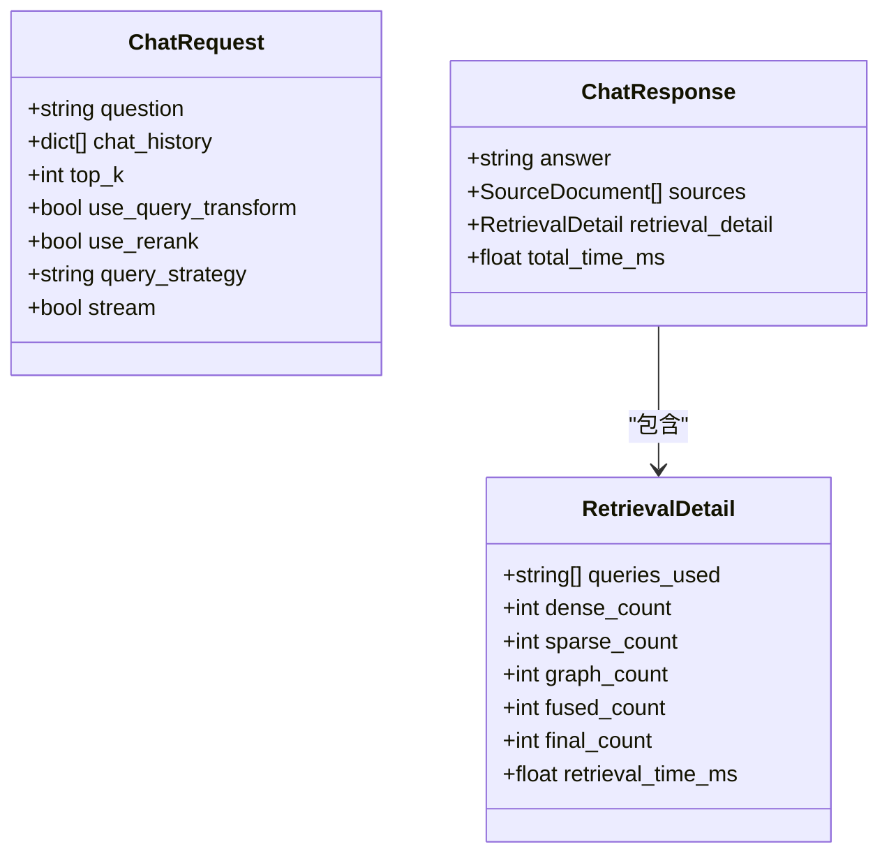
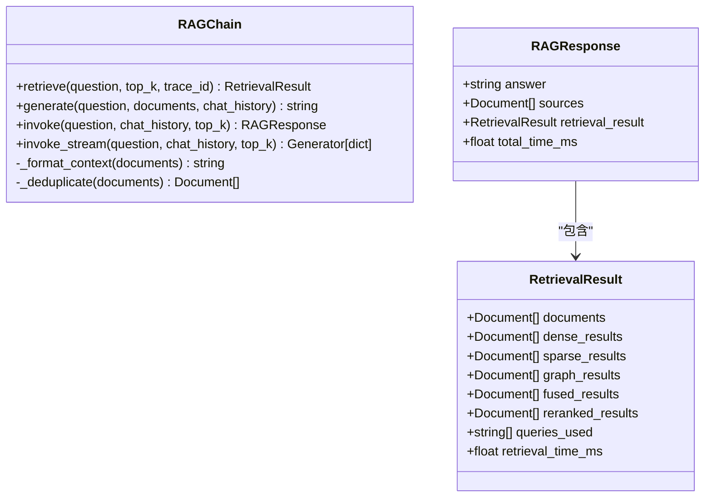
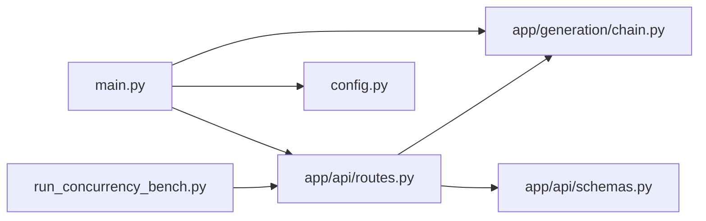

# 性能测试与基准测试

<cite>
**本文引用的文件**   
- [run_concurrency_bench.py](file://run_concurrency_bench.py)
- [main.py](file://main.py)
- [config.py](file://config.py)
- [app/api/routes.py](file://app/api/routes.py)
- [app/generation/chain.py](file://app/generation/chain.py)
- [app/api/schemas.py](file://app/api/schemas.py)
- [tests/test_api.py](file://tests/test_api.py)
</cite>

## 目录
1. [简介](#简介)
2. [项目结构](#项目结构)
3. [核心组件](#核心组件)
4. [架构总览](#架构总览)
5. [详细组件分析](#详细组件分析)
6. [依赖关系分析](#依赖关系分析)
7. [性能考量](#性能考量)
8. [故障排查指南](#故障排查指南)
9. [结论](#结论)
10. [附录](#附录)

## 简介
本指南面向开发者，系统化说明如何对 RAG 系统进行并发性能测试与基准测试。重点包括：
- 如何使用 run_concurrency_bench.py 进行压力测试与性能基准测试
- 并发请求模拟、响应时间监控与吞吐量测量的方法
- 性能瓶颈识别与优化建议
- 负载测试场景设计、测试结果分析与性能报告生成
- 结合系统可观测性与评估工具，形成完整的性能工程实践

## 项目结构
本项目采用分层组织方式：
- API 层：FastAPI 路由定义与数据模型
- 业务层：RAGChain 编排检索与生成流程
- 配置层：统一环境变量与默认值管理
- 入口与运行：应用启动与生命周期管理
- 评测脚本：并发性能评测与质量评估

图表来源
- [main.py:1-83](file://main.py#L1-L83)
- [config.py:1-58](file://config.py#L1-L58)
- [app/api/routes.py:1-563](file://app/api/routes.py#L1-L563)
- [app/api/schemas.py:1-106](file://app/api/schemas.py#L1-L106)
- [app/generation/chain.py:1-377](file://app/generation/chain.py#L1-L377)
- [run_concurrency_bench.py:1-315](file://run_concurrency_bench.py#L1-L315)
- [tests/test_api.py:1-59](file://tests/test_api.py#L1-L59)

章节来源
- [main.py:1-83](file://main.py#L1-L83)
- [config.py:1-58](file://config.py#L1-L58)
- [app/api/routes.py:1-563](file://app/api/routes.py#L1-L563)
- [app/api/schemas.py:1-106](file://app/api/schemas.py#L1-L106)
- [app/generation/chain.py:1-377](file://app/generation/chain.py#L1-L377)
- [run_concurrency_bench.py:1-315](file://run_concurrency_bench.py#L1-L315)
- [tests/test_api.py:1-59](file://tests/test_api.py#L1-L59)

## 核心组件
- 并发评测脚本（run_concurrency_bench.py）
  - 使用 asyncio + httpx 异步并发发送请求
  - 支持多并发级别与固定请求数，统计 QPS、延迟分布（P50/P95/P99）、错误率
  - 自动健康检查、预热、结果汇总与报告输出
- API 服务（main.py + routes.py）
  - FastAPI 应用，提供 /api/chat 等接口
  - 通过 lifespan 初始化 RAGChain，构建索引并注册路由
  - 返回包含检索耗时与总耗时的结构化响应
- RAG 管道（app/generation/chain.py）
  - 查询改写 → 多路召回（Dense/Sparse/Graph）→ RRF 融合 → Rerank → LLM 生成
  - 记录各阶段 Trace，便于定位瓶颈
- 配置（config.py）
  - 集中管理 OpenAI、Embedding、ChromaDB、检索参数、服务器端口等
- 数据模型（app/api/schemas.py）
  - 定义 ChatRequest/ChatResponse 等 Pydantic 模型，约束输入输出

章节来源
- [run_concurrency_bench.py:1-315](file://run_concurrency_bench.py#L1-L315)
- [main.py:1-83](file://main.py#L1-L83)
- [app/api/routes.py:1-563](file://app/api/routes.py#L1-L563)
- [app/generation/chain.py:1-377](file://app/generation/chain.py#L1-L377)
- [config.py:1-58](file://config.py#L1-L58)
- [app/api/schemas.py:1-106](file://app/api/schemas.py#L1-L106)

## 架构总览
下图展示了从评测脚本到服务端处理的关键调用链路与数据流。

图表来源
- [run_concurrency_bench.py:79-197](file://run_concurrency_bench.py#L79-L197)
- [app/api/routes.py:47-71](file://app/api/routes.py#L47-L71)
- [app/generation/chain.py:272-312](file://app/generation/chain.py#L272-L312)
- [app/api/schemas.py:9-50](file://app/api/schemas.py#L9-L50)

## 详细组件分析

### 并发评测脚本（run_concurrency_bench.py）
- 并发控制
  - 使用 asyncio.Semaphore 限制并发度，按 CONCURRENCY_LEVELS 逐档执行
  - 每个并发级别发送 REQUESTS_PER_LEVEL 个请求，问题集循环复用
- 指标采集
  - 单次请求：成功标志、总耗时、状态码、错误信息
  - 服务端指标：retrieval_time_ms、total_time_ms
  - 聚合指标：QPS、平均/分位延迟、错误率、检索与生成占比
- 报告输出
  - 控制台表格打印
  - 保存 data/concurrency_report.json，包含配置、结果与评级

图表来源
- [run_concurrency_bench.py:200-315](file://run_concurrency_bench.py#L200-L315)
- [run_concurrency_bench.py:126-197](file://run_concurrency_bench.py#L126-L197)

章节来源
- [run_concurrency_bench.py:1-315](file://run_concurrency_bench.py#L1-L315)

### API 路由与数据模型（routes.py + schemas.py）
- /api/chat
  - 非流式：调用 RAGChain.invoke，返回 ChatResponse，包含检索详情与总耗时
  - 流式：EventSourceResponse 推送检索阶段与 token 流
- 数据模型
  - ChatRequest：问题、对话历史、top_k、开关项、流式标志
  - ChatResponse：回答、来源、检索详情、总耗时
  - RetrievalDetail：各阶段计数与检索耗时

图表来源
- [app/api/schemas.py:9-50](file://app/api/schemas.py#L9-L50)
- [app/api/routes.py:47-71](file://app/api/routes.py#L47-L71)

章节来源
- [app/api/routes.py:1-563](file://app/api/routes.py#L1-L563)
- [app/api/schemas.py:1-106](file://app/api/schemas.py#L1-L106)

### RAG 管道（chain.py）
- 关键流程
  - retrieve：查询改写 → Dense/Sparse/Graph 召回 → RRF 融合 → Rerank，记录检索耗时
  - generate/invoke：组装上下文，调用 LLM 生成，记录总耗时
  - invoke_stream：流式推送检索阶段与 token，最终返回完成事件
- 可观测性
  - 通过 tracer 记录各阶段起止时间与元数据，便于瀑布图与统计

图表来源
- [app/generation/chain.py:27-47](file://app/generation/chain.py#L27-L47)
- [app/generation/chain.py:49-377](file://app/generation/chain.py#L49-L377)

章节来源
- [app/generation/chain.py:1-377](file://app/generation/chain.py#L1-L377)

### 应用入口与配置（main.py + config.py）
- main.py
  - lifespan 中初始化 RAGChain，设置全局实例，尝试构建 BM25 索引
  - 注册路由、CORS 中间件，uvicorn 启动
- config.py
  - Settings 类集中管理 API 端口、模型、检索参数、图谱开关等
  - get_settings 提供缓存的单例访问

章节来源
- [main.py:1-83](file://main.py#L1-L83)
- [config.py:1-58](file://config.py#L1-L58)

## 依赖关系分析
- 评测脚本依赖服务端 /api/chat 与 /api/health
- API 路由依赖 RAGChain 与数据模型
- RAGChain 依赖检索器、重排器、LLM 与追踪器
- 配置由 Settings 统一管理，影响所有组件行为

图表来源
- [run_concurrency_bench.py:1-315](file://run_concurrency_bench.py#L1-L315)
- [app/api/routes.py:1-563](file://app/api/routes.py#L1-L563)
- [app/generation/chain.py:1-377](file://app/generation/chain.py#L1-L377)
- [app/api/schemas.py:1-106](file://app/api/schemas.py#L1-L106)
- [main.py:1-83](file://main.py#L1-L83)
- [config.py:1-58](file://config.py#L1-L58)

## 性能考量
- 并发与吞吐
  - 使用 Semaphore 控制并发度，避免资源争用导致抖动
  - 合理设置超时与重试策略，确保稳定性
- 延迟分布
  - 关注 P50/P95/P99，长尾延迟通常来自外部 LLM 或重排推理
- 错误率
  - 网络异常、上游限流、模型不可用均会导致错误率上升
- 瓶颈定位
  - 基于检索耗时与总耗时比例判断瓶颈在检索还是生成阶段
  - 结合 Trace 瀑布图查看具体阶段耗时
- 资源与容量规划
  - 根据目标 QPS 与 P95 延迟设定并发上限与水平扩展策略
  - 对 Embedding/Rerank 与 LLM 调用进行独立扩容与缓存

## 故障排查指南
- 服务不可达
  - 确认 /api/health 可达且返回 ok
  - 检查端口与防火墙配置
- 参数校验失败
  - 空问题或缺少字段会返回 422，参考数据模型约束
- 文档上传失败
  - 仅支持 .pdf/.txt/.md/.markdown，其他格式返回 400
- 评估模块缺失
  - 若未安装评估依赖，/api/evaluate 返回 501

章节来源
- [tests/test_api.py:1-59](file://tests/test_api.py#L1-L59)
- [app/api/routes.py:121-163](file://app/api/routes.py#L121-L163)
- [app/api/routes.py:374-397](file://app/api/routes.py#L374-L397)

## 结论
通过 run_concurrency_bench.py 的并发评测与 RAGChain 的可观测性，可以系统化地测量 QPS、延迟分布与错误率，快速定位检索与生成阶段的瓶颈，并结合配置与架构调整实现性能优化。建议在 CI/CD 中集成该评测脚本，持续回归性能基线。

## 附录

### 使用方法与步骤
- 启动服务
  - 确保 OPENAI_API_KEY 已配置，运行主程序以启动 FastAPI 服务
- 运行并发评测
  - 直接执行 run_concurrency_bench.py，脚本将自动健康检查、预热、逐并发级别压测并输出报告
- 查看报告
  - 控制台表格展示关键指标
  - data/concurrency_report.json 保存完整结果与评级

章节来源
- [main.py:73-83](file://main.py#L73-L83)
- [run_concurrency_bench.py:200-315](file://run_concurrency_bench.py#L200-L315)

### 负载测试场景设计
- 基础场景
  - 单用户低并发：验证功能正确性与首包延迟
  - 中等并发：观察 P95 与错误率变化
  - 高并发：逼近系统极限，定位拐点
- 混合场景
  - 不同问题复杂度（短问/长问/跨领域）
  - 开启/关闭查询改写与重排，对比增益与开销
- 持久化与回归
  - 定期回归同一数据集，跟踪趋势
  - 变更配置后对比基线，评估优化效果

### 测试结果分析与报告生成
- 关键指标
  - QPS、P50/P95/P99、错误率、检索与生成占比
- 评级标准
  - 基于错误率与 P95 延迟给出 S/A/B/C/D 等级
- 报告内容
  - 配置摘要、各并发级别结果、综合评级、瓶颈分析
  - 保存为 JSON，便于后续可视化与归档

章节来源
- [run_concurrency_bench.py:231-315](file://run_concurrency_bench.py#L231-L315)

### 性能优化建议
- 检索阶段
  - 减少候选数量、启用缓存、优化 Embedding 与 Rerank 批处理
- 生成阶段
  - 选择更快的模型、降低温度、缩短上下文长度
- 系统层面
  - 增加 Worker 进程、分离检索与生成服务、引入消息队列削峰