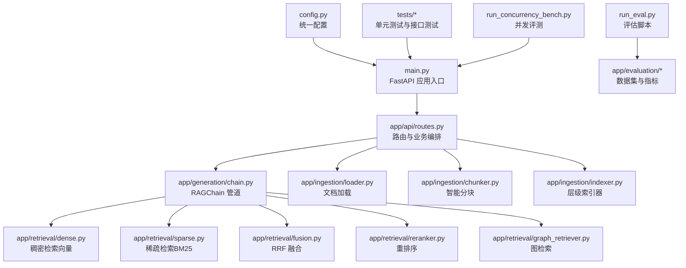
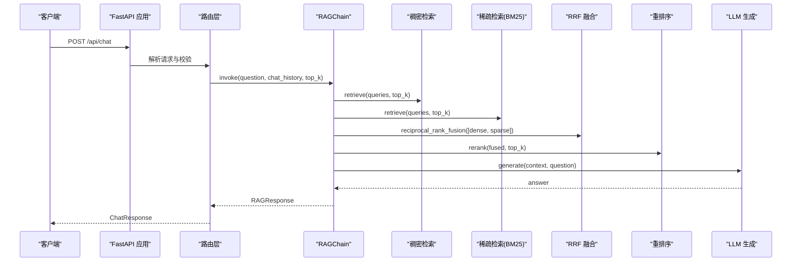
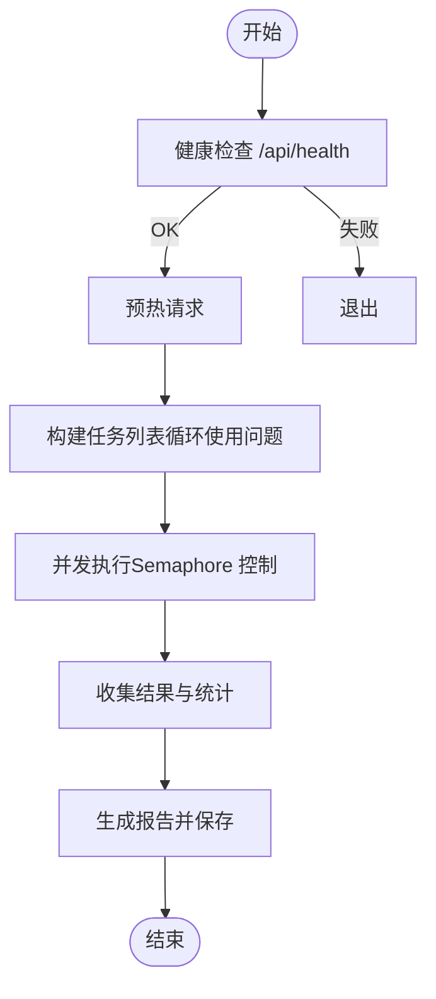
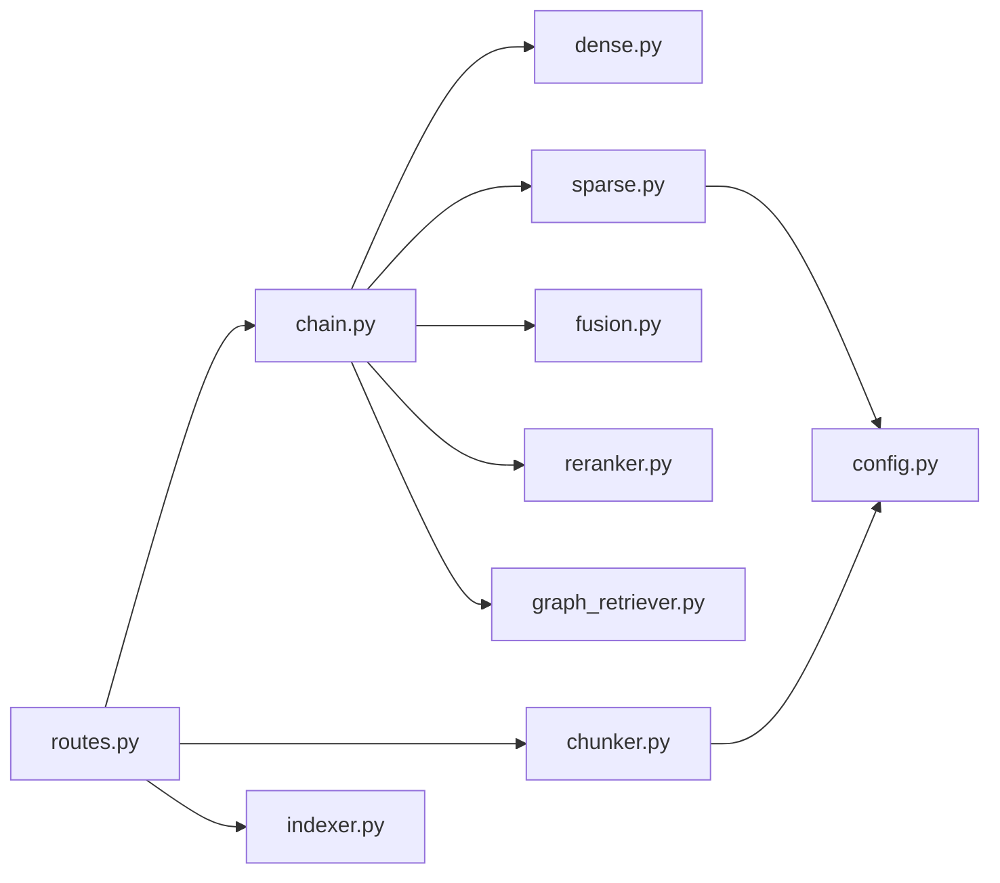

# 测试与开发

<cite>
**本文引用的文件**   
- [main.py](file://main.py)
- [config.py](file://config.py)
- [pyproject.toml](file://pyproject.toml)
- [run_concurrency_bench.py](file://run_concurrency_bench.py)
- [run_eval.py](file://run_eval.py)
- [tests/test_api.py](file://tests/test_api.py)
- [tests/test_chunker.py](file://tests/test_chunker.py)
- [tests/test_retrieval.py](file://tests/test_retrieval.py)
- [app/api/routes.py](file://app/api/routes.py)
- [app/api/schemas.py](file://app/api/schemas.py)
- [app/generation/chain.py](file://app/generation/chain.py)
- [app/ingestion/chunker.py](file://app/ingestion/chunker.py)
- [app/retrieval/fusion.py](file://app/retrieval/fusion.py)
- [app/retrieval/sparse.py](file://app/retrieval/sparse.py)
</cite>

## 目录
1. [简介](#简介)
2. [项目结构](#项目结构)
3. [核心组件](#核心组件)
4. [架构总览](#架构总览)
5. [详细组件分析](#详细组件分析)
6. [依赖关系分析](#依赖关系分析)
7. [性能考虑](#性能考虑)
8. [故障排除指南](#故障排除指南)
9. [结论](#结论)
10. [附录](#附录)

## 简介
本指南面向希望参与贡献与扩展开发的工程师，覆盖单元测试、集成测试、端到端测试、并发性能评测、评估脚本、代码质量与调试、Git 工作流与新功能开发流程等。目标是帮助你在本地快速搭建环境、编写高质量测试、执行基准评测并稳定迭代新功能。

## 项目结构
本项目采用分层组织：入口应用、API 路由与数据模型、RAG 核心链、检索与分块、评估与并发评测脚本、前端以及测试用例。

图表来源
- [main.py:1-83](file://main.py#L1-L83)
- [app/api/routes.py:1-563](file://app/api/routes.py#L1-L563)
- [app/generation/chain.py:1-377](file://app/generation/chain.py#L1-L377)
- [app/retrieval/sparse.py:1-123](file://app/retrieval/sparse.py#L1-L123)
- [app/retrieval/fusion.py:1-106](file://app/retrieval/fusion.py#L1-L106)
- [app/ingestion/chunker.py:1-157](file://app/ingestion/chunker.py#L1-L157)
- [config.py:1-58](file://config.py#L1-L58)
- [run_eval.py:1-54](file://run_eval.py#L1-L54)
- [run_concurrency_bench.py:1-315](file://run_concurrency_bench.py#L1-L315)

章节来源
- [main.py:1-83](file://main.py#L1-L83)
- [pyproject.toml:1-47](file://pyproject.toml#L1-L47)

## 核心组件
- 应用入口与生命周期管理：负责初始化 RAGChain、构建 BM25 索引、注册路由与中间件。
- API 路由层：提供对话、文档上传与列表、检索对比、追踪统计、评估、知识图谱等接口。
- RAG 核心链：串联查询改写、多路召回、RRF 融合、重排序与生成，支持同步与流式输出。
- 检索模块：稠密检索（向量）、稀疏检索（BM25）、融合策略、重排序与图检索。
- 分块与索引：递归字符分块、语义分块、层级索引器。
- 配置管理：集中化配置，环境变量优先，默认值兜底。
- 评估与评测：RAGAS 评估脚本与并发性能评测脚本。

章节来源
- [main.py:21-70](file://main.py#L21-L70)
- [app/api/routes.py:45-120](file://app/api/routes.py#L45-L120)
- [app/generation/chain.py:49-100](file://app/generation/chain.py#L49-L100)
- [app/retrieval/fusion.py:13-64](file://app/retrieval/fusion.py#L13-L64)
- [app/retrieval/sparse.py:19-48](file://app/retrieval/sparse.py#L19-L48)
- [app/ingestion/chunker.py:15-53](file://app/ingestion/chunker.py#L15-L53)
- [config.py:7-57](file://config.py#L7-L57)

## 架构总览
下图展示从客户端请求到 RAG 链路与各子系统的交互，包括健康检查、对话、文档处理、检索与生成。

图表来源
- [app/api/routes.py:47-71](file://app/api/routes.py#L47-L71)
- [app/generation/chain.py:272-312](file://app/generation/chain.py#L272-L312)
- [app/retrieval/fusion.py:13-64](file://app/retrieval/fusion.py#L13-L64)
- [app/retrieval/sparse.py:72-104](file://app/retrieval/sparse.py#L72-L104)

## 详细组件分析

### 单元测试规范与组织结构
- 测试框架与配置
  - 使用 pytest，Pythonpath 与测试路径在 pyproject.toml 中声明。
  - 可选依赖包含 pytest、pytest-asyncio、httpx。
- 测试组织方式
  - 按模块划分测试文件：接口测试、分块测试、检索测试等。
  - 每个测试类聚焦一个功能域，方法命名以 test_ 开头，断言明确且可重复。
- 关键断言要点
  - 状态码与响应体字段完整性。
  - 边界条件（空输入、缺失字段、不支持格式）。
  - 数值精度与近似比较（如分数）。
- 运行命令
  - 在项目根目录执行：pytest
  - 指定单文件或类：pytest tests/test_api.py::TestHealthEndpoint
  - 并行执行：pytest -n auto（需安装 pytest-xdist）

章节来源
- [pyproject.toml:37-47](file://pyproject.toml#L37-L47)
- [tests/test_api.py:1-59](file://tests/test_api.py#L1-L59)
- [tests/test_chunker.py:1-80](file://tests/test_chunker.py#L1-L80)
- [tests/test_retrieval.py:1-91](file://tests/test_retrieval.py#L1-L91)

#### 接口测试示例（健康检查与校验）
- 健康检查返回 ok 与版本信息。
- 空问题或缺少必填字段应返回 422。
- 文档列表接口返回 documents 与 total。
- 上传不支持格式返回 400。

章节来源
- [tests/test_api.py:15-59](file://tests/test_api.py#L15-L59)

#### 分块模块测试要点
- 基本分块：长度约束、元数据保留、chunk_id 与 position 存在。
- 短文档：不切分或仅返回一份。
- 重叠区域：相邻块内容存在重叠片段。
- 空输入：返回空列表。

章节来源
- [tests/test_chunker.py:9-80](file://tests/test_chunker.py#L9-L80)
- [app/ingestion/chunker.py:15-53](file://app/ingestion/chunker.py#L15-L53)

#### 检索模块测试要点
- RRF 融合：多路结果合并后命中度高的文档排名靠前；单路与空列表边界情况；rrf_score 写入元数据。
- 加权融合：权重影响最终排序。
- BM25 分词：英文、中文与混合文本的分词行为。

章节来源
- [tests/test_retrieval.py:10-91](file://tests/test_retrieval.py#L10-L91)
- [app/retrieval/fusion.py:13-106](file://app/retrieval/fusion.py#L13-L106)
- [app/retrieval/sparse.py:49-70](file://app/retrieval/sparse.py#L49-L70)

### 集成测试与端到端测试
- 集成测试建议
  - 使用 TestClient 对 FastAPI 进行端到端调用，覆盖完整链路（路由 -> 链 -> 检索 -> 生成）。
  - 针对上传与索引流程：上传 PDF/TXT/Markdown，验证索引成功与文档列表更新。
  - 针对检索对比接口：验证不同策略的耗时与结果数量。
- 端到端测试建议
  - 启动服务后，通过 httpx.AsyncClient 发送真实请求，模拟用户场景。
  - 结合 run_concurrency_bench.py 进行压力与稳定性验证。
  - 结合 run_eval.py 进行质量评估，输出报告至 data/eval_report.json。

章节来源
- [tests/test_api.py:1-59](file://tests/test_api.py#L1-L59)
- [app/api/routes.py:121-163](file://app/api/routes.py#L121-L163)
- [run_eval.py:13-54](file://run_eval.py#L13-L54)
- [run_concurrency_bench.py:1-315](file://run_concurrency_bench.py#L1-L315)

### 并发性能测试设计与基准执行
- 设计要点
  - 使用 asyncio + httpx 并发发送请求，控制并发级别与总请求数。
  - 记录 QPS、延迟分布（P50/P95/P99）、错误率、检索与生成阶段耗时占比。
  - 健康检查前置，确保服务可用后再压测。
- 执行流程
  - 启动服务：python main.py
  - 运行评测：python run_concurrency_bench.py
  - 查看报告：data/concurrency_report.json
- 指标解读
  - 若检索阶段占比高，优化 Embedding/Rerank 计算或缓存。
  - 若生成阶段占比高，关注 LLM API 延迟与吞吐。

图表来源
- [run_concurrency_bench.py:126-197](file://run_concurrency_bench.py#L126-L197)
- [run_concurrency_bench.py:200-315](file://run_concurrency_bench.py#L200-L315)

章节来源
- [run_concurrency_bench.py:1-315](file://run_concurrency_bench.py#L1-L315)

### 评估脚本与质量度量
- 评估流程
  - 加载评估数据集（questions 与 ground_truths）。
  - 调用 evaluate_rag 计算 faithfulness、answer_relevancy、context_precision、context_recall。
  - 打印指标与逐题详情，保存报告。
- 优秀标准参考
  - faithfulness > 0.9
  - answer_relevancy > 0.85
  - context_precision > 0.85
  - context_recall > 0.9

章节来源
- [run_eval.py:13-54](file://run_eval.py#L13-L54)

### 代码质量检查工具配置与使用
- 推荐工具
  - 静态检查：ruff、flake8、mypy（类型检查）
  - 格式化：black、isort
  - 预提交钩子：pre-commit
- 配置建议
  - 在 pyproject.toml 中添加 ruff/black/isort/mypy 配置段。
  - 在 .pre-commit-config.yaml 中注册 hooks，提交前自动检查与格式化。
  - CI 流水线中加入 lint 与 type-check 步骤。
- 使用方式
  - 本地运行：ruff check .、black --check .、mypy .
  - 提交前自动修复：pre-commit run --all-files

[本节为通用指导，未直接分析具体配置文件，故无“章节来源”]

### 开发环境搭建与调试技巧
- 环境准备
  - Python >= 3.11，建议使用 uv 或 venv 创建虚拟环境。
  - 安装依赖：uv pip install -e ".[dev]" 或 pip install -e ".[dev]"
  - 复制并填写 .env（OPENAI_API_KEY 等），或通过环境变量注入。
- 启动服务
  - python main.py（默认 host=0.0.0.0, port=8000）
  - 访问 OpenAPI 文档：http://localhost:8000/docs
- 调试技巧
  - 日志：logging.basicConfig(level=logging.INFO)，观察初始化与检索耗时。
  - 追踪：启用 LangSmith 或内置 tracer，查看各阶段耗时与 Trace。
  - 热重载：uvicorn 的 reload=True（开发模式）。
  - 断点调试：在路由与链的关键位置设置断点，逐步排查。

章节来源
- [main.py:14-18](file://main.py#L14-L18)
- [main.py:73-83](file://main.py#L73-L83)
- [config.py:7-57](file://config.py#L7-L57)

### Git 工作流与代码提交规范
- 分支策略
  - main：稳定发布分支
  - develop：集成开发分支
  - feature/*：新功能分支
  - fix/*：缺陷修复分支
  - release/*：发布候选分支
- 提交流程
  - 基于最新 develop 拉取 feature 分支
  - 小步提交，commit message 遵循约定式提交（feat/fix/docs/chore）
  - 提交前运行 lint、format、type-check 与测试
  - 发起 MR/PR，至少一名 reviewer 通过后合并
- 标签与版本
  - 使用语义化版本号（vX.Y.Z）
  - 发布前更新 CHANGELOG 与 README

[本节为通用指导，未直接分析具体仓库配置，故无“章节来源”]

### 新功能开发完整流程（需求到实现）
- 需求分析与设计
  - 明确目标与验收标准，识别依赖与风险
  - 设计接口与数据结构（Pydantic Schema）
- 原型与最小可行实现
  - 在 feature 分支实现核心逻辑，补充单元测试
  - 编写集成测试，覆盖关键路径
- 评审与重构
  - 代码审查，关注可读性、健壮性与性能
  - 补充文档与示例
- 测试与回归
  - 全量测试通过，必要时增加性能与评估用例
- 发布与监控
  - 打标签并发布，监控线上指标与错误率

[本节为通用指导，未直接分析具体文件，故无“章节来源”]

## 依赖关系分析
- 外部依赖
  - LangChain 生态、ChromaDB、rank-bm25、sentence-transformers、FastAPI、uvicorn、streamlit、ragas、datasets、pypdf、pydantic-settings、networkx 等。
- 内部依赖
  - routes 依赖 chain、indexer、chunker、retrieval 模块
  - chain 依赖 dense/sparse/fusion/reranker/query_transform/graph_retriever
  - chunker 依赖 RecursiveCharacterTextSplitter 与配置
  - sparse retriever 依赖 jieba 与 BM25Okapi

图表来源
- [app/api/routes.py:1-563](file://app/api/routes.py#L1-L563)
- [app/generation/chain.py:1-377](file://app/generation/chain.py#L1-L377)
- [app/retrieval/sparse.py:1-123](file://app/retrieval/sparse.py#L1-L123)
- [app/retrieval/fusion.py:1-106](file://app/retrieval/fusion.py#L1-L106)
- [app/ingestion/chunker.py:1-157](file://app/ingestion/chunker.py#L1-L157)
- [config.py:1-58](file://config.py#L1-L58)

章节来源
- [pyproject.toml:1-47](file://pyproject.toml#L1-L47)

## 性能考虑
- 检索阶段优化
  - 调整 top_k 与 rerank_top_n，平衡召回与开销
  - 缓存热门查询结果（Redis）
  - 增量索引更新，避免全量重建
- 生成阶段优化
  - 选择合适模型与 base_url，降低延迟
  - 流式输出提升用户体验
- 并发与资源
  - 合理设置并发级别与超时
  - 监控 GPU/CPU 与内存占用，避免 OOM

[本节为通用指导，未直接分析具体文件，故无“章节来源”]

## 故障排除指南
- OPENAI_API_KEY 未配置
  - 现象：启动时报错提示缺少 API Key
  - 解决：复制 .env.example 为 .env 并填入 key
- BM25 索引构建跳过
  - 现象：启动时警告索引构建失败
  - 解决：确认已索引文档存在，或手动触发构建
- 上传文件格式不支持
  - 现象：返回 400，提示不支持格式
  - 解决：上传 .pdf/.txt/.md/.markdown
- 评估模块依赖未安装
  - 现象：评估接口返回 501
  - 解决：安装 ragas 与 datasets 依赖
- 检索为空或结果为空
  - 现象：返回空列表
  - 解决：检查索引是否构建完成，确认分词与查询匹配

章节来源
- [main.py:27-46](file://main.py#L27-L46)
- [app/api/routes.py:132-136](file://app/api/routes.py#L132-L136)
- [app/api/routes.py:393-397](file://app/api/routes.py#L393-L397)
- [app/retrieval/sparse.py:83-88](file://app/retrieval/sparse.py#L83-L88)

## 结论
通过清晰的测试规范、完善的集成与端到端测试、科学的并发评测与评估流程，配合良好的代码质量与调试实践，开发者可以高效地参与贡献与扩展开发。建议在持续集成中固化这些流程，确保每次变更都具备可观测性与可回滚能力。

## 附录
- 常用命令
  - 安装依赖：uv pip install -e ".[dev]"
  - 运行测试：pytest
  - 启动服务：python main.py
  - 运行评估：python run_eval.py
  - 运行并发评测：python run_concurrency_bench.py
- 关键路径
  - 路由定义：app/api/routes.py
  - 数据模型：app/api/schemas.py
  - RAG 链：app/generation/chain.py
  - 分块：app/ingestion/chunker.py
  - 稀疏检索：app/retrieval/sparse.py
  - 融合策略：app/retrieval/fusion.py
  - 配置：config.py

章节来源
- [app/api/routes.py:1-563](file://app/api/routes.py#L1-L563)
- [app/api/schemas.py:1-106](file://app/api/schemas.py#L1-L106)
- [app/generation/chain.py:1-377](file://app/generation/chain.py#L1-L377)
- [app/ingestion/chunker.py:1-157](file://app/ingestion/chunker.py#L1-L157)
- [app/retrieval/sparse.py:1-123](file://app/retrieval/sparse.py#L1-L123)
- [app/retrieval/fusion.py:1-106](file://app/retrieval/fusion.py#L1-L106)
- [config.py:1-58](file://config.py#L1-L58)