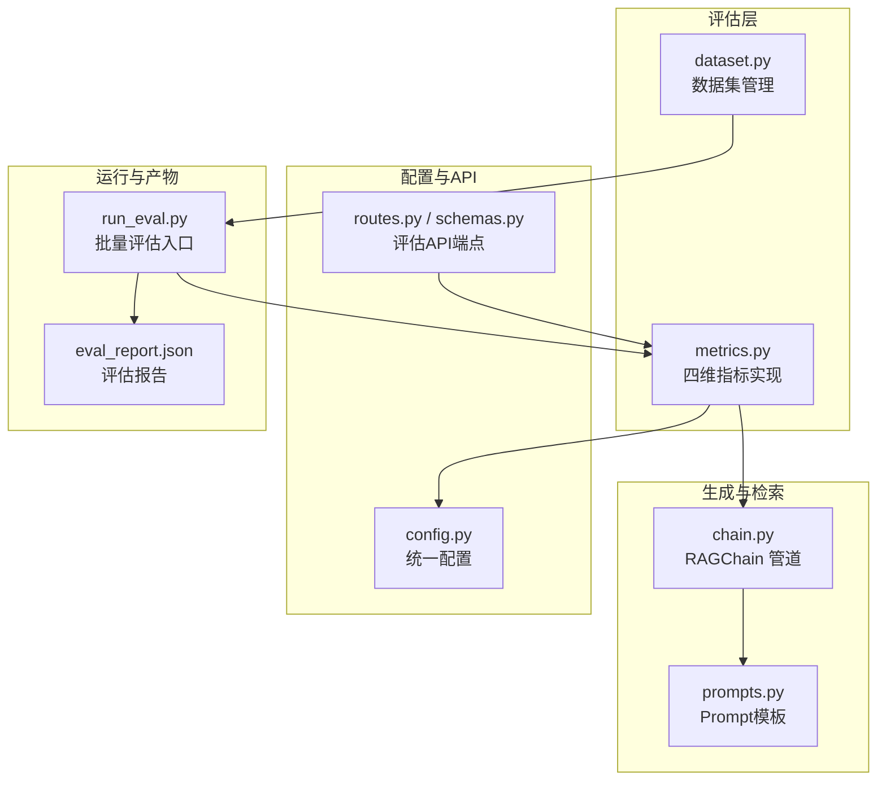
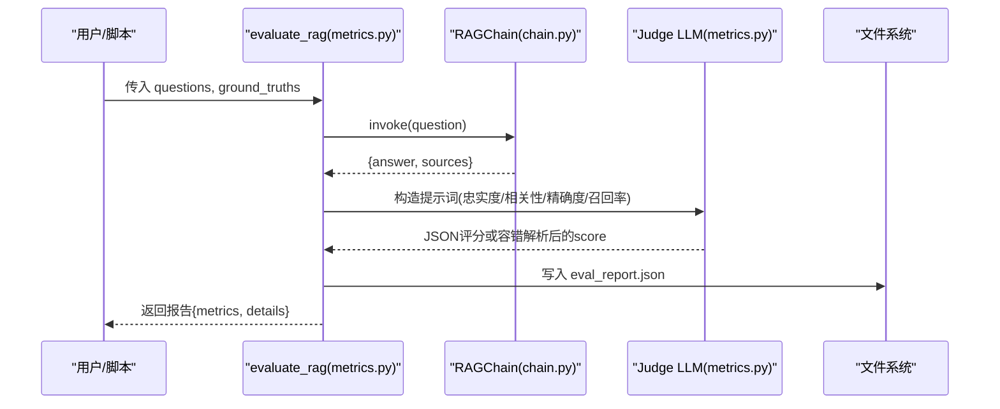
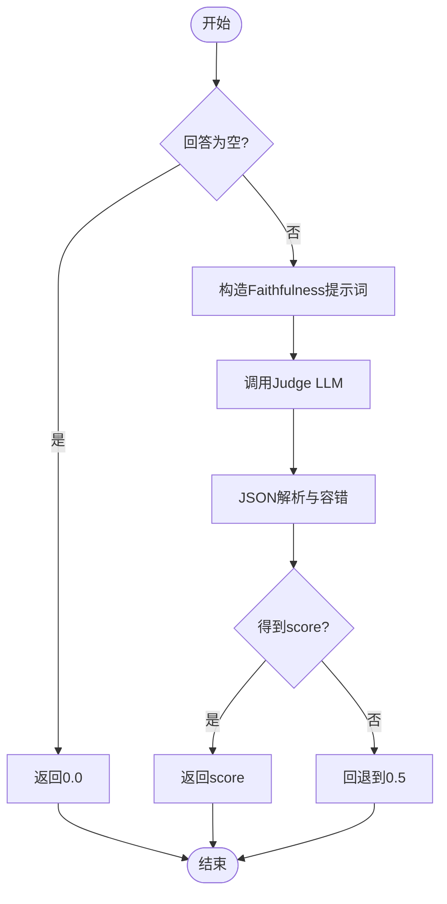
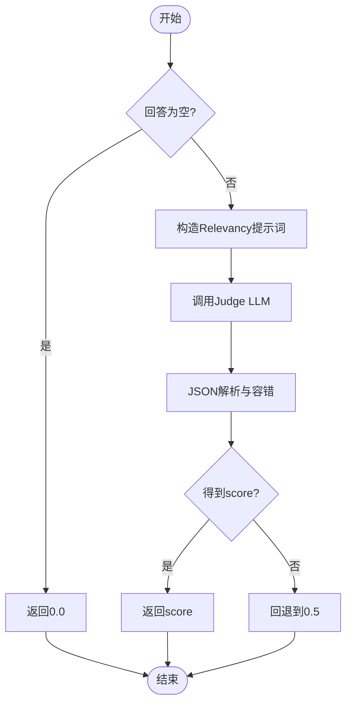
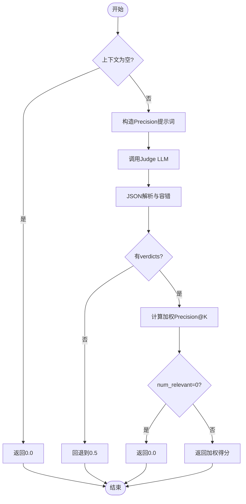
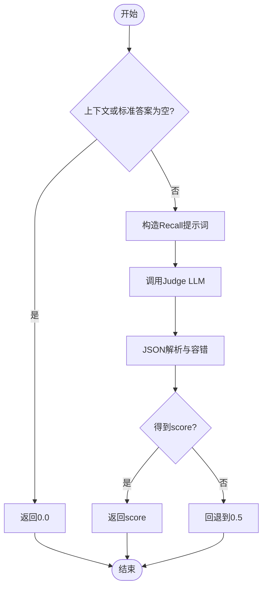
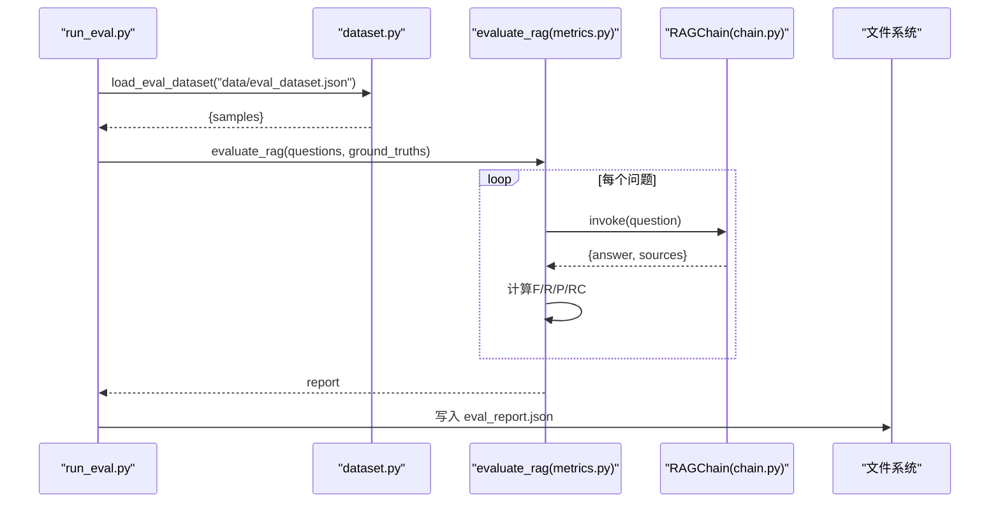
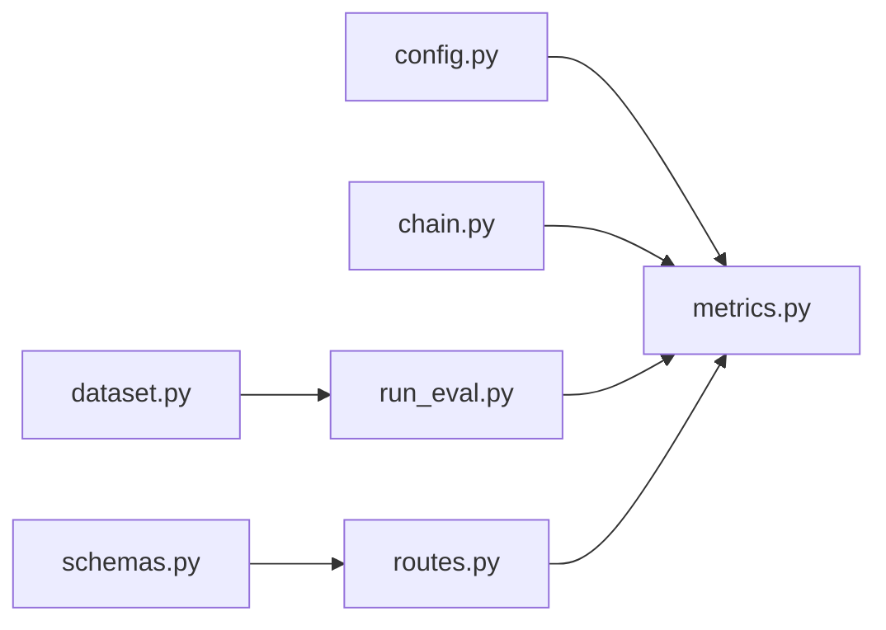

# RAGAS评估指标

<cite>
**本文引用的文件**   
- [metrics.py](file://app/evaluation/metrics.py)
- [dataset.py](file://app/evaluation/dataset.py)
- [run_eval.py](file://run_eval.py)
- [config.py](file://config.py)
- [chain.py](file://app/generation/chain.py)
- [prompts.py](file://app/generation/prompts.py)
- [routes.py](file://app/api/routes.py)
- [schemas.py](file://app/api/schemas.py)
- [eval_report.json](file://data/eval_report.json)
</cite>

## 目录
1. [引言](#引言)
2. [项目结构](#项目结构)
3. [核心组件](#核心组件)
4. [架构总览](#架构总览)
5. [详细组件分析](#详细组件分析)
6. [依赖关系分析](#依赖关系分析)
7. [性能考量](#性能考量)
8. [故障排查指南](#故障排查指南)
9. [结论](#结论)
10. [附录](#附录)

## 引言
本技术文档围绕RAGAS四维评估指标在本仓库中的自实现方案展开，重点解释以下四个指标的数学原理与计算方法：
- Faithfulness（忠实度）
- Answer Relevancy（答案相关性）
- Context Precision（上下文精确度）
- Context Recall（上下文召回率）

同时，文档深入说明LLM-as-Judge的评估机制（提示词设计、JSON解析容错、评分标准化），给出每个指标的具体实现细节（声明提取算法、相似度计算、加权评分策略）、评估数据集管理方法、测试用例编写规范、批量评估流程、结果解读与基准对比，以及自定义评估指标的开发与扩展指南。

## 项目结构
评估相关代码主要位于 app/evaluation 模块，配合运行脚本 run_eval.py 和配置 config.py，形成“数据加载—检索生成—指标评估—报告输出”的完整闭环。

图表来源
- [metrics.py:1-403](file://app/evaluation/metrics.py#L1-L403)
- [dataset.py:1-123](file://app/evaluation/dataset.py#L1-L123)
- [chain.py:1-377](file://app/generation/chain.py#L1-L377)
- [prompts.py:1-61](file://app/generation/prompts.py#L1-L61)
- [config.py:1-58](file://config.py#L1-L58)
- [routes.py:372-398](file://app/api/routes.py#L372-L398)
- [schemas.py:83-104](file://app/api/schemas.py#L83-L104)
- [run_eval.py:1-54](file://run_eval.py#L1-L54)
- [eval_report.json:1-119](file://data/eval_report.json#L1-L119)

章节来源
- [metrics.py:1-403](file://app/evaluation/metrics.py#L1-L403)
- [dataset.py:1-123](file://app/evaluation/dataset.py#L1-L123)
- [run_eval.py:1-54](file://run_eval.py#L1-L54)
- [config.py:1-58](file://config.py#L1-L58)
- [chain.py:1-377](file://app/generation/chain.py#L1-L377)
- [prompts.py:1-61](file://app/generation/prompts.py#L1-L61)
- [routes.py:372-398](file://app/api/routes.py#L372-L398)
- [schemas.py:83-104](file://app/api/schemas.py#L83-L104)
- [eval_report.json:1-119](file://data/eval_report.json#L1-L119)

## 核心组件
- 指标实现（metrics.py）
  - LLM-as-Judge 调用封装与JSON容错解析
  - 四个维度指标函数：Faithfulness、Answer Relevancy、Context Precision、Context Recall
  - 主评估函数 evaluate_rag 与快速评估 quick_evaluate
- 数据集管理（dataset.py）
  - 创建/加载/导出评估数据集
  - 示例数据集初始化
- 运行器（run_eval.py）
  - 从数据集读取问题与标准答案
  - 调用 evaluate_rag 并打印与保存报告
- 配置（config.py）
  - OpenAI/DeepSeek 客户端参数、Embedding模型、检索与重排参数等
- 生成与检索（chain.py, prompts.py）
  - RAGChain 提供检索+生成的端到端接口，供评估时直接调用
  - Prompt模板约束回答忠实性与相关性

章节来源
- [metrics.py:1-403](file://app/evaluation/metrics.py#L1-L403)
- [dataset.py:1-123](file://app/evaluation/dataset.py#L1-L123)
- [run_eval.py:1-54](file://run_eval.py#L1-L54)
- [config.py:1-58](file://config.py#L1-L58)
- [chain.py:1-377](file://app/generation/chain.py#L1-L377)
- [prompts.py:1-61](file://app/generation/prompts.py#L1-L61)

## 架构总览
评估系统以“评测驱动”的方式组织：通过数据集驱动问题与标准答案，调用RAGChain获取回答与上下文，再使用LLM-as-Judge对回答与上下文进行多维打分，最终汇总为报告。

图表来源
- [metrics.py:275-365](file://app/evaluation/metrics.py#L275-L365)
- [chain.py:272-312](file://app/generation/chain.py#L272-L312)
- [run_eval.py:13-53](file://run_eval.py#L13-L53)

## 详细组件分析

### LLM-as-Judge 机制
- 客户端与模型选择
  - 通过配置获取 openai_api_key、openai_base_url、openai_model，构建OpenAI兼容客户端用于评估。
- 提示词设计
  - 各指标均提供结构化任务描述、输入上下文、输出格式要求，强制LLM返回严格JSON，包含 score 字段（0~1）。
  - 针对Faithfulness，要求先抽取关键声明，再逐一判定是否被上下文支持；针对Answer Relevancy，强调切题与完整性；针对Context Precision，要求逐文档判定是否有帮助并按排名加权；针对Context Recall，要求将标准答案拆分为信息点并判断可归因性。
- JSON解析容错
  - 优先正则匹配最外层大括号内容，尝试直接解析；失败则修复尾部多余逗号等常见错误；若仍失败，退化为仅提取 score 数值。
- 评分标准化
  - 所有指标最终输出0~1浮点数，异常或空输入时采用默认值（如0.5或0.0），保证鲁棒性。

章节来源
- [metrics.py:19-41](file://app/evaluation/metrics.py#L19-L41)
- [metrics.py:60-82](file://app/evaluation/metrics.py#L60-L82)
- [metrics.py:87-126](file://app/evaluation/metrics.py#L87-L126)
- [metrics.py:130-168](file://app/evaluation/metrics.py#L130-L168)
- [metrics.py:173-233](file://app/evaluation/metrics.py#L173-L233)
- [metrics.py:238-270](file://app/evaluation/metrics.py#L238-L270)
- [config.py:12-16](file://config.py#L12-L16)

### Faithfulness（忠实度）
- 数学原理
  - 目标：衡量回答中事实性声明与上下文的对齐程度。
  - 计算：faithfulness = 被上下文支持的声明数量 / 总声明数量。
- 实现细节
  - 声明提取：由LLM从回答中提取关键声明列表，并为每条声明标注 supported/not_supported。
  - 评分：统计supported比例作为分数；空回答返回0.0；异常回退到0.5。
- 复杂度与性能
  - 单次评估涉及一次LLM调用；时间复杂度取决于响应长度与解析开销，空间复杂度较低。
- 优化建议
  - 可对长回答进行分段评估或限制最大声明数，减少LLM负载。

图表来源
- [metrics.py:87-126](file://app/evaluation/metrics.py#L87-L126)
- [metrics.py:60-82](file://app/evaluation/metrics.py#L60-L82)

章节来源
- [metrics.py:87-126](file://app/evaluation/metrics.py#L87-L126)

### Answer Relevancy（答案相关性）
- 数学原理
  - 目标：衡量回答与问题的语义相关性与完整性。
  - 计算：由LLM基于评分量表（0.0~1.0）直接给出score。
- 实现细节
  - 提示词明确评分标准与注意事项（如来源标注不影响评分）。
  - 空回答返回0.0；异常回退到0.5。
- 复杂度与性能
  - 单次LLM调用；适合快速评估。

图表来源
- [metrics.py:130-168](file://app/evaluation/metrics.py#L130-L168)
- [metrics.py:60-82](file://app/evaluation/metrics.py#L60-L82)

章节来源
- [metrics.py:130-168](file://app/evaluation/metrics.py#L130-L168)

### Context Precision（上下文精确度）
- 数学原理
  - 目标：衡量相关文档是否排在前面（考虑排名的加权精确度）。
  - 计算：Weighted Precision@K = sum(precision@k * rel(k)) / num_relevant，其中rel(k)表示第k个文档是否相关，precision@k为前k个中相关文档的比例。
- 实现细节
  - 提示词要求对每个检索到的文档判定relevant/not_relevant，并统计num_relevant。
  - 若未返回任何判定，回退到0.5；若无相关文档，返回0.0。
  - 按上述公式计算加权得分。
- 复杂度与性能
  - 单次LLM调用；后续为线性扫描与累加，时间复杂度O(K)。

图表来源
- [metrics.py:173-233](file://app/evaluation/metrics.py#L173-L233)
- [metrics.py:60-82](file://app/evaluation/metrics.py#L60-L82)

章节来源
- [metrics.py:173-233](file://app/evaluation/metrics.py#L173-L233)

### Context Recall（上下文召回率）
- 数学原理
  - 目标：衡量检索结果覆盖标准答案的程度。
  - 计算：recall = attributable数量 / 总信息点数量。
- 实现细节
  - 提示词要求将标准答案拆分为独立信息点，并逐一判断是否可从上下文中推导出来（attributable/not_attributable）。
  - 空上下文或空标准答案返回0.0；异常回退到0.5。
- 复杂度与性能
  - 单次LLM调用；后续为计数与除法，时间复杂度低。

图表来源
- [metrics.py:238-270](file://app/evaluation/metrics.py#L238-L270)
- [metrics.py:60-82](file://app/evaluation/metrics.py#L60-L82)

章节来源
- [metrics.py:238-270](file://app/evaluation/metrics.py#L238-L270)

### 主评估流程与批处理
- evaluate_rag
  - 初始化RAGChain（可开启query_transform与rerank以提升召回质量）。
  - 遍历问题，调用RAGChain.invoke获取回答与上下文。
  - 对每个样本依次计算四个指标，收集详情与均值。
  - 返回包含metrics、num_samples、details的报告。
- quick_evaluate
  - 快速评估模式，不依赖LLM，仅做关键词重叠率等轻量指标，便于快速验证检索质量。
- 运行器 run_eval.py
  - 加载数据集，调用evaluate_rag，打印指标与逐题详情，保存到 data/eval_report.json。

图表来源
- [run_eval.py:13-53](file://run_eval.py#L13-L53)
- [metrics.py:275-365](file://app/evaluation/metrics.py#L275-L365)
- [chain.py:272-312](file://app/generation/chain.py#L272-L312)

章节来源
- [metrics.py:275-365](file://app/evaluation/metrics.py#L275-L365)
- [run_eval.py:13-53](file://run_eval.py#L13-L53)

### 相似度计算与嵌入
- 余弦相似度
  - 实现：_cosine_similarity(a, b)，避免零向量，返回[−1,1]映射到[0,1]区间的使用场景需额外处理。
- 嵌入获取
  - _get_embeddings 通过索引器的嵌入器批量获取文本向量，供相似度计算使用。
- 注意
  - 当前指标实现主要依赖LLM-as-Judge，相似度计算可用于扩展或替代部分LLM判断逻辑。

章节来源
- [metrics.py:44-57](file://app/evaluation/metrics.py#L44-L57)

### 评估数据集管理
- create_eval_dataset
  - 构建包含version、num_samples、samples的数据集结构，支持metadata扩展，持久化到JSON。
- load_eval_dataset
  - 从默认路径或指定路径加载数据集，不存在时返回空结构。
- get_questions_and_answers
  - 便捷提取问题与标准答案列表。
- init_sample_dataset
  - 初始化示例数据集，便于快速体验。

章节来源
- [dataset.py:14-55](file://app/evaluation/dataset.py#L14-L55)
- [dataset.py:58-78](file://app/evaluation/dataset.py#L58-L78)
- [dataset.py:81-94](file://app/evaluation/dataset.py#L81-L94)
- [dataset.py:116-123](file://app/evaluation/dataset.py#L116-L123)

### 评估API与Schema
- API端点
  - POST /api/evaluate：接收questions与可选ground_truths，调用evaluate_rag并返回报告。
- Schema
  - EvalMetrics：包含四个指标字段（可选）。
  - EvalReport：包含metrics、num_samples、details。

章节来源
- [routes.py:372-398](file://app/api/routes.py#L372-L398)
- [schemas.py:83-104](file://app/api/schemas.py#L83-L104)

### 结果解读与基准对比
- 指标含义
  - Faithfulness：越高越好，反映回答忠于上下文，避免幻觉。
  - Answer Relevancy：越高越好，反映回答切题与完整。
  - Context Precision：越高越好，反映相关文档靠前。
  - Context Recall：越高越好，反映检索覆盖标准答案。
- 优秀标准（参考运行器输出）
  - faithfulness > 0.9
  - answer_relevancy > 0.85
  - context_precision > 0.85
  - context_recall > 0.9
- 实际报告样例
  - data/eval_report.json 展示了12条样本的四维指标与逐题详情，可作为基线参考。

章节来源
- [run_eval.py:33-44](file://run_eval.py#L33-L44)
- [eval_report.json:1-119](file://data/eval_report.json#L1-L119)

## 依赖关系分析
- 模块耦合
  - metrics.py 依赖 config.py（LLM与Embedding配置）、chain.py（RAGChain调用）、OpenAI客户端。
  - dataset.py 独立，负责数据IO。
  - run_eval.py 串联 dataset.py 与 metrics.py。
  - routes.py 暴露评估API，内部调用 metrics.py。
- 外部依赖
  - OpenAI兼容服务（DeepSeek/OpenAI）
  - LangChain（RAGChain、Prompt模板）
  - ChromaDB（嵌入与检索后端，通过indexer间接使用）
- 潜在循环依赖
  - 当前未见明显循环依赖；metrics.py在运行时动态导入RAGChain，降低启动期耦合。

图表来源
- [metrics.py:1-403](file://app/evaluation/metrics.py#L1-L403)
- [config.py:1-58](file://config.py#L1-L58)
- [chain.py:1-377](file://app/generation/chain.py#L1-L377)
- [dataset.py:1-123](file://app/evaluation/dataset.py#L1-L123)
- [run_eval.py:1-54](file://run_eval.py#L1-L54)
- [routes.py:372-398](file://app/api/routes.py#L372-L398)
- [schemas.py:83-104](file://app/api/schemas.py#L83-L104)

章节来源
- [metrics.py:1-403](file://app/evaluation/metrics.py#L1-L403)
- [config.py:1-58](file://config.py#L1-L58)
- [chain.py:1-377](file://app/generation/chain.py#L1-L377)
- [dataset.py:1-123](file://app/evaluation/dataset.py#L1-L123)
- [run_eval.py:1-54](file://run_eval.py#L1-L54)
- [routes.py:372-398](file://app/api/routes.py#L372-L398)
- [schemas.py:83-104](file://app/api/schemas.py#L83-L104)

## 性能考量
- LLM调用成本
  - 每个样本至少需要多次LLM调用（四指标），可通过并发或缓存提升吞吐。
- 提示词长度
  - 上下文过长会增加Token消耗与延迟，建议在Precision/Recall中对上下文截断或摘要。
- 默认值与回退
  - 异常或空输入时使用默认分（0.5或0.0），避免阻塞流水线，但可能影响统计准确性。
- 快速评估
  - quick_evaluate 提供轻量指标，适合CI快速回归。

## 故障排查指南
- JSON解析失败
  - 现象：LLM返回非标准JSON导致解析失败。
  - 处理：已内置多步容错（正则提取、修复尾部逗号、仅提取score）；若仍失败，指标回退到默认值。
- 空回答或空上下文
  - 现象：Faithfulness/Recall返回0.0；Precision无相关文档返回0.0。
  - 处理：检查RAGChain检索与生成链路，确认上下文是否有效。
- 配置缺失
  - 现象：OpenAI客户端初始化失败。
  - 处理：检查环境变量或配置文件中的openai_api_key、openai_base_url、openai_model。
- API调用失败
  - 现象：POST /api/evaluate 返回500或501。
  - 处理：确认评估模块依赖安装与网络连通性；查看日志定位具体异常。

章节来源
- [metrics.py:60-82](file://app/evaluation/metrics.py#L60-L82)
- [metrics.py:87-126](file://app/evaluation/metrics.py#L87-L126)
- [metrics.py:130-168](file://app/evaluation/metrics.py#L130-L168)
- [metrics.py:173-233](file://app/evaluation/metrics.py#L173-L233)
- [metrics.py:238-270](file://app/evaluation/metrics.py#L238-L270)
- [routes.py:372-398](file://app/api/routes.py#L372-L398)

## 结论
本仓库实现了RAGAS四维指标的自实现版本，采用LLM-as-Judge结合结构化提示词与JSON容错解析，提供了稳定且可扩展的评估能力。通过RAGChain集成检索与生成，结合数据集管理与API暴露，形成了完整的评估闭环。建议在生产环境中引入并发、缓存与上下文截断策略，以平衡评估质量与性能。

## 附录

### 自定义评估指标开发指南
- 新增指标步骤
  - 在 metrics.py 中新增评估函数，遵循现有模式：
    - 输入：question、answer、contexts、ground_truth（按需）
    - 构造提示词：明确任务、输入、输出格式（严格JSON，包含score）
    - 调用Judge LLM并解析JSON，异常回退到合理默认值
    - 在主评估函数中集成新指标，更新报告结构
- 扩展建议
  - 相似度替代：对于某些指标可用嵌入相似度（_cosine_similarity）替代LLM判断，降低成本。
  - 权重策略：借鉴Context Precision的加权思路，对不同位置的相关性赋予不同权重。
  - 批处理与缓存：对重复提示词或相似输入进行缓存，减少重复调用。
- 测试规范
  - 单元测试：覆盖空输入、异常LLM返回、边界case（超长上下文、空回答）。
  - 集成测试：通过run_eval.py执行端到端评估，校验报告结构与指标范围。
  - 回归测试：维护eval_report.json作为基线，监控指标漂移。

章节来源
- [metrics.py:1-403](file://app/evaluation/metrics.py#L1-L403)
- [run_eval.py:13-53](file://run_eval.py#L13-L53)
- [eval_report.json:1-119](file://data/eval_report.json#L1-L119)