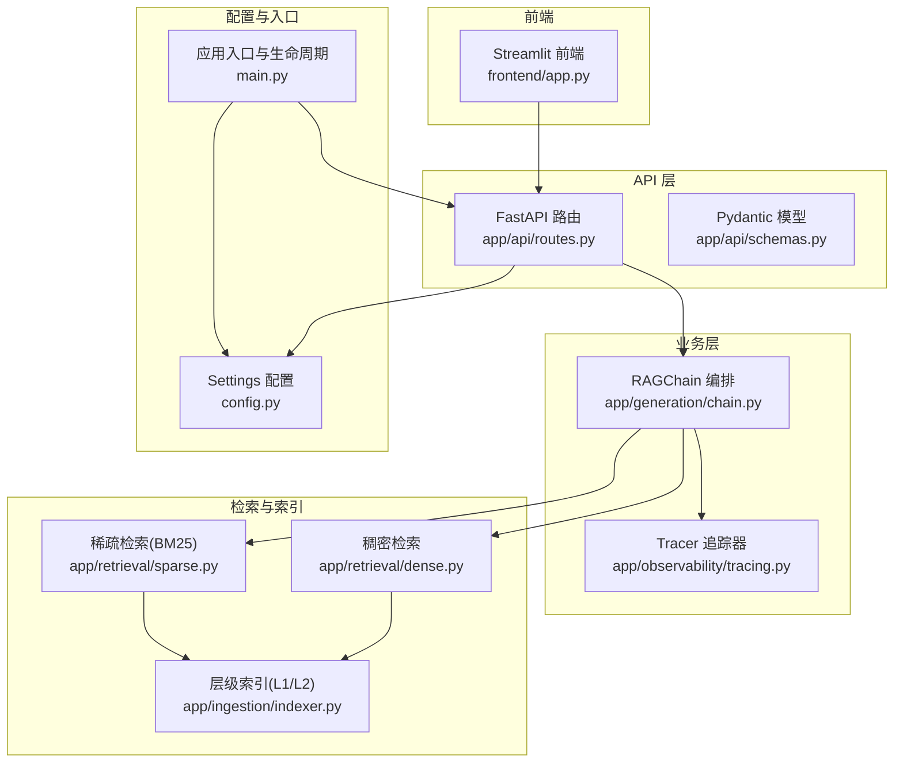
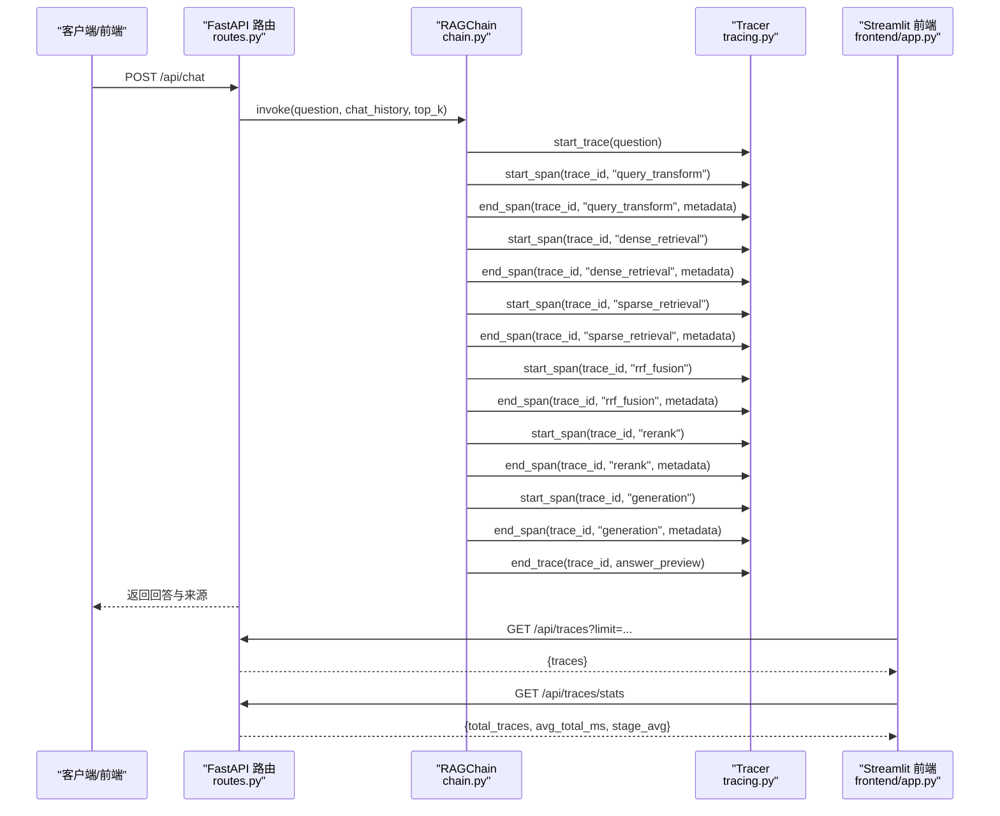
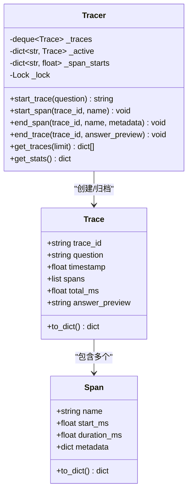
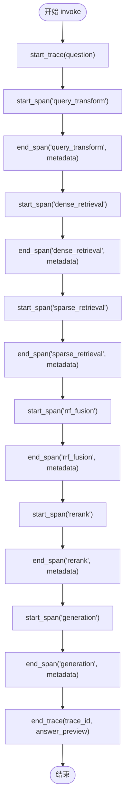
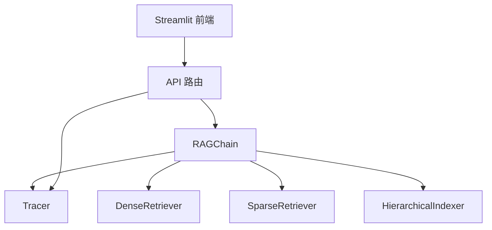

# 管道追踪系统

<cite>
**本文引用的文件**   
- [app/observability/tracing.py](file://app/observability/tracing.py)
- [app/generation/chain.py](file://app/generation/chain.py)
- [app/api/routes.py](file://app/api/routes.py)
- [frontend/app.py](file://frontend/app.py)
- [config.py](file://config.py)
- [main.py](file://main.py)
- [app/ingestion/indexer.py](file://app/ingestion/indexer.py)
- [app/retrieval/dense.py](file://app/retrieval/dense.py)
- [app/retrieval/sparse.py](file://app/retrieval/sparse.py)
</cite>

## 目录
1. [简介](#简介)
2. [项目结构](#项目结构)
3. [核心组件](#核心组件)
4. [架构总览](#架构总览)
5. [详细组件分析](#详细组件分析)
6. [依赖关系分析](#依赖关系分析)
7. [性能考量](#性能考量)
8. [故障诊断与排障指南](#故障诊断与排障指南)
9. [结论](#结论)
10. [附录](#附录)

## 简介
本技术文档聚焦于“管道追踪系统”，围绕 Tracer 类的设计与实现，系统性阐述 Span 记录机制、时间戳管理、层级关系维护；并说明从文档摄入、检索到生成各阶段的性能指标采集方式。同时给出追踪数据的存储格式与查询接口（trace_id 关联、span 树构建、时序分析）、可视化使用方法（瓶颈识别、延迟分析、资源消耗监控），以及生产部署配置、监控告警、安全与隐私保护、故障诊断和问题排查的实用技巧与工具链集成方案。

## 项目结构
仓库采用按功能域组织的分层结构：
- API 层：FastAPI 路由定义与请求响应模型
- 业务层：RAGChain 编排多路召回、融合、重排与生成
- 可观测性：内置轻量级追踪器 Tracer，提供 Trace/Span 数据收集与统计
- 前端：Streamlit 可视化界面，展示对话、对比实验、观测台、索引透视与知识图谱
- 配置：统一 Settings 管理环境变量与默认值
- 入口：应用生命周期管理与服务启动

图表来源
- [main.py:1-83](file://main.py#L1-L83)
- [app/api/routes.py:1-120](file://app/api/routes.py#L1-L120)
- [app/generation/chain.py:1-120](file://app/generation/chain.py#L1-L120)
- [app/observability/tracing.py:1-146](file://app/observability/tracing.py#L1-L146)
- [app/retrieval/dense.py:1-53](file://app/retrieval/dense.py#L1-L53)
- [app/retrieval/sparse.py:1-123](file://app/retrieval/sparse.py#L1-L123)
- [app/ingestion/indexer.py:1-120](file://app/ingestion/indexer.py#L1-L120)
- [config.py:1-58](file://config.py#L1-L58)

章节来源
- [main.py:1-83](file://main.py#L1-L83)
- [config.py:1-58](file://config.py#L1-L58)

## 核心组件
- Tracer：线程安全的轻量级追踪器，负责创建 Trace、记录 Span、计算耗时、归档最近 N 次调用并提供统计。
- RAGChain：编排完整 RAG 流程，自动在关键阶段埋点（query_transform、dense_retrieval、sparse_retrieval、rrf_fusion、rerank、generation）。
- API 路由：暴露 /api/traces 与 /api/traces/stats 等接口，供前端或外部系统获取追踪数据。
- 前端观测台：基于 Streamlit 渲染瀑布图、阶段平均耗时、最慢阶段提示等。

章节来源
- [app/observability/tracing.py:1-146](file://app/observability/tracing.py#L1-L146)
- [app/generation/chain.py:100-356](file://app/generation/chain.py#L100-L356)
- [app/api/routes.py:354-370](file://app/api/routes.py#L354-L370)
- [frontend/app.py:683-789](file://frontend/app.py#L683-L789)

## 架构总览
下图展示了从用户请求到追踪记录的端到端流程，包括 API 路由、RAGChain 编排、Tracer 埋点、前端可视化。

图表来源
- [app/api/routes.py:47-71](file://app/api/routes.py#L47-L71)
- [app/generation/chain.py:272-356](file://app/generation/chain.py#L272-L356)
- [app/observability/tracing.py:63-114](file://app/observability/tracing.py#L63-L114)
- [frontend/app.py:695-789](file://frontend/app.py#L695-L789)

## 详细组件分析

### Tracer 类设计与工作原理
- 数据结构
  - Span：记录单个阶段的 name、start_ms（相对 trace 起始偏移）、duration_ms、metadata。
  - Trace：一次完整调用的 trace_id、question、timestamp、spans、total_ms、answer_preview。
- 时间戳管理
  - 使用 time.time() 作为绝对时间基准，Span.start_ms 为相对 trace 起点的毫秒偏移，便于瀑布图绘制。
  - 通过 _span_starts 字典维护每个 span 的开始时间，key 为 "{trace_id}:{name}"。
- 层级关系维护
  - 同一 trace_id 下的多个 span 顺序追加到 Trace.spans，形成线性执行序列。
  - 当前实现未显式支持父子嵌套，但可通过 metadata 扩展以表达层级。
- 线程安全
  - 使用 threading.Lock 保护 _active、_span_starts、_traces 的并发访问。
- 存储与查询
  - 内存中 deque(maxlen=N) 保存最近 N 次 Trace，避免无限增长。
  - get_traces(limit) 返回序列化后的 traces 列表；get_stats() 汇总各阶段平均耗时。

图表来源
- [app/observability/tracing.py:11-146](file://app/observability/tracing.py#L11-L146)

章节来源
- [app/observability/tracing.py:11-146](file://app/observability/tracing.py#L11-L146)

### RAGChain 中的追踪埋点
- 埋点位置
  - query_transform：记录改写策略与生成的变体数量。
  - dense_retrieval：记录向量检索命中数。
  - sparse_retrieval：记录 BM25 检索命中数。
  - rrf_fusion：记录融合后结果数。
  - rerank：记录是否启用及最终结果数。
  - generation：记录答案长度与来源数。
- 时序与统计
  - 每次调用通过 start_trace/end_trace 包裹整个流程，计算 total_ms。
  - 各阶段通过 start_span/end_span 记录起止时间与元数据，供前端瀑布图与统计使用。

图表来源
- [app/generation/chain.py:100-356](file://app/generation/chain.py#L100-L356)
- [app/observability/tracing.py:63-114](file://app/observability/tracing.py#L63-L114)

章节来源
- [app/generation/chain.py:100-356](file://app/generation/chain.py#L100-L356)

### 追踪数据收集过程（文档摄入、检索、生成）
- 文档摄入
  - 上传文档后，后端进行加载、分块、写入层级索引（L1 摘要、L2 明细），并重建 BM25 索引。
  - 该阶段不直接参与在线请求追踪，但影响后续检索性能。
- 检索阶段
  - 稠密检索：基于向量相似度搜索 ChromaDB。
  - 稀疏检索：BM25 关键词匹配，对专有名词与术语更敏感。
  - 融合与重排：RRF 融合多路结果，Cross-Encoder 重排序提升相关性。
- 生成阶段
  - 将检索到的上下文组织为 prompt，调用 LLM 生成回答，支持流式输出。

章节来源
- [app/api/routes.py:121-163](file://app/api/routes.py#L121-L163)
- [app/ingestion/indexer.py:111-147](file://app/ingestion/indexer.py#L111-L147)
- [app/retrieval/dense.py:24-53](file://app/retrieval/dense.py#L24-L53)
- [app/retrieval/sparse.py:32-123](file://app/retrieval/sparse.py#L32-L123)
- [app/generation/chain.py:203-271](file://app/generation/chain.py#L203-L271)

### 追踪数据存储格式与查询接口
- 存储格式
  - Trace.to_dict() 输出包含 trace_id、question、timestamp、total_ms、answer_preview、spans。
  - Span.to_dict() 输出 name、start_ms、duration_ms、metadata。
- 查询接口
  - GET /api/traces?limit=20：返回最近 N 条追踪记录。
  - GET /api/traces/stats：返回 total_traces、avg_total_ms、stage_avg（各阶段平均耗时）。
- trace_id 关联
  - 前端通过多次调用接口聚合数据，结合问题文本与 answer_preview 定位具体调用。
- span 树构建
  - 当前为线性序列，如需树形结构可在 metadata 中增加 parent/span_id 字段，并在前端解析。
- 时序分析
  - 利用 start_ms 与 duration_ms 计算阶段起止时间，绘制瀑布图与阶段占比。

章节来源
- [app/observability/tracing.py:28-46](file://app/observability/tracing.py#L28-L46)
- [app/api/routes.py:356-370](file://app/api/routes.py#L356-L370)

### 可视化与使用指南
- 观测台（Streamlit）
  - 刷新按钮拉取最新追踪数据。
  - 概览指标：总调用次数、平均总耗时、最慢阶段。
  - 阶段平均耗时条形图：颜色映射不同阶段，直观显示瓶颈。
  - 最近调用记录展开查看：瀑布图、阶段图例、答案预览。
- 使用方法
  - 在「对话问答」中提问，随后进入「观测台」查看对应 Trace。
  - 点击「刷新追踪数据」更新统计与列表。
  - 根据最慢阶段与瀑布图定位性能瓶颈（如 rerank 或 generation）。

章节来源
- [frontend/app.py:683-789](file://frontend/app.py#L683-L789)

### 生产环境部署配置与监控告警
- 配置项（Settings）
  - OpenAI/DeepSeek：openai_api_key、openai_base_url、openai_model、openai_embedding_model。
  - Embedding：embedding_provider、embedding_model。
  - ChromaDB：chroma_persist_dir、chroma_chunk_collection、chroma_summary_collection。
  - Retrieval：retrieval_top_k、retrieval_rrf_k、rerank_top_n、rerank_model。
  - Chunking：chunk_size、chunk_overlap、semantic_chunk_threshold。
  - Server：api_host、api_port。
  - Graph RAG：graph_enabled、graph_max_hops、graph_max_entities、graph_persist_path。
  - LangSmith（可选）：langchain_tracing_v2、langchain_api_key、langchain_project。
- 服务启动
  - main.py 中通过 uvicorn 运行 FastAPI 应用，host/port 来自 Settings。
- 监控建议
  - 结合 /api/traces/stats 定期采集指标，设置阈值告警（如 avg_total_ms、stage_avg 某阶段超过阈值）。
  - 结合健康检查 /api/health 监控服务状态与索引文档数量。

章节来源
- [config.py:7-58](file://config.py#L7-L58)
- [main.py:73-83](file://main.py#L73-L83)
- [app/api/routes.py:504-519](file://app/api/routes.py#L504-L519)

### 安全考虑与隐私保护
- 输入截断
  - Trace.question 截取前 200 字符，answer_preview 截取前 150 字符，降低敏感信息泄露风险。
- 最小化元数据
  - Span.metadata 仅记录必要信息（如策略、计数），避免携带用户隐私或密钥。
- 本地存储
  - 追踪数据保存在进程内存中，重启后丢失，适合开发调试；生产环境建议接入持久化与脱敏。
- 外部依赖
  - 若启用 LangSmith 追踪，需确保 API Key 与 Project 名称安全配置，避免泄露。

章节来源
- [app/observability/tracing.py:63-109](file://app/observability/tracing.py#L63-L109)
- [config.py:48-52](file://config.py#L48-L52)

### 故障诊断与问题排查
- 常见问题
  - 无追踪数据：确认已在 RAGChain.invoke/invoke_stream 中调用 start_trace/end_trace。
  - 阶段缺失：检查对应 start_span/end_span 是否成对出现。
  - 前端无法连接：确认后端已启动且 CORS 允许。
- 诊断步骤
  - 查看 /api/traces/stats 是否有数据与阶段平均耗时。
  - 查看 /api/traces 最近记录，核对 question 与 answer_preview。
  - 检查日志输出（检索完成日志、错误日志）。
- 工具链集成
  - 可将 /api/traces/stats 指标接入 Prometheus/Grafana，设置告警规则。
  - 结合健康检查 /api/health 做存活探针。

章节来源
- [app/api/routes.py:356-370](file://app/api/routes.py#L356-L370)
- [app/generation/chain.py:196-201](file://app/generation/chain.py#L196-L201)
- [app/api/routes.py:504-519](file://app/api/routes.py#L504-L519)

## 依赖关系分析
- 模块耦合
  - RAGChain 依赖 Tracer、DenseRetriever、SparseRetriever、Indexer、Reranker、QueryTransformer、GraphRetriever。
  - API 路由依赖 RAGChain 与 Tracer，提供追踪数据查询接口。
  - 前端依赖 API 路由提供的追踪与对比实验接口。
- 外部依赖
  - ChromaDB 用于向量存储与检索。
  - BM25 用于稀疏检索。
  - OpenAI/DeepSeek 用于 Embedding 与 LLM 生成。

图表来源
- [app/generation/chain.py:49-99](file://app/generation/chain.py#L49-L99)
- [app/api/routes.py:1-43](file://app/api/routes.py#L1-L43)
- [frontend/app.py:200-243](file://frontend/app.py#L200-L243)

章节来源
- [app/generation/chain.py:49-99](file://app/generation/chain.py#L49-L99)
- [app/api/routes.py:1-43](file://app/api/routes.py#L1-L43)
- [frontend/app.py:200-243](file://frontend/app.py#L200-L243)

## 性能考量
- 阶段耗时分布
  - 通过 stage_avg 快速识别瓶颈阶段（如 rerank 或 generation）。
- 并发与吞吐
  - 使用异步 FastAPI 与 SSE 流式输出提升用户体验。
- 索引构建
  - BM25 索引按需构建，避免重复开销；ChromaDB 持久化减少冷启动时间。
- 优化建议
  - 调整 retrieval_top_k、rerank_top_n 平衡召回质量与耗时。
  - 针对高频查询缓存中间结果（如 queries_used）。
  - 在生产环境开启外部追踪（LangSmith）与指标采集。

[本节为通用指导，无需特定文件引用]

## 故障诊断与排障指南
- 追踪链路不完整
  - 检查 RAGChain.retrieve 与 generate 方法中的 start_span/end_span 配对。
  - 确认 end_trace 被调用，否则 Trace 不会归档。
- 前端显示异常
  - 确认 /api/traces 与 /api/traces/stats 返回正常 JSON。
  - 检查 CORS 配置与网络连通性。
- 性能退化
  - 观察 stage_avg 变化趋势，定位新增瓶颈。
  - 检查索引规模增长导致的检索耗时上升。

章节来源
- [app/generation/chain.py:100-356](file://app/generation/chain.py#L100-L356)
- [app/api/routes.py:356-370](file://app/api/routes.py#L356-L370)
- [frontend/app.py:695-789](file://frontend/app.py#L695-L789)

## 结论
本管道追踪系统以 Tracer 为核心，实现了轻量级、线程安全的 Trace/Span 记录机制，覆盖 RAG 管道的关键阶段。配合 API 与前端可视化，能够高效识别性能瓶颈、分析延迟分布与资源消耗。通过合理的配置与监控告警，可在生产环境中稳定运行并持续优化。未来可扩展子级 Span 树、持久化存储与外部追踪集成，进一步提升可观测性与运维能力。

[本节为总结，无需特定文件引用]

## 附录
- 常用接口
  - GET /api/traces?limit=20：获取最近追踪记录
  - GET /api/traces/stats：获取阶段平均耗时统计
  - GET /api/health：健康检查
- 关键配置
  - openai_api_key、openai_model、embedding_provider、chroma_persist_dir、api_host、api_port
- 可视化 Tab
  - 对话问答、对比实验、观测台、索引透视、知识图谱

章节来源
- [app/api/routes.py:356-370](file://app/api/routes.py#L356-L370)
- [app/api/routes.py:504-519](file://app/api/routes.py#L504-L519)
- [config.py:7-58](file://config.py#L7-L58)
- [frontend/app.py:559-561](file://frontend/app.py#L559-L561)