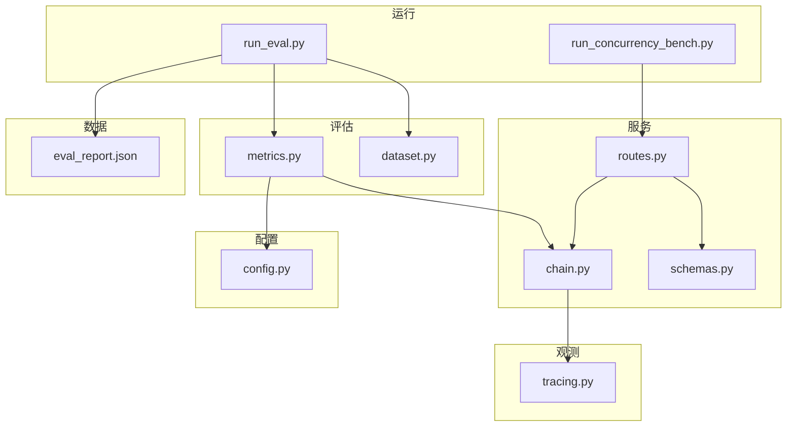
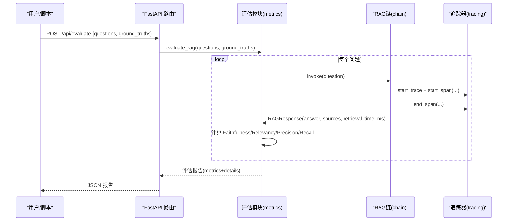
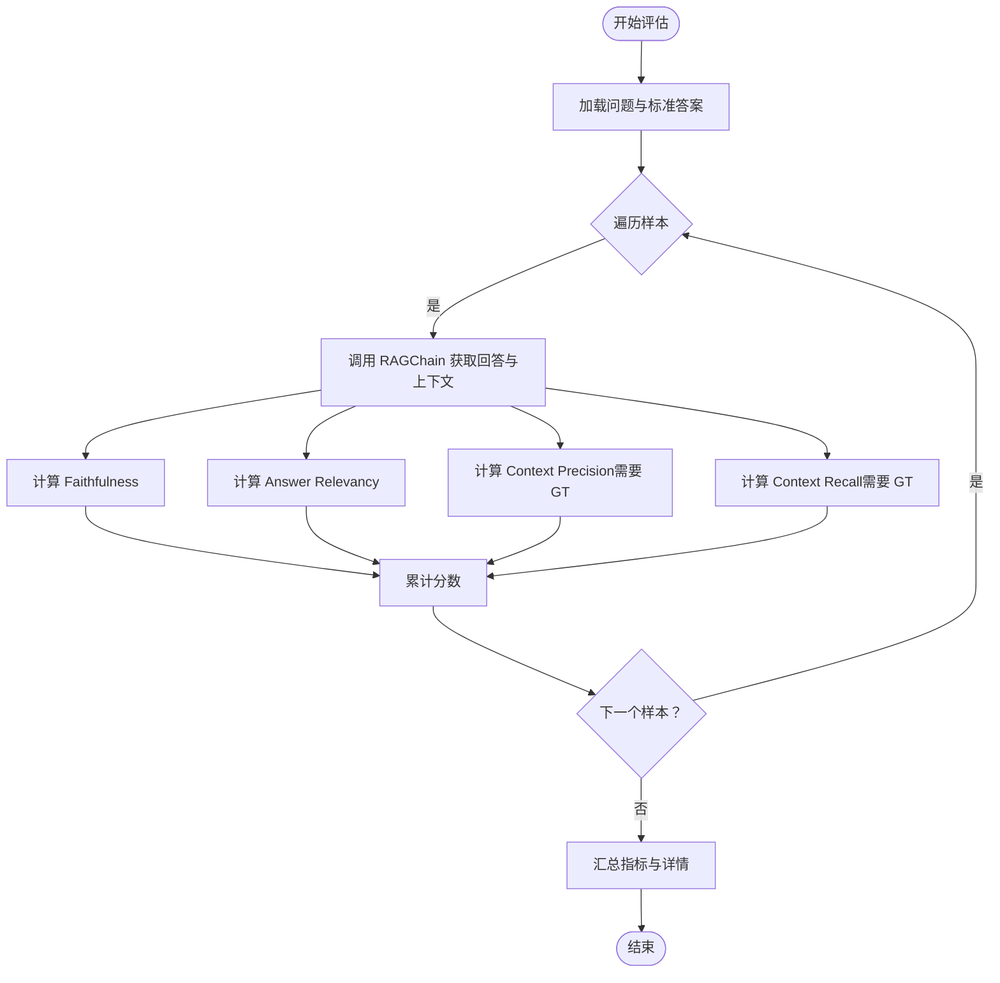
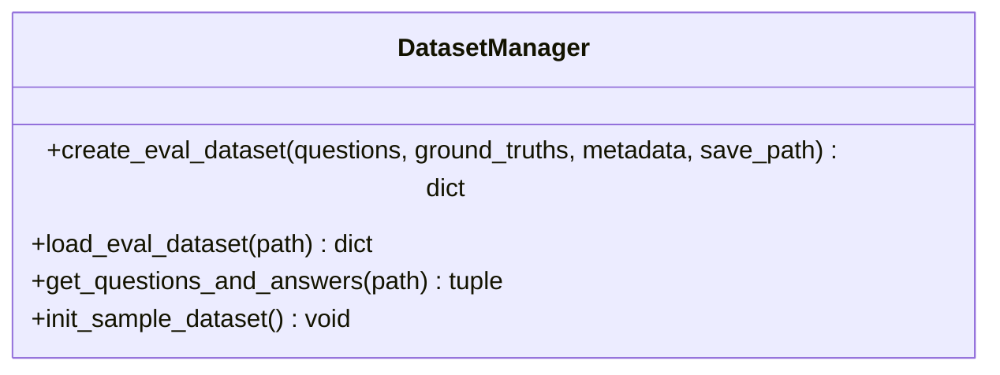
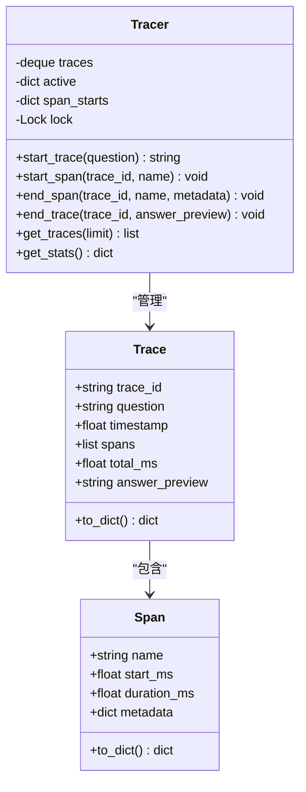
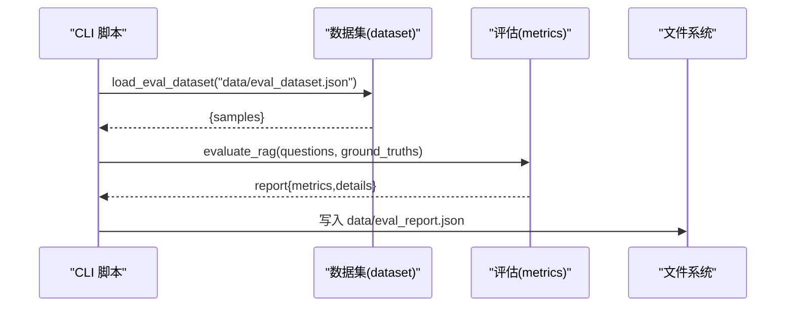
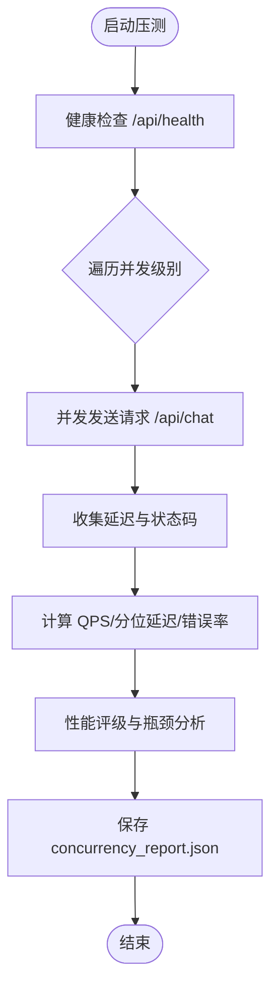
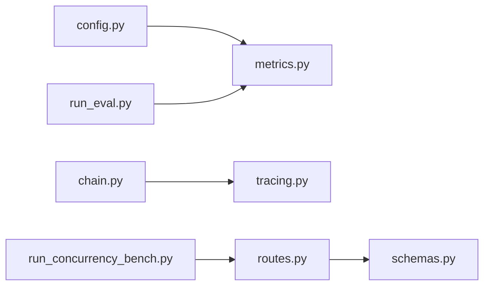

# 评估与监控

<cite>
**本文引用的文件**
- [metrics.py](file://app/evaluation/metrics.py)
- [dataset.py](file://app/evaluation/dataset.py)
- [tracing.py](file://app/observability/tracing.py)
- [chain.py](file://app/generation/chain.py)
- [routes.py](file://app/api/routes.py)
- [schemas.py](file://app/api/schemas.py)
- [config.py](file://config.py)
- [run_eval.py](file://run_eval.py)
- [run_concurrency_bench.py](file://run_concurrency_bench.py)
- [eval_report.json](file://data/eval_report.json)
</cite>

## 目录
1. [简介](#简介)
2. [项目结构](#项目结构)
3. [核心组件](#核心组件)
4. [架构总览](#架构总览)
5. [详细组件分析](#详细组件分析)
6. [依赖关系分析](#依赖关系分析)
7. [性能考量](#性能考量)
8. [故障诊断指南](#故障诊断指南)
9. [结论](#结论)
10. [附录](#附录)

## 简介
本文件面向 RAG 系统的“评估与监控”体系，系统性说明以下能力：
- RAGAS 四维指标的实现原理与计算方法（忠实度、答案相关性、上下文精确度、上下文召回率）
- 评估数据集管理与测试用例编写方法
- 管道追踪系统的工作原理（Span 记录、性能指标收集、瓶颈分析）
- 评估报告生成与可视化使用方法
- 并发性能基准与压力测试执行指南
- 监控指标解读方法与优化建议
- 生产环境监控部署与告警配置建议

## 项目结构
围绕评估与监控的关键代码分布如下：
- 评估模块：app/evaluation/metrics.py、app/evaluation/dataset.py
- 观测与追踪：app/observability/tracing.py
- 主流程集成：app/generation/chain.py、app/api/routes.py、app/api/schemas.py
- 配置管理：config.py
- 运行脚本：run_eval.py、run_concurrency_bench.py
- 示例输出：data/eval_report.json

图表来源
- [metrics.py:1-403](file://app/evaluation/metrics.py#L1-L403)
- [dataset.py:1-123](file://app/evaluation/dataset.py#L1-L123)
- [tracing.py:1-146](file://app/observability/tracing.py#L1-L146)
- [chain.py:1-377](file://app/generation/chain.py#L1-L377)
- [routes.py:1-200](file://app/api/routes.py#L1-L200)
- [schemas.py:83-104](file://app/api/schemas.py#L83-L104)
- [config.py:1-58](file://config.py#L1-L58)
- [run_eval.py:1-54](file://run_eval.py#L1-L54)
- [run_concurrency_bench.py:1-315](file://run_concurrency_bench.py#L1-L315)
- [eval_report.json:1-119](file://data/eval_report.json#L1-L119)

章节来源
- [metrics.py:1-403](file://app/evaluation/metrics.py#L1-L403)
- [dataset.py:1-123](file://app/evaluation/dataset.py#L1-L123)
- [tracing.py:1-146](file://app/observability/tracing.py#L1-L146)
- [chain.py:1-377](file://app/generation/chain.py#L1-L377)
- [routes.py:1-200](file://app/api/routes.py#L1-L200)
- [schemas.py:83-104](file://app/api/schemas.py#L83-L104)
- [config.py:1-58](file://config.py#L1-L58)
- [run_eval.py:1-54](file://run_eval.py#L1-L54)
- [run_concurrency_bench.py:1-315](file://run_concurrency_bench.py#L1-L315)
- [eval_report.json:1-119](file://data/eval_report.json#L1-L119)

## 核心组件
- 评估指标实现：基于 LLM-as-Judge 的 Faithfulness、Answer Relevancy、Context Precision、Context Recall 四个维度；同时提供快速评估接口。
- 评估数据集管理：创建、加载、导出问题与标准答案，支持元数据扩展。
- 管道追踪：轻量级分布式追踪，记录每次调用的 Span 与 Trace，提供阶段耗时统计与最近调用历史。
- 服务集成：通过 API 暴露评估与追踪查询接口，统一响应模型。
- 运行脚本：离线评估与并发压测脚本，输出结构化报告。

章节来源
- [metrics.py:1-403](file://app/evaluation/metrics.py#L1-L403)
- [dataset.py:1-123](file://app/evaluation/dataset.py#L1-L123)
- [tracing.py:1-146](file://app/observability/tracing.py#L1-L146)
- [routes.py:354-400](file://app/api/routes.py#L354-L400)
- [schemas.py:83-104](file://app/api/schemas.py#L83-L104)

## 架构总览
RAG 评估与监控的整体交互如下：
- 评估入口 run_eval.py 读取数据集并调用 evaluate_rag，内部使用 RAGChain 获取回答与检索结果，再对每个样本计算四维指标。
- 管道追踪在 RAGChain.invoke/retrieve 中自动埋点，记录各阶段耗时与元数据，并通过 /api/traces 与 /api/traces/stats 暴露。
- 前端或外部系统可通过 /api/evaluate 触发评估，返回包含指标与逐题详情的报告。

图表来源
- [routes.py:374-398](file://app/api/routes.py#L374-L398)
- [metrics.py:275-365](file://app/evaluation/metrics.py#L275-L365)
- [chain.py:272-312](file://app/generation/chain.py#L272-L312)
- [tracing.py:63-114](file://app/observability/tracing.py#L63-L114)

## 详细组件分析

### 评估指标（RAGAS 四维）
- 忠实度（Faithfulness）
  - 目标：判断回答中的关键声明是否均可从上下文中找到依据。
  - 方法：LLM 提取声明并逐一判定 supported/not_supported，按支持比例计算得分。
  - 异常处理：解析失败时记录警告并回退到默认值。
- 答案相关性（Answer Relevancy）
  - 目标：衡量回答与问题的语义相关程度。
  - 方法：LLM 直接评分，考虑切题性与完整性。
- 上下文精确度（Context Precision）
  - 目标：相关文档是否排在前面（加权精确度）。
  - 方法：LLM 判定每个检索文档是否 relevant，计算 Weighted Precision@K。
- 上下文召回率（Context Recall）
  - 目标：标准答案的信息有多少能从检索结果中找到。
  - 方法：将标准答案拆分为信息点，判定 attributable/not_attributable，按覆盖比例计算得分。
- 快速评估（quick_evaluate）
  - 仅计算不依赖 LLM 的关键词重叠率等基础指标，用于快速验证检索质量。

图表来源
- [metrics.py:85-126](file://app/evaluation/metrics.py#L85-L126)
- [metrics.py:128-169](file://app/evaluation/metrics.py#L128-L169)
- [metrics.py:171-234](file://app/evaluation/metrics.py#L171-L234)
- [metrics.py:236-271](file://app/evaluation/metrics.py#L236-L271)
- [metrics.py:275-365](file://app/evaluation/metrics.py#L275-L365)

章节来源
- [metrics.py:1-403](file://app/evaluation/metrics.py#L1-L403)

### 评估数据集管理
- 创建数据集：支持 questions、ground_truths、metadata，保存为 JSON 文件。
- 加载数据集：从默认路径或指定路径加载，不存在则返回空集。
- 便捷函数：get_questions_and_answers 直接提取问题与标准答案列表。
- 示例数据集：内置 SAMPLE_EVAL_DATA，便于快速初始化。

图表来源
- [dataset.py:14-55](file://app/evaluation/dataset.py#L14-L55)
- [dataset.py:58-78](file://app/evaluation/dataset.py#L58-L78)
- [dataset.py:81-94](file://app/evaluation/dataset.py#L81-L94)
- [dataset.py:97-123](file://app/evaluation/dataset.py#L97-L123)

章节来源
- [dataset.py:1-123](file://app/evaluation/dataset.py#L1-L123)

### 管道追踪系统（Span 与 Trace）
- Span：记录单个阶段的起止时间、相对偏移与元数据。
- Trace：一次完整调用的聚合，包含多个 Span、总耗时与回答预览。
- Tracer：线程安全，维护最近 N 次 Trace 与活跃 Trace，提供 get_traces 与 get_stats。
- 集成点：RAGChain.invoke/retrieve 在每个阶段前后调用 start_span/end_span，最终 end_trace 归档。

图表来源
- [tracing.py:11-46](file://app/observability/tracing.py#L11-L46)
- [tracing.py:49-136](file://app/observability/tracing.py#L49-L136)
- [chain.py:100-201](file://app/generation/chain.py#L100-L201)
- [chain.py:272-312](file://app/generation/chain.py#L272-L312)

章节来源
- [tracing.py:1-146](file://app/observability/tracing.py#L1-L146)
- [chain.py:1-377](file://app/generation/chain.py#L1-L377)

### 评估报告生成与可视化
- 离线评估：run_eval.py 加载 data/eval_dataset.json，调用 evaluate_rag，打印指标与逐题详情，保存到 data/eval_report.json。
- 在线评估：POST /api/evaluate 接收 questions 与可选 ground_truths，返回包含 metrics 与 details 的报告。
- 可视化：前端可拉取 /api/traces/stats 展示阶段平均耗时与最慢阶段，结合 /api/traces 查看瀑布图。

图表来源
- [run_eval.py:13-53](file://run_eval.py#L13-L53)
- [dataset.py:58-78](file://app/evaluation/dataset.py#L58-L78)
- [metrics.py:275-365](file://app/evaluation/metrics.py#L275-L365)
- [eval_report.json:1-119](file://data/eval_report.json#L1-L119)

章节来源
- [run_eval.py:1-54](file://run_eval.py#L1-L54)
- [routes.py:374-398](file://app/api/routes.py#L374-L398)
- [eval_report.json:1-119](file://data/eval_report.json#L1-L119)

### 并发性能基准与压力测试
- 脚本：run_concurrency_bench.py 使用 asyncio + httpx 模拟不同并发级别请求。
- 指标：QPS、P50/P95/P99 延迟、错误率、检索与生成阶段平均耗时占比。
- 评级：根据 P95 延迟与错误率给出 S/A/B/C/D 等级。
- 输出：data/concurrency_report.json 保存详细评测结果。

图表来源
- [run_concurrency_bench.py:126-197](file://run_concurrency_bench.py#L126-L197)
- [run_concurrency_bench.py:200-315](file://run_concurrency_bench.py#L200-L315)

章节来源
- [run_concurrency_bench.py:1-315](file://run_concurrency_bench.py#L1-L315)

## 依赖关系分析
- 评估模块依赖：
  - OpenAI 客户端（Judge LLM）与本地 Embedding 模型（用于相似度计算）
  - RAGChain（用于获取回答与检索结果）
  - 配置模块（读取模型与基地址）
- 追踪模块依赖：
  - 标准库时间与 UUID，线程锁保证并发安全
- 服务层依赖：
  - FastAPI 路由与 Pydantic 模型定义
  - SSE 流式响应（用于对话场景）

图表来源
- [metrics.py:1-403](file://app/evaluation/metrics.py#L1-L403)
- [chain.py:1-377](file://app/generation/chain.py#L1-L377)
- [routes.py:1-200](file://app/api/routes.py#L1-L200)
- [schemas.py:83-104](file://app/api/schemas.py#L83-L104)
- [config.py:1-58](file://config.py#L1-L58)
- [run_eval.py:1-54](file://run_eval.py#L1-L54)
- [run_concurrency_bench.py:1-315](file://run_concurrency_bench.py#L1-L315)

章节来源
- [metrics.py:1-403](file://app/evaluation/metrics.py#L1-L403)
- [chain.py:1-377](file://app/generation/chain.py#L1-L377)
- [routes.py:1-200](file://app/api/routes.py#L1-L200)
- [schemas.py:83-104](file://app/api/schemas.py#L83-L104)
- [config.py:1-58](file://config.py#L1-L58)
- [run_eval.py:1-54](file://run_eval.py#L1-L54)
- [run_concurrency_bench.py:1-315](file://run_concurrency_bench.py#L1-L315)

## 性能考量
- 评估指标开销
  - LLM-as-Judge 调用次数较多（每样本至少两次），需关注 Judge 模型的吞吐与延迟。
  - 上下文长度控制：Precision 与 Recall 提示中包含上下文片段，注意 token 限制与成本。
- 检索与重排
  - 多路召回与 RRF 融合会增加检索耗时；Rerank 进一步增加延迟但提升相关性。
- 追踪开销
  - Span 记录与统计为内存操作，开销较小；但大量 Trace 会占用内存，需合理设置 max_traces。
- 压测建议
  - 逐步提升并发级别，观察 P95/P99 延迟与错误率拐点。
  - 区分检索与生成阶段耗时占比，定位瓶颈（Embedding/Rerank vs LLM API）。

[本节为通用指导，无需具体文件引用]

## 故障诊断指南
- 评估失败
  - 现象：评估接口返回错误或指标异常。
  - 排查：检查 Judge LLM 配置（openai_api_key、openai_base_url、openai_model），确认网络连通与配额。
  - 参考：评估模块异常捕获与日志记录。
- 追踪缺失
  - 现象：/api/traces/stats 无数据或阶段为空。
  - 排查：确认 RAGChain 已启用追踪（默认开启），检查 start_trace/end_trace 是否成对出现。
- 压测错误率高
  - 现象：高并发下错误率上升。
  - 排查：检查服务端资源、下游 LLM 限流、连接池与超时配置；关注 P99 延迟尖峰。
- 报告不一致
  - 现象：离线评估与在线评估结果差异较大。
  - 排查：确认数据集一致、RAGChain 参数（query_transform/rerank）一致、随机性影响（temperature=0）。

章节来源
- [metrics.py:118-126](file://app/evaluation/metrics.py#L118-L126)
- [metrics.py:161-169](file://app/evaluation/metrics.py#L161-L169)
- [metrics.py:199-234](file://app/evaluation/metrics.py#L199-L234)
- [metrics.py:263-271](file://app/evaluation/metrics.py#L263-L271)
- [routes.py:374-398](file://app/api/routes.py#L374-L398)
- [tracing.py:63-114](file://app/observability/tracing.py#L63-L114)
- [run_concurrency_bench.py:200-315](file://run_concurrency_bench.py#L200-L315)

## 结论
本评估与监控体系以轻量实现替代外部依赖冲突，提供了完整的 RAG 质量评估与性能观测能力：
- 四维指标覆盖检索与生成的关键质量维度，具备鲁棒的 JSON 解析与异常回退机制。
- 追踪系统贯穿 RAG 管道，提供阶段耗时与瓶颈分析，支撑持续优化。
- 压测脚本帮助识别系统容量与稳定性边界，配合报告进行回归对比。
- 在生产环境中，建议结合日志、指标与告警策略，形成闭环的质量保障体系。

[本节为总结，无需具体文件引用]

## 附录

### 监控指标解读与优化建议
- 忠实度低
  - 可能原因：上下文不足或检索排序不佳。
  - 优化：提升召回数量、引入 Graph 检索、调整 RRF 权重或 rerank 模型。
- 答案相关性弱
  - 可能原因：Prompt 设计或问题改写策略不当。
  - 优化：改进 Prompt 模板、采用 HyDE/Multi-Query 策略。
- 上下文精确度低
  - 可能原因：无关文档排名靠前。
  - 优化：增强重排、引入交叉编码器或领域微调。
- 上下文召回率低
  - 可能原因：标准答案信息点未在检索结果中出现。
  - 优化：扩大检索范围、优化分块策略、补充知识图谱。
- 延迟偏高
  - 可能原因：LLM 调用或重排计算成为瓶颈。
  - 优化：缓存常用查询、异步并行化、降级 rerank 或减少 top_k。

[本节为通用指导，无需具体文件引用]

### 生产环境监控部署与告警配置建议
- 指标采集
  - 使用 /api/traces/stats 定期拉取阶段平均耗时与总调用数。
  - 结合应用日志与系统指标（CPU、内存、I/O）建立统一看板。
- 告警阈值
  - 错误率超过 5% 触发 P1 告警。
  - P95 延迟超过 15s 触发 P2 告警；超过 30s 触发 P1 告警。
  - 忠实度低于 0.85 或召回率低于 0.8 触发质量告警。
- 存储与保留
  - 追踪数据建议落盘或接入时序数据库，保留 7-30 天用于回溯。
- 自动化回归
  - 每日定时运行 run_eval.py 与 run_concurrency_bench.py，比较指标趋势与性能等级变化。

[本节为通用指导，无需具体文件引用]