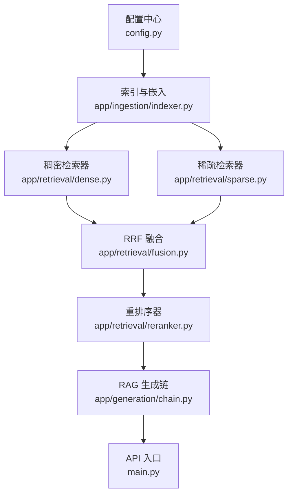
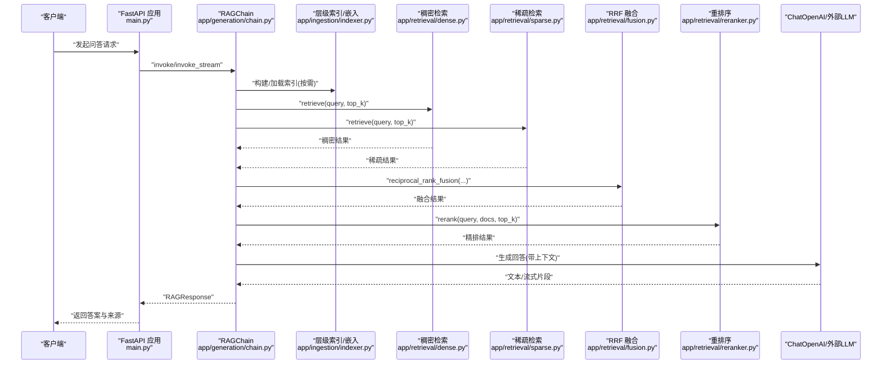
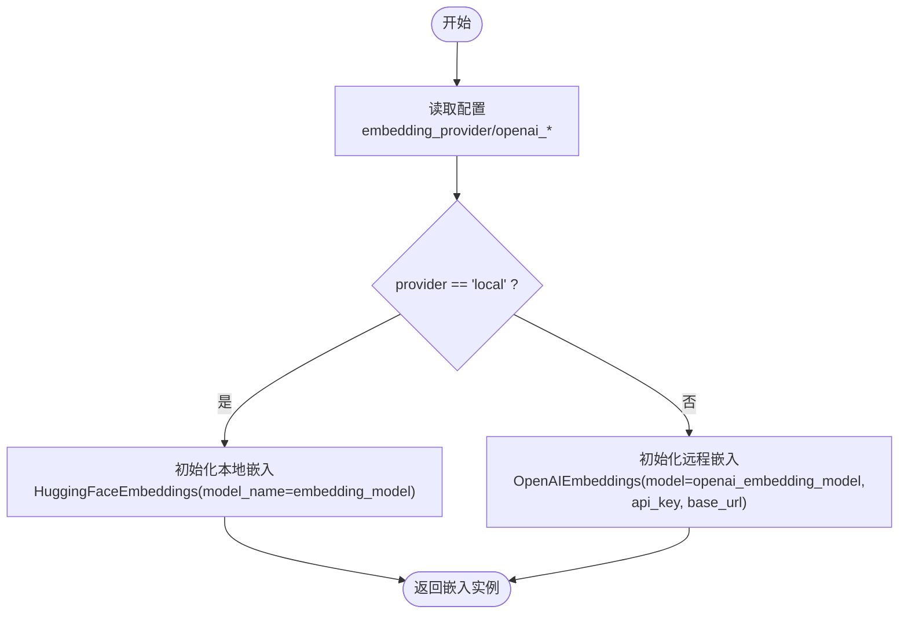
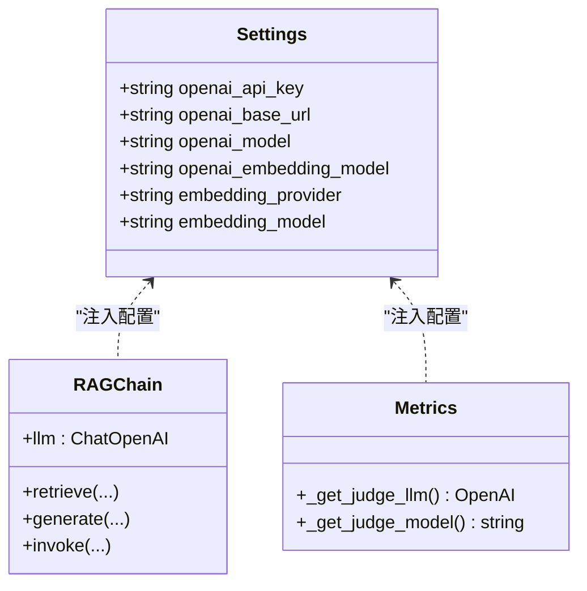
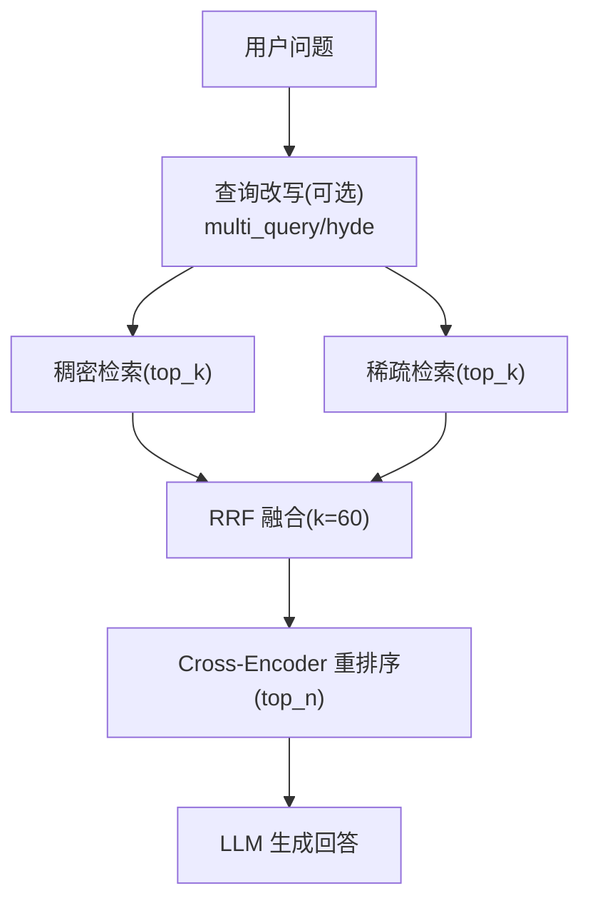
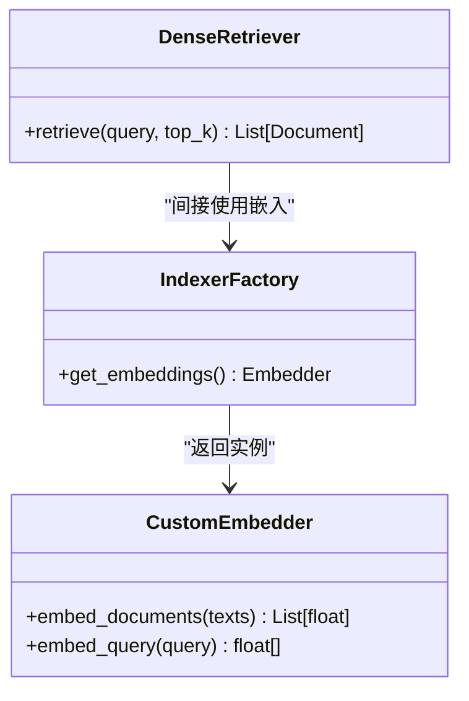
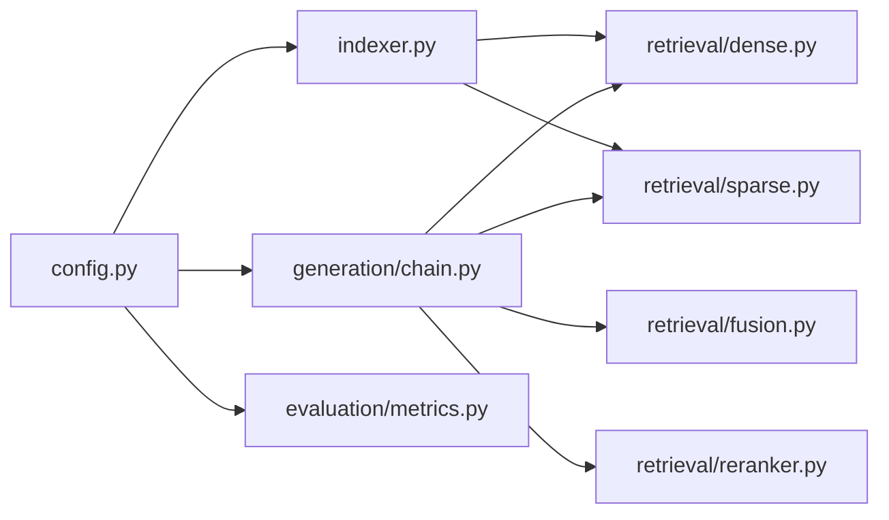

# 模型集成与切换

<cite>
**本文引用的文件**   
- [config.py](file://config.py)
- [main.py](file://main.py)
- [app/ingestion/indexer.py](file://app/ingestion/indexer.py)
- [app/generation/chain.py](file://app/generation/chain.py)
- [app/retrieval/dense.py](file://app/retrieval/dense.py)
- [app/retrieval/sparse.py](file://app/retrieval/sparse.py)
- [app/retrieval/reranker.py](file://app/retrieval/reranker.py)
- [app/retrieval/fusion.py](file://app/retrieval/fusion.py)
- [app/retrieval/query_transform.py](file://app/retrieval/query_transform.py)
- [app/evaluation/metrics.py](file://app/evaluation/metrics.py)
- [pyproject.toml](file://pyproject.toml)
</cite>

## 目录
1. [简介](#简介)
2. [项目结构](#项目结构)
3. [核心组件](#核心组件)
4. [架构总览](#架构总览)
5. [详细组件分析](#详细组件分析)
6. [依赖关系分析](#依赖关系分析)
7. [性能考虑](#性能考虑)
8. [故障排查指南](#故障排查指南)
9. [结论](#结论)
10. [附录](#附录)

## 简介
本指南聚焦于“模型集成与切换”，覆盖以下目标：
- 配置并切换不同嵌入模型提供商：本地 Sentence Transformers 与 OpenAI Embeddings。
- 详细说明 embedding_provider 参数在 local 与 openai 两种模式下的差异与使用方式。
- 说明大语言模型后端配置，支持 OpenAI 与 DeepSeek 等模型的切换（通过 base_url 与 model）。
- 提供自定义嵌入模型集成的开发指南（接口规范与实现示例路径）。
- 给出模型性能调优方法与选择建议。
- 提供多模型部署与负载均衡的配置方案（概念性指导）。

## 项目结构
本项目采用分层组织：配置集中管理、检索链路模块化、生成链统一编排。与模型集成相关的关键位置包括：
- 配置中心：统一读取环境变量与默认值，暴露 embedding_provider、openai_* 等字段。
- 索引与嵌入：根据 embedding_provider 动态选择本地或 OpenAI 的嵌入实现。
- 检索与重排：稠密检索、稀疏检索、RRF 融合、Cross-Encoder 重排序。
- 生成链：统一 LLM 实例化与调用，支持流式输出。

图表来源
- [config.py:1-58](file://config.py#L1-L58)
- [app/ingestion/indexer.py:1-48](file://app/ingestion/indexer.py#L1-L48)
- [app/retrieval/dense.py:1-53](file://app/retrieval/dense.py#L1-L53)
- [app/retrieval/sparse.py:1-123](file://app/retrieval/sparse.py#L1-L123)
- [app/retrieval/fusion.py:1-106](file://app/retrieval/fusion.py#L1-L106)
- [app/retrieval/reranker.py:1-112](file://app/retrieval/reranker.py#L1-L112)
- [app/generation/chain.py:1-377](file://app/generation/chain.py#L1-L377)
- [main.py:1-83](file://main.py#L1-L83)

章节来源
- [config.py:1-58](file://config.py#L1-L58)
- [main.py:1-83](file://main.py#L1-L83)

## 核心组件
- 配置中心 Settings
  - 关键字段：embedding_provider、embedding_model、openai_api_key、openai_base_url、openai_model、openai_embedding_model、rerank_model、retrieval_top_k、retrieval_rrf_k 等。
  - 作用：为嵌入、LLM、检索、重排等模块提供统一配置源。
- 嵌入提供者 get_embeddings()
  - 依据 embedding_provider 动态返回本地 HuggingFaceEmbeddings 或 OpenAIEmbeddings。
- 大语言模型 get_llm()/ChatOpenAI
  - 通过 openai_model 与 openai_base_url 切换不同后端（如 OpenAI、DeepSeek）。
- RAGChain
  - 组装查询改写、多路召回、RRF 融合、重排序、生成等阶段；内部持有 ChatOpenAI 实例。
- 检索器与重排器
  - DenseRetriever/SparseRetriever/Reranker/Fusion 分别负责向量检索、BM25 检索、Cross-Encoder 精排与多路融合。

章节来源
- [config.py:1-58](file://config.py#L1-L58)
- [app/ingestion/indexer.py:1-48](file://app/ingestion/indexer.py#L1-L48)
- [app/generation/chain.py:1-377](file://app/generation/chain.py#L1-L377)
- [app/retrieval/dense.py:1-53](file://app/retrieval/dense.py#L1-L53)
- [app/retrieval/sparse.py:1-123](file://app/retrieval/sparse.py#L1-L123)
- [app/retrieval/reranker.py:1-112](file://app/retrieval/reranker.py#L1-L112)
- [app/retrieval/fusion.py:1-106](file://app/retrieval/fusion.py#L1-L106)

## 架构总览
下图展示从 API 到检索与生成的端到端流程，以及模型切换点（嵌入与 LLM）的位置。

图表来源
- [main.py:1-83](file://main.py#L1-L83)
- [app/generation/chain.py:1-377](file://app/generation/chain.py#L1-L377)
- [app/ingestion/indexer.py:1-48](file://app/ingestion/indexer.py#L1-L48)
- [app/retrieval/dense.py:1-53](file://app/retrieval/dense.py#L1-L53)
- [app/retrieval/sparse.py:1-123](file://app/retrieval/sparse.py#L1-L123)
- [app/retrieval/fusion.py:1-106](file://app/retrieval/fusion.py#L1-L106)
- [app/retrieval/reranker.py:1-112](file://app/retrieval/reranker.py#L1-L112)

## 详细组件分析

### 嵌入模型集成与切换（local vs openai）
- 配置项
  - embedding_provider: "local" | "openai"
  - embedding_model: 本地模型名（如 all-MiniLM-L6-v2）
  - openai_embedding_model: OpenAI 嵌入模型名（如 text-embedding-3-small）
  - openai_api_key / openai_base_url: 用于 OpenAI 兼容后端（可指向第三方服务）
- 行为差异
  - local：使用 HuggingFaceEmbeddings，模型权重本地加载，设备与编码参数可配。
  - openai：使用 OpenAIEmbeddings，通过 api_key 与 base_url 访问远程服务。
- 关键实现位置
  - 获取嵌入实例：根据 embedding_provider 分支创建对应对象。
  - 配置来源：Settings 单例提供默认值与环境变量覆盖。

图表来源
- [config.py:1-58](file://config.py#L1-L58)
- [app/ingestion/indexer.py:1-48](file://app/ingestion/indexer.py#L1-L48)

章节来源
- [config.py:1-58](file://config.py#L1-L58)
- [app/ingestion/indexer.py:1-48](file://app/ingestion/indexer.py#L1-L48)

### 大语言模型后端切换（OpenAI / DeepSeek 等）
- 配置项
  - openai_model: 模型名称（如 gpt-4o-mini），也可替换为其他兼容模型名。
  - openai_base_url: 服务端地址（默认 OpenAI，可改为 DeepSeek 或其他兼容 OpenAI 协议的网关）。
  - openai_api_key: 鉴权密钥。
- 使用位置
  - RAGChain 内部构造 ChatOpenAI 实例。
  - 评估模块使用 OpenAI 客户端进行 Judge 推理。
  - 查询改写、图检索等也通过 ChatOpenAI 调用。
- 切换要点
  - 仅需修改 openai_base_url 与 openai_model，即可将后端切换到 DeepSeek 等兼容服务。

图表来源
- [config.py:1-58](file://config.py#L1-L58)
- [app/generation/chain.py:1-377](file://app/generation/chain.py#L1-L377)
- [app/evaluation/metrics.py:1-48](file://app/evaluation/metrics.py#L1-L48)

章节来源
- [config.py:1-58](file://config.py#L1-L58)
- [app/generation/chain.py:1-377](file://app/generation/chain.py#L1-L377)
- [app/evaluation/metrics.py:1-48](file://app/evaluation/metrics.py#L1-L48)

### 检索与重排序流水线
- 稠密检索：基于向量相似度搜索（底层由嵌入实例驱动）。
- 稀疏检索：BM25 关键词匹配，弥补专有名词与编号等精确匹配场景。
- 融合策略：RRF 融合，不依赖原始分数，仅利用排名信息。
- 重排序：Cross-Encoder 对候选进行细粒度相关性打分。

图表来源
- [app/retrieval/dense.py:1-53](file://app/retrieval/dense.py#L1-L53)
- [app/retrieval/sparse.py:1-123](file://app/retrieval/sparse.py#L1-L123)
- [app/retrieval/fusion.py:1-106](file://app/retrieval/fusion.py#L1-L106)
- [app/retrieval/reranker.py:1-112](file://app/retrieval/reranker.py#L1-L112)
- [app/retrieval/query_transform.py:47-87](file://app/retrieval/query_transform.py#L47-L87)
- [app/generation/chain.py:1-377](file://app/generation/chain.py#L1-L377)

章节来源
- [app/retrieval/dense.py:1-53](file://app/retrieval/dense.py#L1-L53)
- [app/retrieval/sparse.py:1-123](file://app/retrieval/sparse.py#L1-L123)
- [app/retrieval/fusion.py:1-106](file://app/retrieval/fusion.py#L1-L106)
- [app/retrieval/reranker.py:1-112](file://app/retrieval/reranker.py#L1-L112)
- [app/retrieval/query_transform.py:47-87](file://app/retrieval/query_transform.py#L47-L87)
- [app/generation/chain.py:1-377](file://app/generation/chain.py#L1-L377)

### 自定义嵌入模型集成指南
- 接口规范
  - 需实现一个具备 embed_documents(texts) -> List[Vector] 能力的嵌入器。
  - 若需要查询嵌入，还需 embed_query(query) -> Vector。
- 集成步骤
  - 在 get_embeddings() 中新增 provider 分支，返回你的自定义嵌入器。
  - 在 Settings 中新增 provider 枚举与对应配置项（如自定义模型名、权重路径、并发数等）。
  - 确保下游 DenseRetriever 与 HierarchicalIndexer 能透明使用该嵌入器。
- 参考实现位置
  - 嵌入工厂函数：根据 provider 分支创建具体实例。
  - 稠密检索器：直接调用索引层的 search_chunks，嵌入逻辑由索引层封装。

图表来源
- [app/ingestion/indexer.py:1-48](file://app/ingestion/indexer.py#L1-L48)
- [app/retrieval/dense.py:1-53](file://app/retrieval/dense.py#L1-L53)

章节来源
- [app/ingestion/indexer.py:1-48](file://app/ingestion/indexer.py#L1-L48)
- [app/retrieval/dense.py:1-53](file://app/retrieval/dense.py#L1-L53)

## 依赖关系分析
- 运行时依赖
  - LangChain 生态：langchain、langchain-openai、langchain-community、langchain-chroma。
  - 向量库：chromadb。
  - 检索与重排：rank-bm25、sentence-transformers。
  - 服务框架：fastapi、uvicorn、sse-starlette。
  - 前端与工具：streamlit、requests、python-dotenv、pydantic-settings。
- 关键耦合点
  - config.py 被多处引用，作为唯一配置源。
  - app/ingestion/indexer.py 同时依赖嵌入与 LLM 客户端。
  - app/generation/chain.py 聚合各检索与重排组件。

图表来源
- [config.py:1-58](file://config.py#L1-L58)
- [app/ingestion/indexer.py:1-48](file://app/ingestion/indexer.py#L1-L48)
- [app/generation/chain.py:1-377](file://app/generation/chain.py#L1-L377)
- [app/evaluation/metrics.py:1-48](file://app/evaluation/metrics.py#L1-L48)
- [app/retrieval/dense.py:1-53](file://app/retrieval/dense.py#L1-L53)
- [app/retrieval/sparse.py:1-123](file://app/retrieval/sparse.py#L1-L123)
- [app/retrieval/fusion.py:1-106](file://app/retrieval/fusion.py#L1-L106)
- [app/retrieval/reranker.py:1-112](file://app/retrieval/reranker.py#L1-L112)

章节来源
- [pyproject.toml:1-47](file://pyproject.toml#L1-L47)
- [config.py:1-58](file://config.py#L1-L58)

## 性能考虑
- 嵌入模型选择
  - 本地模型：all-MiniLM-L6-v2 轻量高效，适合 CPU 环境；如需更高精度可升级至更大模型。
  - 云端嵌入：text-embedding-3-small 精度高但受网络延迟影响。
- 检索参数
  - retrieval_top_k：控制最终返回文档数量，增大可提升召回但增加生成成本。
  - retrieval_rrf_k：RRF 平滑常数，较大时更强调跨路一致性。
  - rerank_top_n：进入重排序的候选规模，过大将增加 Cross-Encoder 计算开销。
- 重排序模型
  - cross-encoder/ms-marco-MiniLM-L-6-v2 平衡效果与速度；可按需替换为更强模型。
- 生成模型
  - 优先选择低延迟、高吞吐的模型；必要时启用流式输出以降低首字延迟。
- 资源与并发
  - 本地嵌入与重排序对 CPU/GPU 有要求，建议结合批处理与缓存优化。
  - 对外部 LLM 调用应设置超时与重试策略，避免级联失败。

[本节为通用性能建议，不直接分析具体文件]

## 故障排查指南
- 启动时报缺少 API Key
  - 现象：应用生命周期检查未配置 openai_api_key 时抛出异常。
  - 处理：复制 .env.example 为 .env，填入 OPENAI_API_KEY 及必要字段。
- 嵌入模型无法加载
  - 本地模式：确认 embedding_model 名称正确且网络可下载；CPU 模式下注意内存占用。
  - 云端模式：检查 openai_api_key 与 openai_base_url 是否正确，网络可达。
- 检索结果为空
  - 检查 BM25 索引是否构建成功；确认 ChromaDB 数据存在。
  - 调整 retrieval_top_k 与 rerank_top_n，观察召回变化。
- 生成失败或超时
  - 检查 openai_base_url 与 openai_model 是否匹配后端能力；适当降低 temperature 与 max_tokens。
  - 评估模块同样依赖 OpenAI 客户端，若评估失败请核对相同配置。

章节来源
- [main.py:21-31](file://main.py#L21-L31)
- [app/ingestion/indexer.py:15-32](file://app/ingestion/indexer.py#L15-L32)
- [app/retrieval/sparse.py:32-47](file://app/retrieval/sparse.py#L32-L47)
- [app/evaluation/metrics.py:19-25](file://app/evaluation/metrics.py#L19-L25)

## 结论
本项目通过统一的配置中心与清晰的组件边界，实现了嵌入与 LLM 后端的灵活切换。借助 embedding_provider 与 openai_base_url/openai_model，可在本地与云端之间无缝迁移；配合多路召回与重排序，兼顾召回率与准确性。建议在生产环境中结合业务需求选择合适的模型与参数，并通过监控与评估持续优化。

[本节为总结性内容，不直接分析具体文件]

## 附录

### 配置清单与说明
- 嵌入相关
  - embedding_provider: "local" | "openai"
  - embedding_model: 本地模型名
  - openai_embedding_model: 云端嵌入模型名
- LLM 相关
  - openai_api_key: 鉴权密钥
  - openai_base_url: 后端地址（可切换至 DeepSeek 等）
  - openai_model: 模型名称
- 检索与重排
  - retrieval_top_k: 最终返回文档数
  - retrieval_rrf_k: RRF 平滑常数
  - rerank_top_n: 进入重排序的候选数
  - rerank_model: Cross-Encoder 模型名
- 其他
  - chroma_persist_dir/chunk_collection/summary_collection: 向量库持久化与集合名
  - chunk_size/chunk_overlap/semantic_chunk_threshold: 分块策略
  - graph_enabled/graph_max_hops/graph_max_entities/graph_persist_path: 图检索开关与参数

章节来源
- [config.py:1-58](file://config.py#L1-L58)

### 多模型部署与负载均衡（概念性方案）
- 多实例部署
  - 将 FastAPI 服务以多进程/多副本运行，置于反向代理之后（Nginx/HAProxy/ALB）。
- 负载均衡策略
  - 轮询/加权/最少连接/一致性哈希；对长耗时生成任务建议使用会话亲和或粘性会话。
- 模型侧扩展
  - 嵌入与重排序：按 GPU/CPU 资源划分实例，按路由键（如领域/语种）分流。
  - LLM：通过 base_url 指向不同的网关或集群，结合健康检查与熔断降级。
- 观测与回滚
  - 接入日志与追踪（LangSmith 等），灰度发布与快速回滚机制。

[本节为概念性指导，不直接分析具体文件]