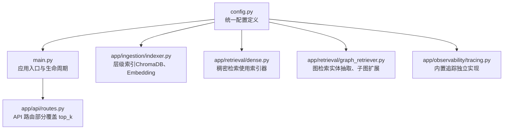
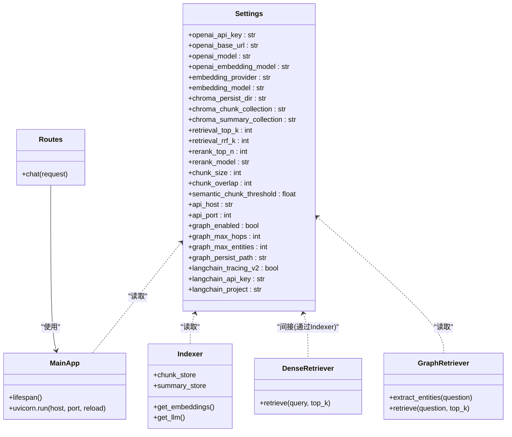

# 系统配置管理

<cite>
**本文引用的文件**
- [config.py](file://config.py)
- [main.py](file://main.py)
- [app/ingestion/indexer.py](file://app/ingestion/indexer.py)
- [app/retrieval/dense.py](file://app/retrieval/dense.py)
- [app/retrieval/graph_retriever.py](file://app/retrieval/graph_retriever.py)
- [app/observability/tracing.py](file://app/observability/tracing.py)
- [app/api/routes.py](file://app/api/routes.py)
- [pyproject.toml](file://pyproject.toml)
- [docs/architecture.md](file://docs/architecture.md)
</cite>

## 目录
1. [简介](#简介)
2. [项目结构](#项目结构)
3. [核心组件](#核心组件)
4. [架构总览](#架构总览)
5. [详细组件分析](#详细组件分析)
6. [依赖关系分析](#依赖关系分析)
7. [性能与调优建议](#性能与调优建议)
8. [故障排除指南](#故障排除指南)
9. [结论](#结论)
10. [附录：配置项清单与环境变量示例](#附录配置项清单与环境变量示例)

## 简介
本文件聚焦于系统的配置管理，围绕基于 Pydantic Settings 的统一配置机制展开，覆盖环境变量加载、默认值策略、运行时覆盖方式、热重载行为以及各模块对配置的读取路径。文档同时给出常见配置场景的最佳实践与排障要点，帮助读者在生产环境中稳定、可观测地运行 RAG 系统。

## 项目结构
配置管理集中在单一模块中，并通过单例函数对外暴露；应用启动时校验关键配置并初始化核心链路；检索、索引、图检索等子系统按需读取全局配置。

图表来源
- [config.py:1-58](file://config.py#L1-L58)
- [main.py:1-83](file://main.py#L1-L83)
- [app/ingestion/indexer.py:1-253](file://app/ingestion/indexer.py#L1-L253)
- [app/retrieval/dense.py:1-53](file://app/retrieval/dense.py#L1-L53)
- [app/retrieval/graph_retriever.py:1-312](file://app/retrieval/graph_retriever.py#L1-L312)
- [app/observability/tracing.py:1-146](file://app/observability/tracing.py#L1-L146)
- [app/api/routes.py:1-400](file://app/api/routes.py#L1-L400)

章节来源
- [config.py:1-58](file://config.py#L1-L58)
- [main.py:1-83](file://main.py#L1-L83)
- [docs/architecture.md:153-159](file://docs/architecture.md#L153-L159)

## 核心组件
- 配置类与加载策略
  - 通过 BaseSettings 声明所有配置项，并提供默认值。
  - 支持从 .env 文件加载，编码为 UTF-8。
  - 提供 lru_cache 装饰的全局单例获取函数，避免重复实例化。
- 应用启动校验
  - 在应用生命周期中检查关键 API Key 是否配置，未配置则抛出异常阻止启动。
- 运行时覆盖
  - 部分接口允许以请求参数形式覆盖默认检索数量等参数。

章节来源
- [config.py:1-58](file://config.py#L1-L58)
- [main.py:21-49](file://main.py#L21-L49)
- [app/api/routes.py:274-316](file://app/api/routes.py#L274-L316)

## 架构总览
下图展示了配置在各模块中的读取与使用关系，体现“集中定义、按需读取”的架构风格。

图表来源
- [config.py:1-58](file://config.py#L1-L58)
- [main.py:1-83](file://main.py#L1-L83)
- [app/ingestion/indexer.py:1-253](file://app/ingestion/indexer.py#L1-L253)
- [app/retrieval/dense.py:1-53](file://app/retrieval/dense.py#L1-L53)
- [app/retrieval/graph_retriever.py:1-312](file://app/retrieval/graph_retriever.py#L1-L312)
- [app/api/routes.py:1-400](file://app/api/routes.py#L1-L400)

## 详细组件分析

### 配置类与加载机制
- 加载顺序与优先级
  - 环境变量优先于 .env 文件，再回退到代码默认值。
  - .env 文件路径与编码由模型配置指定。
- 单例模式
  - 通过缓存函数返回全局唯一实例，减少重复构造开销。
- 类型安全
  - 字段均带有类型注解，便于静态检查与自动提示。

章节来源
- [config.py:1-58](file://config.py#L1-L58)
- [docs/architecture.md:153-159](file://docs/architecture.md#L153-L159)

### OpenAI / DeepSeek 相关配置
- openai_api_key：用于调用 LLM 与 Embedding 服务的鉴权密钥。
- openai_base_url：兼容 OpenAI 协议的代理或第三方服务地址。
- openai_model：生成式对话模型名称。
- openai_embedding_model：文本嵌入模型名称。

使用位置
- 生成式对话：在索引构建与图检索中创建 ChatOpenAI 实例时使用。
- 文本嵌入：根据 embedding_provider 选择本地或 OpenAI 的 Embedding 实现。

章节来源
- [app/ingestion/indexer.py:35-43](file://app/ingestion/indexer.py#L35-L43)
- [app/ingestion/indexer.py:15-32](file://app/ingestion/indexer.py#L15-L32)
- [app/retrieval/graph_retriever.py:50-61](file://app/retrieval/graph_retriever.py#L50-L61)

### 嵌入模型配置
- embedding_provider：选择本地或 OpenAI 的嵌入实现。
- embedding_model：当 provider 为 local 时生效，指定本地模型名。

使用位置
- 根据 provider 动态选择 HuggingFaceEmbeddings 或 OpenAIEmbeddings。

章节来源
- [app/ingestion/indexer.py:15-32](file://app/ingestion/indexer.py#L15-L32)

### ChromaDB 配置
- chroma_persist_dir：向量库持久化目录。
- chroma_chunk_collection：明细分块集合名。
- chroma_summary_collection：文档摘要集合名。

使用位置
- 层级索引器在创建 Chroma 客户端时传入上述配置。

章节来源
- [app/ingestion/indexer.py:89-109](file://app/ingestion/indexer.py#L89-L109)

### 检索参数
- retrieval_top_k：默认召回条数。
- retrieval_rrf_k：RRF 融合时的候选规模。
- rerank_top_n：重排后保留条数。
- rerank_model：重排模型名称。

使用位置
- API 路由中允许以请求参数覆盖 top_k；其余参数作为默认值参与流程。

章节来源
- [app/api/routes.py:274-316](file://app/api/routes.py#L274-L316)

### 分块策略
- chunk_size：递归分块大小。
- chunk_overlap：重叠长度。
- semantic_chunk_threshold：语义分块的相似度阈值。

使用位置
- 递归分块与语义分块逻辑中读取这些参数控制切分粒度与边界判定。

章节来源
- [app/ingestion/chunker.py:49-53](file://app/ingestion/chunker.py#L49-L53)
- [app/ingestion/chunker.py:56-129](file://app/ingestion/chunker.py#L56-L129)

### 服务器配置
- api_host：监听地址。
- api_port：监听端口。

使用位置
- 应用启动时通过 uvicorn 传入 host 和 port。

章节来源
- [main.py:73-83](file://main.py#L73-L83)

### 知识图谱配置
- graph_enabled：是否启用图检索能力。
- graph_max_hops：子图扩展最大跳数。
- graph_max_entities：每次查询最多抽取实体数。
- graph_persist_path：知识图谱持久化路径。

使用位置
- 图检索器初始化时读取 max_hops 与 max_entities 控制检索范围。

章节来源
- [app/retrieval/graph_retriever.py:50-61](file://app/retrieval/graph_retriever.py#L50-L61)

### LangSmith 追踪配置
- langchain_tracing_v2：是否启用 LangChain V2 追踪。
- langchain_api_key：LangSmith 访问密钥。
- langchain_project：项目标识。

说明
- 当前系统内置了轻量级追踪实现，不依赖外部服务；如需接入 LangSmith，可在后续扩展中读取上述配置进行开关与鉴权。

章节来源
- [app/observability/tracing.py:1-146](file://app/observability/tracing.py#L1-L146)

### 配置优先级与运行时覆盖
- 优先级规则
  - 环境变量 > .env 文件 > 代码默认值。
- 运行时覆盖
  - 部分检索参数可通过 API 请求参数覆盖默认值（如 top_k）。

章节来源
- [docs/architecture.md:153-159](file://docs/architecture.md#L153-L159)
- [app/api/routes.py:274-316](file://app/api/routes.py#L274-L316)

### 热重载机制
- 开发模式下 uvicorn 开启 reload，修改 .env 或代码后自动重启进程，从而重新加载配置。
- 生产环境通常关闭 reload，需通过滚动发布或容器编排更新配置。

章节来源
- [main.py:73-83](file://main.py#L73-L83)

## 依赖关系分析
- 配置依赖
  - pydantic-settings 提供 BaseSettings 与模型配置能力。
  - python-dotenv 作为底层依赖被 pydantic-settings 使用以加载 .env。
- 运行时依赖
  - FastAPI、Uvicorn 负责服务启动与生命周期管理。
  - ChromaDB、Sentence Transformers、OpenAI SDK 等由具体模块按需引入。

章节来源
- [pyproject.toml:1-47](file://pyproject.toml#L1-L47)
- [config.py:1-58](file://config.py#L1-L58)
- [main.py:1-83](file://main.py#L1-L83)

## 性能与调优建议
- 合理设置 chunk_size 与 overlap，平衡上下文完整性与检索精度。
- 调整 retrieval_top_k 与 rerank_top_n，兼顾召回率与延迟。
- 对于高并发场景，考虑缓存热门查询结果与重排模型量化。
- 使用内置追踪接口观察各阶段耗时，定位瓶颈。

[本节为通用指导，无需源码引用]

## 故障排除指南
- 启动时报缺少 API Key
  - 现象：应用生命周期中检测到未配置 OpenAI API Key 直接抛出异常。
  - 处理：确保环境变量或 .env 文件中已正确填写 OPENAI_API_KEY。
- 向量库写入失败
  - 现象：写入 ChromaDB 集合报错。
  - 处理：检查 chroma_persist_dir 权限与磁盘空间，确认集合名未被占用。
- 检索结果为空或质量不佳
  - 现象：top_k 过小或语义阈值过高导致召回不足。
  - 处理：适当增大 retrieval_top_k 与 rerank_top_n，降低 semantic_chunk_threshold。
- 图检索无结果
  - 现象：知识图谱为空或未构建。
  - 处理：确认 graph_enabled 为 True，且已完成图谱构建与持久化。

章节来源
- [main.py:21-49](file://main.py#L21-L49)
- [app/ingestion/indexer.py:89-109](file://app/ingestion/indexer.py#L89-L109)
- [app/ingestion/chunker.py:56-129](file://app/ingestion/chunker.py#L56-L129)
- [app/retrieval/graph_retriever.py:99-132](file://app/retrieval/graph_retriever.py#L99-L132)

## 结论
本系统采用集中式配置管理，结合环境变量与默认值，既保证开箱即用，又满足多环境部署需求。通过单例模式与类型安全的配置类，各模块以一致的方式读取配置；配合 API 层的运行时覆盖与内置追踪，形成灵活、可观测的配置体系。建议在上线前完成关键参数的压测与回归验证，并结合日志与追踪持续优化。

[本节为总结性内容，无需源码引用]

## 附录：配置项清单与环境变量示例

### 配置项清单与作用域
- OpenAI / DeepSeek
  - openai_api_key：LLM 与 Embedding 鉴权密钥。
  - openai_base_url：兼容 OpenAI 协议的服务端点。
  - openai_model：对话模型名称。
  - openai_embedding_model：文本嵌入模型名称。
- 嵌入模型
  - embedding_provider：local 或 openai。
  - embedding_model：本地模型名（provider=local 时生效）。
- ChromaDB
  - chroma_persist_dir：向量库持久化目录。
  - chroma_chunk_collection：明细分块集合名。
  - chroma_summary_collection：摘要集合名。
- 检索参数
  - retrieval_top_k：默认召回条数。
  - retrieval_rrf_k：RRF 融合候选规模。
  - rerank_top_n：重排后保留条数。
  - rerank_model：重排模型名称。
- 分块策略
  - chunk_size：递归分块大小。
  - chunk_overlap：重叠长度。
  - semantic_chunk_threshold：语义分块阈值。
- 服务器
  - api_host：监听地址。
  - api_port：监听端口。
- 知识图谱
  - graph_enabled：是否启用图检索。
  - graph_max_hops：子图最大跳数。
  - graph_max_entities：最大实体数。
  - graph_persist_path：图谱持久化路径。
- LangSmith（可选）
  - langchain_tracing_v2：是否启用 V2 追踪。
  - langchain_api_key：LangSmith 密钥。
  - langchain_project：项目名。

章节来源
- [config.py:1-58](file://config.py#L1-L58)

### .env 配置示例（占位符）
- OPENAI_API_KEY=your_openai_api_key_here
- OPENAI_BASE_URL=https://api.openai.com/v1
- OPENAI_MODEL=gpt-4o-mini
- OPENAI_EMBEDDING_MODEL=text-embedding-3-small
- EMBEDDING_PROVIDER=local
- EMBEDDING_MODEL=all-MiniLM-L6-v2
- CHROMA_PERSIST_DIR=./data/chroma_db
- CHROMA_CHUNK_COLLECTION=chunks
- CHROMA_SUMMARY_COLLECTION=summaries
- RETRIEVAL_TOP_K=5
- RETRIEVAL_RRF_K=60
- RERANK_TOP_N=20
- RERANK_MODEL=cross-encoder/ms-marco-MiniLM-L-6-v2
- CHUNK_SIZE=512
- CHUNK_OVERLAP=64
- SEMANTIC_CHUNK_THRESHOLD=0.75
- API_HOST=0.0.0.0
- API_PORT=8000
- GRAPH_ENABLED=True
- GRAPH_MAX_HOPS=2
- GRAPH_MAX_ENTITIES=5
- GRAPH_PERSIST_PATH=./data/knowledge_graph.json
- LANGCHAIN_TRACING_V2=False
- LANGCHAIN_API_KEY=your_langsmith_api_key_here
- LANGCHAIN_PROJECT=rag-project

说明
- 以上键名遵循 pydantic-settings 的环境变量映射规则（大写、下划线分隔），可直接复制到 .env 中使用。
- 生产环境建议将敏感信息（如 API Key）放入平台提供的密钥管理服务，并以环境变量注入。

章节来源
- [config.py:1-58](file://config.py#L1-L58)

### 常见配置场景与最佳实践
- 本地快速体验
  - 设置 embedding_provider=local，使用本地模型进行嵌入；仅配置必要的 OPENAI_API_KEY 用于对话生成。
- 切换至云端嵌入
  - 设置 embedding_provider=openai，并确保 OPENAI_EMBEDDING_MODEL 与 OPENAI_API_KEY 有效。
- 提升召回质量
  - 增大 retrieval_top_k 与 rerank_top_n，必要时调整 rerank_model 以获得更高精度。
- 控制响应延迟
  - 减小 retrieval_top_k 与 rerank_top_n，或在高频查询上增加缓存层。
- 图检索增强
  - 启用 graph_enabled，合理设置 graph_max_hops 与 graph_max_entities，避免过度扩展导致延迟上升。
- 开发调试
  - 使用 uvicorn 的 reload 模式，修改 .env 后自动重启；结合内置追踪接口查看各阶段耗时。

章节来源
- [main.py:73-83](file://main.py#L73-L83)
- [app/api/routes.py:274-316](file://app/api/routes.py#L274-L316)
- [app/observability/tracing.py:1-146](file://app/observability/tracing.py#L1-L146)