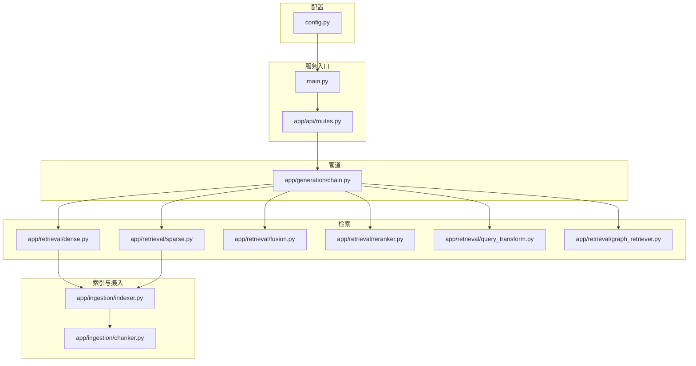
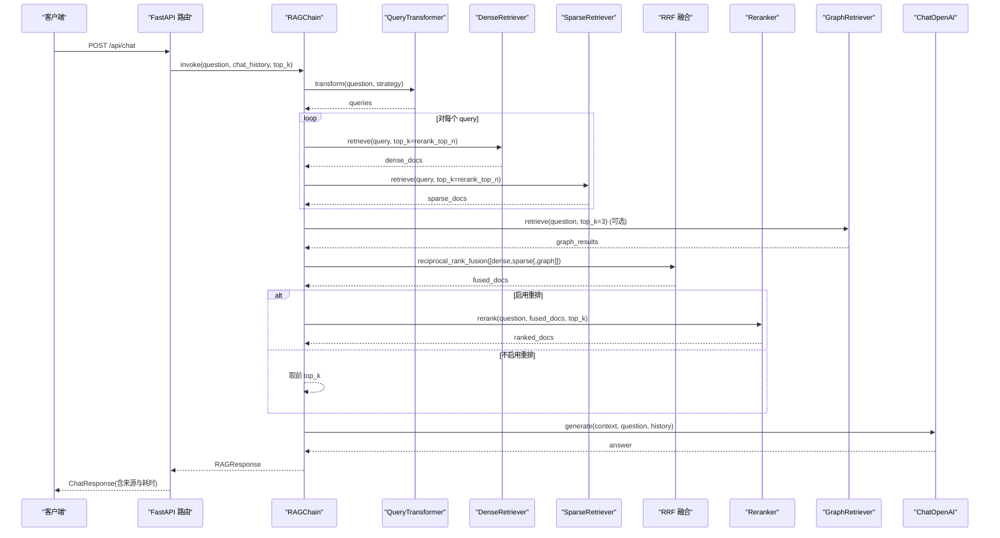
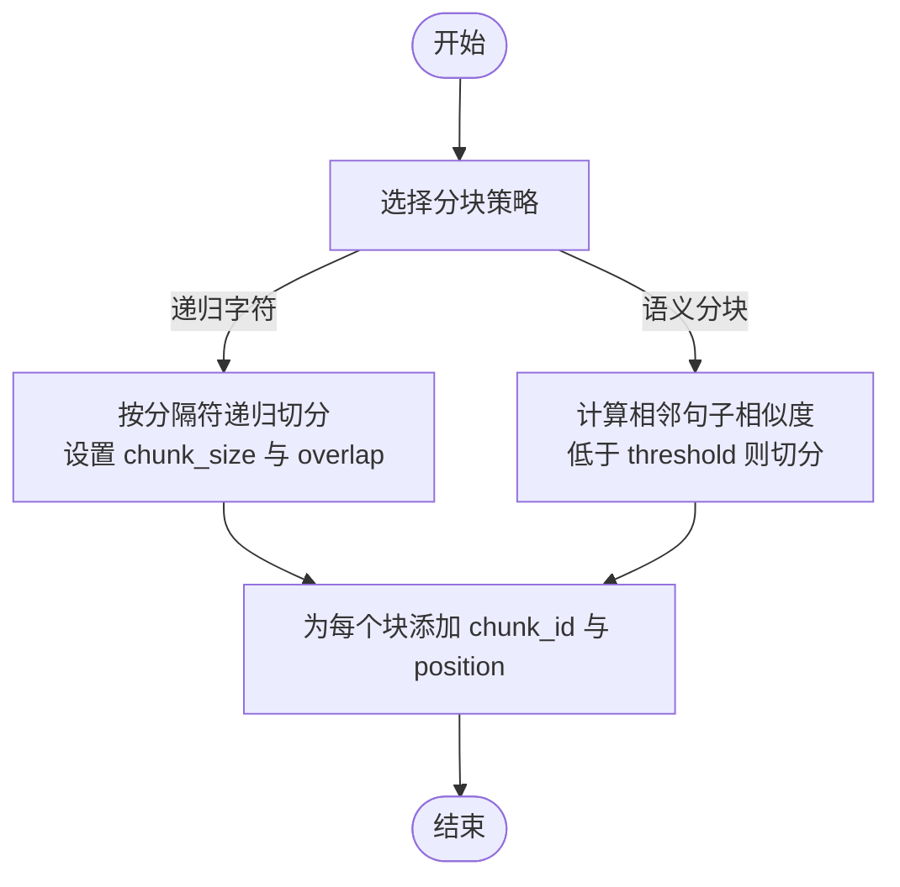
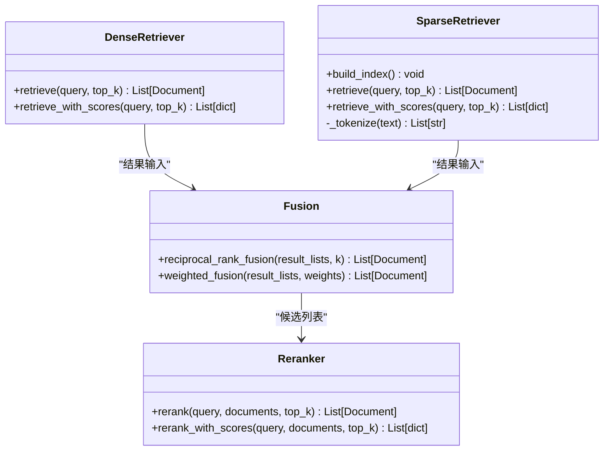

# 配置与定制

<cite>
**本文引用的文件**   
- [config.py](file://config.py)
- [main.py](file://main.py)
- [pyproject.toml](file://pyproject.toml)
- [app/generation/chain.py](file://app/generation/chain.py)
- [app/retrieval/dense.py](file://app/retrieval/dense.py)
- [app/retrieval/sparse.py](file://app/retrieval/sparse.py)
- [app/retrieval/fusion.py](file://app/retrieval/fusion.py)
- [app/retrieval/reranker.py](file://app/retrieval/reranker.py)
- [app/retrieval/query_transform.py](file://app/retrieval/query_transform.py)
- [app/retrieval/graph_retriever.py](file://app/retrieval/graph_retriever.py)
- [app/ingestion/indexer.py](file://app/ingestion/indexer.py)
- [app/ingestion/chunker.py](file://app/ingestion/chunker.py)
- [app/api/routes.py](file://app/api/routes.py)
</cite>

## 目录
1. [简介](#简介)
2. [项目结构](#项目结构)
3. [核心组件](#核心组件)
4. [架构总览](#架构总览)
5. [详细组件分析](#详细组件分析)
6. [依赖与版本管理](#依赖与版本管理)
7. [性能考量与调优建议](#性能考量与调优建议)
8. [故障排查指南](#故障排查指南)
9. [结论](#结论)
10. [附录：常见定制场景示例](#附录常见定制场景示例)

## 简介
本指南聚焦于系统的配置管理与定制化开发，覆盖以下主题：
- Pydantic Settings 统一配置管理：环境变量、默认值、运行时覆盖
- 嵌入模型切换：本地 Sentence Transformers 与 OpenAI Embeddings
- 分块策略、检索算法与重排序参数调优
- 插件化扩展：自定义检索器、新模型集成、扩展点实现
- 依赖管理与版本兼容性控制
- 最佳实践与性能调优建议
- 常见定制场景的实现思路与参考路径

## 项目结构
系统采用分层模块化组织：
- 配置层：统一通过 pydantic-settings 集中管理
- 接入层：FastAPI 路由暴露 API（对话、文档上传、图谱、评估等）
- 管道层：RAGChain 编排查询改写、多路召回、融合、重排、生成
- 索引与检索层：层级索引（L1/L2）、稠密/稀疏检索、RRF 融合、Cross-Encoder 重排、图检索
- 数据摄入层：加载、分块、摘要生成、向量存储

图表来源
- [config.py:1-58](file://config.py#L1-L58)
- [main.py:1-83](file://main.py#L1-L83)
- [app/api/routes.py:1-120](file://app/api/routes.py#L1-L120)
- [app/generation/chain.py:1-120](file://app/generation/chain.py#L1-L120)
- [app/retrieval/dense.py:1-53](file://app/retrieval/dense.py#L1-L53)
- [app/retrieval/sparse.py:1-123](file://app/retrieval/sparse.py#L1-L123)
- [app/retrieval/fusion.py:1-106](file://app/retrieval/fusion.py#L1-L106)
- [app/retrieval/reranker.py:1-112](file://app/retrieval/reranker.py#L1-L112)
- [app/retrieval/query_transform.py:1-134](file://app/retrieval/query_transform.py#L1-L134)
- [app/retrieval/graph_retriever.py:1-120](file://app/retrieval/graph_retriever.py#L1-L120)
- [app/ingestion/indexer.py:1-120](file://app/ingestion/indexer.py#L1-L120)
- [app/ingestion/chunker.py:1-80](file://app/ingestion/chunker.py#L1-L80)

章节来源
- [config.py:1-58](file://config.py#L1-L58)
- [main.py:1-83](file://main.py#L1-L83)
- [app/api/routes.py:1-120](file://app/api/routes.py#L1-L120)
- [app/generation/chain.py:1-120](file://app/generation/chain.py#L1-L120)
- [app/retrieval/dense.py:1-53](file://app/retrieval/dense.py#L1-L53)
- [app/retrieval/sparse.py:1-123](file://app/retrieval/sparse.py#L1-L123)
- [app/retrieval/fusion.py:1-106](file://app/retrieval/fusion.py#L1-L106)
- [app/retrieval/reranker.py:1-112](file://app/retrieval/reranker.py#L1-L112)
- [app/retrieval/query_transform.py:1-134](file://app/retrieval/query_transform.py#L1-L134)
- [app/retrieval/graph_retriever.py:1-120](file://app/retrieval/graph_retriever.py#L1-L120)
- [app/ingestion/indexer.py:1-120](file://app/ingestion/indexer.py#L1-L120)
- [app/ingestion/chunker.py:1-80](file://app/ingestion/chunker.py#L1-L80)

## 核心组件
- 统一配置中心：基于 pydantic-settings 的 Settings 类，提供环境变量、.env 文件与代码默认值的优先级合并；通过 lru_cache 单例获取。
- RAG 管道：RAGChain 串联查询改写、多路召回（稠密+稀疏+可选图）、RRF 融合、Cross-Encoder 重排、LLM 生成。
- 索引与检索：HierarchicalIndexer 维护 L1/L2 两级 ChromaDB 集合；DenseRetriever/SparseRetriever 分别负责向量与 BM25 检索；Reranker 对候选精排；QueryTransformer 支持 Multi-Query/HyDE。
- 图检索：GraphRetriever 抽取实体并检索关系上下文，作为向量检索的补充。
- 文档摄入：chunker 提供递归字符分块与语义分块；indexer 负责写入与检索。

章节来源
- [config.py:1-58](file://config.py#L1-L58)
- [app/generation/chain.py:1-120](file://app/generation/chain.py#L1-L120)
- [app/ingestion/indexer.py:1-120](file://app/ingestion/indexer.py#L1-L120)
- [app/retrieval/dense.py:1-53](file://app/retrieval/dense.py#L1-L53)
- [app/retrieval/sparse.py:1-123](file://app/retrieval/sparse.py#L1-L123)
- [app/retrieval/fusion.py:1-106](file://app/retrieval/fusion.py#L1-L106)
- [app/retrieval/reranker.py:1-112](file://app/retrieval/reranker.py#L1-L112)
- [app/retrieval/query_transform.py:1-134](file://app/retrieval/query_transform.py#L1-L134)
- [app/retrieval/graph_retriever.py:1-120](file://app/retrieval/graph_retriever.py#L1-L120)
- [app/ingestion/chunker.py:1-80](file://app/ingestion/chunker.py#L1-L80)

## 架构总览
下图展示从请求到响应的端到端流程，以及各模块间的调用关系。

图表来源
- [app/api/routes.py:47-117](file://app/api/routes.py#L47-L117)
- [app/generation/chain.py:100-201](file://app/generation/chain.py#L100-L201)
- [app/retrieval/query_transform.py:113-134](file://app/retrieval/query_transform.py#L113-L134)
- [app/retrieval/dense.py:24-37](file://app/retrieval/dense.py#L24-L37)
- [app/retrieval/sparse.py:72-104](file://app/retrieval/sparse.py#L72-L104)
- [app/retrieval/fusion.py:13-64](file://app/retrieval/fusion.py#L13-L64)
- [app/retrieval/reranker.py:33-79](file://app/retrieval/reranker.py#L33-L79)
- [app/retrieval/graph_retriever.py:88-132](file://app/retrieval/graph_retriever.py#L88-L132)

## 详细组件分析

### 配置系统与运行时覆盖
- 配置来源优先级：环境变量 > .env 文件 > 代码默认值
- 关键配置项：
  - 模型与嵌入：openai_api_key/openai_base_url/openai_model/openai_embedding_model；embedding_provider/embedding_model
  - 向量库：chroma_persist_dir/chroma_chunk_collection/chroma_summary_collection
  - 检索：retrieval_top_k/retrieval_rrf_k/rerank_top_n/rerank_model
  - 分块：chunk_size/chunk_overlap/semantic_chunk_threshold
  - 服务：api_host/api_port
  - 图检索：graph_enabled/graph_max_hops/graph_max_entities/graph_persist_path
  - 追踪：langchain_tracing_v2/langchain_api_key/langchain_project
- 运行时覆盖：
  - 通过 get_settings() 在模块内读取最新配置
  - 部分接口允许传入 top_k 等参数进行局部覆盖（如 /api/chat 的 top_k）

章节来源
- [config.py:1-58](file://config.py#L1-L58)
- [app/api/routes.py:47-71](file://app/api/routes.py#L47-L71)
- [app/generation/chain.py:63-99](file://app/generation/chain.py#L63-L99)

### 嵌入模型切换（本地 vs OpenAI）
- 通过 embedding_provider 选择后端：
  - local：使用 HuggingFaceEmbeddings（Sentence Transformers），可指定设备与归一化
  - openai：使用 OpenAIEmbeddings，需配置 openai_api_key/openai_base_url/openai_embedding_model
- 切换方式：
  - 修改配置项 embedding_provider 与对应模型名
  - 确保相应依赖已安装（sentence-transformers 或 langchain-openai）

章节来源
- [app/ingestion/indexer.py:15-33](file://app/ingestion/indexer.py#L15-L33)
- [config.py:18-21](file://config.py#L18-L21)

### 分块策略与参数调优
- 递归字符分块：按段落/句子/字符层级切分，适合通用文档
- 语义分块：计算相邻句子的 embedding 余弦相似度，低于阈值处切分，适合主题频繁变化的长文档
- 关键参数：
  - chunk_size：控制块大小
  - chunk_overlap：重叠度，避免边界信息丢失
  - semantic_chunk_threshold：语义跳变阈值，越小越细碎，越大越粗粒度

图表来源
- [app/ingestion/chunker.py:15-53](file://app/ingestion/chunker.py#L15-L53)
- [app/ingestion/chunker.py:56-135](file://app/ingestion/chunker.py#L56-L135)

章节来源
- [app/ingestion/chunker.py:1-157](file://app/ingestion/chunker.py#L1-157)
- [config.py:33-36](file://config.py#L33-L36)

### 检索算法与融合策略
- 稠密检索：基于向量相似度搜索（ChromaDB）
- 稀疏检索：BM25 关键词匹配，中文使用 jieba 词级分词，过滤噪声
- 融合策略：
  - RRF（倒数排名融合）：仅利用排名，k 为平滑常数，默认 60
  - 加权融合：对不同检索路的权重进行组合
- 重排序：Cross-Encoder 对候选进行精排，提升最终相关性

图表来源
- [app/retrieval/dense.py:13-53](file://app/retrieval/dense.py#L13-L53)
- [app/retrieval/sparse.py:19-123](file://app/retrieval/sparse.py#L19-L123)
- [app/retrieval/fusion.py:13-106](file://app/retrieval/fusion.py#L13-L106)
- [app/retrieval/reranker.py:14-112](file://app/retrieval/reranker.py#L14-L112)

章节来源
- [app/retrieval/dense.py:1-53](file://app/retrieval/dense.py#L1-L53)
- [app/retrieval/sparse.py:1-123](file://app/retrieval/sparse.py#L1-L123)
- [app/retrieval/fusion.py:1-106](file://app/retrieval/fusion.py#L1-L106)
- [app/retrieval/reranker.py:1-112](file://app/retrieval/reranker.py#L1-L112)
- [config.py:27-31](file://config.py#L27-L31)

### 查询改写与图检索
- 查询改写：
  - Multi-Query：生成多个不同角度的查询变体，扩大召回面
  - HyDE：生成假设性回答，用其 embedding 做检索
- 图检索：
  - 从问题中抽取实体，检索知识图谱中的关系与子图
  - 将三元组与子图格式化为自然语言上下文，增强 LLM 理解

章节来源
- [app/retrieval/query_transform.py:1-134](file://app/retrieval/query_transform.py#L1-L134)
- [app/retrieval/graph_retriever.py:1-132](file://app/retrieval/graph_retriever.py#L1-L132)
- [config.py:42-46](file://config.py#L42-L46)

### 层级索引与文档摘要
- L1 摘要索引：为每个文档生成 200 字摘要，向量化后存入 summaries 集合
- L2 明细索引：原始分块向量化后存入 chunks 集合
- 检索流程：先 L1 定位相关文档，再 L2 在目标文档内精细检索

章节来源
- [app/ingestion/indexer.py:74-202](file://app/ingestion/indexer.py#L74-L202)
- [config.py:22-25](file://config.py#L22-L25)

## 依赖与版本管理
- Python 版本要求：>=3.11
- 核心依赖：
  - LangChain 生态：langchain、langchain-openai、langchain-community
  - 向量与检索：chromadb、rank-bm25、sentence-transformers
  - 服务与前端：fastapi、uvicorn、streamlit、requests
  - 评估：ragas、datasets
  - 文档加载：pypdf
  - 配置与工具：python-dotenv、pydantic-settings、networkx、langchain-experimental
- 可选依赖：dev（pytest、httpx 等）
- 锁定文件：uv.lock 用于环境复现

章节来源
- [pyproject.toml:1-47](file://pyproject.toml#L1-L47)

## 性能考量与调优建议
- 嵌入模型选择：
  - 本地模型：降低延迟与成本，注意 CPU/GPU 设备与归一化设置
  - OpenAI 模型：高质量但受网络与配额影响
- 分块策略：
  - 递归分块适合结构化文档；语义分块适合主题变化频繁的长文档
  - 合理设置 chunk_size 与 overlap，平衡上下文完整性与检索精度
- 检索参数：
  - retrieval_top_k：控制最终返回数量，过大增加重排开销
  - retrieval_rrf_k：RRF 平滑常数，常用经验值为 60
  - rerank_top_n：进入重排的候选数，建议 20~30
- 重排序：
  - Cross-Encoder 精度高但慢，仅对少量候选精排
- 图检索：
  - 控制 graph_max_hops 与 graph_max_entities，避免过度扩展
- 服务与并发：
  - FastAPI + Uvicorn 异步高性能，结合 SSE 流式输出提升用户体验

[本节为通用指导，无需特定文件引用]

## 故障排查指南
- 启动时报 OPENAI_API_KEY 未配置：
  - 检查 .env 是否包含必要密钥，或设置环境变量
- BM25 索引构建失败：
  - 确认已有索引文档；若为空，先上传文档并重建索引
- 图检索未启用：
  - 检查 graph_enabled 配置；必要时调用构建图谱接口
- 评估模块导入失败：
  - 确认 ragas 与 datasets 已安装

章节来源
- [main.py:27-31](file://main.py#L27-L31)
- [app/retrieval/sparse.py:32-47](file://app/retrieval/sparse.py#L32-L47)
- [app/api/routes.py:402-428](file://app/api/routes.py#L402-L428)
- [app/api/routes.py:374-397](file://app/api/routes.py#L374-L397)

## 结论
本指南围绕配置管理与定制化开发展开，提供了从配置中心、嵌入模型切换、分块与检索策略到重排序与图检索的系统化说明。通过合理的参数调优与插件化扩展，可在保证性能的同时满足多样化业务需求。

[本节为总结，无需特定文件引用]

## 附录：常见定制场景示例

### 场景一：切换为本地 Sentence Transformers 嵌入
- 步骤：
  - 设置 embedding_provider 为 local，并指定 embedding_model
  - 确保 sentence-transformers 依赖可用
- 参考路径：
  - [app/ingestion/indexer.py:15-33](file://app/ingestion/indexer.py#L15-L33)
  - [config.py:18-21](file://config.py#L18-L21)

### 场景二：调整 RRF 融合与重排序参数
- 步骤：
  - 调整 retrieval_rrf_k 与 rerank_top_n
  - 根据业务需求决定启用/禁用重排序
- 参考路径：
  - [config.py:27-31](file://config.py#L27-L31)
  - [app/retrieval/fusion.py:13-64](file://app/retrieval/fusion.py#L13-L64)
  - [app/retrieval/reranker.py:33-79](file://app/retrieval/reranker.py#L33-L79)

### 场景三：启用/关闭图检索
- 步骤：
  - 通过 graph_enabled 控制是否启用
  - 调整 graph_max_hops 与 graph_max_entities 限制扩展范围
- 参考路径：
  - [config.py:42-46](file://config.py#L42-L46)
  - [app/retrieval/graph_retriever.py:50-61](file://app/retrieval/graph_retriever.py#L50-L61)

### 场景四：自定义检索器（插件化）
- 思路：
  - 新增检索器类，实现 retrieve 方法，返回 Document 列表
  - 在 RAGChain 初始化时注入并使用
  - 在融合阶段纳入新的检索路
- 参考路径：
  - [app/retrieval/dense.py:13-37](file://app/retrieval/dense.py#L13-L37)
  - [app/retrieval/sparse.py:19-104](file://app/retrieval/sparse.py#L19-L104)
  - [app/generation/chain.py:63-99](file://app/generation/chain.py#L63-L99)
  - [app/retrieval/fusion.py:13-64](file://app/retrieval/fusion.py#L13-L64)

### 场景五：替换重排序模型
- 步骤：
  - 修改 rerank_model 配置为新模型名称
  - 确保模型可被 CrossEncoder 加载
- 参考路径：
  - [config.py:31](file://config.py#L31)
  - [app/retrieval/reranker.py:26-31](file://app/retrieval/reranker.py#L26-L31)

### 场景六：优化分块策略
- 步骤：
  - 针对长文档启用语义分块，调整 semantic_chunk_threshold
  - 对结构化文档使用递归分块，调整 chunk_size 与 chunk_overlap
- 参考路径：
  - [app/ingestion/chunker.py:56-135](file://app/ingestion/chunker.py#L56-L135)
  - [config.py:33-36](file://config.py#L33-L36)