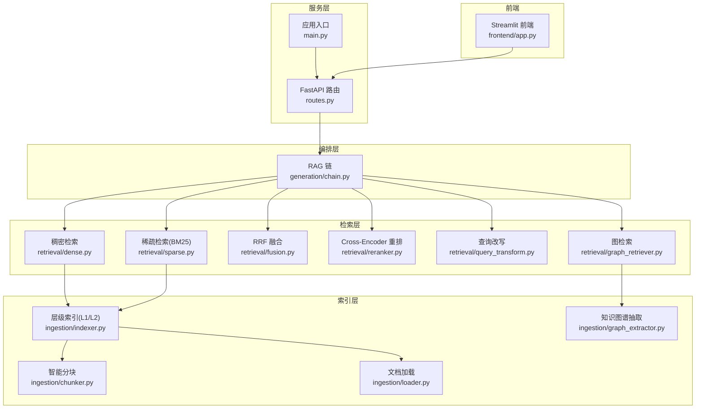
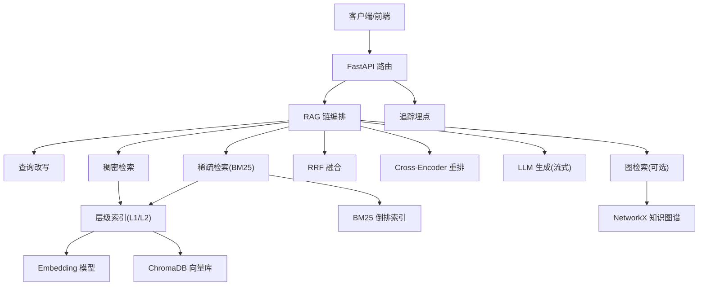
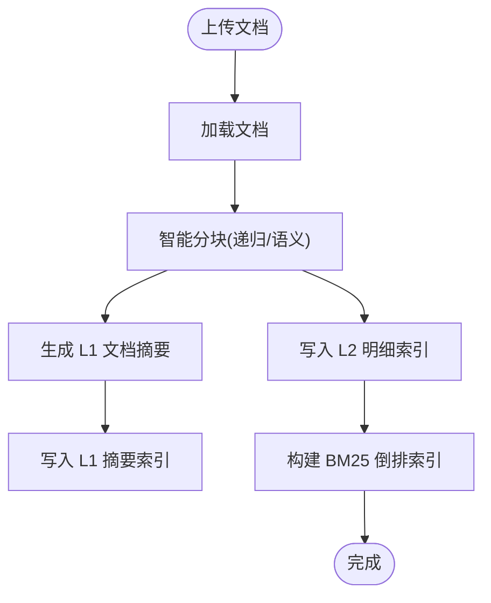
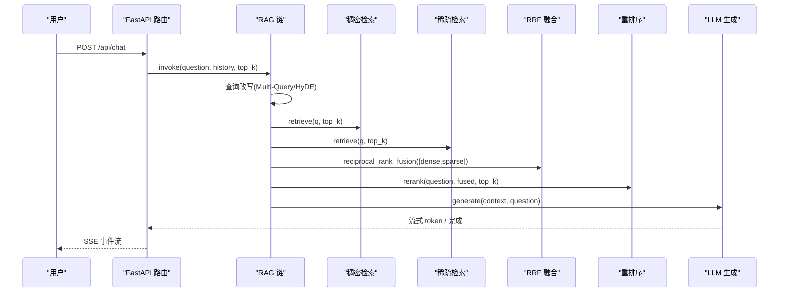
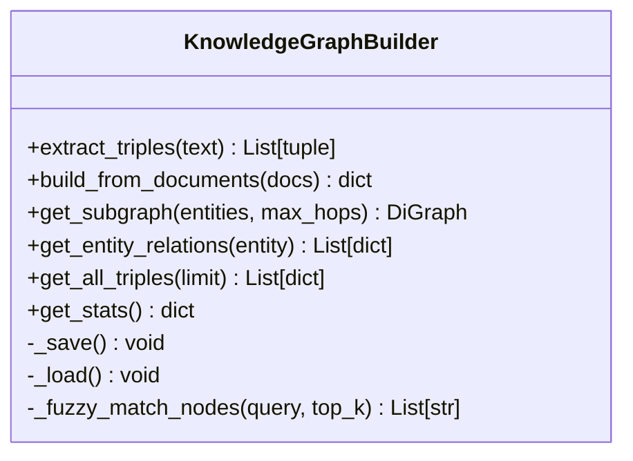
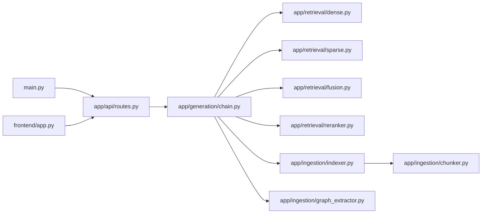

# 项目概述

<cite>
**本文引用的文件**   
- [main.py](file://main.py)
- [config.py](file://config.py)
- [pyproject.toml](file://pyproject.toml)
- [app/api/routes.py](file://app/api/routes.py)
- [app/generation/chain.py](file://app/generation/chain.py)
- [app/retrieval/fusion.py](file://app/retrieval/fusion.py)
- [app/ingestion/indexer.py](file://app/ingestion/indexer.py)
- [app/retrieval/reranker.py](file://app/retrieval/reranker.py)
- [app/retrieval/dense.py](file://app/retrieval/dense.py)
- [app/retrieval/sparse.py](file://app/retrieval/sparse.py)
- [app/ingestion/chunker.py](file://app/ingestion/chunker.py)
- [app/retrieval/query_transform.py](file://app/retrieval/query_transform.py)
- [app/ingestion/graph_extractor.py](file://app/ingestion/graph_extractor.py)
- [app/evaluation/metrics.py](file://app/evaluation/metrics.py)
- [frontend/app.py](file://frontend/app.py)
- [docs/api.md](file://docs/api.md)
</cite>

## 目录
1. [简介](#简介)
2. [项目结构](#项目结构)
3. [核心组件](#核心组件)
4. [架构总览](#架构总览)
5. [详细组件分析](#详细组件分析)
6. [依赖关系分析](#依赖关系分析)
7. [性能与优化建议](#性能与优化建议)
8. [故障排查指南](#故障排查指南)
9. [结论](#结论)
10. [附录：快速开始](#附录快速开始)

## 简介
本项目是一个生产级检索增强生成（RAG）智能问答系统，面向企业文档知识库场景，提供“多路召回 + RRF 融合 + Cross-Encoder 重排序 + 层级索引 + 知识图谱”的完整能力。系统通过文档摄入管道将 PDF/TXT/Markdown 等文档切块、向量化并构建 BM25 倒排索引；在查询阶段支持稠密向量检索与稀疏关键词检索的多路召回，结合 RRF 融合与精排模型提升相关性；同时可选启用知识图谱进行实体关系推理，作为向量检索的有效补充。前端基于 Streamlit 提供对话界面、对比实验、观测台、索引透视与知识图谱可视化，后端以 FastAPI 暴露 REST/SSE 接口，便于集成到各类业务系统。

## 项目结构
仓库采用按功能域分层组织的方式：
- app/api：FastAPI 路由与请求/响应模型
- app/generation：RAG 链编排与提示模板
- app/retrieval：稠密/稀疏检索、RRF 融合、重排序、查询改写、图检索
- app/ingestion：文档加载、分块、层级索引、知识图谱抽取
- app/observability：追踪埋点
- app/evaluation：评估指标实现
- frontend：Streamlit 前端应用
- data：示例文档与评估报告
- docs：API 文档与面试指南
- 根目录：应用入口、配置、依赖与环境脚本

图表来源
- [main.py:1-83](file://main.py#L1-L83)
- [app/api/routes.py:1-563](file://app/api/routes.py#L1-L563)
- [app/generation/chain.py:1-377](file://app/generation/chain.py#L1-L377)
- [app/retrieval/dense.py:1-53](file://app/retrieval/dense.py#L1-L53)
- [app/retrieval/sparse.py:1-123](file://app/retrieval/sparse.py#L1-L123)
- [app/retrieval/fusion.py:1-106](file://app/retrieval/fusion.py#L1-L106)
- [app/retrieval/reranker.py:1-112](file://app/retrieval/reranker.py#L1-L112)
- [app/retrieval/query_transform.py:1-134](file://app/retrieval/query_transform.py#L1-L134)
- [app/ingestion/indexer.py:1-253](file://app/ingestion/indexer.py#L1-L253)
- [app/ingestion/chunker.py:1-157](file://app/ingestion/chunker.py#L1-L157)
- [app/ingestion/graph_extractor.py:1-337](file://app/ingestion/graph_extractor.py#L1-L337)
- [frontend/app.py:1-954](file://frontend/app.py#L1-L954)

章节来源
- [main.py:1-83](file://main.py#L1-L83)
- [app/api/routes.py:1-563](file://app/api/routes.py#L1-L563)
- [app/generation/chain.py:1-377](file://app/generation/chain.py#L1-L377)
- [app/retrieval/fusion.py:1-106](file://app/retrieval/fusion.py#L1-L106)
- [app/ingestion/indexer.py:1-253](file://app/ingestion/indexer.py#L1-L253)
- [app/retrieval/reranker.py:1-112](file://app/retrieval/reranker.py#L1-L112)
- [app/retrieval/dense.py:1-53](file://app/retrieval/dense.py#L1-L53)
- [app/retrieval/sparse.py:1-123](file://app/retrieval/sparse.py#L1-L123)
- [app/ingestion/chunker.py:1-157](file://app/ingestion/chunker.py#L1-L157)
- [app/retrieval/query_transform.py:1-134](file://app/retrieval/query_transform.py#L1-L134)
- [app/ingestion/graph_extractor.py:1-337](file://app/ingestion/graph_extractor.py#L1-L337)
- [frontend/app.py:1-954](file://frontend/app.py#L1-L954)

## 核心组件
- 应用入口与生命周期：初始化 RAGChain、CORS、注册路由、启动 Uvicorn 服务。
- 统一配置：集中管理 OpenAI/Embedding/ChromaDB/检索参数/分块策略/图检索开关等。
- 文档摄入管道：加载文档 → 智能分块（递归/语义）→ 写入层级索引（L1 摘要 + L2 明细）→ 构建 BM25 倒排索引。
- 检索引擎：稠密向量检索（ChromaDB）、稀疏 BM25 检索、RRF 融合、Cross-Encoder 重排序、可选图检索。
- 生成链编排：查询改写（Multi-Query/HyDE）→ 多路召回 → 融合 → 重排 → LLM 生成（支持流式）。
- 知识图谱：从文本抽取三元组，构建 NetworkX 有向图，支持 N 跳子图与路径查询。
- 评估体系：Faithfulness、Answer Relevancy、Context Precision、Context Recall 四维指标。
- 前端交互：对话问答、对比实验、观测台、索引透视、知识图谱可视化。

章节来源
- [main.py:1-83](file://main.py#L1-L83)
- [config.py:1-58](file://config.py#L1-L58)
- [app/ingestion/chunker.py:1-157](file://app/ingestion/chunker.py#L1-L157)
- [app/ingestion/indexer.py:1-253](file://app/ingestion/indexer.py#L1-L253)
- [app/retrieval/dense.py:1-53](file://app/retrieval/dense.py#L1-L53)
- [app/retrieval/sparse.py:1-123](file://app/retrieval/sparse.py#L1-L123)
- [app/retrieval/fusion.py:1-106](file://app/retrieval/fusion.py#L1-L106)
- [app/retrieval/reranker.py:1-112](file://app/retrieval/reranker.py#L1-L112)
- [app/retrieval/query_transform.py:1-134](file://app/retrieval/query_transform.py#L1-L134)
- [app/ingestion/graph_extractor.py:1-337](file://app/ingestion/graph_extractor.py#L1-L337)
- [app/evaluation/metrics.py:1-403](file://app/evaluation/metrics.py#L1-L403)
- [frontend/app.py:1-954](file://frontend/app.py#L1-L954)

## 架构总览
整体架构遵循“摄入—索引—检索—生成—观测”的分层设计，模块间松耦合、职责清晰。

图表来源
- [app/api/routes.py:1-563](file://app/api/routes.py#L1-L563)
- [app/generation/chain.py:1-377](file://app/generation/chain.py#L1-L377)
- [app/retrieval/fusion.py:1-106](file://app/retrieval/fusion.py#L1-L106)
- [app/ingestion/indexer.py:1-253](file://app/ingestion/indexer.py#L1-L253)
- [app/retrieval/reranker.py:1-112](file://app/retrieval/reranker.py#L1-L112)
- [app/retrieval/dense.py:1-53](file://app/retrieval/dense.py#L1-L53)
- [app/retrieval/sparse.py:1-123](file://app/retrieval/sparse.py#L1-L123)
- [app/ingestion/graph_extractor.py:1-337](file://app/ingestion/graph_extractor.py#L1-L337)

## 详细组件分析

### 检索增强生成（RAG）概念与工作原理
- 基本概念：RAG 将外部知识库检索结果注入大模型上下文，使生成回答具备事实依据与可溯源性。
- 工作流：用户问题经查询改写后，进入多路召回（稠密+稀疏），再经 RRF 融合与精排，最终由 LLM 生成答案。
- 优势：显著提升准确性、可解释性与可控性，降低幻觉风险。

[本节为概念性说明，不直接分析具体文件]

### 多路召回、重排序与层级索引
- 多路召回：稠密向量检索擅长语义匹配，稀疏 BM25 擅长精确术语匹配，二者互补。
- RRF 融合：仅利用排名信息合并多路结果，避免分数不可比问题，鲁棒性强。
- 重排序：使用 Cross-Encoder 对候选进行细粒度交互打分，提高 Top-K 质量。
- 层级索引：L1 文档摘要用于粗定位，L2 段落明细用于细粒度检索，兼顾效率与精度。

章节来源
- [app/retrieval/dense.py:1-53](file://app/retrieval/dense.py#L1-L53)
- [app/retrieval/sparse.py:1-123](file://app/retrieval/sparse.py#L1-L123)
- [app/retrieval/fusion.py:1-106](file://app/retrieval/fusion.py#L1-L106)
- [app/retrieval/reranker.py:1-112](file://app/retrieval/reranker.py#L1-L112)
- [app/ingestion/indexer.py:1-253](file://app/ingestion/indexer.py#L1-L253)

### 文档摄入管道
- 文档加载：支持 PDF/TXT/Markdown。
- 智能分块：递归字符分块与语义分块（基于相邻句 embedding 相似度阈值）。
- 层级索引：L1 摘要（LLM 生成）+ L2 明细（ChromaDB 存储），并提供 get_all_chunks 供 BM25 重建。
- BM25 索引：中文 jieba 词级分词，英文/数字保留完整单词，过滤单字噪声。

图表来源
- [app/ingestion/chunker.py:1-157](file://app/ingestion/chunker.py#L1-L157)
- [app/ingestion/indexer.py:1-253](file://app/ingestion/indexer.py#L1-L253)
- [app/retrieval/sparse.py:1-123](file://app/retrieval/sparse.py#L1-L123)

章节来源
- [app/ingestion/chunker.py:1-157](file://app/ingestion/chunker.py#L1-L157)
- [app/ingestion/indexer.py:1-253](file://app/ingestion/indexer.py#L1-L253)
- [app/retrieval/sparse.py:1-123](file://app/retrieval/sparse.py#L1-L123)

### 检索引擎与融合重排
- 稠密检索：基于 ChromaDB 的余弦相似度搜索。
- 稀疏检索：BM25 关键词匹配，自动构建倒排索引。
- RRF 融合：按公式 score(d)=Σ 1/(k+rank_i(d)) 计算，k 默认 60。
- Cross-Encoder 重排：对候选 (query, doc) 对打分，返回 top-K。

图表来源
- [app/api/routes.py:1-563](file://app/api/routes.py#L1-L563)
- [app/generation/chain.py:1-377](file://app/generation/chain.py#L1-L377)
- [app/retrieval/dense.py:1-53](file://app/retrieval/dense.py#L1-L53)
- [app/retrieval/sparse.py:1-123](file://app/retrieval/sparse.py#L1-L123)
- [app/retrieval/fusion.py:1-106](file://app/retrieval/fusion.py#L1-L106)
- [app/retrieval/reranker.py:1-112](file://app/retrieval/reranker.py#L1-L112)

章节来源
- [app/retrieval/dense.py:1-53](file://app/retrieval/dense.py#L1-L53)
- [app/retrieval/sparse.py:1-123](file://app/retrieval/sparse.py#L1-L123)
- [app/retrieval/fusion.py:1-106](file://app/retrieval/fusion.py#L1-L106)
- [app/retrieval/reranker.py:1-112](file://app/retrieval/reranker.py#L1-L112)
- [app/generation/chain.py:1-377](file://app/generation/chain.py#L1-L377)
- [app/api/routes.py:1-563](file://app/api/routes.py#L1-L563)

### 知识图谱（Graph RAG）
- 抽取：使用 LLM 从文本中抽取三元组（头实体、关系、尾实体）。
- 存储：NetworkX 有向图，持久化 JSON，支持加载与清空。
- 查询：N 跳子图、实体关系获取、路径查找。

图表来源
- [app/ingestion/graph_extractor.py:1-337](file://app/ingestion/graph_extractor.py#L1-L337)

章节来源
- [app/ingestion/graph_extractor.py:1-337](file://app/ingestion/graph_extractor.py#L1-L337)

### 评估体系
- 指标：Faithfulness、Answer Relevancy、Context Precision、Context Recall。
- 方法：LLM-as-Judge + Embedding 相似度，兼容无 ragas 包环境。
- 流程：批量调用 RAGChain 获取回答与上下文，逐样本评分并汇总。

章节来源
- [app/evaluation/metrics.py:1-403](file://app/evaluation/metrics.py#L1-L403)

### 前端交互
- 对话问答：支持流式输出与参考来源展示。
- 对比实验：同一问题运行 Dense/Sparse/RRF/Rerank 四种策略，对比命中与耗时。
- 观测台：Trace 瀑布图与阶段平均耗时统计。
- 索引透视：查看分块内容、BM25 词项、向量维度预览与 L1 摘要。
- 知识图谱：三元组导出与路径查询。

章节来源
- [frontend/app.py:1-954](file://frontend/app.py#L1-L954)

## 依赖关系分析
- 运行时依赖：LangChain、OpenAI/DeepSeek 客户端、ChromaDB、Sentence Transformers、FastAPI/Uvicorn、Streamlit、Pydantic Settings、jieba、rank-bm25、networkx 等。
- 开发依赖：pytest、httpx 等。
- 关键导入关系：
  - main.py 初始化 RAGChain 并设置全局实例
  - routes.py 消费 RAGChain 并暴露 REST/SSE 接口
  - chain.py 组合检索器与生成器
  - indexer.py 封装 ChromaDB 与 LLM 摘要生成
  - dense/sparse/fusion/reranker 分别实现各检索与融合步骤
  - graph_extractor 负责图谱抽取与查询

图表来源
- [main.py:1-83](file://main.py#L1-L83)
- [app/api/routes.py:1-563](file://app/api/routes.py#L1-L563)
- [app/generation/chain.py:1-377](file://app/generation/chain.py#L1-L377)
- [app/retrieval/dense.py:1-53](file://app/retrieval/dense.py#L1-L53)
- [app/retrieval/sparse.py:1-123](file://app/retrieval/sparse.py#L1-L123)
- [app/retrieval/fusion.py:1-106](file://app/retrieval/fusion.py#L1-L106)
- [app/retrieval/reranker.py:1-112](file://app/retrieval/reranker.py#L1-L112)
- [app/ingestion/indexer.py:1-253](file://app/ingestion/indexer.py#L1-L253)
- [app/ingestion/chunker.py:1-157](file://app/ingestion/chunker.py#L1-L157)
- [app/ingestion/graph_extractor.py:1-337](file://app/ingestion/graph_extractor.py#L1-L337)
- [frontend/app.py:1-954](file://frontend/app.py#L1-L954)

章节来源
- [pyproject.toml:1-47](file://pyproject.toml#L1-L47)
- [config.py:1-58](file://config.py#L1-L58)

## 性能与优化建议
- 召回规模控制：合理设置 rerank_top_n 与 retrieval_top_k，平衡召回率与延迟。
- 分块策略：根据领域语料调整 chunk_size 与 overlap，必要时启用语义分块提升边界质量。
- 融合参数：RRF 的 k 值影响平滑程度，可按数据集调优。
- 重排成本：Cross-Encoder 开销较大，建议仅在候选集较小（如 top-20~50）时启用。
- 索引维护：新增文档后需重建 BM25 索引，确保稀疏检索命中。
- 资源隔离：Embedding 与 LLM 调用可考虑缓存与批处理，减少重复计算。

[本节为通用指导，不直接分析具体文件]

## 故障排查指南
- 启动失败（缺少 API Key）：检查环境变量 OPENAI_API_KEY 是否配置。
- 文档上传失败：确认文件格式（PDF/TXT/MD）与大小限制，查看服务端日志。
- 检索结果为空：确认已索引文档存在且 BM25 索引已构建。
- 重排序异常：检查 Cross-Encoder 模型下载与本地缓存。
- 前端无法连接后端：确认后端服务已启动且端口可达。

章节来源
- [main.py:1-83](file://main.py#L1-L83)
- [app/api/routes.py:1-563](file://app/api/routes.py#L1-L563)
- [app/retrieval/reranker.py:1-112](file://app/retrieval/reranker.py#L1-L112)

## 结论
本系统以模块化、可扩展的设计实现了生产可用的 RAG 智能问答方案。通过多路召回与重排序的组合，显著提升了检索相关性与生成质量；层级索引与知识图谱进一步增强了可解释性与推理能力。配合完善的观测与评估工具，便于持续优化与落地部署。

[本节为总结性内容，不直接分析具体文件]

## 附录：快速开始
- 环境准备
  - Python >= 3.11
  - 安装依赖：uv pip install -e . 或 pip install -r pyproject.toml（按项目配置）
- 配置
  - 复制并编辑 .env（至少配置 OPENAI_API_KEY、可选 base_url 与模型名）
  - 如需本地 Embedding，设置 embedding_provider=local 与对应模型名
- 启动服务
  - 运行 python main.py，默认监听 0.0.0.0:8000
  - 访问 Swagger 文档：http://localhost:8000/docs
- 上传文档
  - 使用前端上传 PDF/TXT/Markdown，或调用 POST /api/documents/upload
- 发起问答
  - 普通模式：POST /api/chat（stream=false）
  - 流式模式：POST /api/chat（stream=true），接收 SSE 事件
- 对比实验与观测
  - 使用前端“对比实验”与“观测台”查看不同策略效果与阶段耗时
- 评估
  - 调用 POST /api/evaluate，传入测试问题与标准答案（可选）

章节来源
- [pyproject.toml:1-47](file://pyproject.toml#L1-L47)
- [config.py:1-58](file://config.py#L1-L58)
- [main.py:1-83](file://main.py#L1-L83)
- [docs/api.md:1-275](file://docs/api.md#L1-L275)
- [frontend/app.py:1-954](file://frontend/app.py#L1-L954)